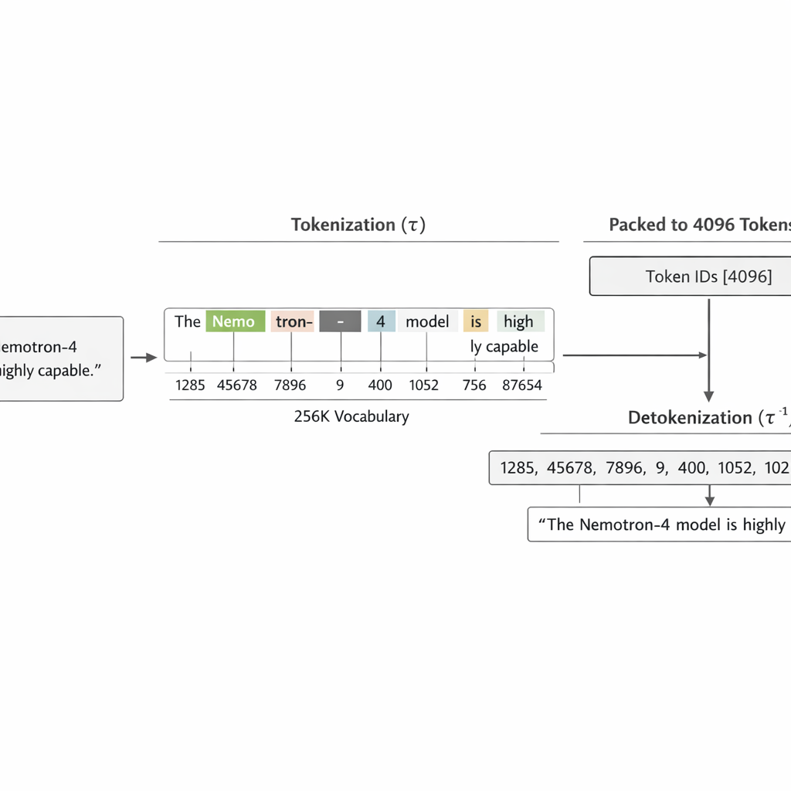
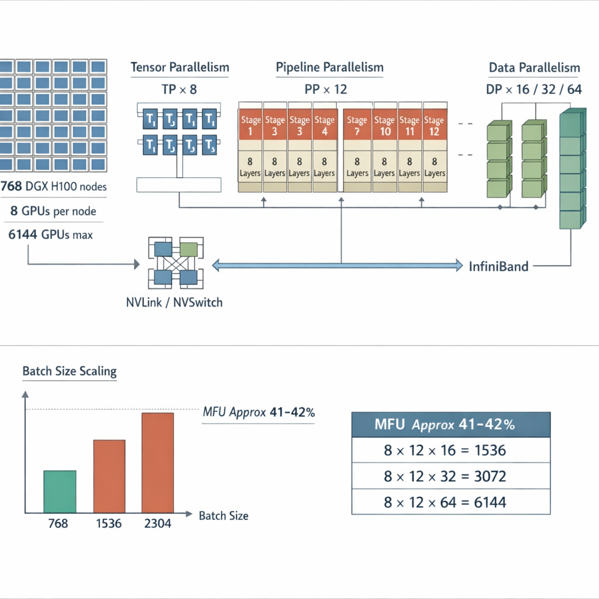
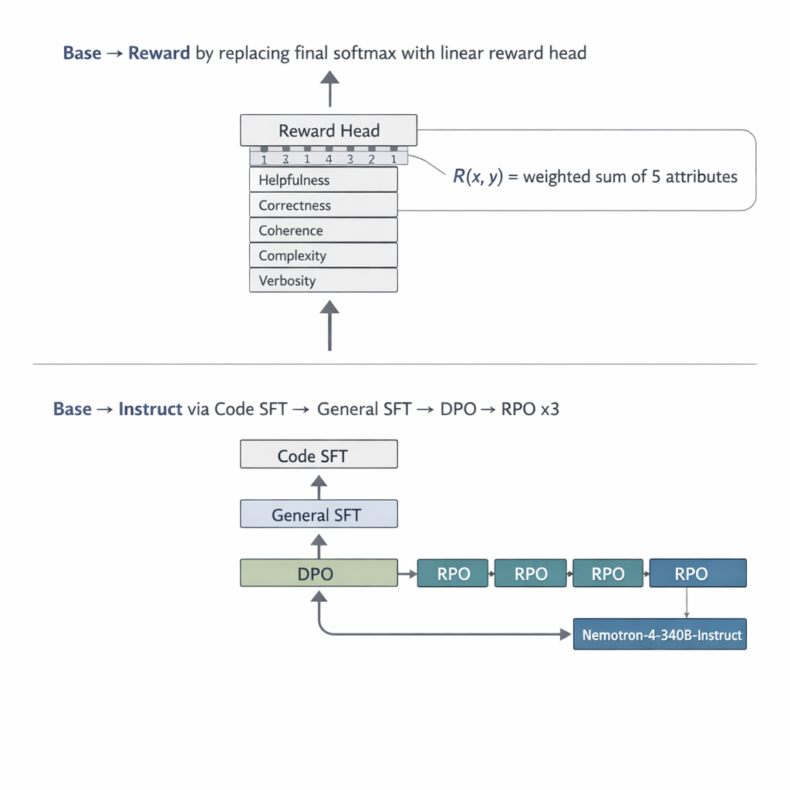
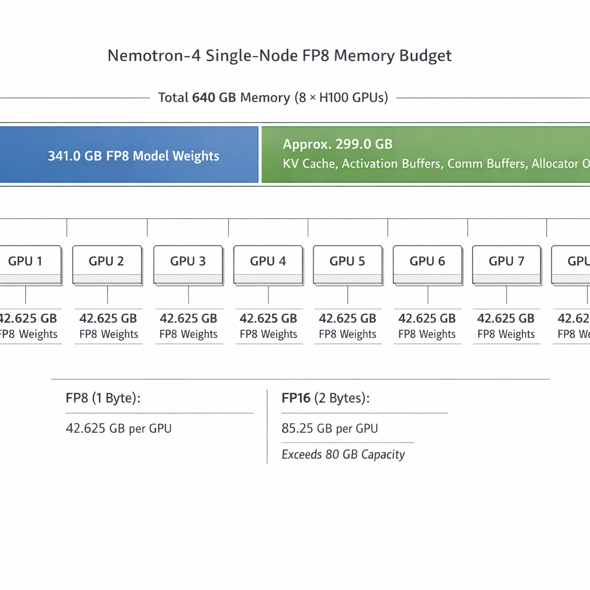

# Nemotron-4 340B: End-to-End Technical Report


*Figure V1-1. End-to-end visual summary of the shared pretraining path, reward-model derivation, synthetic alignment pipeline, and sequential post-training stages that produce Nemotron-4-340B-Instruct.*

---

## 1. Model Architecture

### 1.1 Formal Definition

Nemotron-4-340B-Base is a **decoder-only autoregressive Transformer** mapping input token sequences $x = (x_1, x_2, \ldots, x_T)$ to next-token probability distributions:

$$p_\theta(x_t \mid x_{<t}) = \text{softmax}\left(\mathbf{W}_{\text{out}} \cdot h_t^{(L)}\right) \in \mathbb{R}^{|\mathcal{V}|}$$

where $h_t^{(L)}$ is the hidden state at position $t$ after $L$ transformer layers, $\mathbf{W}_{\text{out}} \in \mathbb{R}^{|\mathcal{V}| \times d}$ is the output projection (untied from input embeddings), and $|\mathcal{V}| = 256{,}000$.

### 1.2 Hyperparameter Specification


*Figure V1-2. Base-model architecture with untied input and output embeddings, 96 decoder layers, RoPE, grouped query attention, squared-ReLU MLP blocks, no bias terms, and zero dropout.*

| Parameter | Value |
|---|---|
| Transformer layers $L$ | 96 |
| Hidden dimension $d$ | 18432 |
| Attention heads $n_h$ | 96 |
| KV heads $n_{kv}$ (GQA) | 8 |
| Head dimension $d_h = d / n_h$ | 192 |
| GQA group size $g = n_h / n_{kv}$ | 12 |
| Sequence length $T$ | 4096 |
| Vocabulary size $|\mathcal{V}|$ | 256,000 |
| Embedding parameters | 9.4B |
| Non-embedding parameters | 331.6B |
| Total parameters | ~341B |
| Bias terms | None |
| Dropout rate | 0.0 |
| Input-output embedding tying | Untied |

### 1.3 Tensor Transformations Per Layer

Each transformer layer $\ell \in \{1, \ldots, L\}$ consists of a **causal multi-head attention block** followed by a **feed-forward network (MLP)** with pre-normalization. Let $\mathbf{H}^{(\ell-1)} \in \mathbb{R}^{T \times d}$ denote the input hidden states.

#### 1.3.1 Pre-Normalization

$$\hat{\mathbf{H}}^{(\ell)} = \text{RMSNorm}\left(\mathbf{H}^{(\ell-1)}\right)$$

where:

$$\text{RMSNorm}(\mathbf{x}) = \frac{\mathbf{x}}{\sqrt{\frac{1}{d}\sum_{i=1}^{d} x_i^2 + \epsilon}} \odot \boldsymbol{\gamma}$$

with learnable gain $\boldsymbol{\gamma} \in \mathbb{R}^d$ and $\epsilon$ a numerical stability constant.

#### 1.3.2 Grouped Query Attention (GQA)

**Projections:**

$$\mathbf{Q} = \hat{\mathbf{H}}^{(\ell)} \mathbf{W}_Q, \quad \mathbf{W}_Q \in \mathbb{R}^{d \times (n_h \cdot d_h)}$$

$$\mathbf{K} = \hat{\mathbf{H}}^{(\ell)} \mathbf{W}_K, \quad \mathbf{W}_K \in \mathbb{R}^{d \times (n_{kv} \cdot d_h)}$$

$$\mathbf{V} = \hat{\mathbf{H}}^{(\ell)} \mathbf{W}_V, \quad \mathbf{W}_V \in \mathbb{R}^{d \times (n_{kv} \cdot d_h)}$$

With GQA, each group of $g = 12$ query heads shares one KV head. For query head $i$ mapped to KV head $\lfloor i/g \rfloor$:

$$\mathbf{Q}_i \in \mathbb{R}^{T \times d_h}, \quad \mathbf{K}_j \in \mathbb{R}^{T \times d_h}, \quad \mathbf{V}_j \in \mathbb{R}^{T \times d_h}, \quad j = \lfloor i / g \rfloor$$

**Rotary Position Embedding (RoPE):**

For position $t$ and dimension pair $(2k, 2k+1)$ with frequency $\omega_k = \frac{1}{10000^{2k/d_h}}$:

$$\text{RoPE}(\mathbf{q}_t, t) = \begin{pmatrix} q_{t,2k} \cos(t\omega_k) - q_{t,2k+1} \sin(t\omega_k) \\ q_{t,2k} \sin(t\omega_k) + q_{t,2k+1} \cos(t\omega_k) \end{pmatrix}$$

Applied identically to $\mathbf{Q}$ and $\mathbf{K}$ before attention computation. RoPE ensures relative position sensitivity via the property:

$$\langle \text{RoPE}(\mathbf{q}_m, m), \text{RoPE}(\mathbf{k}_n, n) \rangle = f(\mathbf{q}_m, \mathbf{k}_n, m - n)$$

**Causal Attention:**

$$\mathbf{A}_i = \text{softmax}\left(\frac{\tilde{\mathbf{Q}}_i \tilde{\mathbf{K}}_j^\top}{\sqrt{d_h}} + \mathbf{M}\right) \mathbf{V}_j$$

where $\tilde{\mathbf{Q}}_i, \tilde{\mathbf{K}}_j$ are the RoPE-rotated queries and keys, and $\mathbf{M} \in \mathbb{R}^{T \times T}$ is the causal mask:

$$M_{st} = \begin{cases} 0 & \text{if } s \geq t \\ -\infty & \text{if } s < t \end{cases}$$

**Output projection:**

$$\mathbf{A} = \text{Concat}(\mathbf{A}_1, \ldots, \mathbf{A}_{n_h}) \mathbf{W}_O, \quad \mathbf{W}_O \in \mathbb{R}^{(n_h \cdot d_h) \times d}$$

**Residual connection:**

$$\mathbf{H}_{\text{attn}}^{(\ell)} = \mathbf{H}^{(\ell-1)} + \mathbf{A}$$

#### 1.3.3 Feed-Forward Network (MLP) with Squared ReLU

$$\hat{\mathbf{H}}_{\text{mlp}}^{(\ell)} = \text{RMSNorm}\left(\mathbf{H}_{\text{attn}}^{(\ell)}\right)$$

$$\mathbf{H}^{(\ell)} = \mathbf{H}_{\text{attn}}^{(\ell)} + \left(\text{SqReLU}\left(\hat{\mathbf{H}}_{\text{mlp}}^{(\ell)} \mathbf{W}_1\right)\right) \mathbf{W}_2$$

where:

$$\text{SqReLU}(z) = \left(\max(0, z)\right)^2$$

$$\mathbf{W}_1 \in \mathbb{R}^{d \times d_{\text{ff}}}, \quad \mathbf{W}_2 \in \mathbb{R}^{d_{\text{ff}} \times d}$$

The squared ReLU activation induces higher sparsity in intermediate activations compared to standard ReLU or GELU, producing sparser gradient flow and potentially better feature selection.

### 1.4 Tokenization



*Figure V1-3. SentencePiece tokenization and detokenization path showing raw text segmentation, vocabulary lookup, packed token sequence construction, and reversible text reconstruction.*

**SentencePiece** tokenizer with vocabulary size $|\mathcal{V}| = 256{,}000$. This large vocabulary reduces sequence length for a given text span, improving throughput and enabling better representation of multilingual tokens and code tokens.

### 1.5 Parameter Count Derivation

**Embedding parameters:**

$$P_{\text{emb}} = |\mathcal{V}| \cdot d + d \cdot |\mathcal{V}| = 2 \times 256{,}000 \times 18{,}432 \approx 9.44\text{B}$$

However, since input-output embeddings are **untied**, both contribute. The report states 9.4B embedding parameters, implying only one embedding matrix is counted as "embedding" while the output projection is counted as non-embedding. Thus:

$$P_{\text{emb}} = |\mathcal{V}| \cdot d = 256{,}000 \times 18{,}432 = 4.72\text{B}$$

This suggests both input and output projection matrices are counted together as embedding parameters: $2 \times 4.72\text{B} \approx 9.4\text{B}$.

**Per-layer non-embedding parameters:**

- Attention: $\mathbf{W}_Q: d^2$, $\mathbf{W}_K: d \cdot n_{kv} \cdot d_h$, $\mathbf{W}_V: d \cdot n_{kv} \cdot d_h$, $\mathbf{W}_O: d^2$
  - $= 2d^2 + 2 \cdot d \cdot n_{kv} \cdot d_h = 2(18432)^2 + 2 \times 18432 \times 8 \times 192$
  - $= 679{,}477{,}248 + 56{,}623{,}104 = 736{,}100{,}352$
- MLP: $\mathbf{W}_1: d \cdot d_{\text{ff}}$, $\mathbf{W}_2: d_{\text{ff}} \cdot d$
  - Assuming $d_{\text{ff}} \approx 4d$ or similar: need to back-calculate from total.
- LayerNorm gains: $2d$ per layer.

Total non-embedding: $96 \times P_{\text{layer}} = 331.6\text{B}$, thus $P_{\text{layer}} \approx 3.454\text{B}$.

### 1.6 GQA Memory and Compute Analysis


*Figure V1-4. Grouped query attention in Nemotron-4: 96 query heads share 8 key-value heads, reducing KV-cache storage to one twelfth of the equivalent full multi-head KV representation.*

**KV-cache memory per token per layer:**

$$\text{KV}_{\text{bytes}} = 2 \times n_{kv} \times d_h \times b_{\text{dtype}} = 2 \times 8 \times 192 \times 2 = 6{,}144 \text{ bytes (bf16)}$$

**Total KV-cache for full sequence:**

$$\text{KV}_{\text{total}} = L \times T \times \text{KV}_{\text{bytes}} = 96 \times 4096 \times 6{,}144 = 2.42 \text{ GB (bf16 per sequence)}$$

**GQA compression ratio vs MHA:**

$$\text{Ratio} = \frac{n_{kv}}{n_h} = \frac{8}{96} = \frac{1}{12}$$

KV-cache is $12\times$ smaller than equivalent MHA, which is critical for fitting the model on 8× H100 GPUs during serving.

### 1.7 Complexity Analysis

**Attention FLOPs per layer (forward):**

$$\mathcal{O}(T^2 \cdot n_h \cdot d_h) = \mathcal{O}(T^2 \cdot d)$$

**MLP FLOPs per layer:**

$$\mathcal{O}(T \cdot d \cdot d_{\text{ff}})$$

**Total forward pass FLOPs:**

$$\text{FLOPs}_{\text{fwd}} \approx L \left(2T^2 d + 8T d \cdot d_{\text{ff}} + 8T d^2\right)$$

Under the standard approximation $\text{FLOPs} \approx 2 \times P_{\text{non-emb}} \times T$ for large models:

$$\text{FLOPs}_{\text{fwd}} \approx 2 \times 331.6\text{B} \times 4096 \approx 2.72 \times 10^{15} \text{ FLOPs per sequence}$$

---

## 2. Data Pipeline

### 2.1 Data Composition


*Figure V1-5. Pretraining corpus composition: the controlled 70 percent English, 15 percent multilingual, and 15 percent code blend that feeds the 9T-token training stream and then splits into 8T formal pretraining plus 1T continued pretraining.*

| Data Type | Fraction | Details |
|---|---|---|
| English natural language | 70% | Web documents, news, scientific papers, books |
| Multilingual natural language | 15% | 53 natural languages, monolingual + parallel corpora |
| Source code | 15% | 43 programming languages |

**Total tokens:** 9T (8T pretraining + 1T continued pretraining).

### 2.2 Data Curation Invariants

Following Parmar et al. (2024) (Nemotron-4-15B-Base data blend):

- **Deduplication:** Document-level and near-duplicate removal across web crawls.
- **Quality filtering:** Classifier-based scoring to remove low-quality web text.
- **Domain balancing:** Controlled sampling weights across sources to ensure representation.
- **Toxicity/PII filtering:** Removal of personally identifiable information and high-toxicity content.
- **Language identification:** Per-document language tagging for the 53-language multilingual subset.

### 2.3 Data Pipeline Pseudo-Algorithm

```
ALGORITHM: PretrainingDataPipeline
INPUT: Raw corpora C = {C_web, C_news, C_sci, C_books, C_multi, C_code}
OUTPUT: Tokenized shards S with distribution D

1. FOR each corpus c in C:
   a. EXTRACT text, apply format normalization (HTML stripping, unicode normalization)
   b. DEDUPLICATE using MinHash LSH (document-level) + exact substring dedup
   c. APPLY quality classifier q(d) → [0,1]; FILTER if q(d) < τ_quality
   d. APPLY language identifier; TAG language; FILTER if confidence < τ_lang
   e. APPLY toxicity classifier; FILTER if toxicity > τ_tox
   f. APPLY PII detector; REDACT or FILTER

2. COMPUTE per-source sampling weights w_i to achieve target distribution:
   D = {0.70 English, 0.15 Multilingual, 0.15 Code}

3. TOKENIZE all documents using SentencePiece (vocab=256000)
   - Byte-pair encoding with unigram model
   - Pack documents into sequences of length T=4096 with separator tokens

4. SHUFFLE and SHARD into training-ready format
5. RETURN S, D
```

### 2.4 Continued Pretraining Data Distribution Shift


*Figure V1-6. Continued-pretraining schematic showing the gentle shift from the original pretraining distribution toward quality-upweighted and low-accuracy-domain sources while maintaining the same language-modeling loss and a steeper learning-rate decay.*

At 8T tokens, the data distribution is modified in two phases:

**Phase 1 (majority of 1T tokens):**
- Same token sources as pretraining
- Increased sampling weight on higher-quality sources
- Objective: refine knowledge density

**Phase 2 (minority of 1T tokens):**
- Question-answering style alignment examples introduced
- Up-weighted data from domains with low model accuracy (identified via intermediate evaluations)
- Objective: improve downstream evaluation capability while maintaining generality

**Learning rate schedule:** Steeper decay slope prioritized over decay magnitude — ensures smooth transition from pretraining distribution to the final distribution without catastrophic forgetting.

---

## 3. Pretraining Optimization

### 3.1 Training Objective

Standard causal language modeling with cross-entropy loss:

$$\mathcal{L}_{\text{pretrain}}(\theta) = -\frac{1}{T} \sum_{t=1}^{T} \log p_\theta(x_t \mid x_{<t})$$

### 3.2 Distributed Training Configuration



*Figure V1-7. Distributed training topology across tensor, pipeline, and data parallelism, together with the batch-size ramp that scales the run from 1536 to 6144 GPUs while maintaining roughly stable model-flop utilization.*

**Hardware:**
- 768 DGX H100 nodes × 8 H100 80GB SXM5 GPUs = **6,144 GPUs** (peak configuration)
- Per-GPU peak throughput: 989 TFLOP/s (bf16, dense)
- Intra-node: NVLink + NVSwitch, 900 GB/s bidirectional
- Inter-node: 8× NVIDIA Mellanox 400 Gbps HDR InfiniBand HCAs

**Parallelism strategy:**

| Parallelism Dimension | Degree |
|---|---|
| Tensor Parallelism (TP) | 8 |
| Pipeline Parallelism (PP) with interleaving | 12 |
| Data Parallelism (DP) | 16 → 32 → 64 (ramped) |
| Distributed optimizer | Sharded across DP replicas |

**Total GPU count verification:** $\text{TP} \times \text{PP} \times \text{DP} = 8 \times 12 \times \text{DP}$

- Stage 1: $8 \times 12 \times 16 = 1536$ GPUs
- Stage 2: $8 \times 12 \times 32 = 3072$ GPUs
- Stage 3: $8 \times 12 \times 64 = 6144$ GPUs

### 3.3 Batch Size Ramp Schedule

| Stage | Batch Size (sequences) | DP Size | GPUs | Tokens (B) | Iter Time (s) | MFU (%) |
|---|---|---|---|---|---|---|
| 1 | 768 | 16 | 1536 | 200 | 10.3 | 42.4 |
| 2 | 1536 | 32 | 3072 | 200 | 10.3 | 42.3 |
| 3 | 2304 | 64 | 6144 | 7600 | 8.0 | 41.0 |

**Tokens per iteration at Stage 3:** $2304 \times 4096 = 9{,}437{,}184$ tokens/iteration.

**Model FLOP/s Utilization (MFU):**

$$\text{MFU} = \frac{\text{FLOPs}_{\text{model-per-iter}}}{\text{GPU-count} \times \text{Peak-FLOP/s} \times \text{Iter-time}}$$

At Stage 3:

$$\text{FLOPs}_{\text{model-per-iter}} \approx 6 \times P_{\text{total}} \times \text{tokens-per-iter} = 6 \times 341\text{B} \times 9.44\text{M} \approx 1.93 \times 10^{19}$$

$$\text{MFU} = \frac{1.93 \times 10^{19}}{6144 \times 989 \times 10^{12} \times 8.0} \approx 0.397 \approx 41.0\%$$

This is consistent with reported values, confirming arithmetic.

### 3.4 Parallelism Memory Analysis

**Per-GPU model shard (bf16):**

$$\text{Model-bf16} = \frac{341\text{B} \times 2\text{ bytes}}{8 \times 12} = \frac{682\text{ GB}}{96} \approx 7.1 \text{ GB}$$

**Optimizer states (Adam, fp32, sharded over DP):**

$$\text{Optimizer-per-GPU} = \frac{P_{\text{shard}} \times (4 + 4 + 4)}{\text{DP}} = \frac{3.56\text{B} \times 12}{64} \approx 667\text{ MB}$$

With distributed optimizer, states are sharded across all DP replicas, making large-scale training feasible within 80GB per GPU.

### 3.5 Training Stability Considerations

- **No bias terms:** Eliminates a class of initialization-dependent instabilities.
- **No dropout:** Full gradient signal; reduces stochasticity in large-batch regime where implicit regularization from batch noise is sufficient.
- **Squared ReLU:** Higher activation sparsity ($\sim$90%+ zeros) reduces effective parameter interaction complexity but requires careful initialization to avoid dead neurons.
- **bf16 precision:** Maintains dynamic range while halving memory; RMSNorm in fp32 for numerical stability of variance computation.

### 3.6 Pretraining Pseudo-Algorithm

```
ALGORITHM: Nemotron4_Pretraining
INPUT: Tokenized shards S, model θ, optimizer Adam(β₁=0.9, β₂=0.95)
OUTPUT: Pretrained model θ*

1. INITIALIZE θ with truncated normal, scale ~ 1/√d
2. SET lr_schedule: warmup + cosine/linear decay over 9T tokens
3. SET batch_ramp = [(768, 200B), (1536, 200B), (2304, 7600B)]

4. FOR each (batch_size, token_budget) in batch_ramp:
   a. CONFIGURE DP degree accordingly
   b. WHILE tokens_consumed < token_budget:
      i.   SAMPLE mini-batch B from S according to distribution D
      ii.  FORWARD: compute L_pretrain(θ; B) with TP+PP
      iii. BACKWARD: compute ∇_θ L via pipeline-interleaved 1F1B schedule
      iv.  ALL-REDUCE gradients across DP replicas
      v.   CLIP gradients: ||∇_θ||₂ ≤ G_max
      vi.  UPDATE θ via distributed Adam
      vii. UPDATE lr via schedule
      viii. LOG loss, gradient norm, throughput, MFU
      ix.  CHECKPOINT periodically

5. SWITCH to continued pretraining distribution D' for final 1T tokens
   a. Phase 1: upweight high-quality sources
   b. Phase 2: introduce QA-style alignment data + low-accuracy domain upweight
   c. USE steeper LR decay schedule
   d. CONTINUE training loop as above

6. RETURN θ*
```

---

## 4. Reward Model

### 4.1 Formal Definition

The reward model $r_\phi: \mathcal{X} \times \mathcal{Y} \rightarrow \mathbb{R}^5$ maps a (prompt, response) pair to a 5-dimensional attribute vector:

$$r_\phi(x, y) = \mathbf{W}_r \cdot h_{\text{last}}^{(L)}(x, y) + \mathbf{b}_r$$

where:
- $h_{\text{last}}^{(L)} \in \mathbb{R}^d$ is the hidden state at the last token of the last transformer layer
- $\mathbf{W}_r \in \mathbb{R}^{5 \times d}$ is the reward head linear projection
- $\mathbf{b}_r \in \mathbb{R}^5$ is the bias of the reward head
- Output dimensions correspond to: **(Helpfulness, Correctness, Coherence, Complexity, Verbosity)**

### 4.2 Architecture Modification



*Figure V1-8. Shared-base derivation path: Nemotron-4-340B-Reward is formed by replacing the final softmax with a five-attribute reward head, while Nemotron-4-340B-Instruct is produced by staged SFT, DPO, and RPO alignment.*

Starting from Nemotron-4-340B-Base:
1. **Remove** the final softmax classification layer ($\mathbf{W}_{\text{out}} \in \mathbb{R}^{|\mathcal{V}| \times d}$)
2. **Replace** with a reward head: linear projection $\mathbb{R}^d \rightarrow \mathbb{R}^5$
3. **Training data:** HelpSteer2 dataset (10K human-annotated samples)

### 4.3 Training Objective

Multi-attribute regression loss:

$$\mathcal{L}_{\text{reward}}(\phi) = \frac{1}{N} \sum_{i=1}^{N} \sum_{a=1}^{5} \left(r_\phi^{(a)}(x_i, y_i) - r_{\text{human}}^{(a)}(x_i, y_i)\right)^2$$

where $r_{\text{human}}^{(a)}$ denotes human-annotated attribute scores.

### 4.4 Inference-Time Reward Aggregation

At inference, the 5-dimensional vector is aggregated via weighted sum:

$$R(x, y) = \sum_{a=1}^{5} w_a \cdot r_\phi^{(a)}(x, y)$$

where $\mathbf{w} = (w_1, \ldots, w_5)$ are tunable aggregation weights. This enables disentangling helpfulness from artifacts (e.g., length bias), since:
- **Verbosity** can be given negative or zero weight to penalize unnecessarily long responses
- **Helpfulness** and **Correctness** can be upweighted for quality-focused filtering

### 4.5 Advantages Over Pairwise Ranking Models

| Property | Pairwise Ranking (Bradley-Terry) | Multi-Attribute Regression |
|---|---|---|
| Disentanglement | Low — conflates helpfulness with length/style | High — separates orthogonal quality dimensions |
| Granularity | Binary preference signal | Continuous fine-grained scores |
| Calibration | Poor for similar-quality pairs | Better — regression targets are calibrated to human scales |
| Flexibility | Fixed ranking | Adjustable attribute weights at inference |

### 4.6 RewardBench Performance

| Model | Overall | Chat | Chat-Hard | Safety | Reasoning |
|---|---|---|---|---|---|
| **Nemotron-4-340B-Reward** | **92.0** | **95.8** | **87.1** | 91.5 | 93.7 |
| GPT-4o-0513 | 84.7 | 96.6 | 70.4 | 86.7 | 84.9 |
| Gemini 1.5 Pro-0514 | 88.1 | 92.3 | 80.6 | 87.5 | 92.0 |

The **Chat-Hard** category is specifically important: chosen vs rejected responses are difficult to differentiate. Nemotron-4-340B-Reward achieves **87.1** vs **70.4** for GPT-4o — a **+16.7 point** gap demonstrating superior discrimination on nuanced preference pairs.

---

## 5. Synthetic Data Generation Pipeline

### 5.1 Pipeline Overview


*Figure V1-9. Synthetic alignment data system showing source datasets, prompt and dialogue generation modules, reward-model filtering, split partitioning, and the output datasets used across SFT and preference optimization.*

Over **98% of alignment data is synthetically generated**. Only ~20K human-annotated samples are used total:
- 10K for SFT (human demonstrations)
- 10K HelpSteer2 for reward model training + preference fine-tuning

### 5.2 Prompt Preparation

#### 5.2.1 Single-Turn Synthetic Prompts


*Figure V1-10. Single-turn synthetic prompt preparation across open question answering, writing, closed-context question answering, and math or coding tasks, with topic construction and prompt refinement steps made explicit.*

Four task categories, each with distinct generation pipeline:

**Open Q&A Pipeline:**
```
1. PROMPT generator → diverse macro-topics
2. FOR each macro-topic:
   a. GENERATE subtopics
3. TOTAL: 3K topics (synthetic macro + subtopics + manual)
4. FOR each topic:
   a. GENERATE initial question
   b. REFINE question to be more detailed/specific
5. OUTPUT: set of open Q&A prompts
```

**Writing Pipeline:**
```
1. FOR each topic:
   a. GENERATE writing instruction (essay, newsletter, report, etc.)
   b. REFINE to include more specific details
2. OUTPUT: set of writing prompts
```

**Closed Q&A Pipeline:**
```
1. SOURCE documents from C4 dataset
2. FOR each document d:
   a. GENERATE instruction (summarize, extract, answer based on context)
   b. CONCATENATE d + instruction via templates
3. OUTPUT: set of closed Q&A prompts
```

**Math & Coding Pipeline:**
```
1. COLLECT keywords: 12K Python-related, 17K math-related
   Sources: manual collection, Wikipedia entity classification, Python pretraining data parsing
2. GENERATE high-level topics and subtopics for math and Python
3. CLASSIFY Wikipedia entities as math-related or Python-related
4. FOR each keyword:
   a. GENERATE problem related to keyword
5. OUTPUT: set of math & coding prompts
```

**Generator model:** Mixtral-8x7B-Instruct-v0.1 (permissive license).

#### 5.2.2 Instruction-Following Prompts

```
1. SAMPLE random subset of synthetic prompts
2. FOR each prompt p:
   a. RANDOMLY select verifiable instruction template i from Zhou et al. (2023)
      (e.g., "Your response should have three paragraphs",
             "Output in JSON format")
   b. CONCATENATE p + i via templates
3. EXTEND to:
   a. Multi-turn IF prompts: instruction applies to ALL future turns
   b. Second-turn IF prompts: request revision of previous response
4. OUTPUT: instruction-following prompt set
```

#### 5.2.3 Two-Turn Prompts


*Figure V1-11. Two-turn prompt construction from ShareGPT starts and intermediate-model continuations, together with balanced LMSYS merging and the supervised versus preference split safety rules.*

```
1. SOURCE first-turn user prompts from ShareGPT
2. FOR each first-turn prompt:
   a. GENERATE assistant response using intermediate instruct model
   b. GENERATE second-turn user question conditioned on dialogue history
3. FORMAT: "User: XXX; Assistant: XXX; User: XXX;"
4. OUTPUT: two-turn prompt set for preference fine-tuning
```

#### 5.2.4 Real-World Prompts

- Source: LMSYS-Chat-1M
- Combined with synthetic prompts in balanced ratio
- Split into non-overlapping SFT and preference sets
- SFT split: remove potentially unsafe LMSYS prompts
- Preference split: retain unsafe prompts (model learns safe vs unsafe distinction)

**Empirical observation:** LMSYS prompts have lower average helpfulness score (3.04) than synthetic prompts (3.24) when evaluated with Nemotron-4-340B-Reward, indicating LMSYS prompts are more challenging and complex.

### 5.3 Synthetic Dialogue Generation (SFT Data)


*Figure V1-12. Synthetic dialogue generation for SFT using alternating assistant and user simulation, dialogue-history conditioning, reward-model scoring, and threshold-based acceptance filtering.*

```
ALGORITHM: SyntheticDialogueGeneration
INPUT: Prompt set P, instruct model M, reward model R, threshold τ
OUTPUT: Multi-turn dialogue dataset D_sft

1. FOR each prompt p in P:
   a. INITIALIZE dialogue d = [("user", p)]
   b. FOR turn t = 1 to 3:
      i.   IF t is odd (assistant turn):
           - GENERATE response r_t = M(d; greedy decoding)
           - APPEND ("assistant", r_t) to d
      ii.  IF t is even (user turn):
           - SAMPLE user personality from personality pool
           - GENERATE user follow-up u_t = M(d, personality; greedy)
           - POST-PROCESS: remove polite statements
             ("Thank you for...", "Sure I'd happy to...")
           - APPEND ("user", u_t) to d
   c. SCORE dialogue: s = R(d)
   d. IF s ≥ τ: ADD d to D_sft

2. RETURN D_sft
```

**Key design decisions:**
- **Greedy sampling** for demonstration data (deterministic, reproducible)
- **Explicit user personalities** to diversify dialogue patterns
- **Post-processing** to mimic real-world user behavior
- **Quality filtering** via reward model threshold

### 5.4 Synthetic Preference Data Generation


*Figure V1-13. Preference triplet generation with prompt sources, candidate responses, ground-truth verification, LLM judging, reward-model judging, and the weak-to-strong alignment flywheel that improves future synthetic data quality.*

#### 5.4.1 Response Generation

```
1. PROMPT sources: synthetic single-turn, IF, two-turn, ShareGPT, LMSYS,
   GSM8K training set, MATH training set
2. FOR each prompt p:
   a. GENERATE K responses {y_1, ..., y_K} using multiple random intermediate models
   b. FOR challenging examples: generate K responses from best model (by MT-Bench)
3. OUTPUT: (prompt, {responses}) pairs
```

#### 5.4.2 Preference Judging — Three Methods

**Method 1: Ground-Truth-as-a-Judge**
- Applicable when ground truth exists (GSM8K/MATH answers) or verifiers exist (IF prompts → Python verification)
- Correct response → chosen; incorrect → rejected
- Highest fidelity signal

**Method 2: LLM-as-a-Judge**
```
1. FOR each (prompt, response_A, response_B):
   a. QUERY judge LLM: "Compare A and B" → preference_1
   b. QUERY judge LLM: "Compare B and A" (swapped order) → preference_2
   c. IF preference_1 == preference_2 (consistent):
      - RECORD valid (prompt, chosen, rejected) triplet
   d. ELSE: DISCARD (positional bias detected)
```

**Method 3: Reward-Model-as-a-Judge**
```
1. FOR each (prompt, response_A, response_B):
   a. r_A = R(prompt, response_A)
   b. r_B = R(prompt, response_B)
   c. chosen = argmax(r_A, r_B); rejected = argmin(r_A, r_B)
```

**Empirical comparison (Chat-Hard accuracy):**

| Method | Chat-Hard Accuracy |
|---|---|
| LLM-as-a-Judge | 0.54 |
| Reward-Model-as-a-Judge | 0.87 |

Reward-Model-as-a-Judge is **+33 points** better on the most discriminative category, making it the preferred method for later iterations.

### 5.5 Iterative Weak-to-Strong Alignment

#### 5.5.1 Formal Framework

Define model quality $Q(M)$ as a multi-metric composite over evaluation benchmarks. The iterative process:

$$M_{\text{instruct}}^{(n+1)} = \text{Align}\left(M_{\text{base}}^{(n+1)}, \mathcal{D}_{\text{synth}}\left(M_{\text{instruct}}^{(n)}\right)\right)$$

where $\mathcal{D}_{\text{synth}}(M)$ denotes data synthesized using model $M$ as generator.

**Critical property:** $Q(M_{\text{instruct}}^{(n+1)}) > Q(M_{\text{instruct}}^{(n)})$ even when $M_{\text{instruct}}^{(n)}$ is the data generator — the teacher does not impose a ceiling on the student.

#### 5.5.2 Iteration Schedule

```
Iteration 0:
  Generator = Mixtral-8x7B-Instruct-v0.1
  Base = 340B-Interm-1-Base (intermediate checkpoint)
  → Train → 340B-Interm-1-Instruct
  Key observation: 340B-Interm-1-Instruct > Mixtral-8x7B-Instruct-v0.1

Iteration 1:
  Generator = 340B-Interm-1-Instruct
  Base = 340B-Interm-2-Base (later checkpoint)
  → Train → 340B-Interm-2-Instruct
  Quality(Iteration 1 data) > Quality(Iteration 0 data)

Iteration N:
  Generator = 340B-Interm-N-Instruct
  Base = 340B-Interm-(N+1)-Base or final Base
  → Train → improved instruct model

Final Iteration:
  Base = Nemotron-4-340B-Base (fully pretrained)
  Data = highest quality synthetic data from best intermediate instruct
  → Train → Nemotron-4-340B-Instruct
```

#### 5.5.3 Two Sources of Improvement

1. **Base model strength:** Holding dataset fixed, stronger base → stronger instruct model
2. **Data quality:** Holding base model fixed, higher-quality synthetic data → stronger instruct model

These create a **self-reinforcing flywheel**: better models generate better data, which trains better models.

### 5.6 Additional Data Sources

| Dataset | Capability | Usage |
|---|---|---|
| CantTalkAboutThis (training set) | Topic coherence, distractor resistance | SFT |
| Incapable tasks (few-shot LLM-generated) | Hallucination mitigation for impossible tasks | SFT |
| Open-Platypus subsets (PRM800K, SciBench, ARB, OpenbookQA) | STEM, logic reasoning | SFT |
| FinQA | Numerical reasoning in document context | SFT |
| Human-annotated contextualized QA | Document-grounded QA | SFT |
| WikiTableQuestions | Semi-structured data understanding | SFT |
| Glaive AI (subset) | Function calling | SFT |

---

## 6. Alignment Algorithms

### 6.1 Stage 1: Supervised Fine-Tuning (SFT)

#### 6.1.1 SFT Loss Formulation

Only assistant turns are used for loss computation (user turns are masked):

$$\mathcal{L}_{\text{SFT}}(\theta) = -\frac{1}{|\mathcal{A}|} \sum_{t \in \mathcal{A}} \log p_\theta(x_t \mid x_{<t})$$

where $\mathcal{A} = \{t : x_t \text{ is an assistant token}\}$.

#### 6.1.2 Two-Stage SFT Strategy

**Motivation:** Learning multiple behaviors concurrently causes optimization conflicts, particularly visible in coding tasks where no single blend weight simultaneously optimizes all coding subtasks.

**Stage 1 — Code SFT:**

| Attribute | Value |
|---|---|
| Data | ~800K curated coding samples via Genetic Instruct |
| Epochs | 1 |
| Learning rate | 3e-7 (constant) |
| Global batch size | 128 |
| Loss masking | Assistant turns only |

**Genetic Instruct Algorithm:**
```
ALGORITHM: GeneticInstruct
INPUT: Seed set S₀ of high-quality coding (instruction, solution) pairs,
       target population size N, LLM judge J
OUTPUT: Curated coding dataset D_code

1. INITIALIZE population P = S₀
2. WHILE |P| < N:
   a. SELECT parents from P
   b. APPLY mutations:
      - Self-instruction: generate new instructions from existing solutions
      - Wizard coder mutations: complexity escalation, constraint addition,
        reformulation
   c. FOR each mutated sample (instruction_new, solution_new):
      i.   EVALUATE fitness via LLM judge J:
           - Correctness: does solution_new solve instruction_new?
           - Quality: is instruction_new meaningful and non-trivial?
      ii.  IF passes fitness evaluation:
           - ADD (instruction_new, solution_new) to P
   d. PARALLELIZE across multiple "colonies" for scalability

3. DEDUPLICATE P (exact + near-duplicate removal)
4. FILTER low-quality samples
5. RETURN D_code ≈ 800K samples
```

**Stage 2 — General SFT:**

| Attribute | Value |
|---|---|
| Data | ~200K blended samples (all tasks from §5) |
| Code samples | 2% from Stage 1 (forgetting mitigation) |
| Epochs | 3 |
| Global batch size | 128 |
| Learning rate | Searched in [1e-7, 5e-7] |
| Loss masking | Assistant turns only |

### 6.2 Stage 2: Preference Fine-Tuning

#### 6.2.1 Direct Preference Optimization (DPO)

**Standard DPO objective:**

$$\mathcal{L}_{\text{DPO}}(\theta) = -\mathbb{E}_{(x, y_c, y_l) \sim \mathcal{D}} \left[ \log \sigma \left( \beta \log \frac{\pi_\theta(y_c \mid x)}{\pi_{\text{ref}}(y_c \mid x)} - \beta \log \frac{\pi_\theta(y_l \mid x)}{\pi_{\text{ref}}(y_l \mid x)} \right) \right]$$

where $\pi_\theta$ is the policy, $\pi_{\text{ref}}$ is the reference policy (SFT checkpoint), $y_c$ is chosen, $y_l$ is rejected, $\beta$ is the KL regularization coefficient, and $\sigma$ is the sigmoid function.

**Observed failure mode:** Both chosen and rejected likelihoods decrease during DPO training, with the gap increasing. The policy overfits — improvement on one metric (e.g., MT-Bench) degrades others (e.g., 0-shot MMLU).

**Mitigation — DPO + Weighted SFT Loss:**

$$\mathcal{L}_{\text{DPO+SFT}}(\theta) = \mathcal{L}_{\text{DPO}}(\theta) - \lambda_{\text{sft}} \cdot \mathbb{E}_{(x, y_c) \sim \mathcal{D}} \left[ \log \pi_\theta(y_c \mid x) \right]$$

where $\lambda_{\text{sft}} \in [10^{-5}, 10^{-3}]$ prevents the policy from drifting too far from the preference data distribution (important since preference data is **not** generated from the reference policy).

**Quality filtering:** Use Nemotron-4-340B-Reward to select only examples with high-quality chosen responses (when ground truth is unavailable).

**DPO Training Configuration:**

| Attribute | Value |
|---|---|
| Dataset size | 160K preference triplets |
| Epochs | 1 |
| Global batch size | 256 |
| Learning rate | Tuned in [3e-8, 3e-7], constant |
| KL coefficient $\beta$ | Tuned in [3e-4, 3e-3] |
| SFT loss weight $\lambda_{\text{sft}}$ | Tuned in [1e-5, 1e-3] |

#### 6.2.2 Reward-Aware Preference Optimization (RPO)

**Motivation:** DPO uses only binary preference order, ignoring the **magnitude** of quality difference between chosen and rejected responses. When the quality gap is small, DPO still maximizes the implicit reward gap, leading to:
- Overfitting
- Unnecessary "unlearning" of high-quality rejected responses
- Calibration collapse

**RPO Objective:**

$$\mathcal{L}_{\text{RPO}}(\theta) = \mathbb{E}_{(x, y_c, y_l)} \left[ D\left[ \eta \left( r^\star(x, y_c) - r^\star(x, y_l) \right) \;\Big\|\; \beta \log \frac{\pi_\theta(y_c \mid x)}{\pi_{\text{ref}}(y_c \mid x)} - \beta \log \frac{\pi_\theta(y_l \mid x)}{\pi_{\text{ref}}(y_l \mid x)} \right] \right]$$

where:
- $\pi_\theta$ is the policy network being trained
- $\pi_{\text{ref}}$ is the reference policy
- $(x, y_c, y_l)$ is the (prompt, chosen, rejected) triplet
- $r^\star(x, y_c), r^\star(x, y_l)$ are the reward model scores
- $\eta$ is a scaling hyperparameter (fixed at 1)
- $D[\cdot \| \cdot]$ is a distance metric

**Choice of distance metric $D$:**

$$D[a \| b] = \sigma(b) \log \frac{\sigma(b)}{\sigma(a)} + (1 - \sigma(b)) \log \frac{1 - \sigma(b)}{1 - \sigma(a)}$$

This is the **binary cross-entropy divergence** (KL divergence between Bernoulli distributions parameterized by $\sigma(a)$ and $\sigma(b)$), which:
- Penalizes deviation of the implicit reward gap from the target reward gap
- Is smooth and bounded when $\sigma(a), \sigma(b) \in (0,1)$
- Reduces to zero when $a = b$, i.e., when the implicit reward gap matches the actual reward gap

**Relationship to existing methods:**

| Method | Relationship via RPO |
|---|---|
| DPO | $D = -\log\sigma$, ignores $r^\star$ gap |
| DNO (Rosset et al., 2024) | Related reward-gap-aware objective |
| cDPO (Mitchell, 2023) | Conservative DPO with label noise |
| IPO (Azar et al., 2024) | Squared loss on preference margin |
| Distill DPO (Fisch et al., 2024) | Distillation from reward model signal |
| BRAINn (Pandey et al., 2024) | Reward-anchored implicit reward optimization |

**RPO Training Configuration:**

| Attribute | Value |
|---|---|
| Dataset size | 300K preference triplets (less harsh quality filtering) |
| Chosen SFT loss weight | 1e-5 |
| $\eta$ | 1 (fixed) |
| Learning rate | 3e-7 (fixed) |
| KL coefficient $\beta$ | Tuned in [1e-3, 1.0] |
| Initialization | DPO checkpoint |
| Reference policy | DPO checkpoint |
| Iterations | 3 |

**Iterative RPO:**
```
ALGORITHM: IterativeRPO
INPUT: DPO checkpoint θ_DPO, preference dataset D_pref, reward model R
OUTPUT: Final instruct model θ*

1. θ⁰ = θ_DPO, π_ref⁰ = θ_DPO

2. FOR iteration k = 1 to 3:
   a. COMPUTE rewards for all (x, y_c, y_l) in D_pref:
      r_c = R(x, y_c), r_l = R(x, y_l)
   b. TRAIN θᵏ from θᵏ⁻¹ by minimizing:
      L_RPO(θᵏ; π_refᵏ⁻¹) + λ_sft · L_SFT(θᵏ)
      for 1 epoch over D_pref
   c. UPDATE reference: π_refᵏ = θᵏ

3. RETURN θ* = θ³
```

**Observation:** Model improves monotonically across all metrics with each RPO iteration — no saturation within 3 iterations.

### 6.3 Full Alignment Pipeline Summary

$$\text{Base} \xrightarrow{\text{Code SFT}} \theta_{\text{code}} \xrightarrow{\text{General SFT}} \theta_{\text{sft}} \xrightarrow{\text{DPO}} \theta_{\text{dpo}} \xrightarrow{\text{RPO}_1} \theta_{\text{rpo1}} \xrightarrow{\text{RPO}_2} \theta_{\text{rpo2}} \xrightarrow{\text{RPO}_3} \theta^*$$

**Progressive metric improvements across stages:**

| Stage | MT-Bench | MMLU 0-shot | GSM8K 0-shot | HumanEval | IFEval Prompt-Strict |
|---|---|---|---|---|---|
| Code SFT | 6.79 | 72.2 | 77.6 | 70.7 | 46.4 |
| +General SFT | 7.99 | 78.3 | 87.9 | 66.5 | 61.4 |
| +DPO | 7.90 | 78.4 | 88.5 | 67.1 | 61.7 |
| +RPO×1 | 8.21 | 78.5 | 91.1 | 70.7 | 78.2 |
| +RPO×2 | 8.31 | 78.6 | 91.8 | 68.3 | 79.9 |
| +RPO×3 (Final) | 8.22 | 78.7 | 92.3 | 73.2 | 79.9 |

**Key observations:**
- Code SFT: HumanEval 57.3→70.7 (+13.4 pts), but general metrics low
- General SFT: MT-Bench +1.2, MMLU +6.1, GSM8K +10.3, HumanEval −4.2 (partial forgetting)
- DPO: modest gains on most metrics, slight MT-Bench regression (overfitting tendency)
- RPO iterations: **uniform improvement** across all metrics; IFEval jumps +16.5 pts in first RPO iteration

---

## 7. Inference and Deployment

### 7.1 Target Deployment Configuration

**Constraint:** Single DGX H100 node (8× H100 80GB GPUs) with FP8 precision.

**FP8 memory budget:**

$$\text{Model-FP8} = 341\text{B} \times 1\text{ byte} = 341 \text{ GB}$$

Distributed across 8 GPUs: $341/8 \approx 42.6$ GB per GPU, leaving ~37 GB per GPU for KV-cache, activations, and system overhead.

### 7.2 FP8 Quantization



*Figure V1-14. FP8 deployment budget across one DGX H100 node: per-GPU sharding, approximate 42.6 GB FP8 weight load per device, and the contrast with a two-byte representation that would exceed H100 memory capacity.*

**Weight quantization:** $\mathbf{W}_{\text{fp32}} \rightarrow \mathbf{W}_{\text{fp8}}$ with per-tensor or per-channel scaling factors:

$$\mathbf{W}_{\text{fp8}} = \text{clamp}\left(\text{round}\left(\frac{\mathbf{W}_{\text{fp32}}}{s}\right), -q_{\max}, q_{\max}\right), \quad s = \frac{\max(|\mathbf{W}_{\text{fp32}}|)}{q_{\max}}$$

where $q_{\max} = 448$ for E4M3 FP8 format. Dequantization during computation:

$$\hat{\mathbf{W}} = s \cdot \mathbf{W}_{\text{fp8}}$$

**Activation quantization:** Dynamic per-token scaling during matrix multiplication for numerical stability.

### 7.3 Serving Parallelism

For single-node serving with 8 H100s:
- **Tensor Parallelism (TP=8):** Each GPU holds $1/8$ of each weight matrix
- **Attention:** Each GPU computes $96/8 = 12$ query heads, $8/8 = 1$ KV head
- **MLP:** Each GPU holds $d_{\text{ff}}/8$ columns of $\mathbf{W}_1$ and corresponding rows of $\mathbf{W}_2$

### 7.4 KV-Cache Budget at FP8

$$\text{KV-FP8 per token per layer} = 2 \times n_{kv} \times d_h \times 1 = 2 \times 8 \times 192 = 3072 \text{ bytes}$$

$$\text{KV per sequence (T=4096)} = 96 \times 4096 \times 3072 = 1.21 \text{ GB}$$

With ~296 GB total KV budget across 8 GPUs (~37 GB each), maximum concurrent sequences:

$$N_{\text{concurrent}} = \left\lfloor \frac{296}{1.21} \right\rfloor = 244 \text{ sequences (theoretical max at full context)}$$

### 7.5 Inference Pseudo-Algorithm

```
ALGORITHM: Nemotron4_AutoregressiveInference
INPUT: Prompt tokens x = (x₁, ..., x_P), model θ_FP8, max_tokens M
OUTPUT: Generated tokens (x_{P+1}, ..., x_{P+M})

1. [PREFILL PHASE]
   a. LOAD model shards across 8 GPUs (TP=8, FP8)
   b. FORWARD full prompt x through all 96 layers in parallel
      - For each layer ℓ:
        i.   RMSNorm → Q,K,V projections (FP8 GEMM)
        ii.  Apply RoPE to Q, K
        iii. Compute causal attention (FlashAttention kernel)
        iv.  Store K_ℓ, V_ℓ in KV-cache
        v.   RMSNorm → MLP (FP8 GEMM with SqReLU)
   c. COMPUTE logits = W_out · h_P^(L)
   d. SAMPLE x_{P+1} ~ softmax(logits / temperature)

2. [DECODE PHASE]
   FOR t = P+1 to P+M:
   a. EMBED x_t, apply RoPE for position t
   b. FOR each layer ℓ:
      i.   Compute q_t, k_t, v_t (single token, FP8 GEMM)
      ii.  APPEND k_t, v_t to KV-cache[ℓ]
      iii. Compute attention: a_t = softmax(q_t K_ℓ^T / √d_h) V_ℓ
      iv.  MLP forward (FP8 GEMM with SqReLU)
   c. COMPUTE logits, SAMPLE x_{t+1}
   d. IF x_{t+1} == EOS: BREAK

3. RETURN generated tokens
```

### 7.6 Throughput and Latency Analysis

**Prefill phase:** Compute-bound. FLOPs per token ≈ $2 \times P_{\text{non-emb}} = 663.2$ GFLOP. At 8× H100 FP8 peak (1978 TFLOP/s per GPU × 8 = 15.8 PFLOP/s), theoretical prefill throughput:

$$\text{Tokens/s}_{\text{prefill}} = \frac{15.8 \times 10^{15}}{663.2 \times 10^9} \approx 23{,}800 \text{ tokens/s (theoretical)}$$

Accounting for ~40% utilization: ~9,500 tokens/s.

**Decode phase:** Memory-bandwidth-bound. Each decode step reads the full model ($\sim$341 GB FP8) plus KV-cache. With 8× H100 aggregate bandwidth of $8 \times 3.35$ TB/s $= 26.8$ TB/s:

$$\text{Time per token}_{\text{decode}} \approx \frac{341 \text{ GB}}{26.8 \text{ TB/s}} \approx 12.7 \text{ ms (model weights only)}$$

Yielding ~78 tokens/s per batch element (single-sequence, no batching overhead).

---

## 8. Evaluation Protocol

### 8.1 Base Model Evaluation

All evaluations use **LM-Evaluation Harness** with standardized few-shot configurations.

| Benchmark | Few-Shot | Metric | Nemotron-4-340B | Llama-3-70B | Mixtral-8x22B | Qwen-2-72B |
|---|---|---|---|---|---|---|
| MMLU | 5-shot | Accuracy | 81.10 | 79.50 | 77.75 | 84.20 |
| BBH | 3-shot | Accuracy | 85.44 | 81.30 | 78.90 | 82.40 |
| ARC-Challenge | 25-shot | Accuracy | **94.28** | 93.00 | 91.30 | 68.90 |
| Winogrande | 5-shot | Accuracy | **89.50** | 85.30 | 84.70 | 85.10 |
| Hellaswag | 10-shot | Accuracy | **90.53** | 88.00 | 88.50 | 87.60 |
| HumanEval | 0-shot | Pass@1 | 57.32 | 48.20 | 45.10 | 64.60 |

### 8.2 Instruct Model Evaluation

**Zero-shot rationale:** Most reflective of real-world LLM usage where users do not provide in-context examples.

| Benchmark | Nemotron-4-340B-Instruct | Llama-3-70B-Instruct | Qwen-2-72B-Instruct | GPT-4-1106-preview |
|---|---|---|---|---|
| Arena Hard | 54.2 | 41.1 | 48.1 | — |
| AlpacaEval 2.0 LC | 41.5 | 34.4 | 38.8 | 50.0 |
| MT-Bench (GPT-4-Turbo) | 8.22 | 8.16 | 8.26 | 8.79 |
| MMLU 0-shot | 78.7 | 77.2 | — | — |
| GSM8K 0-shot | 92.3 | 89.5 | — | — |
| HumanEval 0-shot | 73.2 | 81.7 | 86.0 | 85.4 |
| MBPP 0-shot | 75.4 | 82.3 | 80.2 | 85.7 |
| IFEval Prompt-Strict | 79.9 | 77.8 | 77.6 | 77.1 |
| IFEval Instruction-Strict | 86.1 | 84.3 | 84.2 | 83.7 |
| TFEval Distractor F1 | **81.7** | 63.0 | — | 67.5 |
| TFEval On-topic F1 | **97.7** | 95.7 | — | 97.6 |

**MT-Bench correction:** 13/30 reference answers in reasoning, math, coding categories were identified as incorrect in the original benchmark. Corrected version yields scores ~0.8 points lower on average than original MT-Bench.

### 8.3 Human Evaluation Protocol


*Figure V1-15. Consolidated dashboard of base-model benchmarks, instruct-model benchmarks, RewardBench, human evaluation, AEGIS and Garak safety results, and single-node deployment constraints.*

**Design:**
- 136 prompts across 10 task categories (derived from InstructGPT taxonomy + multi-turn chat)
- 6-point Likert scale (5 quality levels + 1 for complete instruction failure)
- Two evaluation axes: **helpfulness** and **truthfulness**
- Secondary endpoint: perceived response length (too short / just right / too long)
- Each prompt paired with 3 responses from fixed model set
- Response order randomized
- Same annotator group evaluates all prompts

**Results vs GPT-4-1106-preview:**

$$\text{Win : Tie : Loss} = 28.19\% : 46.57\% : 25.24\%$$

**Per-category wins:**

| Category | Win | Tie | Loss |
|---|---|---|---|
| Multi-turn chat | 41.67% | 41.67% | 16.67% |
| Closed QA | 33.33% | 55.56% | 11.11% |
| Rewrite | 3.03% | 30.30% | 66.67% |
| Extraction | 20.83% | 33.33% | 45.83% |

**Length perception:**

| Perception | Nemotron-4-340B-Instruct | GPT-4-1106-preview |
|---|---|---|
| Just right | **79.41%** | 74.02% |
| Too long/verbose | 20.10% | 25.74% |
| Too short/terse | 0.49% | 0.25% |

Nemotron-4-340B-Instruct produces responses perceived as appropriate length more often, with the gain coming from fewer verbose responses.

---

## 9. Safety Evaluation

### 9.1 AEGIS Content Safety

**Taxonomy:** 13 categories — Violence, Sexual, Criminal Planning, Guns/Illegal Weapons, Regulated Substances, Suicide/Self Harm, Sexual Minor, Hate, PII, Harassment, Threat, Profanity, Needs Caution.

**Method:** AEGIS safety models (LlamaGuard-based, instruction-tuned with AEGIS taxonomy) judge responses elicited from AEGIS test partition prompts.

**Results (% unsafe responses):**

| Category | Llama-3-70B-Instruct | Nemotron-4-340B-Instruct |
|---|---|---|
| Criminal Planning | 29.0% | 43.0% |
| Regulated Substances | 16.6% | 26.0% |
| Violence | 0.0% | 0.0% |
| Suicide/Self Harm | 0.0% | 0.0% |
| Sexual Minor | 0.0% | 0.0% |
| PII | 0.0% | 0.0% |
| Harassment | 0.0% | 0.0% |
| Threat | 0.0% | 0.0% |
| Needs Caution | 12.5% | 8.5% |
| **Overall** | **2.1%** | **2.0%** |

Overall comparable safety profiles; Nemotron-4-340B-Instruct has elevated rates in Criminal Planning and Regulated Substances.

### 9.2 Garak Vulnerability Scanning

Categories scanned: automatic red teaming, toxic continuation, jailbreaks, prompt injection, content filtering, training data membership inference, code generation, training data replay, adversarial hallucination, chat exfiltration.

**Performance:** Nominal to good across categories.

### 9.3 Identified Failure Modes

| Failure Mode | Description | Severity |
|---|---|---|
| **Malware generation** | Blocks some but not all requests; responds to sub-component requests | Medium |
| **Adversarial hallucination** | Gives confident incorrect answers to impossible logic problems; falsely denies prime numbers are prime | High |
| **Jailbreak susceptibility** | Pass rate below 30% for attempted jailbreaks; helpfulness training correlates with exploitability | Medium-High |

---

## 10. Failure Modes and Limitations Analysis

### 10.1 DPO Likelihood Collapse

**Observation:** During DPO training, both $\log \pi_\theta(y_c \mid x)$ and $\log \pi_\theta(y_l \mid x)$ decrease monotonically while their gap increases. This is a known failure mode where the policy shifts probability mass to unseen regions rather than concentrating on chosen responses.

**Mitigation:** Added SFT loss on chosen responses prevents unbounded likelihood decrease:

$$\frac{\partial}{\partial \theta}\left[-\lambda_{\text{sft}} \log \pi_\theta(y_c \mid x)\right]$$

directly counteracts the downward pressure on chosen likelihood.

### 10.2 Off-Policy Preference Data

Preference data is **not generated from the reference policy** $\pi_{\text{ref}}$, violating the on-policy assumption of DPO's derivation from the KL-constrained RLHF objective:

$$\max_\pi \mathbb{E}_{x \sim \mathcal{D}, y \sim \pi(\cdot|x)}\left[r(x,y)\right] - \beta \text{KL}[\pi \| \pi_{\text{ref}}]$$

The off-policy mismatch means the implicit reward $\hat{r}(x,y) = \beta \log \frac{\pi_\theta(y|x)}{\pi_{\text{ref}}(y|x)}$ may not converge to the true reward. RPO partially addresses this by anchoring to explicit reward signals rather than relying solely on implicit reward ordering.

### 10.3 Metric Tradeoffs During Alignment

Code SFT→General SFT transition shows HumanEval degradation (70.7→66.5), indicating catastrophic forgetting of coding capability. The 2% code data retention in General SFT only partially mitigates this. Final recovery occurs through RPO iterations (73.2).

### 10.4 Synthetic Data Distribution Bias

Synthetic prompts have higher average helpfulness (3.24 vs 3.04 for LMSYS), suggesting they are systematically easier. This can create a distribution shift where the model is undertrained on complex real-world queries. Mitigation: inclusion of LMSYS prompts in balanced ratio.

### 10.5 Reward Model Limitations

RewardBench Prior Sets score (67.4) is significantly lower than primary dataset score (92.0), likely because the reward model training data (HelpSteer2) does not include samples from those evaluation distributions. This indicates limited out-of-distribution generalization of the reward signal.

---

## 11. Compression and Precision Pipeline

### 11.1 Training Precision

**bf16 (Brain Float 16):**
- 1 sign bit, 8 exponent bits, 7 mantissa bits
- Range: $\pm 3.39 \times 10^{38}$ (same as fp32)
- Precision: ~3 decimal digits
- Memory: $341\text{B} \times 2 = 682$ GB for model weights

**Critical numerical operations in fp32:**
- RMSNorm variance computation
- Softmax exponentials
- Loss accumulation
- Optimizer state (Adam moments)

### 11.2 Deployment Precision (FP8)

**E4M3 format:** 1 sign, 4 exponent, 3 mantissa bits.

$$\text{Compression ratio} = \frac{\text{bf16}}{\text{FP8}} = \frac{2 \text{ bytes}}{1 \text{ byte}} = 2\times$$

**Information preservation constraint:**

$$\mathbb{E}\left[\|\mathbf{W}_{\text{bf16}} - \hat{\mathbf{W}}_{\text{FP8}}\|_F^2\right] \leq \epsilon_{\text{quant}}$$

where $\hat{\mathbf{W}}_{\text{FP8}} = s \cdot \text{round}(\mathbf{W}_{\text{bf16}} / s)$ and $s$ is the per-tensor/per-channel scale factor.

**Quantization error bound:**

$$\text{MSE} \leq \frac{s^2}{12} = \frac{1}{12}\left(\frac{\max(|\mathbf{W}|)}{q_{\max}}\right)^2$$

For well-conditioned weight matrices, this introduces $<0.1\%$ relative error in output logits when combined with per-channel scaling and calibration.

### 11.3 Memory Budget Verification

| Component | FP8 Memory | Per GPU (TP=8) |
|---|---|---|
| Model weights | 341 GB | 42.6 GB |
| KV-cache (single seq, T=4096) | 1.21 GB | 0.15 GB |
| Activations (peak) | ~5 GB | ~0.6 GB |
| System overhead | ~5 GB | ~0.6 GB |
| **Total (single seq)** | **~352 GB** | **~44 GB** |
| **Available per GPU** | — | **80 GB** |
| **Remaining for batching** | — | **~36 GB** |

---

## 12. Convergence Dynamics

### 12.1 Pretraining Convergence

With batch size ramp from 768→2304 over 9T tokens:

$$\text{Effective gradient noise scale} = \frac{B_{\text{noise}}}{B_{\text{actual}}} \propto \frac{1}{\sqrt{B}}$$

Increasing batch size reduces gradient noise, transitioning from exploration-dominant to exploitation-dominant regime. The late-stage batch size (2304) with constant iteration time (8.0s) maximizes token throughput while maintaining gradient quality.

**Total training compute:**

$$C = 6 \times P \times D = 6 \times 341\text{B} \times 9\text{T} = 1.84 \times 10^{25} \text{ FLOPs}$$

### 12.2 Alignment Convergence

**SFT:** 1-3 epochs; further epochs cause overfitting on the small (200K) dataset.

**DPO:** Single epoch; longer training causes the likelihood collapse described in §10.1.

**RPO:** Each iteration uses the previous checkpoint as both initialization and reference, creating a moving target that prevents overfitting:

$$\text{KL}[\pi_\theta^{(k+1)} \| \pi_\theta^{(k)}] \leq \delta_k$$

where $\delta_k$ decreases with iteration $k$ as the policy stabilizes.

### 12.3 Scaling Law Context

At $P = 341\text{B}$ and $D = 9\text{T}$ tokens, the Chinchilla-optimal token count would be approximately $D^* \approx 20P = 6.8\text{T}$. Training on 9T tokens represents a **1.32× over-training factor**, which is consistent with the trend toward over-training for improved inference efficiency (training more tokens than compute-optimal to get a better model at fixed parameter count, amortizing training cost over many inference requests).

---

## 13. End-to-End Pipeline Summary


*Figure V1-16. Alternate end-to-end systems view aligned with the final summary: data curation, pretraining, reward-model construction, synthetic-data generation, alignment, and deployment in one compact figure.*

**Full visual architecture reference:** [Nemotron-4_340B_Visual_Architecture.pdf](assets/Nemotron-4_340B_Visual_Architecture.pdf)

```
┌─────────────────────────────────────────────────────────┐
│                    DATA PIPELINE                         │
│  Raw Corpora → Dedup → Quality Filter → Tokenize → Pack │
│  70% EN + 15% Multi + 15% Code = 9T tokens              │
└──────────────────────┬──────────────────────────────────┘
                       │
                       ▼
┌─────────────────────────────────────────────────────────┐
│                  PRETRAINING                              │
│  Causal LM loss, bf16, 768 DGX H100 nodes               │
│  TP=8, PP=12, DP=16→64, 9T tokens (8T+1T continued)     │
│  MFU ≈ 41-42%                                            │
│  → Nemotron-4-340B-Base                                  │
└──────────────────────┬──────────────────────────────────┘
                       │
          ┌────────────┴────────────┐
          ▼                         ▼
┌──────────────────┐    ┌──────────────────────────┐
│  REWARD MODEL    │    │  SYNTHETIC DATA PIPELINE  │
│  Base + reward   │    │  Prompt Gen → Response Gen│
│  head (R⁵)       │    │  → Quality Filter/Judge   │
│  HelpSteer2 10K  │    │  → Iterative Weak→Strong  │
│  → 92.0 RB       │    │  98%+ synthetic data      │
└────────┬─────────┘    └──────────┬───────────────┘
         │                         │
         └────────────┬────────────┘
                      ▼
┌─────────────────────────────────────────────────────────┐
│                  ALIGNMENT                               │
│  Stage 1: Code SFT (800K, 1 epoch, lr=3e-7)            │
│  Stage 2: General SFT (200K, 3 epochs)                  │
│  Stage 3: DPO (160K, 1 epoch) + SFT regularization      │
│  Stage 4: RPO × 3 iterations (300K each)                 │
│  → Nemotron-4-340B-Instruct                              │
└──────────────────────┬──────────────────────────────────┘
                       │
                       ▼
┌─────────────────────────────────────────────────────────┐
│                  DEPLOYMENT                              │
│  FP8 quantization → single DGX H100 (8×80GB)           │
│  TP=8, ~42.6 GB/GPU model + KV-cache budget             │
│  Autoregressive decode: ~78 tok/s single-stream          │
└─────────────────────────────────────────────────────────┘
```
