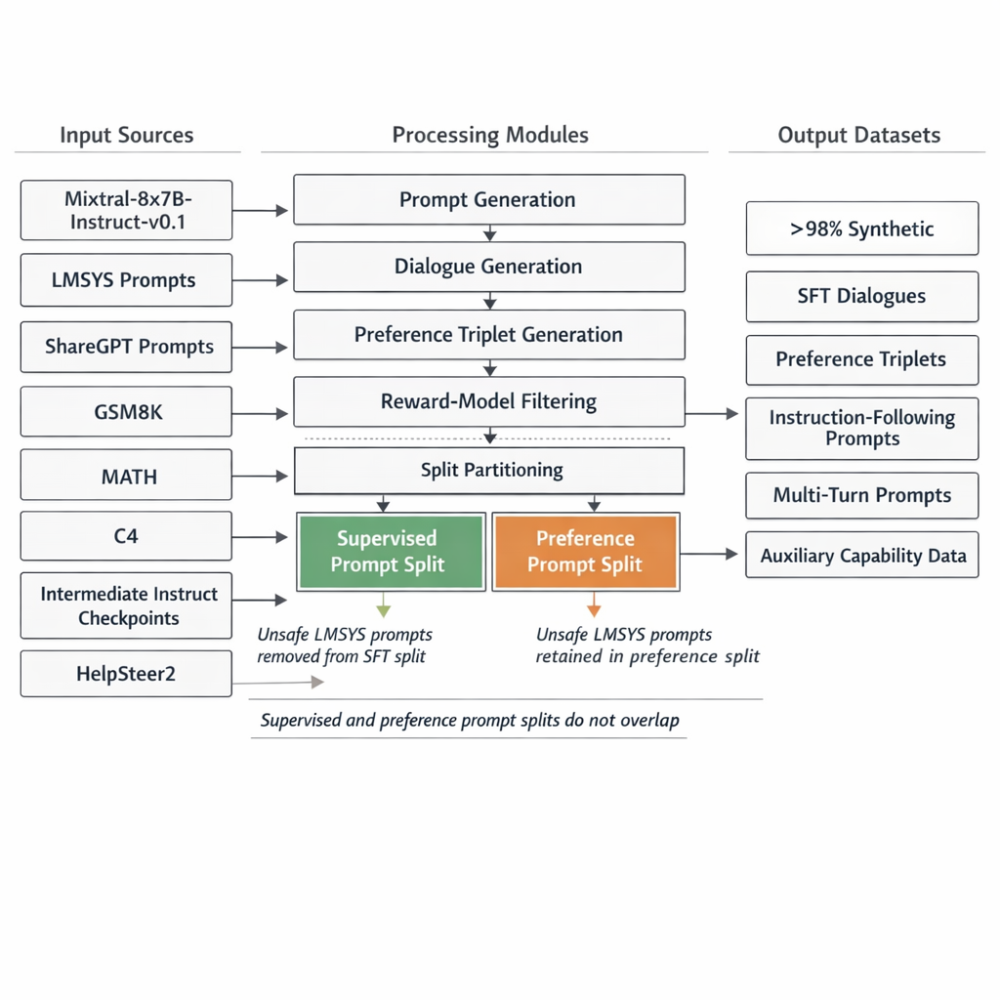

# Nemotron-4 340B: End-to-End Technical Report


*Figure V2-1. High-level systems view of the data pipeline, shared base model, reward-model branch, and sequential alignment path that produces the instruct model.*

---

## 1. Data Pipeline

### 1.1 Pretraining Data


*Figure V2-2. Controlled pretraining blend of English, multilingual, and code data feeding the full 9T-token corpus and the 8T plus 1T stage split.*

#### 1.1.1 Definition and Composition

The pretraining corpus is a tripartite data blend:

| Modality | Proportion | Details |
|---|---|---|
| English natural language | 70% | Web documents, news articles, scientific papers, books |
| Multilingual natural language | 15% | 53 natural languages; monolingual and parallel corpora |
| Source code | 15% | 43 programming languages |

**Total token budget:** $T_{\text{total}} = 9 \times 10^{12}$ tokens, decomposed as:

$$T_{\text{total}} = T_{\text{pretrain}} + T_{\text{continued}} = 8 \times 10^{12} + 1 \times 10^{12}$$

#### 1.1.2 Curation Invariants

- Data blend follows Nemotron-4-15B-Base (Parmar et al., 2024) identically
- Curation procedures include deduplication, quality filtering, domain balancing
- No explicit disclosure of decontamination protocol against downstream evaluation sets

#### 1.1.3 Continued Training Data Distribution

Two distinct distributions during the final $1 \times 10^{12}$ tokens:

**Distribution 1 (majority):** Re-weighted pretraining tokens with higher sampling probability on high-quality sources

**Distribution 2 (minority):** Question-answering style alignment examples + up-weighted sources from low-accuracy domains

**Objective:** Smooth transition from pretraining distribution to alignment-ready representation

**Learning rate schedule:** Prioritizes steeper decay slope over absolute magnitude, enabling graceful distribution shift without catastrophic forgetting

#### 1.1.4 Failure Modes

- **Distribution mismatch:** Abrupt data distribution shift causes catastrophic forgetting; mitigated by gradual transition
- **Data contamination:** No explicit decontamination against evaluation benchmarks documented
- **Under-representation bias:** Multilingual and code data at 15% each may underperform on low-resource languages or niche programming languages

---

### 1.2 Alignment Data


*Figure V2-3. Alignment data system with source datasets, prompt and dialogue generation, reward-model filtering, split partitioning, and the output datasets used in SFT and preference training.*


*Figure V2-4. Two-turn prompt construction and LMSYS merging rules, highlighting the non-overlapping supervised and preference partitions and the safety-specific handling of unsafe prompts.*

#### 1.2.1 Human-Annotated Data Budget

| Dataset | Size | Purpose |
|---|---|---|
| SFT human data | ~10K | Supervised fine-tuning seed |
| HelpSteer2 | 10K | Reward model training + preference fine-tuning |
| **Total human-annotated** | **~20K** | |

**Critical invariant:** Over 98% of all alignment data is synthetically generated.

#### 1.2.2 Synthetic Prompt Generation Pipeline

**Generator model:** Mixtral-8x7B-Instruct-v0.1 (permissive license)

**Prompt taxonomy:**

| Task Type | Generation Method |
|---|---|
| Open Q&A | Topic → subtopic hierarchy (3K topics); generate question per topic, then refine for specificity |
| Writing | Instruction to generate document types (newsletters, essays) per topic; refinement pass |
| Closed Q&A | C4 documents → generate instructions (summarize, extract) → concatenate with templates |
| Math & Coding | Keyword collection (12K Python, 17K math) → topic/subtopic generation → problem generation per keyword |

**Pseudo-Algorithm: Synthetic Single-Turn Prompt Generation**

```
PROCEDURE GenerateSingleTurnPrompts(generator, task_type):
    IF task_type == "open_qa":
        macro_topics ← generator.generate("List diverse macro topics")
        FOR each t in macro_topics:
            subtopics ← generator.generate("List subtopics of " + t)
        topics ← macro_topics ∪ subtopics ∪ manual_topics  // |topics| = 3K
        FOR each topic in topics:
            q ← generator.generate("Generate question about " + topic)
            q_refined ← generator.generate("Make more detailed and specific: " + q)
            EMIT q_refined
    ELIF task_type == "closed_qa":
        FOR each doc in C4_corpus:
            instruction ← generator.generate("Generate instruction for: " + doc)
            prompt ← TEMPLATE(doc, instruction)
            EMIT prompt
    ELIF task_type == "math_coding":
        keywords ← parse_python_pretraining() ∪ manual_math_keywords
        // |python_keywords| = 12K, |math_keywords| = 17K
        FOR each kw in keywords:
            problem ← generator.generate("Generate problem about " + kw)
            EMIT problem
    ELIF task_type == "writing":
        FOR each topic in topics:
            task ← generator.generate("Generate writing task about " + topic)
            task_refined ← generator.generate("Add details: " + task)
            EMIT task_refined
```

#### 1.2.3 Instruction-Following Prompt Construction

For a random prompt $p$ from the synthetic prompt pool and a verifiable instruction template $c$ sampled from Zhou et al. (2023):

$$p_{\text{IF}} = \text{TEMPLATE}(p, c)$$

Three instruction-following prompt types:

1. **Single-turn IF:** Concatenate prompt + instruction
2. **Multi-turn IF:** Instruction applies to all future conversation turns, wrapped in `[BEGIN OF INSTRUCTION]...[END OF INSTRUCTION]`
3. **Second-turn IF:** Request revision of previous response according to new instruction

#### 1.2.4 Two-Turn Prompt Construction

Structure: $(u_1, a_1, u_2)$ where $u_1$ sourced from ShareGPT, $a_1$ and $u_2$ generated by intermediate instruct models.

**Motivation:** Preference data is typically single-turn; two-turn prompts improve multi-turn conversation capability during preference fine-tuning.

#### 1.2.5 Real-World LMSYS Prompts

- Drawn from LMSYS-Chat-1M
- Combined with synthetic prompts in balanced ratio
- **Split invariant:** SFT split and preference split are disjoint
- SFT split: potentially unsafe LMSYS prompts removed
- Preference split: unsafe prompts retained (model learns to distinguish safe vs. unsafe responses)

**Quality comparison:** Mean helpfulness score (via Nemotron-4-340B-Reward) of synthetic prompts = 3.24 vs. LMSYS prompts = 3.04, indicating LMSYS prompts are harder/more complex on average.

---

### 1.3 Synthetic Dialogue Generation


*Figure V2-5. Three-turn synthetic dialogue generation with alternating assistant and user simulation, dialogue-history reuse, quality scoring, and threshold-based retention.*

**Pseudo-Algorithm: Multi-Turn Dialogue Synthesis**

```
PROCEDURE GenerateSyntheticDialogues(instruct_model, prompts, reward_model, threshold):
    FOR each prompt p in prompts:
        dialogue ← []
        FOR turn t = 1 TO 3:
            IF t is odd:  // Assistant turn
                response ← instruct_model.generate(p, dialogue, sampling="greedy")
                dialogue.append(("assistant", response))
            ELSE:  // User turn
                user_persona ← SAMPLE(user_personality_pool)
                user_query ← instruct_model.generate(
                    system="Simulate user with personality: " + user_persona,
                    context=dialogue)
                user_query ← POSTPROCESS(user_query)
                    // Remove polite statements: "Thank you for...", "Sure I'd happy to..."
                dialogue.append(("user", user_query))
        score ← reward_model.predict(dialogue)
        IF score ≥ threshold:
            EMIT dialogue
        ELSE:
            DISCARD dialogue
```

**Key design choices:**
- Greedy sampling for demonstration data (deterministic, high-quality)
- Quality filtering via Nemotron-4-340B-Reward with predetermined threshold
- Explicit user personality prompting to diversify conversational patterns

---

### 1.4 Synthetic Preference Data Generation



*Figure V2-6. Compact view of the prompt-generation, dialogue-generation, preference-generation, reward-filtering, and split-partitioning stack that underlies synthetic preference data creation.*

#### 1.4.1 Response Generation

**Prompt sources:** Synthetic single-turn, instruction-following, two-turn, ShareGPT, LMSYS, GSM8K training set, MATH training set

**Response strategy:**
- Multiple responses per prompt from multiple random intermediate models → diversity
- Additional challenging examples: multiple random generations from best-performing model (by MT-Bench) → self-improvement signal

#### 1.4.2 Preference Judging

Three judging mechanisms:

**Ground-Truth-as-a-Judge:**
For prompts with verifiable answers (GSM8K, MATH, instruction-following with programmatic verification):

$$\text{chosen} = y_i \text{ where } \text{verify}(y_i, \text{ground\_truth}) = \text{True}$$
$$\text{rejected} = y_j \text{ where } \text{verify}(y_j, \text{ground\_truth}) = \text{False}$$

**LLM-as-Judge:**
Present $(p, y_1, y_2)$ to judging LLM twice with swapped order:

$$\text{valid triplet iff } \text{judge}(p, y_1, y_2) = \text{judge}(p, y_2, y_1)$$

This eliminates positional bias. Used in early iterations.

**Reward-Model-as-Judge:**

$$\text{chosen} = \arg\max_{y \in \{y_1, y_2\}} r_\theta(p, y)$$
$$\text{rejected} = \arg\min_{y \in \{y_1, y_2\}} r_\theta(p, y)$$

where $r_\theta$ is Nemotron-4-340B-Reward.

**Empirical comparison:**
- RewardBench Chat-Hard category: Reward-Model-as-Judge accuracy = 0.87 vs. LLM-as-Judge accuracy = 0.54
- Later iterations exclusively use Reward-Model-as-Judge

**Pseudo-Algorithm: Preference Data Construction**

```
PROCEDURE ConstructPreferenceData(prompts, models, reward_model, judge_type):
    preference_data ← []
    FOR each prompt p in prompts:
        responses ← {}
        FOR each model m in models:
            y_m ← m.generate(p)
            responses.add(y_m)
        IF ground_truth_available(p):
            chosen ← SELECT(responses, verify=True)
            rejected ← SELECT(responses, verify=False)
        ELIF judge_type == "reward_model":
            scores ← {y: reward_model.predict(p, y) FOR y in responses}
            chosen ← argmax(scores)
            rejected ← argmin(scores)
        ELIF judge_type == "llm":
            FOR each pair (y_i, y_j) in COMBINATIONS(responses, 2):
                j1 ← llm_judge(p, y_i, y_j)
                j2 ← llm_judge(p, y_j, y_i)
                IF j1 == j2:  // Consistent judgment
                    chosen, rejected ← ASSIGN(y_i, y_j, j1)
        IF chosen ≠ NULL AND rejected ≠ NULL:
            preference_data.append((p, chosen, rejected))
    RETURN preference_data
```

---

### 1.5 Iterative Weak-to-Strong Alignment


*Figure V2-7. Judge hierarchy for synthetic preference triplets together with the weak-to-strong flywheel that improves both the generator and the quality of future synthetic data.*

#### 1.5.1 Formal Definition

Let $\mathcal{M}_t$ denote the aligned model at iteration $t$, $\mathcal{B}_t$ the base model checkpoint at iteration $t$, and $\mathcal{D}_t$ the synthetic dataset generated by $\mathcal{M}_{t-1}$:

$$\mathcal{D}_t = \text{SDG}(\mathcal{M}_{t-1})$$
$$\mathcal{M}_t = \text{Align}(\mathcal{B}_t, \mathcal{D}_t)$$

**Initial condition:** $\mathcal{M}_0 = \text{Mixtral-8x7B-Instruct-v0.1}$

#### 1.5.2 Iteration Schedule

| Iteration | Generator | Base Model | Result |
|---|---|---|---|
| 0 | Mixtral-8x7B-Instruct-v0.1 | 340B-Interm-1-Base | 340B-Interm-1-Instruct |
| 1 | 340B-Interm-1-Instruct | 340B-Interm-2-Base | 340B-Interm-2-Chat |
| ... | Successive intermediate instruct models | Successive base checkpoints | Progressively stronger models |

#### 1.5.3 Two Improvement Axes

**Axis 1 (Base model strength):** Fixed dataset $\mathcal{D}$, stronger $\mathcal{B}$ → stronger $\mathcal{M}$

$$\text{Quality}(\mathcal{M}) \propto \text{Quality}(\mathcal{B}) \quad \text{at fixed } \mathcal{D}$$

**Axis 2 (Data quality):** Fixed $\mathcal{B}$, higher-quality $\mathcal{D}$ → stronger $\mathcal{M}$

$$\text{Quality}(\mathcal{M}) \propto \text{Quality}(\mathcal{D}) \quad \text{at fixed } \mathcal{B}$$

**Key empirical finding:** The teacher model does NOT impose a ceiling on the student model. The student surpasses the teacher when the base model is sufficiently strong.

**Alignment is performed in parallel with base model pretraining** — enabling co-evolution of data quality and model capability.

#### 1.5.4 Failure Modes

- **Reward hacking:** Iterative self-improvement may exploit reward model blind spots
- **Distribution collapse:** Synthetic data from increasingly similar models may reduce diversity
- **Error amplification:** Systematic biases in the generator propagate through iterations

---

### 1.6 Additional Data Sources

| Source | Purpose | Details |
|---|---|---|
| CantTalkAboutThis (training set) | Topic following | Synthetic dialogues with distractor turns |
| Incapable tasks data | Hallucination mitigation | Few-shot LLM-generated questions paired with rejection responses |
| Open-Platypus subsets | STEM/logic | PRM800K, SciBench, ARB, OpenBookQA (permissive license only) |
| FinQA | Numerical reasoning | Document-grounded financial QA |
| Human-annotated contextualized QA | Document QA | Liu et al. (2024) |
| WikiTableQuestions | Semi-structured data understanding | Table-based QA |
| Glaive AI function calling subset | Function calling | Tool-use capability |

---

## 2. Model Architecture

### 2.1 Architecture Specification


*Figure V2-8. Decoder-only base architecture with untied embeddings, 96 stacked layers, RoPE, grouped query attention, squared-ReLU MLP blocks, no bias terms, and zero dropout.*

**Type:** Standard decoder-only Transformer (Vaswani et al., 2017) with causal attention mask

| Hyperparameter | Value |
|---|---|
| Transformer layers ($L$) | 96 |
| Hidden dimension ($d_{\text{model}}$) | 18432 |
| Attention heads ($H$) | 96 |
| KV heads ($H_{\text{KV}}$) | 8 |
| Sequence length ($S$) | 4096 |
| Vocabulary size ($V$) | 256,000 |
| Head dimension ($d_h$) | $d_{\text{model}} / H = 192$ |
| GQA group size | $H / H_{\text{KV}} = 12$ |

### 2.2 Parameter Count

**Embedding parameters:**

$$P_{\text{embed}} = V \times d_{\text{model}} = 256{,}000 \times 18{,}432 = 9.4 \times 10^9$$

**Non-embedding parameters:**

$$P_{\text{non-embed}} = 331.6 \times 10^9$$

**Total parameters:**

$$P_{\text{total}} = P_{\text{embed}} + P_{\text{non-embed}} = 341 \times 10^9$$

**Note:** Input-output embeddings are **untied**, so the output projection contributes an additional $d_{\text{model}} \times V$ parameters.

### 2.3 Architectural Components


*Figure V2-9. Grouped query attention mechanism in which 96 query heads share 8 KV heads, preserving attention expressivity while shrinking the KV cache by a factor of twelve.*

#### 2.3.1 Positional Encoding: Rotary Position Embeddings (RoPE)

For query/key vectors $\mathbf{q}, \mathbf{k} \in \mathbb{R}^{d_h}$ at positions $m, n$:

$$\text{RoPE}(\mathbf{x}, m) = \begin{pmatrix} x_1 \cos(m\theta_1) - x_2 \sin(m\theta_1) \\ x_1 \sin(m\theta_1) + x_2 \cos(m\theta_1) \\ \vdots \\ x_{d_h-1} \cos(m\theta_{d_h/2}) - x_{d_h} \sin(m\theta_{d_h/2}) \\ x_{d_h-1} \sin(m\theta_{d_h/2}) + x_{d_h} \cos(m\theta_{d_h/2}) \end{pmatrix}$$

where $\theta_i = 10000^{-2i/d_h}$, $i \in \{1, \ldots, d_h/2\}$.

**Property:** $\langle \text{RoPE}(\mathbf{q}, m), \text{RoPE}(\mathbf{k}, n) \rangle = f(\mathbf{q}, \mathbf{k}, m-n)$, encoding relative position via inner product.

#### 2.3.2 Attention: Grouped Query Attention (GQA)

Standard multi-head attention with $H = 96$ query heads sharing $H_{\text{KV}} = 8$ key-value heads.

For layer $l$, input $\mathbf{X} \in \mathbb{R}^{S \times d_{\text{model}}}$:

$$\mathbf{Q} = \mathbf{X} \mathbf{W}_Q, \quad \mathbf{Q} \in \mathbb{R}^{S \times H \times d_h}$$
$$\mathbf{K} = \mathbf{X} \mathbf{W}_K, \quad \mathbf{K} \in \mathbb{R}^{S \times H_{\text{KV}} \times d_h}$$
$$\mathbf{V} = \mathbf{X} \mathbf{W}_V, \quad \mathbf{V} \in \mathbb{R}^{S \times H_{\text{KV}} \times d_h}$$

Each query head group $g \in \{1, \ldots, H_{\text{KV}}\}$ shares one KV head among $H/H_{\text{KV}} = 12$ query heads:

$$\text{Attn}_{g,i}(\mathbf{Q}, \mathbf{K}, \mathbf{V}) = \text{softmax}\left(\frac{\mathbf{Q}_{g,i} \mathbf{K}_g^\top}{\sqrt{d_h}} + \mathbf{M}_{\text{causal}}\right) \mathbf{V}_g$$

where $\mathbf{M}_{\text{causal}} \in \{0, -\infty\}^{S \times S}$ is the causal mask, $i \in \{1, \ldots, 12\}$ indexes query heads within group $g$.

**KV cache memory per layer:**

$$\text{KV}_{\text{cache}} = 2 \times H_{\text{KV}} \times d_h \times S \times b_{\text{precision}} = 2 \times 8 \times 192 \times S \times b_{\text{precision}}$$

where $b_{\text{precision}}$ is bytes per element.

#### 2.3.3 MLP with Squared ReLU

$$\text{MLP}(\mathbf{x}) = \mathbf{W}_{\text{down}} \cdot \left[\text{SqReLU}(\mathbf{W}_{\text{up}} \cdot \mathbf{x})\right]$$

where:

$$\text{SqReLU}(z) = (\max(0, z))^2 = \text{ReLU}(z)^2$$

**Properties of Squared ReLU:**
- Induces stronger sparsity than standard ReLU (gradient $= 2z \cdot \mathbb{1}[z > 0]$)
- Smoother gradient landscape near zero
- Higher activation sparsity → potential for inference-time activation sparsity exploitation

#### 2.3.4 Excluded Components

| Component | Status |
|---|---|
| Bias terms | **None** in any layer |
| Dropout | Rate = 0 |
| Input-output embedding tying | **Untied** |

### 2.4 Tokenization


*Figure V2-10. SentencePiece tokenizer and reconstruction path used consistently across the base, instruct, and reward models.*

**Tokenizer:** SentencePiece (Kudo and Richardson, 2018)

**Vocabulary size:** $V = 256{,}000$

**Properties:**
- Byte-pair encoding (BPE) variant
- Large vocabulary reduces average sequence length, improving throughput
- Supports multilingual coverage across 53 languages + 43 programming languages

### 2.5 Reward Model Architecture

Built on top of Nemotron-4-340B-Base by:

1. **Remove** the final softmax/language-model head
2. **Replace** with a linear projection (reward head):

$$\mathbf{r} = \mathbf{W}_{\text{reward}} \cdot \mathbf{h}_{\text{last}} + \mathbf{b}_{\text{reward}}, \quad \mathbf{r} \in \mathbb{R}^5$$

where $\mathbf{h}_{\text{last}} \in \mathbb{R}^{d_{\text{model}}}$ is the hidden state of the last token at the final layer.

**Output dimensions (HelpSteer attributes):**

$$\mathbf{r} = (r_{\text{helpfulness}}, r_{\text{correctness}}, r_{\text{coherence}}, r_{\text{complexity}}, r_{\text{verbosity}})$$

**Inference aggregation:**

$$r_{\text{overall}} = \sum_{a=1}^{5} w_a \cdot r_a$$

where $\{w_a\}$ are task-specific or tuned weights.

**Advantage over pairwise ranking models:**
- Multi-attribute regression disentangles helpfulness from irrelevant artifacts (e.g., length bias)
- Fine-grained reward prediction captures nuances between similar responses
- Continuous reward signal enables Reward-Model-as-Judge and RPO

### 2.6 Tensor Dimensions Summary (Per Layer)

| Tensor | Shape | Notes |
|---|---|---|
| $\mathbf{W}_Q$ | $d_{\text{model}} \times (H \times d_h) = 18432 \times 18432$ | |
| $\mathbf{W}_K$ | $d_{\text{model}} \times (H_{\text{KV}} \times d_h) = 18432 \times 1536$ | |
| $\mathbf{W}_V$ | $d_{\text{model}} \times (H_{\text{KV}} \times d_h) = 18432 \times 1536$ | |
| $\mathbf{W}_O$ | $(H \times d_h) \times d_{\text{model}} = 18432 \times 18432$ | |
| $\mathbf{W}_{\text{up}}$ | $d_{\text{model}} \times d_{\text{ff}}$ | $d_{\text{ff}}$ not explicitly stated |
| $\mathbf{W}_{\text{down}}$ | $d_{\text{ff}} \times d_{\text{model}}$ | |

### 2.7 Deployment Constraint

**Target hardware:** Single DGX H100 node (8 × H100 80GB GPUs)

**Precision:** FP8

**Memory requirement at FP8:**

$$\text{Model memory} \approx \frac{341 \times 10^9 \times 1 \text{ byte}}{1} = 341 \text{ GB}$$

$$\text{Available HBM} = 8 \times 80 \text{ GB} = 640 \text{ GB}$$

$$\text{Headroom for KV cache + activations} = 640 - 341 = 299 \text{ GB}$$

---

## 3. Training Pipeline

### 3.1 Pretraining Infrastructure

| Component | Specification |
|---|---|
| Nodes | 768 DGX H100 |
| GPUs per node | 8 × H100 80GB SXM5 |
| Peak per-GPU throughput | 989 TFLOP/s (BF16, dense) |
| Intra-node interconnect | NVLink + NVSwitch, 900 GB/s bidirectional |
| Inter-node interconnect | 8 × 400 Gbps HDR InfiniBand HCAs per node |
| Training precision | BF16 |

### 3.2 Parallelism Strategy


*Figure V2-11. Distributed training topology across DGX H100 nodes, tensor and pipeline parallel factorization, and the data-parallel scaling schedule that drives the batch-size ramp.*

| Parallelism Type | Degree |
|---|---|
| Tensor parallelism (TP) | 8-way (within node) |
| Pipeline parallelism (PP) | 12-way with interleaving |
| Data parallelism (DP) | 16 → 32 → 64 (ramped) |

**Distributed optimizer:** Shards optimizer states across DP replicas → reduces per-GPU memory by factor of DP degree for optimizer states.

**Total GPU count:**

$$\text{GPUs} = \text{TP} \times \text{PP} \times \text{DP}$$

At full scale: $8 \times 12 \times 64 = 6144$ GPUs (768 nodes × 8 GPUs).

### 3.3 Batch Size Ramp Schedule

| Stage | DP | GPUs | Batch Size (sequences) | Tokens (B) | Iteration Time (s) | MFU (%) |
|---|---|---|---|---|---|---|
| 1 | 16 | 1536 | 768 | 200 | 10.3 | 42.4 |
| 2 | 32 | 3072 | 1536 | 200 | 10.3 | 42.3 |
| 3 | 64 | 6144 | 2304 | 7600 | 8.0 | 41.0 |

**Tokens per iteration at stage 3:**

$$\text{Tokens/iter} = \text{batch\_size} \times S = 2304 \times 4096 = 9{,}437{,}184 \approx 9.4 \times 10^6$$

**Total iterations at stage 3:**

$$\text{Iters}_3 = \frac{7.6 \times 10^{12}}{9.4 \times 10^6} \approx 808{,}511$$

**Model FLOP/s Utilization (MFU):**

$$\text{MFU} = \frac{\text{Achieved FLOP/s}}{\text{Peak FLOP/s}} = \frac{6 \times P_{\text{total}} \times \text{Tokens/iter} / t_{\text{iter}}}{\text{GPUs} \times 989 \times 10^{12}}$$

Achieved MFU ≈ 41–42.4%, consistent with large-scale Transformer training.

### 3.4 Continued Pretraining


*Figure V2-12. Continued-pretraining schedule showing the controlled curriculum shift and steeper decay that improves downstream behavior without changing the core LM objective.*

**Token budget:** $1 \times 10^{12}$

**Same loss objective** as pretraining (next-token prediction):

$$\mathcal{L}_{\text{pretrain}} = -\frac{1}{T} \sum_{t=1}^{T} \log p_\theta(x_t | x_{<t})$$

**Data distribution transition:** Gradual shift via:
1. Majority distribution: higher-quality subset reweighting
2. Minority distribution: QA-style alignment examples + low-accuracy domain upweighting

**Learning rate:** Steeper decay slope prioritized, enabling the model to converge on the new distribution without destabilizing learned representations.

---

## 4. Alignment Training

### 4.1 Stage 1: Code SFT

**Objective:** Improve coding and reasoning without interfering with other capabilities

**Data generation — Genetic Instruct:**

```
PROCEDURE GeneticInstruct(seeds, target_size, fitness_llm):
    population ← seeds
    WHILE |population| < target_size:
        FOR each colony in parallel_colonies:
            parent ← SAMPLE(population)
            // Self-instruction mutation
            child_instr ← self_instruct(parent)
            // WizardCoder-style mutation
            child_mutated ← wizard_mutation(child_instr)
            // Generate solution
            solution ← generate_solution(child_mutated)
            // Fitness evaluation via LLM
            correctness ← fitness_llm.judge_correctness(child_mutated, solution)
            quality ← fitness_llm.judge_quality(child_mutated, solution)
            IF correctness AND quality ≥ threshold:
                population.add((child_mutated, solution))
    population ← DEDUPLICATE(population)
    population ← QUALITY_FILTER(population)
    RETURN population  // ~800K samples after filtering
```

**Training configuration:**
- Dataset: ~800K curated code samples
- Epochs: 1
- Learning rate: $3 \times 10^{-7}$ (constant)
- Global batch size: 128
- Loss masking: User turns masked, loss computed only on assistant turns

**Loss function:**

$$\mathcal{L}_{\text{Code-SFT}} = -\frac{1}{|\mathcal{T}_{\text{asst}}|} \sum_{t \in \mathcal{T}_{\text{asst}}} \log p_\theta(x_t | x_{<t})$$

where $\mathcal{T}_{\text{asst}}$ denotes token positions belonging to assistant turns.

### 4.2 Stage 2: General SFT

**Objective:** Broad capability acquisition across all tasks

**Dataset:** 200K blended samples including:
- Synthetic dialogues (Section 1.3)
- Supplementary datasets (Section 1.6)
- 2% code generation samples from Code SFT stage (forgetting mitigation)

**Training configuration:**
- Epochs: 3
- Global batch size: 128
- Learning rate: searched in $[1 \times 10^{-7}, 5 \times 10^{-7}]$
- Loss masking: identical to Code SFT (assistant turns only)

**Rationale for two-stage SFT:**
- Concurrent multi-task learning creates optimization conflicts, especially for coding tasks
- Adjusting sampling weights alone is insufficient to resolve conflicts
- Sequential skill acquisition avoids destructive interference
- Code SFT establishes strong coding foundation; General SFT builds on top without degradation (with 2% code replay)

### 4.3 Stage 3: Direct Preference Optimization (DPO)

#### 4.3.1 Standard DPO Loss

$$\mathcal{L}_{\text{DPO}} = -\mathbb{E}_{(x, y_c, y_l) \sim \mathcal{D}} \left[ \log \sigma\left( \beta \log \frac{\pi_\theta(y_c | x)}{\pi_{\text{ref}}(y_c | x)} - \beta \log \frac{\pi_\theta(y_l | x)}{\pi_{\text{ref}}(y_l | x)} \right) \right]$$

where:
- $\pi_\theta$ is the policy being trained
- $\pi_{\text{ref}}$ is the reference policy (SFT checkpoint)
- $(x, y_c, y_l)$ is (prompt, chosen, rejected)
- $\beta$ is the KL regularization coefficient
- $\sigma(\cdot)$ is the logistic sigmoid

#### 4.3.2 Modified DPO with Chosen SFT Loss

**Observed failure mode:** Both chosen and rejected likelihoods decrease during DPO training; the gap increases but absolute quality degrades. Policy overfits with long training; improvement on one metric (e.g., MT-Bench) degrades others (e.g., 0-shot MMLU).

**Mitigation:**

$$\mathcal{L}_{\text{DPO+SFT}} = \mathcal{L}_{\text{DPO}} + \lambda \cdot \mathcal{L}_{\text{SFT}}(y_c)$$

where:

$$\mathcal{L}_{\text{SFT}}(y_c) = -\frac{1}{|y_c|} \sum_{t} \log \pi_\theta(y_{c,t} | x, y_{c,<t})$$

**Quality filtering on chosen responses:** Only high-quality chosen responses (scored by Nemotron-4-340B-Reward) are included when ground-truth is unavailable.

#### 4.3.3 DPO Training Configuration

| Hyperparameter | Value / Range |
|---|---|
| Preference dataset size | 160K examples |
| Epochs | 1 |
| Global batch size | 256 |
| Learning rate | tuned in $[3 \times 10^{-8}, 3 \times 10^{-7}]$, constant |
| $\beta$ (KL coefficient) | tuned in $[3 \times 10^{-4}, 3 \times 10^{-3}]$ |
| $\lambda$ (SFT loss weight) | tuned in $[1 \times 10^{-5}, 1 \times 10^{-3}]$ |

### 4.4 Stage 4: Reward-aware Preference Optimization (RPO)

#### 4.4.1 Motivation

DPO treats preference as binary, ignoring the magnitude of quality difference. Empirical observations:
- Some rejected responses are only marginally worse than chosen
- DPO maximizes implicit reward gap regardless of actual quality gap
- This leads to overfitting and unnecessarily "unlearning" high-quality rejected responses

#### 4.4.2 RPO Loss Formulation

$$\mathcal{L}_{\text{RPO}} = \mathbb{E}_{(x, y_c, y_l) \sim \mathcal{D}} \left[ D\left[ \left. \eta \left( r^\star(x, y_c) - r^\star(x, y_l) \right) \;\right\|\; \beta \log \frac{\pi_\theta(y_c | x)}{\pi_{\text{ref}}(y_c | x)} - \beta \log \frac{\pi_\theta(y_l | x)}{\pi_{\text{ref}}(y_l | x)} \right] \right]$$

where:
- $\pi_\theta$ is the policy network being trained
- $\pi_{\text{ref}}$ is the reference policy
- $(x, y_c, y_l)$ is (prompt, chosen response, rejected response)
- $r^\star(x, y_c)$, $r^\star(x, y_l)$ are reward model scores for chosen and rejected responses
- $\eta$ is a scaling hyperparameter
- $D[\cdot \| \cdot]$ is a distance metric

#### 4.4.3 Distance Metric

$$D[a \| b] = \sigma(b) \log \frac{\sigma(b)}{\sigma(a)} + (1 - \sigma(b)) \log \frac{1 - \sigma(b)}{1 - \sigma(a)}$$

This is the **binary KL divergence** (KL divergence between two Bernoulli distributions with parameters $\sigma(a)$ and $\sigma(b)$):

$$D[a \| b] = \text{KL}\left( \text{Bern}(\sigma(b)) \| \text{Bern}(\sigma(a)) \right)$$

**Interpretation:** The policy's implicit reward gap $\beta \log \frac{\pi_\theta(y_c|x)}{\pi_{\text{ref}}(y_c|x)} - \beta \log \frac{\pi_\theta(y_l|x)}{\pi_{\text{ref}}(y_l|x)}$ should approximate the scaled true reward gap $\eta(r^\star(x, y_c) - r^\star(x, y_l))$.

#### 4.4.4 Connection to Existing Methods

| Method | Relationship to RPO |
|---|---|
| DPO | RPO with $D = $ binary cross-entropy loss and uniform reward gap |
| DNO (Rosset et al., 2024) | Related through reward-gap-aware optimization |
| cDPO (Mitchell, 2023) | Conservative DPO, related via reward calibration |
| IPO (Azar et al., 2024) | Squared loss version of preference optimization |
| Distill DPO (Fisch et al., 2024) | Distillation from reward model signal |
| BRAINn (Pandey et al., 2024) | Related via reward-aware training |

#### 4.4.5 RPO Training Configuration

| Hyperparameter | Value |
|---|---|
| Preference dataset size | 300K examples |
| Quality filtering on chosen | Less harsh than DPO stage |
| Chosen SFT loss weight | $1 \times 10^{-5}$ |
| $\eta$ | 1 (fixed) |
| Learning rate | $3 \times 10^{-7}$ (fixed) |
| $\beta$ (KL coefficient) | tuned in $[1 \times 10^{-3}, 1.0]$ |
| Iterations | 3 rounds |

**Iterative RPO protocol:**
- Round 1: Initialize from DPO checkpoint; reference policy = DPO checkpoint
- Round $k > 1$: Initialize from Round $k-1$ checkpoint; reference policy = Round $k-1$ checkpoint
- Model improves with each additional RPO iteration

#### 4.4.6 Full RPO Pseudo-Algorithm

```
PROCEDURE RPO_Training(policy_init, ref_policy_init, data, reward_model,
                        β, η, lr, sft_weight, num_rounds):
    π_θ ← policy_init
    π_ref ← ref_policy_init
    FOR round = 1 TO num_rounds:
        FOR each batch (x, y_c, y_l) in data:
            // Compute implicit reward gap
            implicit_gap ← β * (log π_θ(y_c|x) - log π_ref(y_c|x))
                         - β * (log π_θ(y_l|x) - log π_ref(y_l|x))
            // Compute true reward gap
            r_c ← reward_model.predict(x, y_c)
            r_l ← reward_model.predict(x, y_l)
            true_gap ← η * (r_c - r_l)
            // Compute RPO loss (binary KL divergence)
            L_RPO ← σ(true_gap) * log(σ(true_gap) / σ(implicit_gap))
                   + (1 - σ(true_gap)) * log((1 - σ(true_gap)) / (1 - σ(implicit_gap)))
            // Compute chosen SFT loss
            L_SFT ← -mean(log π_θ(y_c,t | x, y_c,<t))
            // Total loss
            L_total ← L_RPO + sft_weight * L_SFT
            // Update
            π_θ ← π_θ - lr * ∇L_total
        // Update reference for next round
        π_ref ← π_θ
    RETURN π_θ
```

### 4.5 Complete Alignment Pipeline Summary


*Figure V2-13. Alignment-stage progression from Code SFT through General SFT, DPO, and iterative RPO, with the stage ordering chosen to preserve coding ability while improving broad instruction following.*

$$\mathcal{B}_{\text{base}} \xrightarrow{\text{Code SFT}} \mathcal{M}_1 \xrightarrow{\text{General SFT}} \mathcal{M}_2 \xrightarrow{\text{DPO}} \mathcal{M}_3 \xrightarrow{\text{RPO}_1} \mathcal{M}_4 \xrightarrow{\text{RPO}_2} \mathcal{M}_5 \xrightarrow{\text{RPO}_3} \mathcal{M}_{\text{Instruct}}$$

### 4.6 Stage-wise Performance Trajectory

| Metric | Code SFT | +Gen SFT | +DPO | +RPO₁ | +RPO₂ | +RPO₃ |
|---|---|---|---|---|---|---|
| MT-Bench (GPT-4-Turbo) | 6.79 | 7.99 | 7.90 | 8.21 | 8.31 | 8.22 |
| MMLU 0-shot | 72.2 | 78.3 | 78.4 | 78.5 | 78.6 | 78.7 |
| GSM8K 0-shot | 77.6 | 87.9 | 88.5 | 91.1 | 91.8 | 92.3 |
| HumanEval 0-shot | 70.7 | 66.5 | 67.1 | 70.7 | 68.3 | 73.2 |
| IFEval Prompt-Strict | 46.4 | 61.4 | 61.7 | 78.2 | 79.9 | 79.9 |
| IFEval Instruction-Strict | 53.8 | 71.9 | 72.7 | 84.5 | 86.1 | 86.1 |

**Key observations:**
- Code SFT: HumanEval 57.3 → 70.7 (+13.4 absolute)
- General SFT: MT-Bench 6.79 → 7.99; slight HumanEval regression (70.7 → 66.5)
- DPO: Mixed — most metrics improve slightly; MT-Bench slightly drops (7.99 → 7.90)
- RPO iterations: **Uniform improvement across all metrics**; IFEval Prompt-Strict 61.7 → 79.9 (+18.2 absolute)

---

## 5. Optimization Strategy

### 5.1 Pretraining Optimizer

**Not explicitly stated** in the report; standard practice for models of this class is Adam/AdamW with:

$$\theta_{t+1} = \theta_t - \alpha_t \frac{\hat{m}_t}{\sqrt{\hat{v}_t} + \epsilon}$$

with distributed optimizer sharding states across DP replicas.

### 5.2 Learning Rate Schedules

| Stage | LR Schedule | LR Value/Range |
|---|---|---|
| Pretraining | Warmup + cosine/linear decay | Not specified |
| Continued pretraining | Steeper decay slope prioritized | Not specified |
| Code SFT | Constant | $3 \times 10^{-7}$ |
| General SFT | Constant (searched) | $[1 \times 10^{-7}, 5 \times 10^{-7}]$ |
| DPO | Constant (searched) | $[3 \times 10^{-8}, 3 \times 10^{-7}]$ |
| RPO | Constant | $3 \times 10^{-7}$ |

### 5.3 Precision

**Training:** BF16

**Deployment:** FP8

### 5.4 Memory Optimization

**Distributed optimizer:** Shards $(\mathbf{m}, \mathbf{v}, \theta_{\text{fp32}})$ across DP replicas

**Per-GPU optimizer state memory reduction factor:** $\text{DP}$ degree

At DP=64: optimizer states reduced by $64\times$ per GPU

### 5.5 Parallelism Mapping

For $L = 96$ layers, PP = 12:

$$\text{Layers per pipeline stage} = \frac{96}{12} = 8$$

With interleaving (virtual pipeline stages), each GPU handles multiple non-contiguous 8-layer chunks, reducing pipeline bubble fraction:

$$\text{Bubble fraction} \approx \frac{p - 1}{m \times p + p - 1}$$

where $p = 12$ is pipeline stages and $m$ is number of microbatches.

---

## 6. Inference Path

### 6.1 Deployment Target


*Figure V2-14. Serving-path view of autoregressive generation and reward-model inference, including prompt tokenization, 96-layer forward passes, KV-cache reuse, next-token selection, and scalar reward aggregation.*

- **Hardware:** Single DGX H100 (8 × H100 80GB)
- **Precision:** FP8
- **Model parallelism at inference:** TP=8 (tensor parallelism across 8 GPUs within one node)

### 6.2 KV Cache Analysis

Per layer per token per KV head:

$$\text{KV bytes/token/layer} = 2 \times H_{\text{KV}} \times d_h \times b_{\text{FP8}} = 2 \times 8 \times 192 \times 1 = 3072 \text{ bytes}$$

For $L = 96$ layers:

$$\text{KV bytes/token} = 96 \times 3072 = 294{,}912 \text{ bytes} \approx 0.294 \text{ MB/token}$$

For sequence length $S = 4096$:

$$\text{KV cache total} = 4096 \times 0.294 \text{ MB} \approx 1.2 \text{ GB per sequence}$$

### 6.3 GQA Serving Advantage

Compared to MHA ($H_{\text{KV}} = H = 96$), GQA with $H_{\text{KV}} = 8$ reduces KV cache by:

$$\text{KV reduction} = \frac{H}{H_{\text{KV}}} = \frac{96}{8} = 12\times$$

This is critical for fitting within the 299 GB headroom after model weights.

### 6.4 Reward Model Inference

**For Reward-Model-as-Judge:**

$$r_{\text{overall}}(x, y) = \sum_{a=1}^{5} w_a \cdot [\mathbf{W}_{\text{reward}} \cdot \mathbf{h}_{\text{last}}(x, y)]_a$$

Single forward pass through the full 340B model per (prompt, response) pair.

---

## 7. Evaluation Protocol


*Figure V2-15. Compact model-family dashboard summarizing benchmark performance, RewardBench, human evaluation, safety evaluation, and the single-node deployment target.*

### 7.1 Base Model Evaluation

| Benchmark | Setup | Metric |
|---|---|---|
| MMLU | 5-shot | Accuracy |
| BBH (BigBench Hard) | 3-shot | Accuracy |
| ARC-Challenge | 25-shot | Accuracy |
| Winogrande | 5-shot | Accuracy |
| HellaSwag | 10-shot | Accuracy |
| HumanEval | 0-shot | Pass@1 |

**Evaluation framework:** LM-Evaluation Harness (Gao et al., 2021)

**Standardized task setup:** Adhered to for all evaluations

### 7.2 Base Model Results

| Model | Size | ARC-c | Winogrande | HellaSwag | MMLU | BBH | HumanEval |
|---|---|---|---|---|---|---|---|
| Nemotron-4-340B-Base | 340B | **94.28** | **89.50** | **90.53** | 81.10 | **85.44** | 57.32 |
| Llama-3 70B | 70B | 93.00 | 85.30 | 88.00 | 79.50 | 81.30 | 48.20 |
| Mixtral 8x22B | 8×22B | 91.30 | 84.70 | 88.50 | 77.75 | 78.90 | 45.10 |
| Qwen-2 72B | 72B | 68.90 | 85.10 | 87.60 | **84.20** | 82.40 | **64.60** |

### 7.3 Instruct Model Evaluation

| Benchmark | Setup | Metric |
|---|---|---|
| AlpacaEval 2.0 LC | - | Length-controlled win rate |
| Arena Hard | - | Win rate |
| MT-Bench (GPT-4-Turbo) | Corrected version | Score (1-10) |
| MMLU | 0-shot | Accuracy |
| GSM8K | 0-shot | Accuracy |
| HumanEval | 0-shot | Pass@1 |
| MBPP | 0-shot | Pass@1 |
| IFEval | - | Prompt-Strict-Acc, Instruction-Strict-Acc |
| TFEval | - | Distractor F1, On-topic F1 |

**Note on MT-Bench:** 13 out of 30 reference answers in reasoning, math, coding categories were incorrect in the original version; corrected version used.

### 7.4 Instruct Model Results

| Model | Arena Hard | AlpacaEval 2.0 LC | MT-Bench | MMLU 0-shot | GSM8K 0-shot | HumanEval | MBPP | IFEval P-Strict | IFEval I-Strict |
|---|---|---|---|---|---|---|---|---|---|
| Nemotron-4-340B-Instruct | **54.2** | **41.5** | 8.22 | **78.7** | 92.3 | 73.2 | 75.4 | **79.9** | **86.1** |
| Llama-3-70B-Instruct | 41.1 | 34.4 | 8.16 | 77.2 | 89.5 | 81.7 | 82.3 | 77.8 | 84.3 |
| GPT-4-1106-preview | - | 50.0 | **8.79** | - | - | 85.4 | **85.7** | 77.1 | 83.7 |

### 7.5 Reward Model Evaluation

**Benchmark:** RewardBench (Lambert et al., 2024)

| Model | Overall | Chat | Chat-Hard | Safety | Reasoning |
|---|---|---|---|---|---|
| Nemotron-4-340B-Reward | **92.0** | 95.8 | **87.1** | 91.5 | 93.7 |
| GPT-4o-0513 | 84.7 | **96.6** | 70.4 | 86.7 | 84.9 |
| Gemini 1.5 Pro-0514 | 88.1 | 92.3 | 80.6 | 87.5 | 92.0 |

**Highest accuracy on RewardBench** at time of publication, surpassing all proprietary models.

**Chat-Hard category** (87.1 vs. next-best 80.6): Critical for synthetic preference data generation where chosen and rejected are difficult to differentiate.

### 7.6 Human Evaluation Protocol

**Annotator setup:** Dedicated trained annotator team

**Prompt set:** 136 prompts across 10 task categories (derived from InstructGPT + multi-turn chat)

**Rating scale:** 6-point Likert scale (5 quality levels + 1 for complete instruction-following failure)

**Evaluation axes:**
1. **Helpfulness** (primary)
2. **Truthfulness** (primary)
3. **Length perception** (secondary): Too short / Just right / Too long

**Design:**
- Each prompt paired with 3 responses from fixed model set
- Response order randomized per prompt
- All prompts evaluated by same annotator group
- Scores converted to pairwise win/tie/loss vs. GPT-4-1106-preview

**Results vs. GPT-4-1106-preview:**

$$\text{Win : Tie : Loss} = 28.19\% : 46.57\% : 25.24\%$$

**Length perception:**

| | Nemotron-4-340B-Instruct | GPT-4-1106-preview |
|---|---|---|
| Too short/terse | 0.49% | 0.25% |
| Just right | **79.41%** | 74.02% |
| Too long/verbose | **20.10%** | 25.74% |

### 7.7 Safety Evaluation

#### 7.7.1 AEGIS Evaluation

**Taxonomy:** 13 categories of critical risks (Violence, Sexual, Criminal Planning, Guns/Illegal Weapons, Regulated Substances, Suicide/Self Harm, Sexual Minor, Hate, PII, Harassment, Threat, Profanity, Needs Caution)

**Protocol:** AEGIS test prompts → elicit responses from model → AEGIS safety model judges safe/unsafe

**Result:** Nemotron-4-340B-Instruct has very low unsafe response rate, comparable to Llama-3-70B-Instruct. Negligible unsafe responses in Violence, Suicide/Self Harm, Sexual Minor, PII, Harassment, Threat, Needs Caution. Minor residual issues in Criminal Planning and Regulated Substances.

#### 7.7.2 Garak Security Scan

**Categories tested:** Automatic red teaming, toxic continuation, jailbreaks, prompt injection, content filtering, training data membership inference, code generation, training data replay, adversarial hallucination, chat exfiltration

**Performance:** Nominal to good across categories

#### 7.7.3 Known Vulnerabilities

| Vulnerability | Description |
|---|---|
| Malware generation | Blocks some but not all requests; susceptible to sub-component requests |
| Adversarial hallucination | Gives direct incorrect answers to impossible logic problems; falsely denies primality |
| Jailbreaks | Pass rate below 30% for attempted jailbreaks; helpfulness training increases exploitability |

---

## 8. Compression and Serving

### 8.1 FP8 Quantization


*Figure V2-16. Compression stack overview spanning SentencePiece token compression, grouped-query-attention KV-state compression, and FP8 deployment compression.*

**Deployment precision:** FP8 (E4M3 or E5M2 format on H100)

**Model weight compression:**

$$\text{Compression ratio} = \frac{\text{BF16 size}}{\text{FP8 size}} = \frac{2 \text{ bytes}}{1 \text{ byte}} = 2\times$$

**BF16 model size:**

$$\text{BF16} = 341 \times 10^9 \times 2 = 682 \text{ GB}$$

**FP8 model size:**

$$\text{FP8} = 341 \times 10^9 \times 1 = 341 \text{ GB}$$

**Information preservation:** FP8 quantization on H100 is hardware-native with per-tensor or per-channel scaling factors; the report specifies the model was "sized to fit on a single DGX H100 with 8 GPUs when deployed in FP8 precision."

### 8.2 Serving Constraints


*Figure V2-17. Single-node FP8 serving budget showing sharded weight placement across eight H100 GPUs and the residual runtime budget for KV cache and buffers.*

| Constraint | Value |
|---|---|
| Target hardware | 1 × DGX H100 (8 × 80GB GPUs) |
| Available HBM | 640 GB |
| Model weights (FP8) | 341 GB |
| KV cache + activation headroom | 299 GB |
| Inference TP | 8-way |
| Max concurrent sequences | $\lfloor 299 \text{ GB} / \text{KV per sequence} \rfloor$ |

**Max batch size estimate** at full 4096 context:

$$B_{\max} \approx \frac{299 \text{ GB}}{1.2 \text{ GB/seq}} \approx 249 \text{ sequences}$$

(Excluding activation memory overhead, which would reduce this.)

---

## 9. System-Level Failure Modes and Mitigations

| Failure Mode | Where It Manifests | Mitigation |
|---|---|---|
| **Likelihood collapse in DPO** | Both chosen and rejected likelihoods decrease | Added weighted SFT loss on chosen responses |
| **DPO overfitting** | Metric improvements on one task degrade others | RPO replaces binary preference with calibrated reward gap |
| **Unlearning high-quality rejects** | DPO forces maximum gap even for marginally worse rejects | RPO approximates true reward gap, preventing excessive unlearning |
| **Multi-task optimization conflict** | Concurrent code + general SFT | Two-stage SFT with sequential skill acquisition |
| **Catastrophic forgetting (Code → General)** | Code capability regresses during General SFT | 2% code data replay in General SFT blend |
| **Synthetic data quality ceiling** | Weak generator limits data quality | Iterative weak-to-strong alignment; teacher ceiling is not binding |
| **Positional bias in LLM-as-Judge** | Order of responses affects judgment | Double evaluation with swapped order; only consistent judgments retained |
| **Reward model length bias** | Multi-attribute regression | Separate verbosity dimension in HelpSteer2 attributes |
| **Distribution drift in iterative SDG** | Each iteration's synthetic data shifts distribution | Multiple RPO iterations with updated reference policies |
| **Jailbreak susceptibility** | Helpfulness-safety tradeoff | AEGIS evaluation + Garak scanning; <30% jailbreak pass rate |
| **Adversarial hallucination** | Model gives confident wrong answers to impossible problems | Identified; planned mitigation in subsequent updates |

---

## 10. Complexity Analysis

### 10.1 Pretraining Compute

**Forward pass FLOPs per token (approximate):**

$$C_{\text{fwd}} \approx 2 \times P_{\text{non-embed}} = 2 \times 331.6 \times 10^9 = 663.2 \times 10^9 \text{ FLOP}$$

**Total training FLOPs (forward + backward ≈ 3× forward):**

$$C_{\text{total}} = 6 \times P_{\text{non-embed}} \times T_{\text{total}} = 6 \times 331.6 \times 10^9 \times 9 \times 10^{12} \approx 1.79 \times 10^{25} \text{ FLOP}$$

### 10.2 Attention Complexity

**Per layer, per token (causal attention):**

$$\mathcal{O}(S \times d_h \times H) + \mathcal{O}(S^2 \times H)$$

With GQA, KV computation cost reduced by $H/H_{\text{KV}} = 12\times$:

$$\text{KV compute} = \mathcal{O}(S \times d_h \times H_{\text{KV}})$$

### 10.3 Alignment Stage Compute (Relative)

| Stage | Dataset Size | Epochs | Effective Tokens |
|---|---|---|---|
| Code SFT | 800K samples | 1 | ~800K × avg_len |
| General SFT | 200K samples | 3 | ~600K × avg_len |
| DPO | 160K triplets | 1 | ~320K × avg_len (chosen + rejected) |
| RPO (×3) | 300K triplets × 3 | 1 each | ~1.8M × avg_len |

Alignment compute is orders of magnitude smaller than pretraining ($\ll 9 \times 10^{12}$ tokens).

---

## 11. Mathematical Derivation: RPO vs DPO

### 11.1 DPO Implicit Reward

Under the DPO framework, the implicit reward of a response $y$ given prompt $x$ is:

$$\hat{r}_\theta(x, y) = \beta \log \frac{\pi_\theta(y | x)}{\pi_{\text{ref}}(y | x)}$$

DPO loss minimizes:

$$\mathcal{L}_{\text{DPO}} = -\log \sigma\left(\hat{r}_\theta(x, y_c) - \hat{r}_\theta(x, y_l)\right)$$

This forces $\hat{r}_\theta(x, y_c) - \hat{r}_\theta(x, y_l) \to +\infty$, regardless of the true gap $r^\star(x, y_c) - r^\star(x, y_l)$.

### 11.2 RPO Reward Calibration

RPO instead minimizes:

$$\mathcal{L}_{\text{RPO}} = D\left[\eta(r^\star(x, y_c) - r^\star(x, y_l)) \;\|\; \hat{r}_\theta(x, y_c) - \hat{r}_\theta(x, y_l)\right]$$

**At optimum:**

$$\hat{r}_\theta(x, y_c) - \hat{r}_\theta(x, y_l) = \eta(r^\star(x, y_c) - r^\star(x, y_l))$$

The implicit reward gap is calibrated to the true reward gap, preventing:
- Over-separation when the true gap is small
- Under-separation when the true gap is large

### 11.3 Gradient Analysis

Let $\Delta_\theta = \hat{r}_\theta(x, y_c) - \hat{r}_\theta(x, y_l)$ and $\Delta^\star = \eta(r^\star(x, y_c) - r^\star(x, y_l))$.

With the binary KL divergence:

$$D[\Delta^\star \| \Delta_\theta] = \sigma(\Delta^\star) \log \frac{\sigma(\Delta^\star)}{\sigma(\Delta_\theta)} + (1 - \sigma(\Delta^\star)) \log \frac{1 - \sigma(\Delta^\star)}{1 - \sigma(\Delta_\theta)}$$

Taking the gradient with respect to $\Delta_\theta$:

$$\frac{\partial D}{\partial \Delta_\theta} = -\sigma(\Delta^\star) \cdot \frac{\sigma'(\Delta_\theta)}{\sigma(\Delta_\theta)} + (1 - \sigma(\Delta^\star)) \cdot \frac{\sigma'(\Delta_\theta)}{1 - \sigma(\Delta_\theta)}$$

$$= \sigma'(\Delta_\theta) \left[ \frac{1 - \sigma(\Delta^\star)}{1 - \sigma(\Delta_\theta)} - \frac{\sigma(\Delta^\star)}{\sigma(\Delta_\theta)} \right]$$

$$= \sigma(\Delta_\theta)(1 - \sigma(\Delta_\theta)) \left[ \frac{1 - \sigma(\Delta^\star)}{1 - \sigma(\Delta_\theta)} - \frac{\sigma(\Delta^\star)}{\sigma(\Delta_\theta)} \right]$$

$$= (1 - \sigma(\Delta^\star)) \cdot \sigma(\Delta_\theta) - \sigma(\Delta^\star) \cdot (1 - \sigma(\Delta_\theta))$$

$$= \sigma(\Delta_\theta) - \sigma(\Delta^\star)$$

**At equilibrium:** $\frac{\partial D}{\partial \Delta_\theta} = 0 \Rightarrow \sigma(\Delta_\theta) = \sigma(\Delta^\star) \Rightarrow \Delta_\theta = \Delta^\star$

This confirms RPO drives the implicit reward gap to match the true reward gap, with gradient magnitude proportional to the mismatch.

**Contrast with DPO gradient:**

$$\frac{\partial \mathcal{L}_{\text{DPO}}}{\partial \Delta_\theta} = -(1 - \sigma(\Delta_\theta))$$

DPO gradient is always negative (pushing $\Delta_\theta \to +\infty$) regardless of true gap.

---

## 12. Convergence Dynamics

### 12.1 DPO Convergence Issues

**Likelihood monotonic decrease:** Both $\log \pi_\theta(y_c|x)$ and $\log \pi_\theta(y_l|x)$ decrease. The gap $\hat{r}_\theta(x, y_c) - \hat{r}_\theta(x, y_l)$ increases, but the policy drifts from the data manifold.

**Mode collapse indicator:** When $\pi_\theta(y_c|x)$ drops significantly below $\pi_{\text{ref}}(y_c|x)$, the model is "unlearning" the chosen response.

### 12.2 RPO Convergence Properties

**Bounded optimization target:** Since $D[\Delta^\star \| \Delta_\theta]$ has minimum 0 at $\Delta_\theta = \Delta^\star$, the objective is bounded below by 0.

**Adaptive gradient magnitude:** Small true gap $\Delta^\star$ → small target $\Delta_\theta$ → gradient approaches zero quickly → prevents over-optimization.

**SFT regularization:** The additional $\lambda \cdot \mathcal{L}_{\text{SFT}}(y_c)$ term anchors $\pi_\theta(y_c|x)$ near the training data, preventing likelihood collapse.

### 12.3 Iterative RPO Convergence

With reference policy updated each round:

$$\pi_{\text{ref}}^{(k)} = \pi_\theta^{(k-1)}$$

The KL divergence between successive policies is implicitly bounded by the learning rate and number of gradient steps per round. Three rounds of RPO show monotonic improvement on most metrics (Table 6), suggesting stable convergence without oscillation.

---

## 13. Significance and Implications

### 13.1 Why This Matters

1. **98% synthetic data alignment:** Demonstrates that human annotation can be reduced to ~20K samples with strong synthetic data generation pipeline
2. **Iterative weak-to-strong:** Teacher ceiling is NOT binding — weaker teacher can produce data that trains a stronger student when the base model is sufficiently capable
3. **Multi-attribute reward modeling:** Outperforms pairwise ranking and single-scalar reward on RewardBench, enabling better synthetic data filtering
4. **RPO algorithm:** Addresses fundamental DPO failure modes (likelihood collapse, over-separation) with principled reward-calibrated objective
5. **Deployment-aware sizing:** 340B parameters specifically chosen to fit single DGX H100 at FP8

### 13.2 Limitations

1. **Sequence length:** $S = 4096$ is short by current standards (cf. 128K+ for frontier models)
2. **Architecture:** Standard dense Transformer without MoE — lower compute efficiency at scale compared to MoE alternatives
3. **No explicit decontamination protocol** documented against evaluation benchmarks
4. **Safety:** <30% jailbreak resistance; residual criminal planning and regulated substances vulnerabilities
5. **Adversarial hallucination:** Model gives confident incorrect answers to impossible problems
6. **Reward model Prior Sets performance:** Lower accuracy on Prior Sets (67.4) likely due to not training on those datasets' training data
7. **Single modality:** Text-only; no multimodal capability

### 13.3 Frontier Extensions

- **MoE routing** over the 340B parameter space for inference efficiency
- **Longer context** via RoPE scaling or hybrid linear attention
- **RLVR/DAPO** replacing RPO for verifier-guided reasoning optimization
- **Speculative decoding** with smaller draft models from the same family
- **MLA-style KV compression** to further reduce serving memory
- **Multimodal extension** via cross-attention fusion with vision/audio encoders
