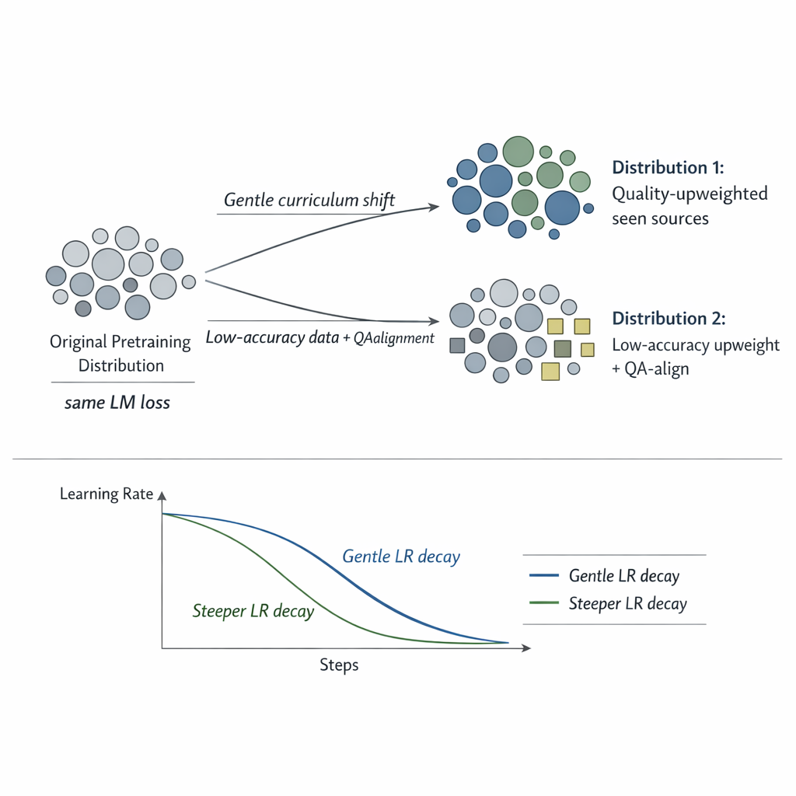
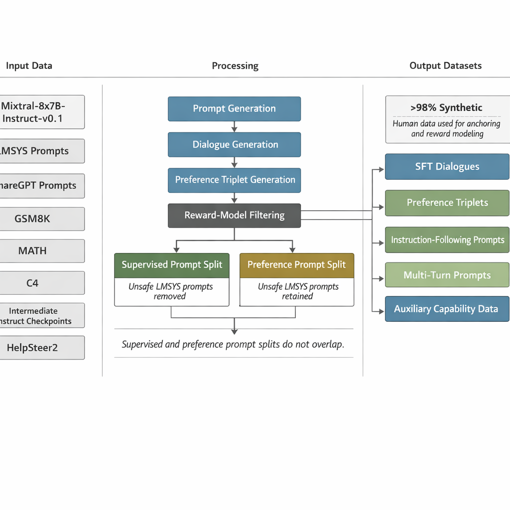
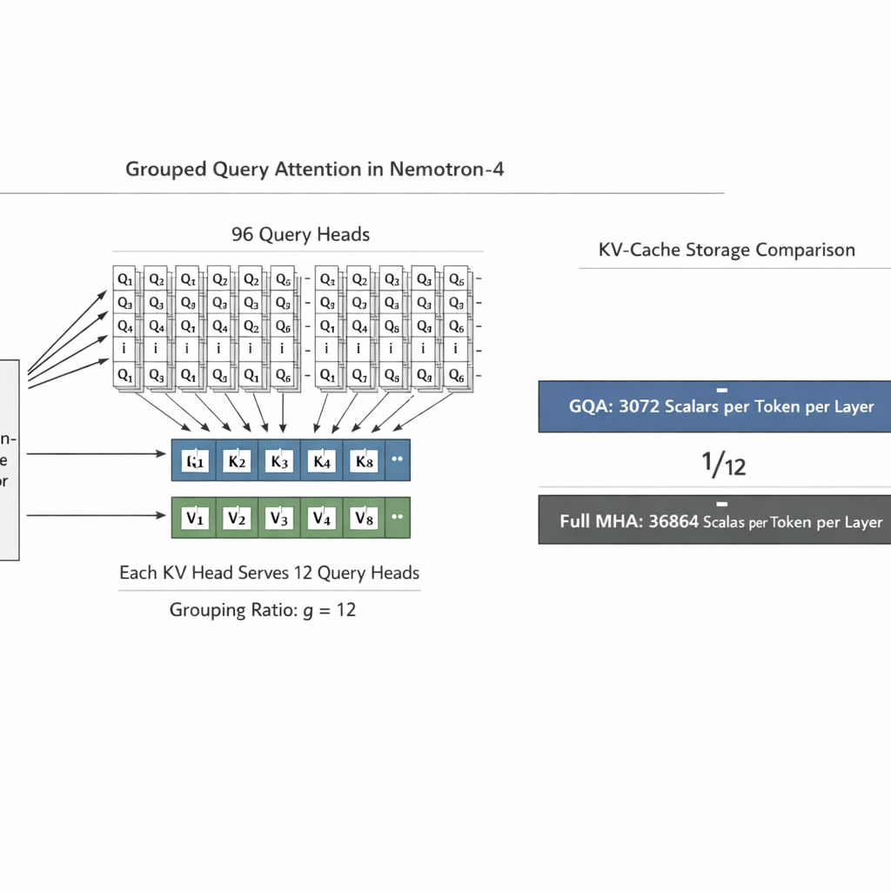
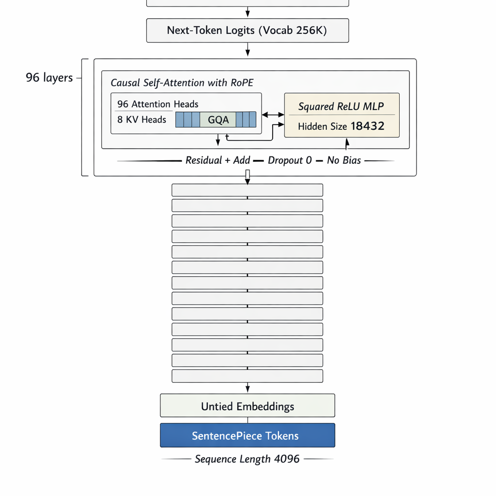
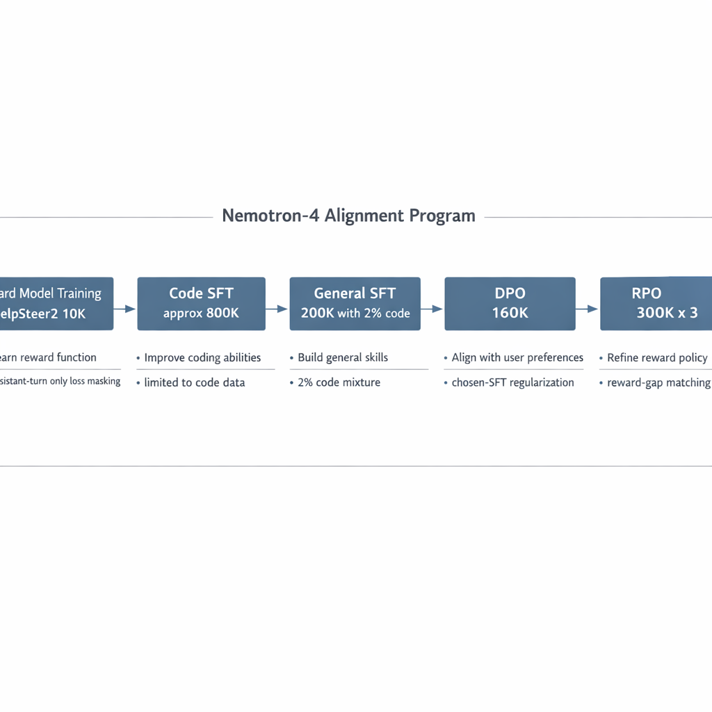
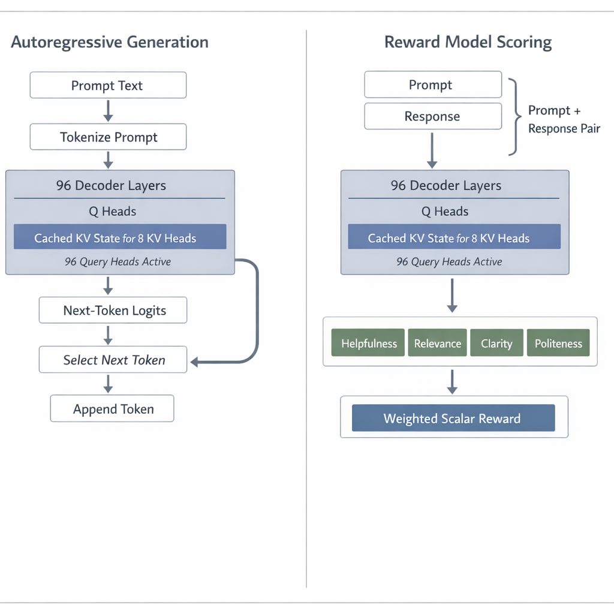
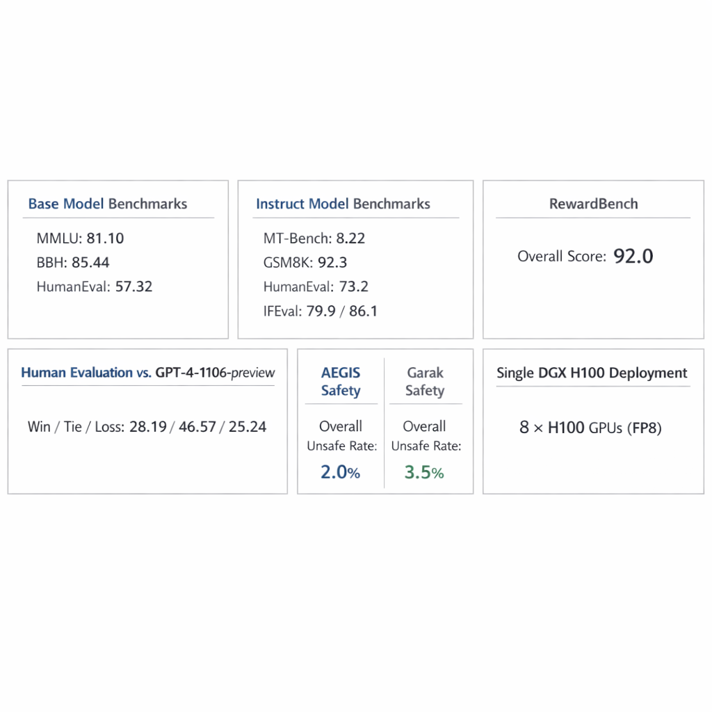

# Nemotron-4 340B End-to-End Technical Report

## 1. Data Pipeline

### 1.1 Global Data Objective

*Figure V3-1. End-to-end overview of the shared data-production stack that jointly yields the base, reward, and instruct artifacts through pretraining, reward-head replacement, synthetic data generation, and staged alignment.*

Learn three coupled artifacts from a shared data-production stack:

- a base causal language model, Nemotron-4-340B-Base
- an instruction-following model, Nemotron-4-340B-Instruct
- a reward model, Nemotron-4-340B-Reward

The data system is factorized into:

- pretraining corpus construction
- synthetic prompt generation
- synthetic dialogue generation
- synthetic preference triplet generation
- auxiliary capability datasets
- iterative weak-to-strong data refinement

The alignment data budget is dominated by synthetic data:

- approximately $20\text{K}$ human-annotated data total
- $10\text{K}$ for supervised fine-tuning
- $10\text{K}$ HelpSteer2 for reward model training and preference fine-tuning
- over $98\%$ of SFT and preference data is synthetic

---

### 1.2 Pretraining Corpus Construction

*Figure V3-2. Pretraining corpus mixture showing the exact English, multilingual, and code proportions that feed the 9T-token stream and the 8T plus 1T stage split.*

#### Definition

The pretraining distribution is a three-component mixture over tokenized corpora:

$$
p_{\text{pre}}(z)=0.70\,p_{\text{en}}(z)+0.15\,p_{\text{multi}}(z)+0.15\,p_{\text{code}}(z)
$$

where:

- $p_{\text{en}}$: English natural language corpus
- $p_{\text{multi}}$: multilingual natural language corpus
- $p_{\text{code}}$: source code corpus

#### Inputs

- curated English documents from web, news, scientific papers, books, and related sources
- multilingual documents from monolingual and parallel corpora
- source code documents

#### Outputs

- tokenized training stream of $9\text{T}$ tokens
- first $8\text{T}$ tokens used for formal pretraining
- last $1\text{T}$ tokens used for continued pretraining

#### Composition

- English natural language: $70\%$
- multilingual natural language: $15\%$
- source code: $15\%$

#### Coverage

- multilingual data: $53$ natural languages
- code data: $43$ programming languages

#### Invariants

- mixture proportions are explicitly controlled at the category level
- continued pretraining preserves the same causal language modeling objective
- data blend follows the same corpus design as Nemotron-4-15B-Base

#### Failure Modes

- domain imbalance if sampling weights drift
- under-coverage of low-resource languages or code languages
- late-stage quality degradation if continued pretraining is not distribution-controlled

---

### 1.3 Continued Pretraining Distribution Shift

*Figure V3-3. Continued-pretraining schedule with quality-upweighted seen sources, low-accuracy-domain upweighting, small QA-style alignment injection, and a steeper learning-rate decay.*

#### Definition

After $8\text{T}$ pretraining tokens, the model is further trained on $1\text{T}$ tokens under modified sampling distributions while keeping the same loss objective.

Let $p_{\text{cont},1}$ and $p_{\text{cont},2}$ denote the two continued-training distributions.

#### Distribution 1

Majority of continued-training tokens.

Constraint:

$$
p_{\text{cont},1}(s) \propto w_{\text{quality}}(s)\,p_{\text{pre}}(s)
$$

with larger sampling weights on higher-quality sources already seen during pretraining.

#### Distribution 2

Minority of continued-training tokens.

Constraint:

$$
p_{\text{cont},2}(s) \propto w_{\text{low-acc}}(s)\,p_{\text{pre}}(s)+p_{\text{QA-align}}(s)
$$

where:

- $p_{\text{QA-align}}$ introduces a small number of question-answering style alignment examples
- $w_{\text{low-acc}}(s)$ upweights sources from areas of low model accuracy

#### Learning Rate Constraint

The continued phase changes both:

- data distribution
- learning rate decay schedule

with emphasis on a steeper decay slope rather than larger absolute learning rate magnitude.

#### Objective

Enable a gentle transition away from the original pretraining distribution while improving downstream evaluation behavior.

#### Failure Modes

- abrupt curriculum shift causing forgetting
- overspecialization to evaluation-style QA
- insufficient transfer if the decay schedule is too flat

---

### 1.4 Synthetic Alignment Data System

*Figure V3-4. Synthetic alignment data stack linking source prompts and checkpoints to prompt generation, dialogue generation, preference generation, reward-model filtering, and output datasets.*

#### Definition

The alignment corpus is synthesized from prompt generation, dialogue generation, and preference generation pipelines, with human data used primarily for supervision anchoring and reward modeling.

#### Inputs

- Mixtral-8x7B-Instruct-v0.1 as initial synthetic generator
- LMSYS-Chat-1M prompts
- ShareGPT prompts
- GSM8K and MATH training prompts
- C4 documents
- intermediate instruct checkpoints
- HelpSteer2 human preference data

#### Outputs

- SFT dialogues
- preference triplets of the form $(x,y_c,y_r)$
- instruction-following prompts
- multi-turn prompts
- auxiliary capability samples

#### Invariants

- supervised-learning and preference-learning prompt splits do not overlap
- LMSYS unsafe prompts are removed from supervised split
- LMSYS unsafe prompts are retained in preference split
- synthetic data is quality filtered, increasingly via Nemotron-4-340B-Reward

#### Failure Modes

- prompt distribution collapse toward easy prompts
- generator bias propagating into downstream alignment data
- judge bias in synthetic preference ranking
- unsafe content leakage without split-specific filtering

---

### 1.5 Prompt Preparation

## 1.5.1 Synthetic Single-Turn Prompts

*Figure V3-5. Single-turn prompt preparation across open Q and A, writing, closed-context Q and A, and math or coding tasks, with top-down topic construction and prompt refinement.*

#### Objective

Produce a controllable and diverse prompt distribution spanning task type, topic, and instruction format.

#### Task Axes

- open Q&A
- writing
- closed Q&A
- math and coding

#### Topic Construction

Pipeline:

1. generate diverse macro-topics
2. generate subtopics for each macro-topic
3. merge synthetic macro-topics, synthetic subtopics, and manually collected topics

Total topic inventory:

- $3\text{K}$ topics

#### Open Q&A Prompt Pipeline

Given topic set $\mathcal{T}$, generate question prompts:

$$
\mathcal{P}_{\text{open}}=\{\,\text{Refine}(\text{QuestionGen}(t)) : t\in\mathcal{T}\,\}
$$

where the refinement step makes short questions more detailed and specific.

#### Writing Prompt Pipeline

For each topic, generate writing tasks such as essays or newsletters, then refine them to increase specificity.

#### Closed Q&A Prompt Pipeline

Documents are sourced from C4. For a document $d$:

$$
x = \text{Template}(d,\text{InstructionGen}(d))
$$

Example instruction types include:

- summarize the text
- answer a question based on the text

#### Math and Coding Prompt Pipeline

Keyword inventory:

- $12\text{K}$ Python-related keywords
- $17\text{K}$ math-related keywords

Keyword sources:

- manual keyword collection
- high-level topics and subtopics for math and Python
- LLM classification of Wikipedia entities as math-related or Python-related
- parsing of Python pretraining data for frequent keywords

Prompt generation:

$$
\mathcal{P}_{\text{math/code}}=\{\,\text{ProblemGen}(k): k\in\mathcal{K}_{\text{math}}\cup \mathcal{K}_{\text{python}}\,\}
$$

#### Inputs

- Mixtral-8x7B-Instruct-v0.1
- topic seeds
- keyword seeds
- C4 documents
- manual templates

#### Outputs

- diverse single-turn prompt pool across four task categories

#### Invariants

- diversity is enforced simultaneously over task, topic, and response-format constraints
- generated short prompts are refined before acceptance
- closed-QA prompts are document-conditioned

#### Failure Modes

- trivial or underspecified prompts
- topic redundancy
- bias toward generator-preferred topics
- insufficient difficulty relative to real user requests

---

## 1.5.2 Synthetic Instruction-Following Prompts

#### Objective

Improve strict instruction following, including verifiable output constraints and instruction persistence across turns.

#### Mechanism

For a synthetic prompt $x$ and instruction template $c$ from the verifiable template set:

$$
x'=\text{Template}(x,c)
$$

Instruction types include examples such as:

- fixed number of paragraphs
- JSON output
- constrained answer format
- yes-or-no output

Additional constructions:

- multi-turn persistent instructions applying to all future turns
- second-turn prompts requiring revision of the previous response according to the instruction

#### Inputs

- random subset of synthetic prompts
- verifiable instruction templates from Zhou et al. (2023)

#### Outputs

- single-turn instruction-following prompts
- multi-turn persistent-instruction prompts
- second-turn revision prompts

#### Invariants

- instructions are explicit and externally verifiable
- persistent instruction prompts condition future turns, not just the current answer

#### Failure Modes

- superficial compliance without semantic correctness
- prompt-template artifacts overfitting the model to template style

---

## 1.5.3 Synthetic Two-Turn Prompts

*Figure V3-6. Two-turn prompt construction from ShareGPT starts plus intermediate-model continuations, paired with the LMSYS merge and split rules that separate supervised and preference prompt sets.*

#### Objective

Improve multi-turn conversational behavior inside preference fine-tuning, where preference data is otherwise often single-turn.

#### Structure

A two-turn prompt has the form:

- user question
- assistant answer
- follow-up user question

Formally:

$$
x = [u_1, a_1, u_2]
$$

where:

- $u_1$ is sourced from ShareGPT
- $a_1$ is generated by an intermediate instruct model
- $u_2$ is generated conditioned on dialogue history

#### Inputs

- ShareGPT first-turn user prompts
- intermediate instruct checkpoints

#### Outputs

- multi-turn prompts for preference data construction

#### Failure Modes

- synthetic follow-up questions that are unnatural or weakly grounded in prior turns
- reduced realism if intermediate models generate self-similar conversational trajectories

---

## 1.5.4 Real-World LMSYS Prompts

#### Objective

Inject real-user prompt complexity and difficulty into the alignment corpus.

#### Mechanism

All prompts are combined in a balanced ratio and partitioned into:

- supervised-learning split
- preference-learning split

Constraint:

$$
\mathcal{P}_{\text{SFT}} \cap \mathcal{P}_{\text{Pref}} = \varnothing
$$

Split-specific safety rule:

- supervised split removes prompts flagged as potentially unsafe
- preference split retains such prompts to teach safe-vs-unsafe discrimination

#### Difficulty Diagnostic

Using Mixtral-8x7B-Instruct-v0.1 to answer prompt sets and Nemotron-4-340B-Reward to score helpfulness:

- synthetic prompt helpfulness average: $3.24$
- LMSYS prompt helpfulness average: $3.04$

Interpretation used in the source content:

- higher helpfulness on synthetic prompts indicates those prompts are easier on average
- LMSYS prompts are more difficult and complex on average

#### Failure Modes

- over-reliance on easier synthetic prompt distributions
- safety regression if unsafe preference examples are mis-ranked

---

### 1.6 Synthetic Dialogue Generation for SFT

*Figure V3-7. Synthetic dialogue generation for SFT with alternating assistant and user simulation, user-personality conditioning, history-aware continuation, reward scoring, and threshold-based filtering.*

#### Definition

Generate three-turn synthetic dialogues by iterative role-playing between assistant and user.

#### Objective

Teach dialogue interaction behavior, multi-turn continuity, and user-response conditioning.

#### Dialogue Length

Each dialogue comprises three turns.

#### Mechanism

Given prompt $x_0$, construct dialogue:

$$
d = [u_1, a_1, u_2, a_2, u_3, a_3]
$$

operationally generated through alternating role simulation.

Important details:

- explicit user-personality prompts are injected when simulating user turns
- dialogue history is always included
- polite statements are removed from generated user turns to better mimic real-world user prompts
- greedy sampling is used for demonstration synthesis
- Nemotron-4-340B-Reward scores each dialogue
- samples below a threshold are filtered out

#### Inputs

- prompt pool
- instruct generator
- user personality prompts
- reward model
- filtering threshold

#### Outputs

- high-quality synthetic dialogue dataset for SFT

#### Invariants

- multi-turn structure is preserved
- user turns are post-processed to reduce assistant-like politeness artifacts
- accepted dialogues satisfy reward-threshold filtering

#### Failure Modes

- role leakage: synthetic user sounds like assistant
- mode collapse from greedy generation
- reward-model filtering bias toward stylistic artifacts
- insufficient adversarial or difficult user behavior

---

### 1.7 Synthetic Preference Data Generation

*Figure V3-8. Preference triplet generation pipeline and judge hierarchy, together with the weak-to-strong flywheel that upgrades future generators and future synthetic data quality.*

#### Definition

Construct preference triplets:

$$
(x,y_c,y_r)
$$

where:

- $x$: prompt
- $y_c$: chosen response
- $y_r$: rejected response

#### Objective

Provide broad-domain, high-quality preference data using synthetic responses and available correctness signals.

---

## 1.7.1 Response Generation

#### Prompt Sources

- synthetic single-turn prompts
- synthetic instruction-following prompts
- synthetic two-turn prompts
- ShareGPT prompts
- LMSYS prompts
- GSM8K training prompts
- MATH training prompts

#### Response Sources

For each prompt, responses are generated using:

- multiple random intermediate models
- multiple random generations from the best-performing model according to MT-Bench for harder examples

This increases response diversity and difficulty.

#### Failure Modes

- insufficient negative diversity if all generators have similar policy biases
- low-quality chosen responses if filtering is weak
- response families becoming too homogeneous across iterations

---

## 1.7.2 Ground-Truth-as-a-Judge

#### Objective

Exploit exact correctness signals when available.

#### Mechanism

If a task has a ground-truth label or verifier:

$$
y_c = \arg\max_{y \in \mathcal{Y}} \mathbb{I}[\text{Verify}(x,y)=1]
$$

and incorrect responses are assigned as rejected.

Examples:

- GSM8K and MATH answers
- verifiable instruction-following responses checked with Python programs

#### Invariants

- preference ranking is anchored to externally checkable correctness
- chosen/rejected assignment is not style-based when ground truth exists

#### Failure Modes

- verifier incompleteness
- hidden ambiguities in target format causing false negatives

---

## 1.7.3 LLM-as-a-Judge

#### Objective

Rank response pairs when no objective answer exists.

#### Mechanism

For a prompt $x$ and candidate pair $(y_i,y_j)$:

1. query judge LLM with order $(y_i,y_j)$
2. query again with swapped order $(y_j,y_i)$
3. accept the triplet only if the verdict is consistent across both orderings

Formally, if $J(x,y_i,y_j)$ is the judge verdict, accept only if:

$$
J(x,y_i,y_j) = \neg J(x,y_j,y_i)
$$

in the consistent binary sense intended by the ranking prompt.

#### Failure Modes

- positional bias
- judge inconsistency
- style or verbosity bias

---

## 1.7.4 Reward-Model-as-a-Judge

#### Objective

Replace generic LLM pairwise judgment with a higher-accuracy specialized reward model.

#### Mechanism

For each response pair:

$$
R(x,y)=\sum_{k=1}^{5} w_k\,r_k(x,y)
$$

where $r_k$ are the five HelpSteer attribute predictions:

- Helpfulness
- Correctness
- Coherence
- Complexity
- Verbosity

Ranking rule:

$$
y_c = \arg\max_{y\in\{y_i,y_j\}} R(x,y), \qquad
y_r = \arg\min_{y\in\{y_i,y_j\}} R(x,y)
$$

#### Empirical Diagnostic

Chat-Hard accuracy:

- Reward-Model-as-a-Judge: $0.87$
- LLM-as-a-Judge: $0.54$

#### Invariants

- later preference datasets are reward-model-ranked
- hard preference pairs are a primary target because they are critical for alignment signal quality

#### Failure Modes

- reward-model bias becomes self-reinforcing in downstream alignment
- blind spots on data distributions absent from reward-model training

---

### 1.8 Iterative Weak-to-Strong Alignment Data Flywheel

#### Definition

Alignment data generation and model alignment are iterated jointly such that stronger aligned models generate stronger synthetic data, which in turn trains stronger aligned models.

Let:

- $G_t$ be the aligned generator at iteration $t$
- $B_t$ be the base model checkpoint aligned at iteration $t$
- $\mathcal{D}_t$ be the synthetic data produced by $G_t$

Then the pipeline is:

$$
\mathcal{D}_t = \text{SDG}(G_t), \qquad
G_{t+1} = \text{Align}(B_{t+1},\mathcal{D}_t)
$$

#### Key Observed Property

The teacher does not impose a ceiling on the student.

That is, it is empirically possible that:

$$
Q(G_{t+1}) > Q(G_t)
$$

even though $G_t$ generated the synthetic data for training $G_{t+1}$.

#### Iteration Sequence

- initial aligned generator: Mixtral-8x7B-Instruct-v0.1
- first aligned student base: 340B-Interm-1-Base
- resulting instruct model: 340B-Interm-1-Instruct
- second generator: 340B-Interm-1-Instruct
- next aligned base: 340B-Interm-2-Base
- resulting chat model: 340B-Interm-2-Chat
- multiple rounds continue during base-model pretraining

#### Two Improvement Axes Identified

1. for fixed dataset, stronger base model yields stronger instruct model
2. for fixed base model, higher-quality dataset yields stronger instruct model

#### Failure Modes

- synthetic self-distillation loops amplifying narrow behaviors
- generator overfitting to its own outputs
- quality plateaus if either base capability or data quality stops improving

---

### 1.9 Additional Data Sources

#### Topic Following

- CantTalkAboutThis training set
- purpose: maintain topic coherence under distractor turns

#### Incapable Tasks

- human-written few-shot examples are used to prompt an LLM to generate impossible-task questions and explicit rejection responses
- purpose: reduce hallucinations for tasks requiring unavailable capabilities such as internet access or real-time knowledge

#### STEM Data

Permissive-license subsets from Open-Platypus:

- PRM800K
- SciBench
- ARB
- openbookQA

Purpose:

- improve STEM and logic knowledge

#### Document-Based Reasoning and QA

- FinQA: numerical reasoning
- human annotated contextualized QA data from Liu et al. (2024)
- WikiTableQuestions: semi-structured data understanding

#### Function Calling

- subset of Glaive AI samples

#### Failure Modes

- capability over-specialization if auxiliary data overwhelms general dialogue data
- latent conflicts between rejection behavior, function calling, and broad helpfulness

---

### 1.10 Data Pipeline Pseudo-Algorithms

#### Algorithm 1: Pretraining Data Preparation

1. collect English, multilingual, and code corpora
2. curate corpora according to the Nemotron-4-15B-Base data blend procedure
3. tokenize with SentencePiece
4. sample tokens to satisfy the mixture:
   - $70\%$ English
   - $15\%$ multilingual
   - $15\%$ code
5. stream $8\text{T}$ tokens for formal pretraining
6. switch to continued-pretraining distributions:
   - high-quality upweighted previously seen sources
   - small quantity of QA-style alignment examples and low-accuracy-domain upweights
7. stream final $1\text{T}$ tokens

#### Algorithm 2: Synthetic Prompt Preparation

1. use Mixtral-8x7B-Instruct-v0.1 as prompt generator
2. generate macro-topics
3. generate subtopics for each macro-topic
4. merge synthetic and manual topics into a $3\text{K}$ topic pool
5. generate and refine:
   - open Q&A prompts
   - writing prompts
   - closed-QA prompts from C4 documents plus generated instructions
   - math and coding prompts from keyword inventories
6. create instruction-following variants using verifiable instruction templates
7. create two-turn prompts from ShareGPT starts and intermediate-model continuations
8. merge with LMSYS prompts in balanced ratio
9. partition into non-overlapping supervised and preference prompt sets

#### Algorithm 3: Synthetic Dialogue Generation

1. select input prompt
2. generate assistant response with instruct model
3. generate user follow-up conditioned on dialogue history and explicit personality prompt
4. remove polite user phrases
5. continue until a three-turn dialogue is formed
6. score the dialogue with Nemotron-4-340B-Reward
7. retain only samples above threshold

#### Algorithm 4: Synthetic Preference Triplet Generation

1. select prompt from synthetic or real-world prompt sources
2. generate multiple candidate responses from multiple intermediate models
3. optionally generate hard pairs using multiple random generations from the best MT-Bench model
4. if ground truth or verifier exists:
   - mark correct response as chosen
   - mark incorrect response as rejected
5. else if using LLM-as-a-Judge:
   - judge both original and swapped orderings
   - keep pair only if verdict is consistent
6. else if using Reward-Model-as-a-Judge:
   - compute reward for each response
   - rank by reward
7. export $(x,y_c,y_r)$ triplets

---

## 2. Compression Pipeline

*Figure V3-9. Compression stack overview spanning SentencePiece text compression, grouped-query-attention KV compression, and FP8 deployment compression.*

### 2.1 Text Compression and Reconstruction via SentencePiece

*Figure V3-10. Detailed compression-and-serving view that couples SentencePiece tokenization, grouped query attention, and FP8 deployment into a single systems figure.*

#### Definition

SentencePiece defines a reversible tokenizer:

$$
\tau : \Sigma^\ast \rightarrow \mathcal{V}^{\leq T}
$$

with vocabulary size:

$$
|\mathcal{V}| = 256{,}000
$$

and inverse detokenization:

$$
\tau^{-1} : \mathcal{V}^{\leq T} \rightarrow \Sigma^\ast
$$

#### Objective

Map raw text into a discrete symbol sequence compatible with a decoder-only Transformer while preserving recoverable text structure.

#### Inputs

- raw text strings

#### Outputs

- token-id sequences
- detokenized text after generation

#### Invariants

- tokenizer is fixed across base, instruct, and reward models
- maximum modeled sequence length is $4096$ tokens

#### Failure Modes

- segmentation artifacts on rare strings
- increased prompt length for unfavorable segmentations
- domain-specific token inefficiency for unseen lexical patterns

---

### 2.2 Structural Compression via Grouped Query Attention

*Figure V3-11. Grouped query attention with 96 query heads and 8 shared KV heads, making the one-twelfth KV-cache ratio visually explicit.*

#### Definition

Nemotron-4-340B-Base uses grouped query attention with:

- attention heads: $n_h = 96$
- KV heads: $n_{kv} = 8$

Head dimension:

$$
d_h = \frac{18432}{96} = 192
$$

Grouping ratio:

$$
g = \frac{n_h}{n_{kv}} = \frac{96}{8} = 12
$$

Thus, each KV head is shared by $12$ query heads.

#### KV-State Compression

Per token, per layer, the KV cache scalar count under GQA is:

$$
N_{\text{KV,GQA}} = 2\,n_{kv}\,d_h = 2 \cdot 8 \cdot 192 = 3072
$$

For full multi-head KV storage, the equivalent count would be:

$$
N_{\text{KV,MHA}} = 2\,n_h\,d_h = 2 \cdot 96 \cdot 192 = 36864
$$

Compression ratio:

$$
\frac{N_{\text{KV,GQA}}}{N_{\text{KV,MHA}}} = \frac{8}{96} = \frac{1}{12}
$$

#### Objective

Reduce inference-time KV-state memory while retaining multi-head query expressivity.

#### Inputs

- hidden states
- grouped attention parameterization

#### Outputs

- reduced KV cache footprint
- standard causal attention outputs

#### Invariants

- query-head count remains $96$
- only KV heads are compressed to $8$
- causal masking is preserved

#### Failure Modes

- quality loss if KV sharing becomes too aggressive
- degraded long-context discrimination if key/value diversity is insufficient

---

### 2.3 Deployment Precision Compression via FP8

*Figure V3-12. Single-node FP8 deployment budget across eight H100 GPUs, emphasizing per-GPU shard size and the residual memory budget reserved for runtime state and buffers.*

#### Definition

The model family is sized to fit on a single DGX H100 with $8$ GPUs when deployed in FP8 precision.

Total reported parameters:

$$
P_{\text{total}} = 9.4\text{B} + 331.6\text{B} = 341.0\text{B}
$$

Assuming one byte per FP8 parameter, total weight storage is approximately:

$$
M_{\text{FP8}} \approx 341.0\text{ GB}
$$

Under an $8$-GPU deployment shard:

$$
M_{\text{FP8,per-GPU}} \approx \frac{341.0}{8} = 42.625\text{ GB}
$$

For comparison, a two-byte representation would require:

$$
M_{\text{2-byte,per-GPU}} \approx \frac{682.0}{8} = 85.25\text{ GB}
$$

which exceeds the $80\text{ GB}$ memory capacity of one H100 before accounting for KV state and runtime buffers.

#### Generic Quantization Objective

The source content specifies FP8 deployment but does not specify the exact quantizer, scale calibration, or reconstruction operator. A generic formulation consistent with the deployment objective is:

$$
q = Q(W;s), \qquad \hat{W}=D(q;s)
$$

with optimization target:

$$
\min_{Q,D,s}\; \|W-\hat{W}\| \quad \text{subject to} \quad \text{memory}(\hat{W}) \leq 8 \times 80\text{ GB}
$$

#### Objective

Satisfy the single-node deployment memory budget.

#### Inputs

- trained model weights
- FP8 deployment target

#### Outputs

- FP8-deployed model shardable across $8$ H100 GPUs

#### Invariants

- deployment target is a single DGX H100 with $8$ GPUs
- model quality remains competitive according to reported benchmark results

#### Failure Modes

- quantization overflow or underflow
- accuracy loss under poorly calibrated reconstruction
- runtime memory pressure from KV state or activations despite weight compression

---

### 2.4 Compression and Reconstruction Pseudo-Algorithms

#### Algorithm 5: SentencePiece Encoding

1. receive raw input text
2. segment text using the fixed SentencePiece tokenizer
3. map segments to token ids in the $256{,}000$-word vocabulary
4. pack or truncate to the model context length of $4096$

#### Algorithm 6: Text Reconstruction

1. receive generated token ids
2. apply inverse SentencePiece detokenization
3. emit reconstructed text string

#### Algorithm 7: FP8 Deployment Compression

1. load trained checkpoint weights
2. apply an FP8 compression map satisfying the $8$-GPU memory budget
3. shard compressed weights across $8$ GPUs
4. preserve the exact architectural tensor shapes required for inference

#### Algorithm 8: Runtime Reconstruction for Inference

1. receive FP8-compressed weight shard
2. reconstruct compute-ready tensor representation according to the deployment kernel path
3. execute autoregressive forward pass
4. return logits or reward-head outputs

---

## 3. Model Architecture

### 3.1 Base Model Definition

*Figure V3-13. Base-model architecture stack with untied embeddings, repeated decoder layers, RoPE, grouped query attention, and squared-ReLU MLP blocks.*

Nemotron-4-340B-Base is a standard decoder-only Transformer with:

- causal attention masks
- Rotary Position Embeddings
- SentencePiece tokenizer
- squared ReLU in MLP layers
- no bias terms
- dropout rate of zero
- untied input-output embeddings
- grouped query attention

The autoregressive factorization is:

$$
p_\theta(x_{1:T})=\prod_{t=1}^{T} p_\theta(x_t \mid x_{<t})
$$

with next-token logits computed from the final hidden state sequence.

---

### 3.2 Parameterization

| Quantity | Value |
|---|---:|
| number of transformer layers | $96$ |
| hidden dimension | $18432$ |
| attention heads | $96$ |
| KV heads | $8$ |
| sequence length | $4096$ |
| vocabulary size | $256{,}000$ |
| embedding parameters | $9.4\text{B}$ |
| non-embedding parameters | $331.6\text{B}$ |

Derived quantities:

$$
d_h = \frac{18432}{96}=192
$$

$$
P_{\text{total}} = 341.0\text{B}
$$

---

### 3.3 Token Embedding and Untied Output Projection

Let:

- $E_{\text{in}} \in \mathbb{R}^{|\mathcal{V}| \times d}$ be input embeddings
- $E_{\text{out}} \in \mathbb{R}^{d \times |\mathcal{V}|}$ be output projection

Untied embeddings imply:

$$
E_{\text{out}} \neq E_{\text{in}}^\top
$$

Input token sequence $x_{1:T}$ is embedded as:

$$
H^{(0)} = E_{\text{in}}[x_{1:T}] \in \mathbb{R}^{T \times d}
$$

Final logits:

$$
Z = H^{(L)} E_{\text{out}} \in \mathbb{R}^{T \times |\mathcal{V}|}
$$

#### Invariants

- input and output parameters are distinct
- no bias term is used in linear layers according to the provided description

---

### 3.4 Causal Self-Attention with RoPE and GQA

For layer $\ell$ and hidden tensor $H^{(\ell-1)} \in \mathbb{R}^{T \times d}$, define linear projections:

$$
Q^{(\ell)} = H^{(\ell-1)} W_Q^{(\ell)} \in \mathbb{R}^{T \times n_h \times d_h}
$$

$$
K^{(\ell)} = H^{(\ell-1)} W_K^{(\ell)} \in \mathbb{R}^{T \times n_{kv} \times d_h}
$$

$$
V^{(\ell)} = H^{(\ell-1)} W_V^{(\ell)} \in \mathbb{R}^{T \times n_{kv} \times d_h}
$$

RoPE is applied to the query and key channels. For a two-dimensional pair $(u_{2m},u_{2m+1})$ at position $t$:

$$
\operatorname{RoPE}_t
\begin{pmatrix}
u_{2m}\\
u_{2m+1}
\end{pmatrix}
=
\begin{pmatrix}
\cos \omega_m t & -\sin \omega_m t\\
\sin \omega_m t & \cos \omega_m t
\end{pmatrix}
\begin{pmatrix}
u_{2m}\\
u_{2m+1}
\end{pmatrix}
$$

For query head $i$, let its shared KV head index be:

$$
\kappa(i)=\left\lfloor \frac{i}{g}\right\rfloor
$$

with $g=12$.

Causal attention for head $i$:

$$
A_i = \operatorname{softmax}\left(
\frac{\widetilde{Q}_i \widetilde{K}_{\kappa(i)}^\top}{\sqrt{d_h}} + M
\right) V_{\kappa(i)}
$$

where the causal mask $M$ is:

$$
M_{tu}=
\begin{cases}
0, & u \le t \\
-\infty, & u>t
\end{cases}
$$

Attention outputs are concatenated and projected:

$$
O^{(\ell)} = \operatorname{Concat}(A_1,\dots,A_{n_h}) W_O^{(\ell)}
$$

#### Memory Flow

At inference with KV caching, each layer stores:

- keys: $\mathbb{R}^{T \times 8 \times 192}$
- values: $\mathbb{R}^{T \times 8 \times 192}$

rather than:

- keys: $\mathbb{R}^{T \times 96 \times 192}$
- values: $\mathbb{R}^{T \times 96 \times 192}$

for full MHA-style KV storage.

---

### 3.5 Feed-Forward Block with Squared ReLU

The MLP nonlinearity is squared ReLU:

$$
\operatorname{SqReLU}(x)=\max(0,x)^2
$$

A generic layer feed-forward map can be written as:

$$
\operatorname{MLP}(h)=W_2\,\operatorname{SqReLU}(W_1 h)
$$

The exact intermediate width is not specified in the provided content.

#### Invariants

- activation is squared ReLU, not GELU or SwiGLU
- dropout rate is zero

#### Failure Modes

- activation dead-zones for negative channels
- instability if scaling of MLP activations is poorly controlled

---

### 3.6 Layer Composition

The source content specifies a standard decoder-only Transformer but does not specify the exact normalization placement or residual parameterization. A generic compliant layer can be represented as:

$$
H^{(\ell)} = \operatorname{TransformerLayer}^{(\ell)}(H^{(\ell-1)})
$$

with:

- causal self-attention
- residual pathways
- MLP block
- zero dropout
- no bias terms

#### Constraint

Normalization type and exact pre-norm/post-norm ordering are not specified in the provided material and therefore remain unspecified in this report.

---

### 3.7 Reward Model Architecture

Nemotron-4-340B-Reward is built from Nemotron-4-340B-Base by replacing the final softmax layer with a linear reward head mapping the last-layer hidden state to a five-dimensional attribute vector.

Let $h(x,y)$ denote the terminal hidden representation for prompt-response pair $(x,y)$. Then:

$$
r_\phi(x,y)=W_r h(x,y)
$$

with:

$$
r_\phi(x,y)\in\mathbb{R}^{5}
$$

Attributes:

1. Helpfulness
2. Correctness
3. Coherence
4. Complexity
5. Verbosity

Overall reward is a weighted sum:

$$
R(x,y)=\sum_{k=1}^{5} w_k\,r_{\phi,k}(x,y)
$$

#### Architectural Difference from Pairwise Ranking Reward Models

- pairwise ranking models produce relative preferences
- Nemotron-4-340B-Reward produces fine-grained attribute regressions

This is used to disentangle helpfulness from artifacts such as excessive length.

---

### 3.8 Instruct Model Definition

Nemotron-4-340B-Instruct is the result of applying staged supervised fine-tuning and preference fine-tuning to Nemotron-4-340B-Base.

Formally, if $\theta_{\text{base}}$ are pretrained parameters, then:

$$
\theta_{\text{inst}} =
\operatorname{RPO}^{(3)}\Big(
\operatorname{DPO}\big(
\operatorname{GeneralSFT}(
\operatorname{CodeSFT}(\theta_{\text{base}})
)\big)\Big)
$$

with the exact stage ordering:

- Code SFT
- General SFT
- DPO
- RPO iteration 1
- RPO iteration 2
- RPO iteration 3

---

### 3.9 Architectural Complexity

For sequence length $T$, hidden size $d$, head count $n_h$, head dimension $d_h$:

#### Attention Compute

$$
\mathcal{O}(T^2 n_h d_h)=\mathcal{O}(T^2 d)
$$

#### Feed-Forward Compute

If the MLP expansion width is $d_{\text{ff}}$, then:

$$
\mathcal{O}(T d d_{\text{ff}})
$$

The provided content does not specify $d_{\text{ff}}$.

#### KV Cache Memory per Layer

In scalar units:

$$
\mathcal{O}(T n_{kv} d_h)
$$

and with the reported values:

$$
\mathcal{O}(T \cdot 8 \cdot 192)
$$

instead of:

$$
\mathcal{O}(T \cdot 96 \cdot 192)
$$

for ungrouped KV storage.

---

## 4. Optimization Strategy

### 4.1 System-Level Training Objective

The training program jointly optimizes:

- base-model likelihood over $9\text{T}$ tokens
- reward-model attribute prediction over HelpSteer2
- instruct-model behavior via staged SFT, DPO, and RPO

At the highest level:

$$
\theta_{\text{base}}^\star = \arg\min_\theta \mathcal{L}_{\text{LM}}(\theta)
$$

$$
\phi^\star = \arg\min_\phi \mathcal{L}_{\text{RM}}(\phi)
$$

$$
\theta_{\text{inst}}^\star = \arg\min_\theta
\left(
\mathcal{L}_{\text{SFT}}
+
\mathcal{L}_{\text{DPO}}
+
\mathcal{L}_{\text{RPO}}
\right)
$$

with stage-specific instantiation.

---

### 4.2 Pretraining Objective

Causal language modeling loss:

$$
\mathcal{L}_{\text{LM}}(\theta)
=
-\mathbb{E}_{x_{1:T}\sim p_{\text{data}}}
\left[
\sum_{t=1}^{T}
\log p_\theta(x_t \mid x_{<t})
\right]
$$

#### Objective

Maximize next-token likelihood over the $9\text{T}$-token corpus.

#### Inputs

- tokenized pretraining stream
- decoder-only Transformer parameters

#### Outputs

- Nemotron-4-340B-Base checkpoint after $8\text{T}$ tokens
- final Nemotron-4-340B-Base after continued pretraining on the last $1\text{T}$ tokens

#### Invariants

- same loss objective throughout formal and continued pretraining
- only data distribution and LR schedule change in the continued phase

#### Failure Modes

- overfitting to late-stage QA-style examples
- undertraining on underweighted domains
- instability from abrupt batch-size transitions

---

### 4.3 Reward-Model Objective

The report specifies a multi-attribute regression reward model but does not give the exact regression loss. A generic consistent formulation is:

$$
\mathcal{L}_{\text{RM}}(\phi)
=
\mathbb{E}_{(x,y,a)\sim \mathcal{D}_{\text{HelpSteer2}}}
\left[
\ell\big(r_\phi(x,y),a\big)
\right]
$$

where:

- $a \in \mathbb{R}^5$ is the target attribute vector
- $\ell$ is a regression loss consistent with multi-attribute regression

#### Objective

Predict fine-grained attribute rewards rather than only pairwise ranking.

#### Failure Modes

- attribute entanglement if regression does not properly separate verbosity from helpfulness
- distribution mismatch on prior-set benchmarks not represented in training data

---

### 4.4 Distributed Training Topology

*Figure V3-14. Distributed training topology over DGX H100 nodes, tensor and pipeline parallel organization, and the DP batch ramp from 16 to 64 replicas.*

#### Hardware

Training used:

- $768$ DGX H100 nodes
- each node contains $8$ H100 $80\text{GB}$ SXM5 GPUs
- total maximum GPU count: $6144$

Each H100 GPU:

- peak throughput: $989$ teraFLOP/s for $16$-bit floating point arithmetic without sparsity

Intra-node connectivity:

- NVLink and NVSwitch
- GPU-to-GPU bandwidth: $900\text{ GB/s}$ total, $450\text{ GB/s}$ in each direction

Inter-node connectivity:

- $8$ NVIDIA Mellanox $400\text{ Gbps}$ HDR InfiniBand HCAs per node

#### Parallelism Strategy

- tensor parallelism: $8$-way
- pipeline parallelism with interleaving: $12$-way
- data parallelism: scaled from $16$ to $64$
- distributed optimizer shards optimizer state over data-parallel replicas

GPU count consistency:

$$
N_{\text{GPU}} = N_{\text{TP}} \cdot N_{\text{PP}} \cdot N_{\text{DP}}
$$

Stagewise:

- $8 \cdot 12 \cdot 16 = 1536$
- $8 \cdot 12 \cdot 32 = 3072$
- $8 \cdot 12 \cdot 64 = 6144$

Since the model has $96$ layers and pipeline degree is $12$, the average layer load per pipeline stage is:

$$
\frac{96}{12}=8 \text{ layers}
$$

#### Failure Modes

- communication bottlenecks across pipeline boundaries
- optimizer-state memory pressure without sharding
- pipeline bubbles if interleaving is poorly scheduled

---

### 4.5 Batch-Size Ramp and Utilization

| data-parallel size | GPUs | iteration time (s) | MFU | batch size | tokens (B) |
|---:|---:|---:|---:|---:|---:|
| $16$ | $1536$ | $10.3$ | $42.4\%$ | $768$ | $200$ |
| $32$ | $3072$ | $10.3$ | $42.3\%$ | $1536$ | $200$ |
| $64$ | $6144$ | $8.0$ | $41.0\%$ | $2304$ | $7600$ |

Derived tokens per iteration:

Stage 1:

$$
768 \cdot 4096 = 3{,}145{,}728
$$

Stage 2:

$$
1536 \cdot 4096 = 6{,}291{,}456
$$

Stage 3:

$$
2304 \cdot 4096 = 9{,}437{,}184
$$

#### Objective

Increase global batch size as training scales while maintaining roughly stable utilization.

#### Invariants

- MFU remains near $41\%-42\%$ across ramp stages
- batch scaling is accompanied by data-parallel scaling

#### Failure Modes

- gradient-quality shift under large batch changes
- throughput loss if communication dominates arithmetic

---

### 4.6 Optimization Pseudo-Algorithm

#### Algorithm 9: Distributed Pretraining Optimization

1. initialize the decoder-only Transformer
2. shard model states across:
   - $8$ tensor-parallel ranks
   - $12$ pipeline-parallel ranks with interleaving
   - current data-parallel degree
3. stream training tokens from the pretraining mixture
4. compute causal LM loss
5. backpropagate through the distributed graph
6. update parameters with the distributed optimizer whose states are sharded across data-parallel replicas
7. ramp data parallelism from $16$ to $32$ to $64$ according to the batch schedule
8. after $8\text{T}$ tokens, switch to the continued-training distributions and adjusted LR decay schedule
9. stop after $9\text{T}$ total tokens

---

## 5. Training Stages

### 5.1 Stage A: Base Model Pretraining

#### Objective

Train Nemotron-4-340B-Base on the $9\text{T}$-token blended corpus.

#### Inputs

- tokenized pretraining stream
- distributed hardware configuration
- base architecture

#### Outputs

- Nemotron-4-340B-Base

#### Invariants

- causal LM objective
- sequence length $4096$
- no bias, no dropout, RoPE, GQA, SentencePiece

#### Failure Modes

- incomplete learning transfer from code and multilingual subsets
- sensitivity to late-stage curriculum shift

---

### 5.2 Stage B: Reward Model Training

#### Objective

Train a fine-grained reward model for:

- quality filtering
- preference ranking
- downstream alignment

#### Inputs

- Nemotron-4-340B-Base
- HelpSteer2 $10\text{K}$ human preference dataset

#### Outputs

- Nemotron-4-340B-Reward

#### Invariants

- final softmax layer replaced by a five-dimensional linear reward head
- overall reward obtained by weighted aggregation of attributes

#### Failure Modes

- lower generalization on prior-set distributions
- verbosity/helpfulness disentanglement failure
- ranking bias propagating into synthetic preference generation

#### RewardBench Performance

| model | overall | chat | chat-hard | safety | reasoning | prior sets |
|---|---:|---:|---:|---:|---:|---:|
| Nemotron-4-340B-Reward | $92.0$ | $95.8$ | $87.1$ | $91.5$ | $93.7$ | $67.4$ |
| Cohere May 2024 | $89.5$ | $96.4$ | $71.3$ | $92.7$ | $97.7$ | $78.2$ |
| Gemini 1.5 Pro-0514 | $88.1$ | $92.3$ | $80.6$ | $87.5$ | $92.0$ | - |
| Cohere March 2024 | $87.1$ | $94.7$ | $65.1$ | $90.3$ | $98.2$ | $74.6$ |
| GPT-4-0125-preview | $85.9$ | $95.3$ | $74.3$ | $87.2$ | $86.9$ | $70.9$ |
| GPT-4-0409-preview | $85.1$ | $95.3$ | $75.4$ | $87.1$ | $82.7$ | $73.6$ |
| GPT-4o-0513 | $84.7$ | $96.6$ | $70.4$ | $86.7$ | $84.9$ | $72.6$ |
| Claude-3-Opus-02292024 | $80.7$ | $94.7$ | $60.3$ | $89.1$ | $78.7$ | - |

---

### 5.3 Stage C: Staged Supervised Fine-Tuning

#### Formal Objective

With assistant-turn mask $m_t \in \{0,1\}$:

$$
\mathcal{L}_{\text{SFT}}(\theta)
=
-\sum_{t=1}^{T} m_t \log p_\theta(x_t \mid x_{<t})
$$

where:

- $m_t=1$ for assistant tokens
- $m_t=0$ for user tokens

#### Rationale

Single-stage mixed-behavior SFT causes behavior conflicts, especially in coding tasks. A sequential two-stage SFT is therefore used.

---

#### 5.3.1 Code SFT

##### Objective

Improve coding and reasoning without interfering with other behaviors.

##### Data Construction: Genetic Instruct

Genetic Instruct uses:

- self-instruction
- wizard coder mutations
- LLM-based fitness evaluation
- multiple population colonies for parallel scaling

A generic population dynamic consistent with the description is:

$$
\mathcal{P}_{t+1} = \mathcal{P}_{t} \cup
\left\{
z' : z'=\text{Mutate}(z),\, z\in\mathcal{P}_t,\,
\text{Fitness}(z')=1
\right\}
$$

After extensive deduplication and filtering:

- retained curated dataset size: approximately $800\text{K}$ samples

##### Training Hyperparameters

- epochs: $1$
- learning rate: constant $3\times 10^{-7}$
- global batch size: $128$

##### Inputs

- high-quality seed coding instructions and solutions
- LLM fitness function
- mutation operators

##### Outputs

- Code-SFT checkpoint

##### Invariants

- training data is coding-only
- assistant-turn-only loss masking

##### Failure Modes

- synthetic coding mutation artifacts
- overfitting to mutated instruction templates
- reduced general-language alignment if Code SFT is overextended

---

#### 5.3.2 General SFT

##### Objective

Acquire broad aligned behaviors across mixed tasks while mitigating forgetting.

##### Dataset

- blended dataset size: $200\text{K}$ samples
- includes $2\%$ code-generation data from the Code SFT stage

##### Training Hyperparameters

- epochs: $3$
- global batch size: $128$
- learning rate search range:

$$
[10^{-7},\,5\times 10^{-7}]
$$

##### Inputs

- blended synthetic and supplementary alignment data
- residual code data for retention

##### Outputs

- General-SFT checkpoint

##### Invariants

- assistant-turn-only loss masking
- multi-task blended alignment objective

##### Failure Modes

- forgetting of coding capabilities
- conflicts between function calling, refusal behavior, and general helpfulness

---

### 5.4 Stage D: Direct Preference Optimization

#### Standard DPO Objective

For prompt $x$, chosen response $y_c$, rejected response $y_r$, policy $\pi_\theta$, reference policy $\pi_{\text{ref}}$, and coefficient $\beta$:

$$
\mathcal{L}_{\text{DPO}}(\theta)
=
-\mathbb{E}_{(x,y_c,y_r)\sim\mathcal{D}}
\left[
\log \sigma
\left(
\beta
\log \frac{\pi_\theta(y_c\mid x)}{\pi_{\text{ref}}(y_c\mid x)}
-
\beta
\log \frac{\pi_\theta(y_r\mid x)}{\pi_{\text{ref}}(y_r\mid x)}
\right)
\right]
$$

#### Observed Failure Mode

The report explicitly states:

- both chosen and rejected likelihoods drop during training
- their gap increases
- high-quality chosen responses may still lose likelihood
- overfitting appears with longer training
- improvement on one metric may degrade another, for example MT-Bench versus $0$-shot MMLU

#### Weighted SFT Regularization

To stabilize DPO, a weighted SFT term on chosen responses is added:

$$
\mathcal{L}_{\text{DPO+SFT}}(\theta)
=
\mathcal{L}_{\text{DPO}}(\theta)
+
\lambda_{\text{SFT}}
\mathcal{L}_{\text{chosen-SFT}}(\theta)
$$

where:

$$
\mathcal{L}_{\text{chosen-SFT}}(\theta)
=
-\mathbb{E}_{(x,y_c)\sim\mathcal{D}}
\left[
\log \pi_\theta(y_c\mid x)
\right]
$$

#### Preference Dataset

- size: $160\text{K}$ examples
- chosen responses are quality filtered when no ground truth is available, using Nemotron-4-340B-Reward

#### Training Hyperparameters

- epochs: $1$
- global batch size: $256$
- constant learning rate
- learning rate search range:

$$
[3\times 10^{-8},\,3\times 10^{-7}]
$$

- KL regularization coefficient search range:

$$
[3\times 10^{-4},\,3\times 10^{-3}]
$$

- SFT weight search range:

$$
[10^{-5},\,10^{-3}]
$$

#### Inputs

- General-SFT checkpoint
- $160\text{K}$ preference triplets

#### Outputs

- DPO checkpoint

#### Failure Modes

- implicit reward over-optimization
- chosen-likelihood collapse
- metric trade-off instability

---

### 5.5 Stage E: Reward-aware Preference Optimization

#### Definition

RPO uses reward-gap magnitude, not only pairwise order. Let:

- $\pi$ be the trainable policy
- $\pi_{\text{ref}}$ be the reference policy
- $r^\star(x,y)$ be the reward-model score
- $\eta$ be a scale factor
- $\beta$ be the KL coefficient

Then the RPO loss is:

$$
\mathcal{L}_{\text{RPO}}(\pi)
=
\mathbb{E}_{(x,y_c,y_r)\sim\mathcal{D}}
\left[
D\!\left[
\eta \left(r^\star(x,y_c)-r^\star(x,y_r)\right)
\,\Big\|\,
\beta \log \frac{\pi(y_c\mid x)}{\pi_{\text{ref}}(y_c\mid x)}
-
\beta \log \frac{\pi(y_r\mid x)}{\pi_{\text{ref}}(y_r\mid x)}
\right]
\right]
$$

Distance metric used in experiments:

$$
D[a\|b]
:=
\sigma(b)\log\frac{\sigma(b)}{\sigma(a)}
+
\left(1-\sigma(b)\right)
\log\frac{1-\sigma(b)}{1-\sigma(a)}
$$

#### Interpretation

- DPO uses only binary order
- RPO matches the policy-implied reward gap to the explicit reward-model gap
- this reduces unnecessary unlearning of mildly worse rejected responses
- this is intended to prevent overfitting

#### Relationship to Existing Methods

Depending on $D$ and $r^\star$, the report relates RPO to:

- DNO
- cDPO
- IPO
- Distill DPO
- BRAINn

#### Training Setup

- initialization: DPO checkpoint
- reference policy: DPO checkpoint
- dataset size: $300\text{K}$ preference examples
- chosen-SFT regularization coefficient: $10^{-5}$
- fixed:

$$
\eta = 1
$$

$$
\text{lr}=3\times10^{-7}
$$

- KL coefficient tuning range:

$$
[10^{-3},\,1]
$$

- number of RPO iterations: $3$

Iteration rule:

$$
\pi_{\text{ref}}^{(k+1)} = \pi^{(k)}
$$

where each iteration uses the previous checkpoint as both initialization and reference.

#### Inputs

- DPO checkpoint
- $300\text{K}$ preference dataset with less harsh chosen-response filtering

#### Outputs

- final Nemotron-4-340B-Instruct after three RPO rounds

#### Invariants

- each RPO round is anchored to the preceding model
- chosen-SFT regularization remains present
- reward-model scores provide gap magnitude

#### Failure Modes

- reward-model bias can still propagate
- excessive KL can overconstrain learning
- too-small KL can permit new overfitting regimes

---

### 5.6 Alignment Progression and Convergence Diagnostics

*Figure V3-15. Alignment progression from Code SFT through General SFT, DPO, and iterative RPO, summarizing how the staged program improves metrics while controlling trade-offs.*

| stage | MT-Bench (GPT-4-Turbo) | MMLU 0-shot | GSM8K 0-shot | HumanEval 0-shot | IFEval Prompt-Strict-Acc | Instruction-Strict-Acc |
|---|---:|---:|---:|---:|---:|---:|
| CodeSFT | $6.79$ | $72.2$ | $77.6$ | $70.7$ | $46.4$ | $53.8$ |
| + General SFT | $7.99$ | $78.3$ | $87.9$ | $66.5$ | $61.4$ | $71.9$ |
| + DPO | $7.90$ | $78.4$ | $88.5$ | $67.1$ | $61.7$ | $72.7$ |
| + RPO | $8.21$ | $78.5$ | $91.1$ | $70.7$ | $78.2$ | $84.5$ |
| + RPO | $8.31$ | $78.6$ | $91.8$ | $68.3$ | $79.9$ | $86.1$ |
| + RPO | $8.22$ | $78.7$ | $92.3$ | $73.2$ | $79.9$ | $86.1$ |

Observed convergence behavior from the provided results:

- Code SFT sharply improves HumanEval from the base-model level
- General SFT greatly improves general instruction metrics but slightly reduces HumanEval
- DPO improves most metrics but slightly drops MT-Bench
- RPO provides the most uniform gains across metrics
- final RPO recovery yields the best HumanEval among aligned checkpoints

---

### 5.7 Training Pseudo-Algorithms

#### Algorithm 10: Reward Model Training

1. start from Nemotron-4-340B-Base
2. replace the final softmax layer with a five-dimensional linear reward head
3. train on the HelpSteer2 human preference dataset
4. learn attribute predictions for:
   - Helpfulness
   - Correctness
   - Coherence
   - Complexity
   - Verbosity
5. aggregate attributes by weighted sum during inference

#### Algorithm 11: Staged SFT

1. run Code SFT on the $800\text{K}$ Genetic Instruct coding dataset
2. train for one epoch with constant learning rate $3\times10^{-7}$ and batch size $128$
3. form the General SFT dataset of $200\text{K}$ samples including $2\%$ code data
4. search learning rate in $[10^{-7},5\times10^{-7}]$
5. train for three epochs with batch size $128$
6. in both stages, mask user turns and compute loss only on assistant turns

#### Algorithm 12: DPO Training

1. assemble $160\text{K}$ preference triplets
2. retain high-quality chosen responses using ground truth or reward-model filtering
3. initialize from the General-SFT checkpoint
4. optimize the DPO objective plus weighted chosen-SFT regularization
5. train for one epoch with batch size $256$
6. tune:
   - learning rate
   - KL coefficient
   - chosen-SFT weight

#### Algorithm 13: Iterative RPO Training

1. initialize from the DPO checkpoint
2. set the same checkpoint as the initial reference policy
3. assemble $300\text{K}$ preference triplets with less harsh chosen filtering
4. optimize the RPO loss plus small chosen-SFT regularization
5. fix $\eta=1$ and learning rate $3\times10^{-7}$
6. tune the KL coefficient in $[10^{-3},1]$
7. after each RPO round:
   - save checkpoint
   - reuse it as the next initialization
   - reuse it as the next reference policy
8. stop after three rounds

---

## 6. Inference Path

### 6.1 Base Model Autoregressive Inference

*Figure V3-16. Inference path for autoregressive generation and reward-model scoring, including tokenization, forward passes, KV-cache reuse, and next-token or reward outputs.*

#### Objective

Generate tokens left-to-right under the causal factorization.

#### Inputs

- raw text prompt
- SentencePiece tokenizer
- trained base or instruct model
- maximum context length $4096$

#### Outputs

- next-token probabilities
- generated continuation text

#### Forward Path

1. tokenize prompt with SentencePiece
2. embed token ids using untied input embeddings
3. apply $96$ decoder layers with:
   - causal attention
   - RoPE on queries and keys
   - GQA with $96$ query heads and $8$ KV heads
   - squared ReLU MLP
4. project final hidden state through untied output matrix
5. apply softmax for next-token distribution
6. append generated token and continue until stop criterion

Autoregressive recurrence:

$$
x_{t+1} \sim p_\theta(\cdot \mid x_{\le t})
$$

#### Runtime Memory Flow

For each layer at decode time:

- new query tensor uses full query-head structure
- KV state is appended only for $8$ KV heads
- historical KV state is reused under causal masking

#### Invariants

- maximum sequence length $4096$
- causal masking blocks access to future tokens

#### Failure Modes

- long-form compounding errors
- hallucination under underdetermined prompts
- incorrect answers to impossible logic problems as observed in red teaming

---

### 6.2 Reward Model Inference

#### Objective

Score a prompt-response pair for quality filtering or ranking.

#### Inputs

- prompt $x$
- response $y$

#### Outputs

- five-dimensional attribute vector
- aggregated scalar reward

#### Computation

$$
r_\phi(x,y)\in\mathbb{R}^{5}
$$

$$
R(x,y)=\sum_{k=1}^{5} w_k r_{\phi,k}(x,y)
$$

#### Use Cases

- quality filtering of synthetic dialogues
- ranking synthetic response pairs
- preference data generation

#### Failure Modes

- underperformance on prior-set distributions
- hidden reward misspecification transferred into data selection

---

### 6.3 Inference Inside the Data-Generation Pipeline

#### Dialogue Synthesis Mode

- generator uses greedy decoding
- assistant and user roles are alternated
- user turns are personality-conditioned
- reward model filters final dialogues

#### Preference Synthesis Mode

- multiple candidate responses are produced
- either ground truth, verifier, LLM judge, or reward model determines ranking
- later iterations prefer reward-model ranking

#### Invariants

- ranking is pairwise and prompt-conditioned
- two-turn and multi-turn prompts retain their dialogue history during generation

---

### 6.4 Serving Pseudo-Algorithm

#### Algorithm 14: Autoregressive Serving

1. receive input text
2. tokenize with SentencePiece
3. place token ids into the model context window
4. execute a causal forward pass through all $96$ layers
5. compute next-token logits through the untied output projection
6. select or sample the next token
7. append the token to the context
8. reuse cached KV states for subsequent decode steps under GQA
9. detokenize generated tokens to text

#### Algorithm 15: Reward Serving

1. receive prompt-response pair
2. tokenize concatenated sequence
3. run the Nemotron-4-340B-Reward forward pass
4. project the final hidden state to the five HelpSteer attributes
5. aggregate attributes by weighted sum
6. return scalar reward and optionally per-attribute scores

---

## 7. Evaluation Protocol

### 7.1 Base Model Evaluation Protocol

#### Benchmarks and Setups

- MMLU: $5$-shot
- BBH: $3$-shot
- ARC-Challenge: $25$-shot
- Winogrande: $5$-shot
- Hellaswag: $10$-shot
- HumanEval: $0$-shot pass@1

#### Evaluation Framework

- LM-Evaluation Harness
- standardized task setups across all models

#### Results

| model | size | ARC-c | Winogrande | Hellaswag | MMLU | BBH | HumanEval |
|---|---:|---:|---:|---:|---:|---:|---:|
| Mistral 8x22B | - | $91.30$ | $84.70$ | $88.50$ | $77.75$ | $78.90$ | $45.10$ |
| Llama-3 70B | - | $93.00$ | $85.30$ | $88.00$ | $79.50$ | $81.30$ | $48.20$ |
| Qwen-2 72B | - | $68.90$ | $85.10$ | $87.60$ | $84.20$ | $82.40$ | $64.60$ |
| Nemotron-4-340B-Base | $340$B | $94.28$ | $89.50$ | $90.53$ | $81.10$ | $85.44$ | $57.32$ |

#### Observed Strengths

- strongest reported accuracy on commonsense reasoning tasks listed
- strongest reported BBH among compared open-access models
- competitive on MMLU and HumanEval

---

### 7.2 Instruct Model Automatic Evaluation Protocol

*Figure V3-17. Consolidated dashboard of benchmark, human-evaluation, safety, and deployment results for the Nemotron-4 model family.*

#### Benchmarks

- AlpacaEval 2.0 LC
- Arena Hard
- MT-Bench evaluated by GPT-4-Turbo
- MMLU $0$-shot
- GSM8K $0$-shot
- HumanEval $0$-shot
- MBPP $0$-shot
- IFEval
- TFEval

#### MT-Bench Protocol Note

The reported MT-Bench results use a corrected version because $13$ out of $30$ reference answers in reasoning, math, and coding categories were incorrect in the original benchmark. The corrected scores are on average $0.8$ points lower than original MT-Bench scores.

#### Zero-Shot Priority

The source content explicitly prioritizes zero-shot evaluation for instruct models because it better reflects real-world interaction.

#### Results

| model | Arena Hard | AlpacaEval 2.0 LC | MT-Bench | MMLU 0-shot | GSM8K 0-shot | HumanEval 0-shot | MBPP 0-shot | IFEval Prompt-Strict | IFEval Instruction-Strict | TFEval Distractor F1 | TFEval On-topic F1 |
|---|---:|---:|---:|---:|---:|---:|---:|---:|---:|---:|---:|
| Nemotron-4-340B-Instruct | $54.2$ | $41.5$ | $8.22$ | $78.7$ | $92.3$ | $73.2$ | $75.4$ | $79.9$ | $86.1$ | $81.7$ | $97.7$ |
| Llama-3-70B-Instruct | $41.1$ | $34.4$ | $8.16$ | $77.2$ | $89.5$ | $81.7$ | $82.3$ | $77.8$ | $84.3$ | $63.0$ | $95.7$ |
| Mixtral-8x22B-Instruct-v0.1 | $36.4$ | $30.9$ | $7.63$ | - | - | $76.2$ | $73.8$ | $61.7$ | $72.2$ | $27.8$ | $83.5$ |
| Qwen-2-72B-Instruct | $48.1$ | $38.8$ | $8.26$ | - | - | $86.0$ | $80.2$ | $77.6$ | $84.2$ | - | - |
| GPT-4-1106-preview | - | $50.0$ | $8.79$ | - | - | $85.4$ | $85.7$ | $77.1$ | $83.7$ | $67.5$ | $97.6$ |
| Mistral Large | $37.7$ | $32.7$ | $7.80$ | - | - | $69.5$ | $72.8$ | - | - | - | - |
| Claude-3 Sonnet | $46.8$ | $34.9$ | $7.82$ | - | $92.3$ | $73.0$ | $79.4$ | - | - | - | - |

---

### 7.3 Human Evaluation Protocol

#### Annotation Design

- $136$ prompts
- $10$ task categories
- $6$-point Likert-type scale:
  - five quality levels
  - one level for complete instruction failure

Prompt categories were derived mainly from InstructGPT, plus a multi-turn chat category. The Other category included pure reasoning and adversarial prompting.

#### Evaluation Axes

Primary axes:

- helpfulness
- truthfulness

Secondary endpoint:

- perceived response length

This secondary endpoint is used to separate annotator verbosity preference from instruction-following and helpfulness quality.

#### Pairing Protocol

- each prompt paired with three responses from a fixed set of models
- response order randomized
- all prompts and responses evaluated by the same annotator group

#### Overall Relative Outcome Against GPT-4-1106-preview

$$
\text{Win : Tie : Loss}
=
28.19\% : 46.57\% : 25.24\%
$$

Qualitative finding stated in the source:

- with the exception of extraction and rewrite, win rates are comparable or better than GPT-4-1106-preview
- multi-turn chat is a strong category

#### Length Perception

| length perception | Nemotron-4-340B-Instruct | GPT-4-1106-preview |
|---|---:|---:|
| too short / terse | $0.49\%$ | $0.25\%$ |
| just right | $79.41\%$ | $74.02\%$ |
| too long / verbose | $20.10\%$ | $25.74\%$ |

Interpretation stated in the source:

- Nemotron-4-340B-Instruct has a higher rate of appropriate response length
- the gain mainly comes from fewer long or verbose responses

---

### 7.4 Safety Evaluation Protocol

#### AEGIS

AEGIS provides:

- content safety evaluation dataset
- LLM-based safety classifier
- broad taxonomy of $13$ categories

The taxonomy covers $12$ critical risks plus the introduced category:

- Needs Caution

AEGIS safety models are open-sourced LlamaGuard-based classifiers further instruction tuned with the AEGIS taxonomy and policy in a parameter-efficient manner.

#### AEGIS Unsafe-Response Rates

| category | Llama-3-70B-Instruct | Nemotron-4-340B-Instruct |
|---|---:|---:|
| Violence | $0.0\%$ | $0.0\%$ |
| Sexual | $16.0\%$ | $13.0\%$ |
| Criminal Planning | $29.0\%$ | $43.0\%$ |
| Guns and Illegal Weapons | $0.0\%$ | $4.0\%$ |
| Regulated Substances | $16.6\%$ | $26.0\%$ |
| Suicide and Self Harm | $0.0\%$ | $0.0\%$ |
| Sexual Minor | $0.0\%$ | $0.0\%$ |
| Hate | $4.1\%$ | $4.3\%$ |
| PII | $0.0\%$ | $0.0\%$ |
| Harassment | $0.0\%$ | $0.0\%$ |
| Threat | $0.0\%$ | $0.0\%$ |
| Profanity | $12.5\%$ | $8.5\%$ |
| Needs Caution | $20.0\%$ | $0.0\%$ |
| Overall | $2.1\%$ | $2.0\%$ |

Source-level interpretation:

- Nemotron-4-340B-Instruct has a very low overall unsafe response rate
- unsafe responses are negligible in Violence, Suicide and Self Harm, Sexual Minor, PII, Harassment, Threat, and Needs Caution
- some minor unsafe responses appear in Criminal Planning and Regulated Substances
- overall safety is comparable to Llama-3-70B-Instruct

#### Garak

Garak probes for:

- automatic red teaming
- toxic continuation
- jailbreaks
- prompt injection
- content filtering
- training data membership inference
- code generation
- training data replay
- adversarial hallucination
- chat exfiltration

Reported result:

- nominal to good performance across several stages of development

#### Human Content Red Teaming

Used as an additional adversarial evaluation procedure.

---

### 7.5 Validation Pseudo-Algorithm

#### Algorithm 16: Base Model Validation

1. evaluate Nemotron-4-340B-Base with LM-Evaluation Harness
2. run standardized setups:
   - MMLU $5$-shot
   - BBH $3$-shot
   - ARC-Challenge $25$-shot
   - Winogrande $5$-shot
   - Hellaswag $10$-shot
   - HumanEval $0$-shot
3. compare against selected open-access baselines

#### Algorithm 17: Instruct Model Validation

1. evaluate on:
   - Arena Hard
   - AlpacaEval 2.0 LC
   - corrected MT-Bench
   - MMLU $0$-shot
   - GSM8K $0$-shot
   - HumanEval $0$-shot
   - MBPP $0$-shot
   - IFEval
   - TFEval
2. compare final checkpoint and all intermediate post-training checkpoints

#### Algorithm 18: Reward Model Validation

1. score RewardBench categories
2. record:
   - Overall
   - Chat
   - Chat-Hard
   - Safety
   - Reasoning
   - Prior Sets
3. compare against open and proprietary judges

#### Algorithm 19: Safety Validation

1. elicit responses from AEGIS test prompts
2. classify responses with the AEGIS safety model
3. compute unsafe-response percentages by category
4. scan model with Garak across security categories
5. conduct human content red teaming

---

## 8. Deployment Constraints

### 8.1 Artifact Set and Availability Constraints

Released artifacts:

- Nemotron-4-340B-Base
- Nemotron-4-340B-Instruct
- Nemotron-4-340B-Reward

Availability and reproducibility assets:

- open access under the NVIDIA Open Model License Agreement
- code for pretraining, alignment, reward model training, and inference
- synthetic data generation pipeline
- generation prompts
- human annotated preference dataset
- Nemotron-4-340B-Reward for quality filtering and preference ranking
- future tooling planned, including NVIDIA Inference Microservices for synthetic data generation

Also available through NVIDIA NGC according to the provided content.

---

### 8.2 Single-Node Deployment Constraint

The model family was explicitly sized to fit on:

- one DGX H100
- $8$ GPUs
- FP8 precision

Given:

- $8$ H100 GPUs
- each H100 has $80\text{ GB}$ memory

Total device memory:

$$
8 \times 80 = 640\text{ GB}
$$

Approximate total FP8 weight footprint:

$$
341.0\text{ GB}
$$

Thus the approximate residual budget for runtime states is:

$$
640 - 341.0 = 299.0\text{ GB}
$$

before accounting for:

- KV cache
- activation buffers
- communication buffers
- runtime allocator overhead

This deployment feasibility is enabled jointly by:

- FP8 precision
- grouped query attention

#### Failure Modes

- runtime memory overflow if KV cache and execution buffers exceed the residual budget
- deployment accuracy loss if FP8 compression is poorly calibrated
- degraded throughput if cross-GPU sharding is imbalanced

---

### 8.3 Operational Safety and Security Constraints

#### Malware Assistance

Observed issue:

- blocks some but not all requests for malware help
- can answer some top-level malware requests
- can answer some malware sub-component requests such as disabling antivirus
- no assessment was made of whether produced code actually works

#### Adversarial Hallucination

Observed issue:

- gives direct incorrect answers to impossible logic problems
- produces yes/no answers for impossible logic questions
- can falsely deny that some prime numbers are prime
- low success rate on primes, logical reasoning, and complex fact scoping under leading questions

#### Jailbreak Susceptibility

Observed issue:

- susceptible to existing jailbreaks
- pass rate below $30\%$ for attempted jailbreaks

Source-level explanation noted:

- training models to be helpful tends to make them easier to exploit by jailbreak

#### Invariants

- responsible-use intention is explicitly stated
- model is not intended for toxic or harmful content generation

---

### 8.4 End-to-End Systems View

*Figure V3-18. End-to-end systems view tying together raw corpora, tokenization, pretraining, reward-model derivation, synthetic-data generation, and the full alignment sequence.*

**Full visual architecture reference:** [Nemotron-4_340B_Visual_Architecture.pdf](assets/Nemotron-4_340B_Visual_Architecture.pdf)

#### Data-to-Model Flow

$$
\text{Raw corpora}
\rightarrow
\text{SentencePiece tokenization}
\rightarrow
\text{9T-token pretraining}
\rightarrow
\text{Base model}
\rightarrow
\text{Reward head replacement}
\rightarrow
\text{Reward model}
$$

$$
\text{Prompt synthesis}
\rightarrow
\text{Dialogue synthesis / preference synthesis}
\rightarrow
\text{Code SFT}
\rightarrow
\text{General SFT}
\rightarrow
\text{DPO}
\rightarrow
\text{RPO} \times 3
\rightarrow
\text{Instruct model}
$$

#### Primary Invariants Across the Full Stack

- shared tokenizer: SentencePiece, vocabulary size $256{,}000$
- shared context length: $4096$
- shared base architecture: decoder-only Transformer with RoPE, GQA, squared ReLU, no bias, zero dropout, untied embeddings
- reward model derived from base by head replacement
- alignment data is predominantly synthetic and increasingly reward-model-filtered

#### Primary End-to-End Failure Modes

- distribution mismatch between synthetic and real prompts
- reward-model bias in ranking and filtering
- DPO overfitting and chosen-likelihood collapse
- safety leakage in criminal-planning and regulated-substance prompts
- adversarial hallucination on impossible or misleading tasks
- jailbreak vulnerability despite helpfulness optimization
