# DeepSeek-V3: End-to-End Technical Report

---

## 1. System Overview and Formal Problem Specification

### 1.1 Problem Formulation

**Objective:** Train a Mixture-of-Experts (MoE) autoregressive language model $\pi_\theta$ with $671\text{B}$ total parameters, $37\text{B}$ activated per token, on $14.8\text{T}$ tokens, achieving frontier-class performance at $2.788\text{M}$ H800 GPU hours total cost.

**Formal specification:**

$$
\theta^* = \arg\min_\theta \; \mathbb{E}_{x \sim \mathcal{D}} \left[ \mathcal{L}_{\text{main}}(x; \theta) + \lambda \cdot \mathcal{L}_{\text{MTP}}(x; \theta) + \alpha \cdot \mathcal{L}_{\text{bal}}(x; \theta) \right]
$$

where $\mathcal{D}$ is the pre-training distribution over $14.8\text{T}$ tokens, $\mathcal{L}_{\text{main}}$ is the next-token prediction cross-entropy, $\mathcal{L}_{\text{MTP}}$ is the multi-token prediction auxiliary loss, and $\mathcal{L}_{\text{bal}}$ is the complementary sequence-wise balance loss.

**Invariants:**
- No irrecoverable loss spikes throughout training
- No rollbacks required
- No token dropping during training or inference
- Load balance maintained via auxiliary-loss-free bias mechanism
- FP8 mixed precision with relative loss error $< 0.25\%$ vs BF16 baseline

**Boundary conditions:**
- Maximum context: 4K $\rightarrow$ 32K $\rightarrow$ 128K (staged extension)
- Hardware: 2048 NVIDIA H800 GPUs, NVLink intra-node, IB inter-node
- Parallelism: PP16 $\times$ EP64 $\times$ ZeRO-1 DP

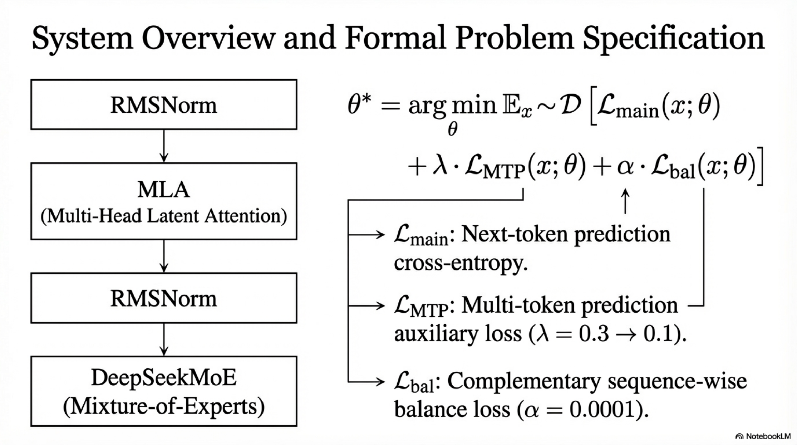

*Figure. Formal DeepSeek-V3 system specification, tying the objective, auxiliary losses, and stacked architectural blocks to the deployment and training boundary conditions stated above.*

---

## 2. Data Pipeline

### 2.1 Corpus Construction

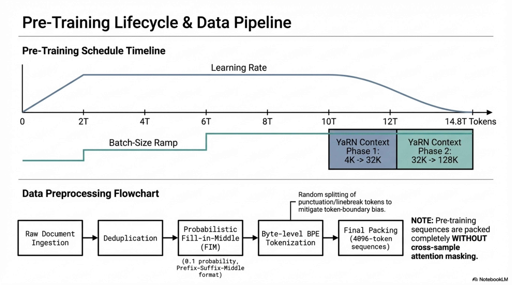

*Figure. Data and schedule overview for pre-training, combining corpus preprocessing, FIM injection, byte-level tokenization, packing, and context-extension timing.*

**Objective:** Construct $14.8\text{T}$ high-quality, diverse tokens with enhanced mathematical and programming representation and multilingual coverage beyond English and Chinese.

**Inputs:** Raw web corpora, code repositories, mathematical texts, multilingual documents.

**Outputs:** Tokenized, deduplicated, packed training sequences of length $T = 4096$.

#### 2.1.1 Data Processing Pipeline

**Stage 1: Filtering and Quality Control**
- Enhanced ratio of mathematical and programming samples relative to DeepSeek-V2
- Expanded multilingual coverage
- Refined pipeline to minimize redundancy while maintaining corpus diversity

**Stage 2: Deduplication**
- Redundancy minimization across the full corpus
- Diversity preservation as a constraint

**Stage 3: Document Packing**
- Inspired by Ding et al. (2024), implements document packing for data integrity
- No cross-sample attention masking during training (documents packed into sequences but attention spans full sequence)

**Stage 4: Fill-in-Middle (FIM) Strategy**
- Applied at document level as part of pre-packing
- FIM rate: $0.1$ (10% of documents)
- Uses Prefix-Suffix-Middle (PSM) framework:

$$
\text{PSM}(d) = \langle \text{PRE} \rangle \; x_{\text{pre}} \; \langle \text{SUF} \rangle \; x_{\text{suf}} \; \langle \text{MID} \rangle \; x_{\text{mid}}
$$

where $d = x_{\text{pre}} \| x_{\text{mid}} \| x_{\text{suf}}$ is the original document with a randomly chosen split point.

**Invariant:** FIM does not compromise next-token prediction capability while enabling accurate middle-text prediction from contextual cues.

#### 2.1.2 Tokenizer

- **Type:** Byte-level BPE (Shibata et al., 1999)
- **Vocabulary size:** $V = 128\text{K}$ tokens
- **Modifications:**
  - Modified pretokenizer and training data for multilingual compression efficiency
  - New pretokenizer introduces tokens combining punctuations and line breaks
  - **Token boundary bias mitigation:** Random splitting of a proportion of combined tokens during training to expose the model to edge cases (e.g., multi-line prompts without terminal line breaks)

#### 2.1.3 Failure Modes in Data Pipeline
- **Token boundary bias:** Combined punctuation-linebreak tokens create evaluation artifacts in few-shot prompts → mitigated by random splitting
- **Redundancy vs. diversity trade-off:** Over-deduplication can reduce corpus diversity → refined pipeline balances both
- **FIM distribution shift:** FIM restructuring may alter learning dynamics → rate limited to 0.1

### 2.2 Pseudo-Algorithm: Data Preprocessing

```
ALGORITHM: DataPreprocessing
INPUT: Raw corpus C_raw
OUTPUT: Packed, tokenized training batches B

1. C_filtered ← QualityFilter(C_raw)           // Domain-specific filtering
2. C_dedup ← Deduplicate(C_filtered)             // Minimize redundancy, preserve diversity
3. C_multi ← EnhanceSampling(C_dedup,             // Increase math/code ratio,
              domains={math, code, multilingual})   // expand multilingual coverage
4. FOR each document d ∈ C_multi:
     IF Random() < 0.1:                           // FIM rate = 0.1
       (x_pre, x_mid, x_suf) ← RandomSplit(d)
       d ← ⟨PRE⟩ x_pre ⟨SUF⟩ x_suf ⟨MID⟩ x_mid  // PSM framework
     tokens_d ← ByteBPE_Tokenize(d, vocab_size=128K)
     IF ContainsCombinedPuncLinebreak(tokens_d):
       tokens_d ← RandomSplitCombinedTokens(tokens_d, p=p_split)
     APPEND tokens_d TO token_pool
5. sequences ← DocumentPack(token_pool, max_len=T)  // Pack multiple docs per sequence
6. B ← BatchFormation(sequences)                     // No cross-sample attention masking
7. RETURN B
```

---

## 3. Model Architecture

### 3.1 Global Architecture Specification

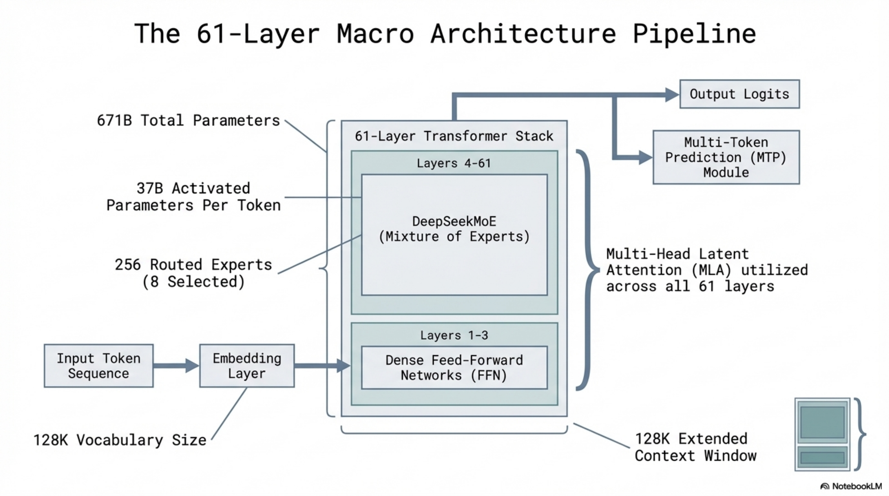

*Figure. Macro architecture pipeline for the 61-layer model, showing where dense early layers give way to the DeepSeekMoE stack and how the overall token path is organized.*

DeepSeek-V3 is a Transformer-based autoregressive model with:

| Parameter | Value |
|---|---|
| Transformer layers $L$ | 61 |
| Hidden dimension $d$ | 7168 |
| Attention heads $n_h$ | 128 |
| Per-head dimension $d_h$ | 128 |
| KV compression dimension $d_c$ | 512 |
| Query compression dimension $d'_c$ | 1536 |
| Decoupled RoPE per-head dimension $d^R_h$ | 64 |
| Shared experts $N_s$ | 1 |
| Routed experts $N_r$ | 256 |
| Activated routed experts $K_r$ | 8 |
| Expert intermediate dimension | 2048 |
| Node-limited routing $M$ | 4 |
| MTP depth $D$ | 1 |
| Total parameters | 671B |
| Activated parameters per token | 37B |

**Structure:** First 3 layers use dense FFNs; layers 4–61 use MoE FFNs. Each Transformer block: RMSNorm → MLA → RMSNorm → FFN/MoE.

**Initialization:** All learnable parameters randomly initialized with $\sigma = 0.006$.

**Additional architectural elements (from DeepSeek-V2):**
- Additional RMSNorm layers after compressed latent vectors
- Additional scaling factors at width bottlenecks

### 3.2 Multi-Head Latent Attention (MLA)

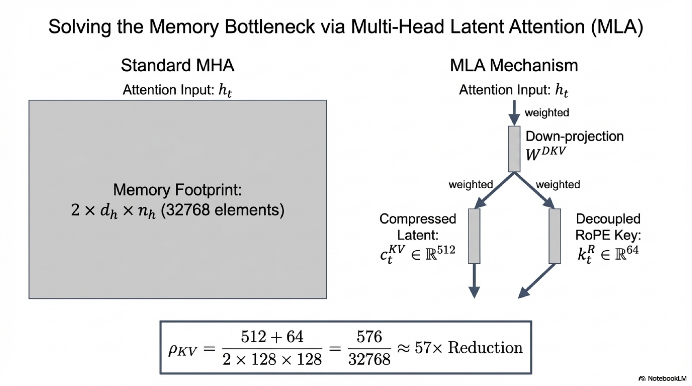

*Figure. MLA replaces full KV caching with a compressed latent plus a decoupled RoPE branch, making the report's memory-compression argument concrete before the detailed derivation.*

#### 3.2.1 Definition

MLA achieves KV cache compression through low-rank joint compression of keys and values. Instead of caching full $n_h \times d_h$-dimensional key-value pairs per token, MLA caches only a compressed latent vector $\mathbf{c}^{KV}_t \in \mathbb{R}^{d_c}$ and a decoupled RoPE key $\mathbf{k}^R_t \in \mathbb{R}^{d^R_h}$.

#### 3.2.2 KV Compression Path

Given attention input $\mathbf{h}_t \in \mathbb{R}^d$ for token $t$:

**Down-projection to KV latent:**

$$
\mathbf{c}^{KV}_t = W^{DKV} \mathbf{h}_t
$$

where $W^{DKV} \in \mathbb{R}^{d_c \times d}$, $d_c = 512 \ll d_h n_h = 128 \times 128 = 16384$.

**Up-projection to keys and values (per head $i$):**

$$
\mathbf{k}^C_{t,i} = W^{UK}_i \mathbf{c}^{KV}_t, \quad W^{UK} \in \mathbb{R}^{d_h n_h \times d_c}
$$

$$
\mathbf{v}^C_{t,i} = W^{UV}_i \mathbf{c}^{KV}_t, \quad W^{UV} \in \mathbb{R}^{d_h n_h \times d_c}
$$

**Decoupled RoPE key:**

$$
\mathbf{k}^R_t = \text{RoPE}(W^{KR} \mathbf{h}_t)
$$

where $W^{KR} \in \mathbb{R}^{d^R_h \times d}$, $d^R_h = 64$.

**Full key (per head $i$):**

$$
\mathbf{k}_{t,i} = [\mathbf{k}^C_{t,i}; \; \mathbf{k}^R_t]
$$

**KV cache per token (during inference):** Only $\mathbf{c}^{KV}_t \in \mathbb{R}^{512}$ and $\mathbf{k}^R_t \in \mathbb{R}^{64}$ are cached — total 576 floats per token, vs. $2 \times n_h \times d_h = 32768$ for standard MHA.

**Compression ratio:**

$$
\rho_{KV} = \frac{d_c + d^R_h}{2 \cdot n_h \cdot d_h} = \frac{512 + 64}{2 \times 128 \times 128} = \frac{576}{32768} \approx 1.76\%
$$

#### 3.2.3 Query Compression Path

**Down-projection to query latent:**

$$
\mathbf{c}^Q_t = W^{DQ} \mathbf{h}_t
$$

where $W^{DQ} \in \mathbb{R}^{d'_c \times d}$, $d'_c = 1536$.

**Up-projection to queries (per head $i$):**

$$
\mathbf{q}^C_{t,i} = W^{UQ}_i \mathbf{c}^Q_t, \quad W^{UQ} \in \mathbb{R}^{d_h n_h \times d'_c}
$$

**Decoupled RoPE queries:**

$$
\mathbf{q}^R_{t,i} = \text{RoPE}(W^{QR}_i \mathbf{c}^Q_t)
$$

where $W^{QR} \in \mathbb{R}^{d^R_h n_h \times d'_c}$.

**Full query (per head $i$):**

$$
\mathbf{q}_{t,i} = [\mathbf{q}^C_{t,i}; \; \mathbf{q}^R_{t,i}]
$$

**Benefit:** Low-rank query compression reduces activation memory during training.

#### 3.2.4 Attention Computation

$$
o_{t,i} = \sum_{j=1}^{t} \text{Softmax}_j\left(\frac{\mathbf{q}_{t,i}^\top \mathbf{k}_{j,i}}{\sqrt{d_h + d^R_h}}\right) \mathbf{v}^C_{j,i}
$$

$$
\mathbf{u}_t = W^O [\mathbf{o}_{t,1}; \; \mathbf{o}_{t,2}; \; \ldots; \; \mathbf{o}_{t,n_h}]
$$

where $W^O \in \mathbb{R}^{d \times d_h n_h}$.

#### 3.2.5 Complexity Analysis

| Operation | Standard MHA | MLA |
|---|---|---|
| KV cache per token | $2 n_h d_h$ | $d_c + d^R_h$ |
| KV cache (DeepSeek-V3) | 32768 | 576 |
| Compression factor | 1× | ~57× |

**Attention FLOPs per token:** $O(T \cdot (d_h + d^R_h) \cdot n_h)$ — same asymptotic complexity as MHA but with dramatically reduced memory bandwidth requirements during decoding.

#### 3.2.6 Pseudo-Algorithm: MLA Forward Pass

```
ALGORITHM: MLA_Forward
INPUT: h_t ∈ ℝ^d for t = 1..T
OUTPUT: u_t ∈ ℝ^d for t = 1..T

1. FOR t = 1 TO T:
     c^KV_t ← W^DKV · h_t                    // ℝ^{d_c}
     c^Q_t  ← W^DQ · h_t                     // ℝ^{d'_c}
     k^R_t  ← RoPE(W^KR · h_t)               // ℝ^{d^R_h}
     FOR i = 1 TO n_h:
       k^C_{t,i} ← W^UK_i · c^KV_t            // ℝ^{d_h}
       v^C_{t,i} ← W^UV_i · c^KV_t            // ℝ^{d_h}
       q^C_{t,i} ← W^UQ_i · c^Q_t             // ℝ^{d_h}
       q^R_{t,i} ← RoPE(W^QR_i · c^Q_t)       // ℝ^{d^R_h}
       q_{t,i} ← [q^C_{t,i}; q^R_{t,i}]
       k_{t,i} ← [k^C_{t,i}; k^R_t]
     CACHE: c^KV_t, k^R_t                      // Only these cached during inference

2. FOR t = 1 TO T:
     FOR i = 1 TO n_h:
       a_{t,j,i} ← Softmax_j(q_{t,i}^T · k_{j,i} / √(d_h + d^R_h)) for j ≤ t
       o_{t,i} ← Σ_{j=1}^{t} a_{t,j,i} · v^C_{j,i}
     u_t ← W^O · [o_{t,1}; ...; o_{t,n_h}]

3. RETURN u_1, ..., u_T
```

### 3.3 DeepSeekMoE with Auxiliary-Loss-Free Load Balancing

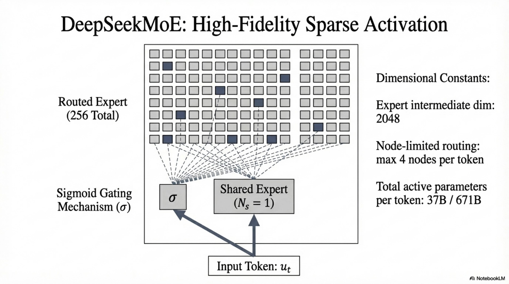

*Figure. DeepSeekMoE routing layout with sparse expert activation, shared expertise, and node-limited dispatch, aligned with the gating equations and balancing rules in this section.*

#### 3.3.1 MoE FFN Architecture

Given FFN input $\mathbf{u}_t \in \mathbb{R}^d$ (output of attention):

$$
\mathbf{h}'_t = \mathbf{u}_t + \sum_{i=1}^{N_s} \text{FFN}^{(s)}_i(\mathbf{u}_t) + \sum_{i=1}^{N_r} g_{i,t} \cdot \text{FFN}^{(r)}_i(\mathbf{u}_t)
$$

where:
- $N_s = 1$ shared expert, $N_r = 256$ routed experts
- $K_r = 8$ routed experts activated per token
- Each expert FFN has intermediate dimension 2048

#### 3.3.2 Gating Mechanism

**Token-to-expert affinity (sigmoid-based):**

$$
s_{i,t} = \sigma(\mathbf{u}_t^\top \mathbf{e}_i)
$$

where $\mathbf{e}_i \in \mathbb{R}^d$ is the centroid vector of the $i$-th routed expert, and $\sigma(\cdot)$ is the sigmoid function.

**Top-K selection:**

$$
\text{TopK}(\{s_{i,t}\}_{i=1}^{N_r}, K_r) = \text{set of } K_r \text{ experts with highest } s_{i,t}
$$

**Gating values (normalized over selected experts):**

$$
g_{i,t} = \begin{cases} \frac{s_{i,t}}{\sum_{j \in \text{TopK}} s_{j,t}} & \text{if } i \in \text{TopK}(\{s_{i,t}\}, K_r) \\ 0 & \text{otherwise} \end{cases}
$$

**Key difference from DeepSeek-V2:** Uses sigmoid (not softmax over all experts) for affinity computation, with normalization restricted to selected experts.

#### 3.3.3 Auxiliary-Loss-Free Load Balancing

**Mechanism:** Introduce a bias term $b_i$ for each expert, added to affinity scores only for routing decisions (not for gating values):

$$
g'_{i,t} = \begin{cases} g_{i,t} & \text{if } i \in \text{TopK}(\{s_{j,t} + b_j\}_{j=1}^{N_r}, K_r) \\ 0 & \text{otherwise} \end{cases}
$$

**Dynamic bias update rule (end of each training step):**

$$
b_i \leftarrow \begin{cases} b_i - \gamma & \text{if expert } i \text{ is overloaded in the current batch} \\ b_i + \gamma & \text{if expert } i \text{ is underloaded in the current batch} \end{cases}
$$

where $\gamma$ is the bias update speed:
- $\gamma = 0.001$ for first 14.3T tokens
- $\gamma = 0.0$ for remaining 500B tokens (bias frozen)

**Critical property:** The bias term only influences the routing decision (which experts are selected). The actual gating value $g_{i,t}$ used for weighted combination is derived from the original unbiased affinity score $s_{i,t}$. This preserves gradient flow fidelity while steering load balance.

**Why it works (batch-wise vs. sequence-wise):**
- Auxiliary-loss-free operates at batch granularity, not sequence granularity
- This allows experts to specialize in different domains within a batch
- Empirically validated: 1B model validation loss: 2.258 (sequence-wise aux loss) vs. 2.253 (aux-loss-free) vs. 2.253 (batch-wise aux loss)
- 3B model: 2.085 (sequence-wise) vs. 2.080 (aux-loss-free/batch-wise)

#### 3.3.4 Complementary Sequence-Wise Balance Loss

To prevent extreme imbalance within any single sequence:

$$
\mathcal{L}_{\text{bal}} = \alpha \sum_{i=1}^{N_r} f_i \cdot P_i
$$

where:

$$
f_i = \frac{N_r}{K_r \cdot T} \sum_{t=1}^{T} \mathbb{1}(i \in \text{TopK}(\{s_{j,t} + b_j\}, K_r))
$$

$$
P_i = \frac{1}{T} \sum_{t=1}^{T} s_{i,t}
$$

- $\alpha = 0.0001$ (extremely small — just to avoid extreme within-sequence imbalance)
- $\mathbb{1}(\cdot)$ is the indicator function
- $T$ is the number of tokens in the sequence

#### 3.3.5 Node-Limited Routing

Each token is sent to at most $M = 4$ nodes. Node selection is based on the sum of the highest $\frac{K_r}{M}$ affinity scores of experts distributed on each node. Under this constraint, near-full computation-communication overlap is achieved.

#### 3.3.6 No Token Dropping

**Training:** Effective load balancing eliminates the need for token dropping.
**Inference:** Specific deployment strategies (redundant experts) ensure inference load balance without dropping.

#### 3.3.7 Pseudo-Algorithm: MoE Forward

```
ALGORITHM: MoE_Forward
INPUT: u_t ∈ ℝ^d for t = 1..T, expert centroids {e_i}, biases {b_i}
OUTPUT: h'_t ∈ ℝ^d for t = 1..T

1. FOR t = 1 TO T:
     // Compute affinities
     FOR i = 1 TO N_r:
       s_{i,t} ← σ(u_t^T · e_i)
     
     // Node-limited routing: select top M=4 nodes
     FOR each node n:
       node_score_n ← sum of top K_r/M affinities among experts on node n
     selected_nodes ← TopK(node_scores, M)
     candidate_experts ← experts on selected_nodes
     
     // Top-K routing with bias (among candidate experts)
     routed_set ← TopK({s_{i,t} + b_i : i ∈ candidate_experts}, K_r)
     
     // Compute gating values (without bias)
     FOR i ∈ routed_set:
       g_{i,t} ← s_{i,t} / Σ_{j ∈ routed_set} s_{j,t}
     
     // Compute MoE output
     h'_t ← u_t + Σ_{i=1}^{N_s} FFN^(s)_i(u_t) + Σ_{i ∈ routed_set} g_{i,t} · FFN^(r)_i(u_t)

2. // Update biases (end of step, across full batch)
   FOR i = 1 TO N_r:
     IF load_i > balanced_load: b_i ← b_i - γ
     IF load_i < balanced_load: b_i ← b_i + γ

3. RETURN h'_1, ..., h'_T
```

### 3.4 Multi-Token Prediction (MTP)

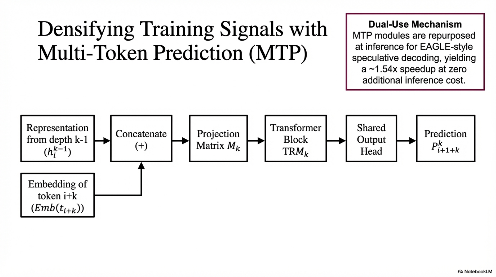

*Figure. Sequential MTP module used by DeepSeek-V3 to densify supervision and preserve the causal chain while predicting future tokens.*

#### 3.4.1 Definition and Motivation

MTP extends the prediction scope to $D$ additional future tokens at each position, where $D = 1$ for DeepSeek-V3. Unlike Gloeckle et al. (2024) which uses parallel independent output heads, DeepSeek-V3 uses sequential prediction with a complete causal chain at each depth.

**Motivations:**
1. Densifies training signals → improves data efficiency
2. Enables pre-planning of representations for future token prediction
3. MTP modules can be repurposed for speculative decoding during inference

#### 3.4.2 MTP Module Architecture

The $k$-th MTP module ($k = 1, \ldots, D$) consists of:
- Shared embedding layer $\text{Emb}(\cdot)$ (shared with main model)
- Shared output head $\text{OutHead}(\cdot)$ (shared with main model)
- Transformer block $\text{TRM}_k(\cdot)$ (unique per depth)
- Projection matrix $M_k \in \mathbb{R}^{d \times 2d}$ (unique per depth)

#### 3.4.3 Forward Computation

For input token $t_i$ at prediction depth $k$:

**Step 1: Combine representation and embedding**

$$
\mathbf{h}'^{k}_i = M_k [\mathbf{h}^{k-1}_i; \; \text{Emb}(t_{i+k})]
$$

where:
- $\mathbf{h}^{k-1}_i \in \mathbb{R}^d$ is the representation at depth $k-1$
- $\text{Emb}(t_{i+k}) \in \mathbb{R}^d$ is the embedding of the $(i+k)$-th token
- $[\cdot; \cdot]$ denotes concatenation (input dimension $2d$)
- When $k = 1$: $\mathbf{h}^0_i$ is the output of the main model's Transformer blocks

**Step 2: Transformer block processing**

$$
\mathbf{h}^k_{1:T} = \text{TRM}_k(\mathbf{h}'^{k}_{1:T})
$$

where $T$ is the input sequence length and $1:T$ denotes slicing (inclusive of both boundaries).

**Step 3: Prediction probability**

$$
P^k_{i+1+k} = \text{OutHead}(\mathbf{h}^k_i) = \text{Softmax}(W_{\text{head}} \cdot \text{RMSNorm}(\mathbf{h}^k_i))
$$

where $P^k_{i+1+k} \in \mathbb{R}^V$, $V = 128\text{K}$.

#### 3.4.4 MTP Training Objective

For each depth $k$:

$$
\mathcal{L}^k_{\text{MTP}} = -\frac{1}{T} \sum_{i=1}^{T} \log P^k_i[t_i]
$$

where $t_i$ is the ground-truth token at position $i$ and $P^k_i[t_i]$ is the probability assigned to $t_i$ by the $k$-th MTP module.

**Overall MTP loss:**

$$
\mathcal{L}_{\text{MTP}} = \lambda \cdot \frac{1}{D} \sum_{k=1}^{D} \mathcal{L}^k_{\text{MTP}}
$$

**MTP loss weight schedule:**
- $\lambda = 0.3$ for first 10T tokens
- $\lambda = 0.1$ for remaining 4.8T tokens

#### 3.4.5 MTP During Inference

- **Default:** MTP modules are discarded; main model functions independently
- **Optional:** MTP modules repurposed for speculative decoding to reduce generation latency

#### 3.4.6 Ablation Evidence

| Scale | Params | Tokens | MATH (w/o MTP) | MATH (w/ MTP) | HumanEval (w/o) | HumanEval (w/) |
|---|---|---|---|---|---|---|
| Small | 15.7B | 1.33T | 10.7 | 12.6 | 20.7 | 26.8 |
| Large | 228.7B | 540B | 38.6 | 39.8 | 44.5 | 53.7 |

MTP consistently enhances performance with zero additional inference cost (when modules are discarded).

#### 3.4.7 Pseudo-Algorithm: MTP Forward and Loss

```
ALGORITHM: MTP_Forward_and_Loss
INPUT: Token sequence t_1, ..., t_{T+D}, main model representations h^0_1, ..., h^0_T
OUTPUT: MTP loss L_MTP

1. total_loss ← 0
2. FOR k = 1 TO D:
     FOR i = 1 TO T:
       // Combine previous-depth representation with next token embedding
       h'_i^k ← M_k · [h^{k-1}_i ; Emb(t_{i+k})]      // ℝ^{2d} → ℝ^d
     
     // Process through depth-k Transformer block (causal)
     h^k_{1:T} ← TRM_k(h'^k_{1:T})
     
     // Compute predictions
     FOR i = 1 TO T:
       P^k_{i+1+k} ← Softmax(W_head · RMSNorm(h^k_i))
       loss_i ← -log P^k_{i+1+k}[t_{i+1+k}]
     
     L^k_MTP ← (1/T) · Σ_{i=1}^{T} loss_i
     total_loss ← total_loss + L^k_MTP

3. L_MTP ← λ · (1/D) · total_loss
4. RETURN L_MTP
```

### 3.5 Complete Training Loss

$$
\mathcal{L}_{\text{total}} = \mathcal{L}_{\text{main}} + \mathcal{L}_{\text{MTP}} + \mathcal{L}_{\text{bal}}
$$

$$
= -\frac{1}{T}\sum_{i=1}^{T} \log P_{\text{main}}(t_{i+1} | t_{1:i}) + \lambda \cdot \frac{1}{D} \sum_{k=1}^{D} \mathcal{L}^k_{\text{MTP}} + \alpha \sum_{i=1}^{N_r} f_i P_i
$$

with $\alpha = 0.0001$, $\lambda \in \{0.3, 0.1\}$ (scheduled), $D = 1$.

---

## 4. Compression Pipeline: FP8 Mixed Precision Training

### 4.1 Definition and Objective

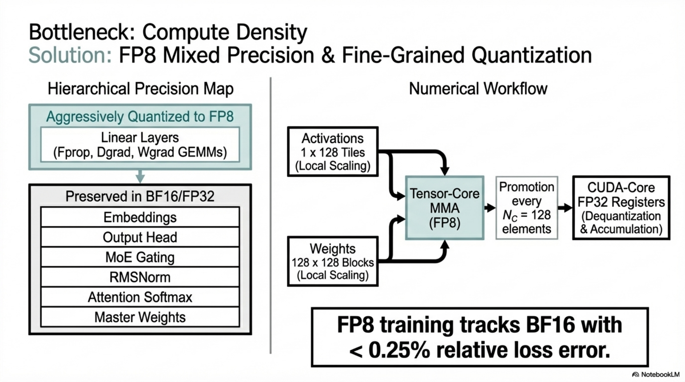

*Figure. FP8 mixed-precision stack identifying which modules remain in higher precision and where quantized GEMMs and promoted accumulation enter the training path.*

**Objective:** Achieve training-time compute acceleration and memory reduction by performing majority of GEMM operations in FP8 (E4M3 format), with relative loss error $< 0.25\%$ vs. BF16 baseline.

**Invariant:** Numerical stability preserved through strategic precision retention in critical operators and fine-grained quantization.

### 4.2 Mixed Precision Framework

#### 4.2.1 FP8 GEMM Operations

All three GEMMs associated with each Linear operator execute in FP8:

1. **Fprop (forward pass):** $Y = X W^\top$ where $X, W$ are FP8, $Y$ is BF16/FP32
2. **Dgrad (activation backward):** $\frac{\partial \mathcal{L}}{\partial X} = \frac{\partial \mathcal{L}}{\partial Y} W$ where inputs are FP8
3. **Wgrad (weight backward):** $\frac{\partial \mathcal{L}}{\partial W} = \frac{\partial \mathcal{L}}{\partial Y}^\top X$ where inputs are FP8

**Theoretical speedup:** 2× computational speed vs. BF16.

**Memory benefit:** FP8 Wgrad allows activations to be stored in FP8 for the backward pass.

#### 4.2.2 Operations Retained in Higher Precision (BF16/FP32)

- Embedding module
- Output head
- MoE gating modules
- Normalization operators (RMSNorm)
- Attention operators

**Rationale:** These are either low-cost (negligible overhead from higher precision) or sensitivity-critical (low precision causes training instability).

#### 4.2.3 High-Precision Storage

- Master weights: FP32 (in optimizer)
- Weight gradients: FP32 (for batch accumulation)
- Optimizer states: BF16 (first and second moments of AdamW — reduced from FP32 without observable performance degradation)

### 4.3 Fine-Grained Quantization

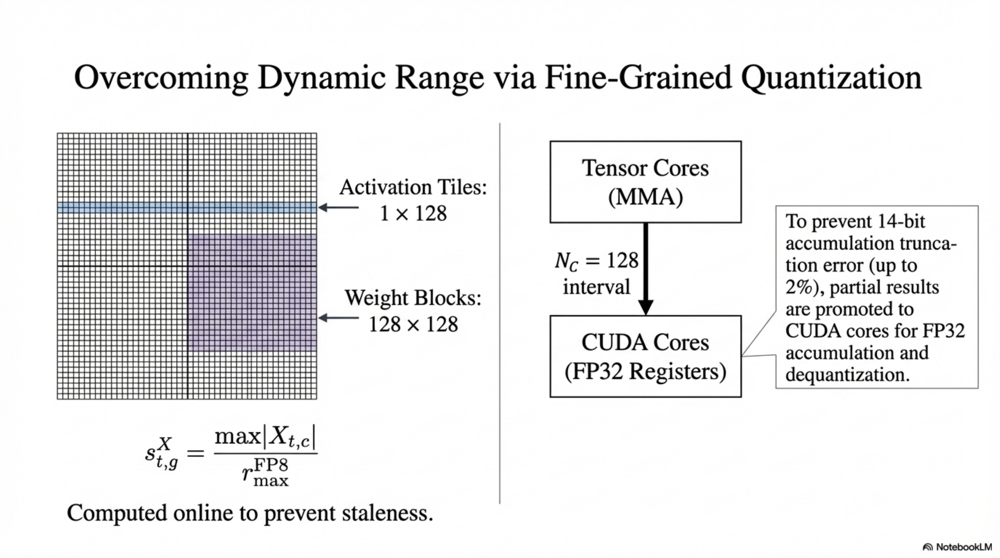

*Figure. Fine-grained tile and block quantization, showing how local scale factors and promoted accumulation keep FP8 error under control for large GEMMs.*

#### 4.3.1 Tile-Wise Quantization for Activations

Group and scale elements on a $1 \times 128$ tile basis (per token, per 128 channels):

$$
X^{\text{FP8}}_{t, g} = \text{Quantize}_{\text{FP8}}\left(\frac{X_{t, g}}{s^X_{t,g}}\right), \quad s^X_{t,g} = \frac{\max_{c \in g} |X_{t,c}|}{r_{\max}^{\text{FP8}}}
$$

where $g$ indexes groups of 128 channels, $t$ indexes tokens, and $r_{\max}^{\text{FP8}}$ is the maximum representable value in E4M3 format ($= 448$).

#### 4.3.2 Block-Wise Quantization for Weights

Group and scale elements on a $128 \times 128$ block basis (per 128 input channels, per 128 output channels):

$$
W^{\text{FP8}}_{b_{\text{in}}, b_{\text{out}}} = \text{Quantize}_{\text{FP8}}\left(\frac{W_{b_{\text{in}}, b_{\text{out}}}}{s^W_{b_{\text{in}}, b_{\text{out}}}}\right), \quad s^W_{b_{\text{in}}, b_{\text{out}}} = \frac{\max_{(i,j) \in \text{block}} |W_{i,j}|}{r_{\max}^{\text{FP8}}}
$$

#### 4.3.3 Dequantization During GEMM

Per-group scaling factors along the inner dimension $K$ are introduced. Combined with FP32 accumulation on CUDA Cores, dequantization overhead is largely mitigated:

$$
Y_{m,n} = \sum_{g=0}^{K/N_C - 1} s^X_{m,g} \cdot s^W_{g,n} \cdot \left(\sum_{k=gN_C}^{(g+1)N_C - 1} X^{\text{FP8}}_{m,k} \cdot W^{\text{FP8}}_{k,n}\right)_{\text{FP32 acc}}
$$

where $N_C = 128$ is the accumulation interval.

#### 4.3.4 Consistency with Microscaling Formats

This fine-grained quantization is consistent with microscaling formats (Rouhani et al., 2023b). NVIDIA Blackwell series Tensor Cores have announced native support for microscaling with smaller quantization granularity.

### 4.4 Increased Accumulation Precision

#### 4.4.1 Problem

FP8 GEMM on H800 retains only ~14 bits of accumulation precision in Tensor Cores, significantly below FP32. For large inner dimension $K$ (typical in large-scale training with large batch size and model width), this causes maximum relative error ~2%.

#### 4.4.2 Solution: Promotion to CUDA Cores

During MMA (Matrix Multiply-Accumulate) on Tensor Cores:

1. Intermediate results accumulated with limited bit width for $N_C$ elements
2. At interval $N_C = 128$ (= 4 WGMMAs), partial results copied to FP32 registers on CUDA Cores
3. Full-precision FP32 accumulation performed on CUDA Cores
4. Per-group scaling factors multiplied on CUDA Cores as dequantization (minimal additional cost)

**Overlap mechanism:** On H800, two WGMMAs persist concurrently — while one warpgroup promotes, the other executes MMA, maintaining high Tensor Core utilization.

### 4.5 Mantissa over Exponents

**Choice:** E4M3 format for all tensors (Fprop, Dgrad, Wgrad) — not the hybrid E4M3/E5M2 approach.

**Rationale:** Fine-grained tile/block-wise scaling effectively shares exponent bits among grouped elements, mitigating the limited dynamic range of E4M3.

### 4.6 Online Quantization

- Maximum absolute value calculated online for each $1 \times 128$ activation tile or $128 \times 128$ weight block
- Scaling factor derived and quantization performed immediately
- No delayed quantization (which requires history tracking and can introduce staleness)

### 4.7 Low-Precision Storage and Communication

#### 4.7.1 Low-Precision Activations

| Activation Type | Precision | Details |
|---|---|---|
| General Linear inputs (for Wgrad) | FP8 | Fine-grained quantization |
| Post-attention Linear inputs | Custom E5M6 | Sensitive to attention backward; round scaling factors (integral power of 2) |
| SwiGLU operator inputs in MoE | FP8 | Cache inputs, recompute SwiGLU output in backward |

**Tile transposition handling:** Post-attention activations stored as $1 \times 128$ tiles, must be converted to $128 \times 1$ tiles in backward. Round scaling factors (integral powers of 2) prevent additional quantization error during transposition.

#### 4.7.2 Low-Precision Communication

| Communication | Precision | Details |
|---|---|---|
| MoE dispatch (activation before up-projection) | FP8 | Integral-power-of-2 scaling; compatible with FP8 Fprop |
| MoE dispatch gradient (before down-projection) | FP8 | Same strategy |
| Forward combine | BF16 | Preserved for training precision |
| Backward combine | BF16 | Preserved for training precision |

### 4.8 Compression Equations and Information Preservation

**Memory reduction per activation tensor:**

$$
\text{Memory}_{\text{FP8}} = \frac{1}{2} \text{Memory}_{\text{BF16}} + \text{ScalingFactorOverhead}
$$

**Scaling factor overhead for $1 \times 128$ tile quantization on activation $X \in \mathbb{R}^{B \times d}$:**

$$
\text{Overhead}_{\text{scale}} = \frac{B \cdot \lceil d / 128 \rceil \cdot 32\text{bit}}{B \cdot d \cdot 8\text{bit}} = \frac{4}{128} = 3.125\%
$$

**Information preservation guarantee:** Relative loss error $< 0.25\%$ vs. BF16 baseline across $\sim 1\text{T}$ tokens of training at both DeepSeek-V2-Lite and DeepSeek-V2 scales.

### 4.9 Pseudo-Algorithm: FP8 Forward-Backward for Linear

```
ALGORITHM: FP8_Linear_ForwardBackward
INPUT: X ∈ ℝ^{B×d_in} (BF16), W ∈ ℝ^{d_out×d_in} (BF16 master)
OUTPUT: Y ∈ ℝ^{B×d_out} (BF16), dX ∈ ℝ^{B×d_in}, dW ∈ ℝ^{d_out×d_in}

=== FORWARD (Fprop) ===
1. // Online tile-wise quantization of activation
   FOR each token t, each group g of 128 channels:
     s^X_{t,g} ← max(|X_{t, g·128:(g+1)·128}|) / FP8_MAX
     X^FP8_{t,g} ← Quantize_E4M3(X_{t,g} / s^X_{t,g})
   
2. // Online block-wise quantization of weight
   FOR each 128×128 block (b_in, b_out):
     s^W_{b_in,b_out} ← max(|W_{block}|) / FP8_MAX
     W^FP8_{block} ← Quantize_E4M3(W_{block} / s^W_{b_in,b_out})
   
3. // FP8 GEMM with FP32 accumulation every N_C=128
   Y ← FP8_GEMM(X^FP8, W^FP8, scales_X=s^X, scales_W=s^W, acc_interval=128)
   // Y output in BF16/FP32

4. CACHE X^FP8, s^X (for Wgrad in backward)

=== BACKWARD (Dgrad) ===
5. // Quantize dY to FP8
   dY^FP8 ← OnlineQuantize_TileWise(dY, tile=1×128)
   // W^FP8 already available
   dX ← FP8_GEMM(dY^FP8, W^FP8, ..., acc_interval=128)  // ℝ^{B×d_in}

=== BACKWARD (Wgrad) ===
6. // Use cached X^FP8 from forward
   dW ← FP8_GEMM(dY^FP8_transposed, X^FP8, ..., acc_interval=128)  // ℝ^{d_out×d_in}
   // dW stored in FP32 for optimizer
```

---

## 5. Training Infrastructure and Optimization Strategy

### 5.1 Parallelism Configuration

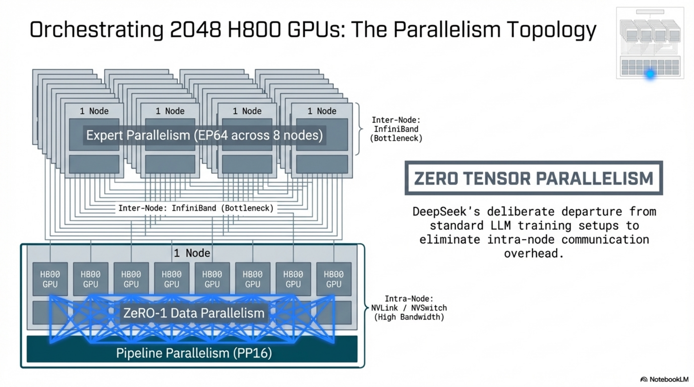

*Figure. End-to-end training topology across 2048 H800 GPUs, clarifying the interaction among pipeline parallelism, expert parallelism, and ZeRO-1 data parallelism.*

| Dimension | Strategy | Degree |
|---|---|---|
| Pipeline Parallelism (PP) | DualPipe | 16 |
| Expert Parallelism (EP) | Across 8 nodes | 64 |
| Data Parallelism (DP) | ZeRO-1 | Remaining GPUs |
| Tensor Parallelism (TP) | **Not used** during training | — |

**No TP during training** — memory optimizations eliminate the need for costly tensor parallelism.

### 5.2 DualPipe Algorithm

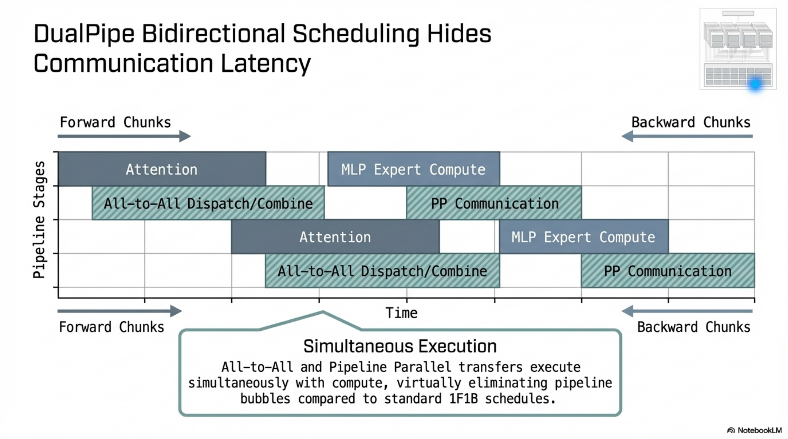

*Figure. DualPipe scheduling overlaps forward, backward, and communication work from both pipeline ends to remove idle bubbles introduced by cross-node MoE traffic.*

#### 5.2.1 Problem

Cross-node expert parallelism creates computation-to-communication ratio of approximately 1:1, making standard pipeline parallelism inefficient.

#### 5.2.2 Core Idea

Overlap computation and communication within pairs of forward and backward chunks by decomposing each chunk into four components:

1. **Attention** (ATTN)
2. **All-to-All Dispatch** (DISPATCH)
3. **MLP/MoE** (MLP)
4. **All-to-All Combine** (COMBINE)

For backward chunks, ATTN and MLP further split into:
- **Backward for input** (B)
- **Backward for weights** (W)

Plus a **PP communication** component.

#### 5.2.3 Overlapping Strategy

For a pair of forward chunk $\triangle$ and backward chunk $\blacktriangle$:

```
Time →
Computation: MLP(B)▲ | MLP(W)▲ | MLP(F)△ | ATTN(B)▲ | ATTN(W)▲ | ATTN(F)△
Communication: DISPATCH(F)△ | DISPATCH(B)▲ | COMBINE(F)△ | PP | COMBINE(B)▲
```

GPU SMs are manually partitioned between computation and communication, with ratios adjusted to ensure full overlap of both all-to-all and PP communication.

#### 5.2.4 Bidirectional Pipeline Scheduling

DualPipe feeds micro-batches from **both ends** of the pipeline simultaneously. This enables a significant portion of communications to be fully overlapped.

#### 5.2.5 Complexity Comparison

| Method | Bubble Size | Parameter Memory | Activation Memory |
|---|---|---|---|
| 1F1B | $(PP - 1)(F + B)$ | $1 \times$ | $PP$ |
| ZB1P | $(PP - 1)(F + B - 2W)$ | $1 \times$ | $PP$ |
| **DualPipe** | $(\frac{PP}{2} - 1)(F\&B + B - 3W)$ | $2 \times$ | $PP + 1$ |

where $F$ = forward chunk time, $B$ = full backward time, $W$ = backward-for-weights time, $F\&B$ = time of two mutually overlapped forward and backward chunks.

**DualPipe advantages:**
- Significantly fewer pipeline bubbles
- Only $+1$ peak activation memory increase (negligible with large EP)
- $2\times$ parameter copies — not significant with large EP (each GPU holds few parameters)
- Only requires pipeline stages and micro-batches divisible by 2
- Neither bubbles nor activation memory increase with number of micro-batches

### 5.3 Cross-Node All-to-All Communication

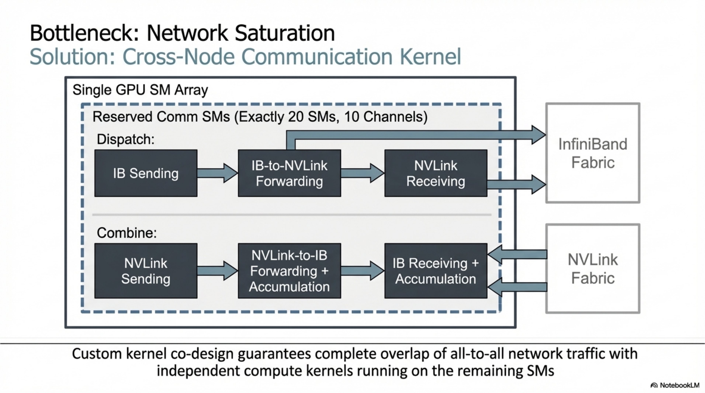

*Figure. Specialized communication kernel for dispatch and combine, illustrating how InfiniBand and NVLink transfers are staged and overlapped across dedicated warp groups.*

#### 5.3.1 Network Topology

- **Intra-node:** NVLink, 160 GB/s bandwidth
- **Inter-node:** InfiniBand (IB), 50 GB/s bandwidth
- **Bandwidth ratio:** NVLink/IB ≈ 3.2×

#### 5.3.2 Communication Kernel Design

**Constraints:**
- Each token dispatched to at most $M = 4$ nodes (limits IB traffic)
- Token first sent via IB to GPU with same in-node index on target node
- Immediately forwarded via NVLink to target expert GPUs (non-blocking)
- IB and NVLink communications fully overlapped

**Expert selection capacity:** Each token can select average of 3.2 experts per node → maximum 13 experts ($4 \times 3.2$) with same communication cost, though DeepSeek-V3 uses 8.

**SM allocation:** Only 20 SMs dedicated to communication (out of 132 on H800).

#### 5.3.3 Warp Specialization

20 SMs partitioned into 10 communication channels.

**Dispatch process (3 warp types):**
1. IB sending
2. IB-to-NVLink forwarding
3. NVLink receiving

**Combine process (3 warp types):**
1. NVLink sending
2. NVLink-to-IB forwarding and accumulation
3. IB receiving and accumulation

Warp allocation dynamically adjusted based on actual workload. Customized PTX instructions and auto-tuned communication chunk size reduce L2 cache usage and interference with computation SMs.

### 5.4 Memory Optimization

#### 5.4.1 Recomputation

- All RMSNorm operations: recomputed during backward (eliminates storing output activations)
- MLA up-projections: recomputed during backward
- SwiGLU outputs in MoE: recomputed from cached inputs during backward

**Trade-off:** Minor recomputation overhead ↔ significant memory reduction.

#### 5.4.2 EMA in CPU

- Exponential Moving Average of model parameters maintained in CPU memory
- Updated asynchronously after each training step
- Zero GPU memory or time overhead
- Used for early estimation of model performance after learning rate decay

#### 5.4.3 Shared Embedding and Output Head via DualPipe

DualPipe deploys shallowest layers (embedding) and deepest layers (output head) on the same PP rank → physical sharing of parameters and gradients between MTP module and main model.

### 5.5 Optimizer Configuration

**Optimizer:** AdamW

$$
m_t = \beta_1 m_{t-1} + (1 - \beta_1) g_t
$$

$$
v_t = \beta_2 v_{t-1} + (1 - \beta_2) g_t^2
$$

$$
\theta_t = \theta_{t-1} - \eta \left(\frac{m_t / (1 - \beta_1^t)}{\sqrt{v_t / (1 - \beta_2^t)} + \epsilon} + \lambda_{\text{wd}} \theta_{t-1}\right)
$$

| Hyperparameter | Value |
|---|---|
| $\beta_1$ | 0.9 |
| $\beta_2$ | 0.95 |
| Weight decay $\lambda_{\text{wd}}$ | 0.1 |
| Gradient clipping norm | 1.0 |
| Optimizer state precision ($m_t, v_t$) | BF16 |
| Master weights | FP32 |
| Gradients (for accumulation) | FP32 |

### 5.6 Learning Rate Schedule

**Phase 1 — Warmup:** Linear increase from $0 \rightarrow 2.2 \times 10^{-4}$ over first 2K steps.

**Phase 2 — Constant:** $\eta = 2.2 \times 10^{-4}$ until 10T tokens consumed.

**Phase 3 — Cosine decay:** $2.2 \times 10^{-4} \rightarrow 2.2 \times 10^{-5}$ over 4.3T tokens:

$$
\eta(t) = 2.2 \times 10^{-5} + \frac{1}{2}(2.2 \times 10^{-4} - 2.2 \times 10^{-5})\left(1 + \cos\left(\frac{\pi \cdot (t - t_{\text{start}})}{t_{\text{end}} - t_{\text{start}}}\right)\right)
$$

**Phase 4 — Final constant:** $\eta = 2.2 \times 10^{-5}$ for first 333B of final 500B tokens.

**Phase 5 — Final reduction:** $\eta = 7.3 \times 10^{-6}$ for last 167B tokens.

### 5.7 Batch Size Schedule

- Gradually increase from 3072 to 15360 over first 469B tokens
- Constant at 15360 for remainder of training
- Each sequence: max length $T = 4096$

### 5.8 Training Stability

**Empirical result:** Zero irrecoverable loss spikes, zero rollbacks throughout entire 14.8T token pre-training. This is attributed to:
- Auxiliary-loss-free load balancing (avoids gradient spikes from balance losses)
- FP8 mixed precision with fine-grained quantization (maintains numerical stability)
- Careful precision retention in critical operators
- Gradient clipping at norm 1.0

---

## 6. Training Stages

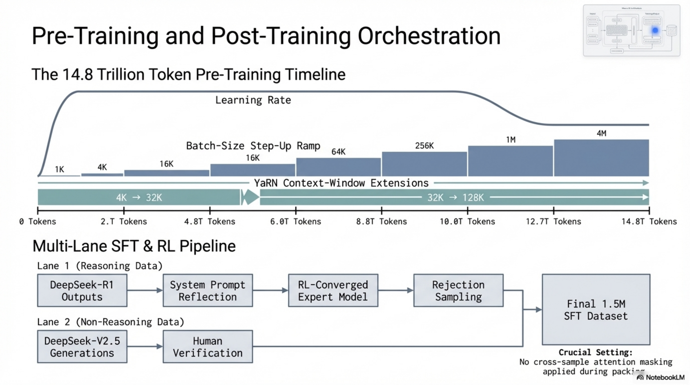

*Figure. Global training-stage orchestration, joining the 14.8T-token pre-training schedule with the downstream SFT and RL data lanes used for alignment.*

### 6.1 Stage 1: Pre-Training

**Inputs:** 14.8T tokenized, packed sequences
**Outputs:** DeepSeek-V3-Base checkpoint
**Duration:** $\sim$ 2 months, 2664K H800 GPU hours
**Cost per trillion tokens:** 180K H800 GPU hours (3.7 days on 2048 H800s)

| Configuration | Value |
|---|---|
| Sequence length | 4096 |
| Batch size | 3072 → 15360 |
| Total tokens | 14.8T |
| Learning rate | See §5.6 schedule |
| Bias update speed $\gamma$ | 0.001 (first 14.3T) → 0.0 (last 500B) |
| Balance loss $\alpha$ | 0.0001 |
| MTP weight $\lambda$ | 0.3 (first 10T) → 0.1 (last 4.8T) |

### 6.2 Stage 2: Long Context Extension

**Objective:** Extend context window from 4K → 32K → 128K using YaRN (Yet another RoPE extensioN).

**YaRN configuration (applied exclusively to decoupled shared key $\mathbf{k}^R_t$):**

$$
\text{RoPE}_{\text{ext}}(\theta_i) = \begin{cases}
\theta_i & \text{if } \theta_i \text{ is high-frequency (wavelength } < \beta) \\
\theta_i / s & \text{if } \theta_i \text{ is low-frequency (wavelength } > \alpha \cdot s) \\
\text{interpolated} & \text{otherwise}
\end{cases}
$$

with attention scaling factor $\sqrt{t} = 0.1 \ln s + 1$, where $s = 40$, $\alpha = 1$, $\beta = 32$.

**Phase 1 (4K → 32K):**
- 1000 steps
- Sequence length: 32K
- Batch size: 1920
- Learning rate: $7.3 \times 10^{-6}$

**Phase 2 (32K → 128K):**
- 1000 steps
- Sequence length: 128K
- Batch size: 480
- Learning rate: $7.3 \times 10^{-6}$

**Total GPU hours:** 119K H800 GPU hours

**Validation:** Full NIAH (Needle In A Haystack) pass across all context lengths up to 128K.

### 6.3 Stage 3: Post-Training

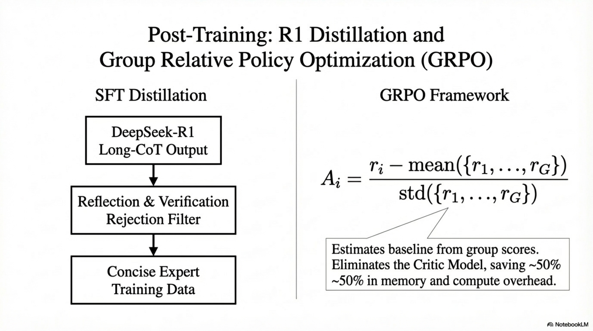

*Figure. Post-training synthesis of R1 distillation and GRPO, showing how reasoning data construction and critic-free RL interact in the alignment phase.*

**Total GPU hours:** 5K H800 GPU hours

#### 6.3.1 Supervised Fine-Tuning (SFT)

**Dataset:** 1.5M instances across multiple domains.

**Data categories:**

**Reasoning data** (math, code competition, logic puzzles):
- Generated by internal DeepSeek-R1 model
- Two SFT sample types per instance:
  1. $\langle \text{problem}, \text{original response} \rangle$
  2. $\langle \text{system prompt}, \text{problem}, \text{R1 response} \rangle$
- System prompt designed to elicit reflection and verification patterns
- Expert model developed per domain via combined SFT + RL pipeline
- After RL training: rejection sampling curates high-quality SFT data
- High-temperature sampling during RL integrates R1 patterns without explicit system prompts
- Final data retains R1 strengths while being concise and effective

**Non-reasoning data** (creative writing, role-play, simple QA):
- Generated by DeepSeek-V2.5
- Human annotators verify accuracy and correctness

**SFT training configuration:**

| Parameter | Value |
|---|---|
| Epochs | 2 |
| Learning rate schedule | Cosine decay: $5 \times 10^{-6} \rightarrow 1 \times 10^{-6}$ |
| Packing | Multiple samples per sequence |
| Sample masking | Samples isolated and mutually invisible |

#### 6.3.2 Reinforcement Learning (RL)

**Algorithm:** Group Relative Policy Optimization (GRPO)

**GRPO Objective:**

For each question $q$, sample group of $G$ outputs $\{o_1, o_2, \ldots, o_G\}$ from old policy $\pi_{\theta_{\text{old}}}$:

$$
\mathcal{J}_{\text{GRPO}}(\theta) = \mathbb{E}_{q \sim \mathcal{P}, \{o_i\} \sim \pi_{\theta_{\text{old}}}} \left[ \frac{1}{G} \sum_{i=1}^{G} \min\left( r_i(\theta) A_i, \; \text{clip}(r_i(\theta), 1-\varepsilon, 1+\varepsilon) A_i \right) - \beta \cdot D_{\text{KL}}(\pi_\theta \| \pi_{\text{ref}}) \right]
$$

where:

$$
r_i(\theta) = \frac{\pi_\theta(o_i | q)}{\pi_{\theta_{\text{old}}}(o_i | q)}
$$

$$
D_{\text{KL}}(\pi_\theta \| \pi_{\text{ref}}) = \frac{\pi_{\text{ref}}(o_i | q)}{\pi_\theta(o_i | q)} - \log \frac{\pi_{\text{ref}}(o_i | q)}{\pi_\theta(o_i | q)} - 1
$$

**Advantage estimation (from group rewards, no critic model):**

$$
A_i = \frac{r_i - \text{mean}(\{r_1, r_2, \ldots, r_G\})}{\text{std}(\{r_1, r_2, \ldots, r_G\})}
$$

where $r_i$ is the reward for output $o_i$.

**Key property:** GRPO eliminates the critic model (which would be same size as policy), estimating baseline from group scores instead.

**Reward Model Architecture:**

**Rule-Based RM:**
- For problems with deterministic results (math with boxed answers, LeetCode with test cases)
- Uses compiler feedback or rule-based verification
- Resistant to manipulation/exploitation

**Model-Based RM:**
- For free-form answers: checks match with ground-truth
- For open-ended questions (creative writing): provides feedback based on question-answer pair
- Trained from DeepSeek-V3 SFT checkpoints
- Preference data includes chain-of-thought leading to reward (mitigates reward hacking)

**RL prompt domains:** coding, math, writing, role-playing, question answering.

**Self-Rewarding:**
- For general scenarios where hard-coded verification is impractical
- Uses constitutional AI approach
- Voting evaluation results of DeepSeek-V3 itself as feedback source
- Significantly enhances subjective evaluation performance

### 6.4 Pseudo-Algorithm: Full Training Pipeline

```
ALGORITHM: DeepSeekV3_FullTraining
INPUT: Raw corpus C, hardware cluster H(2048 H800s)
OUTPUT: Final aligned model θ*

=== STAGE 1: PRE-TRAINING ===
1. D ← DataPreprocessing(C)                    // 14.8T tokens
2. Initialize θ with N(0, 0.006²)
3. Configure: PP16 × EP64 × ZeRO-1 DP
4. lr ← 0; batch_size ← 3072; step ← 0
5. FOR token_count = 0 TO 14.8T:
     // Learning rate schedule
     IF step < 2K: lr ← linear_warmup(step, target=2.2e-4)
     ELIF token_count < 10T: lr ← 2.2e-4
     ELIF token_count < 14.3T: lr ← cosine_decay(token_count, 2.2e-4, 2.2e-5)
     ELIF token_count < 14.633T: lr ← 2.2e-5
     ELSE: lr ← 7.3e-6
     
     // Batch size schedule
     IF token_count < 469B: batch_size ← linear_increase(token_count, 3072, 15360)
     ELSE: batch_size ← 15360
     
     // MTP weight schedule
     IF token_count < 10T: λ ← 0.3
     ELSE: λ ← 0.1
     
     // Bias update schedule
     IF token_count < 14.3T: γ ← 0.001
     ELSE: γ ← 0.0
     
     // Forward pass (FP8 mixed precision)
     x ← SampleBatch(D, batch_size, seq_len=4096)
     L_main ← NextTokenPredictionLoss(x, θ)
     L_MTP ← MTP_Loss(x, θ, D=1)
     L_bal ← SequenceBalanceLoss(θ, α=0.0001)
     L_total ← L_main + λ · L_MTP + L_bal
     
     // Backward pass (FP8 GEMM, DualPipe)
     Backward(L_total, θ)
     ClipGradNorm(θ, max_norm=1.0)
     AdamW_Step(θ, lr, β₁=0.9, β₂=0.95, wd=0.1)
     UpdateBiases(γ)
     UpdateEMA_CPU(θ)
     step ← step + 1

=== STAGE 2: CONTEXT EXTENSION ===
6. // Phase 1: 4K → 32K
   ApplyYaRN(θ, s=40, α=1, β=32, scale_factor=0.1·ln(40)+1)
   FOR step = 1 TO 1000:
     Train(θ, seq_len=32K, batch=1920, lr=7.3e-6)

7. // Phase 2: 32K → 128K
   FOR step = 1 TO 1000:
     Train(θ, seq_len=128K, batch=480, lr=7.3e-6)

=== STAGE 3: POST-TRAINING ===
8. // SFT
   D_SFT ← CurateSFTData(R1_expert_models, V2.5, human_annotators)  // 1.5M instances
   FOR epoch = 1 TO 2:
     FineTune(θ, D_SFT, lr_schedule=cosine(5e-6→1e-6), mask=sample_isolation)

9. // RL (GRPO)
   θ_ref ← copy(θ)
   FOR iteration = 1 TO N_RL:
     FOR q ∈ RL_prompts(code, math, writing, roleplay, QA):
       {o_1,...,o_G} ← Sample(π_{θ_old}, q)
       {r_1,...,r_G} ← Reward(o_1,...,o_G, RM_rule, RM_model)
       A_i ← (r_i - mean(r)) / std(r)
       Update θ via GRPO objective with KL penalty against θ_ref

10. θ* ← θ
11. RETURN θ*
```

---

## 7. Inference Path

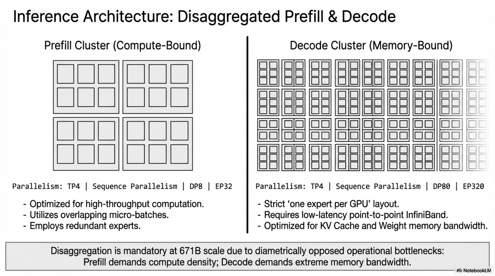

*Figure. Disaggregated serving layout, separating compute-heavy prefilling from memory-bound decoding so each regime can use a different expert and attention topology.*

### 7.1 Prefilling Stage

**Deployment unit:** 4 nodes × 8 GPUs = 32 GPUs

| Component | Parallelism | Details |
|---|---|---|
| Attention | TP4 + SP + DP8 | Small TP size limits communication overhead |
| MoE | EP32 | Each expert gets sufficiently large batch |
| Dense MLPs (shallow layers) | TP1 | Saves TP communication |
| All-to-all | IB cross-node + NVLink intra-node | Same as training |

**Redundant expert deployment:**
- 32 redundant experts (duplicated high-load experts)
- Each GPU: 8 original experts + 1 redundant expert = 9 total
- High-load experts detected from online statistics, adjusted every ~10 minutes
- Experts rearranged within nodes to balance GPU loads without increasing cross-node communication

**Throughput optimization:**
- Two micro-batches processed simultaneously
- Attention + MoE of micro-batch A overlapped with dispatch + combine of micro-batch B

**Dynamic redundancy (in exploration):**
- Each GPU hosts 16 experts, only 9 activated per step
- Globally optimal routing computed on-the-fly before each layer's all-to-all
- Overhead negligible due to heavy prefilling computation

### 7.2 Decoding Stage

**Shared expert treated as routed:** Each token selects 9 experts (8 routed + 1 shared, always selected).

**Deployment unit:** 40 nodes × 8 GPUs = 320 GPUs

| Component | Parallelism | Details |
|---|---|---|
| Attention | TP4 + SP + DP80 | |
| MoE | EP320 | Each GPU hosts exactly 1 expert |

**Expert distribution:**
- 256 routed experts + redundant experts + shared experts → 320 GPUs
- 64 GPUs dedicated to redundant and shared experts
- All-to-all via direct point-to-point IB transfers (low latency)
- IBGDA (InfiniBand GPU Direct Async) for further latency reduction

**Throughput optimization (in exploration):**
- Two micro-batches simultaneously
- Attention of micro-batch A overlapped with dispatch+MoE+combine of micro-batch B
- Attention dominates decoding time → allocate most SMs to attention
- MoE per-expert batch size small (~256 tokens), bottleneck is memory access not compute
- Few SMs sufficient for MoE without impacting attention performance

### 7.3 MTP for Speculative Decoding

MTP modules ($D = 1$ additional depth) can serve as draft heads:

1. Main model generates token $t_i$
2. MTP module predicts candidate $\hat{t}_{i+2}$
3. Main model verifies $\hat{t}_{i+2}$ in next forward pass
4. If accepted: skip one autoregressive step
5. If rejected: discard and continue standard decoding

**Acceptance rate** depends on MTP accuracy; empirically ~60-70% for well-trained models.

### 7.4 Pseudo-Algorithm: Inference Serving

```
ALGORITHM: DeepSeekV3_Inference
INPUT: Prompt tokens p_1, ..., p_n; max_new_tokens M
OUTPUT: Generated tokens g_1, ..., g_m

=== PREFILLING (32 GPUs: TP4+SP, EP32, DP8) ===
1. // Distribute prompt across TP4+SP for attention
   Partition prompt into SP chunks
   
2. FOR layer l = 1 TO 61:
     // Attention (TP4+SP)
     h ← MLA_Forward(h, layer=l)          // TP4 all-reduce
     
     IF l > 3:  // MoE layers
       // Compute routing with redundant expert awareness
       routing ← ComputeRouting(h, expert_biases, redundant_map)
       // All-to-all dispatch (IB + NVLink)
       dispatched ← AllToAll_Dispatch(h, routing, EP32)
       // Expert computation
       expert_out ← MoE_Compute(dispatched)
       // All-to-all combine
       h ← AllToAll_Combine(expert_out, EP32)
     ELSE:  // Dense FFN
       h ← DenseFFN(h)                    // TP1 for shallow layers
   
   // Overlap: process micro-batch B dispatch/combine during micro-batch A compute

3. // Cache KV: only c^KV_t ∈ ℝ^512 and k^R_t ∈ ℝ^64 per token per layer
   KV_cache ← {c^KV_t, k^R_t : t=1..n, l=1..61}

=== DECODING (320 GPUs: TP4+SP, EP320) ===
4. FOR step = 1 TO M:
     // Single token forward through all layers
     FOR layer l = 1 TO 61:
       h ← MLA_Decode(h, KV_cache[l])     // TP4, append to KV cache
       IF l > 3:
         routing ← ComputeRouting(h)        // 9 experts (8 routed + 1 shared)
         h ← PointToPoint_AllToAll(h, routing, EP320)  // Direct IB P2P
       ELSE:
         h ← DenseFFN(h)
     
     logits ← OutputHead(h)
     g_step ← Sample(logits)               // or Greedy
     
     // Optional: speculative decoding with MTP
     IF USE_SPECULATIVE:
       draft ← MTP_Module(h, Emb(g_step))
       draft_token ← ArgMax(OutHead(draft))
       // Verify in next step...

5. RETURN g_1, ..., g_m
```

---

## 8. Evaluation Protocol

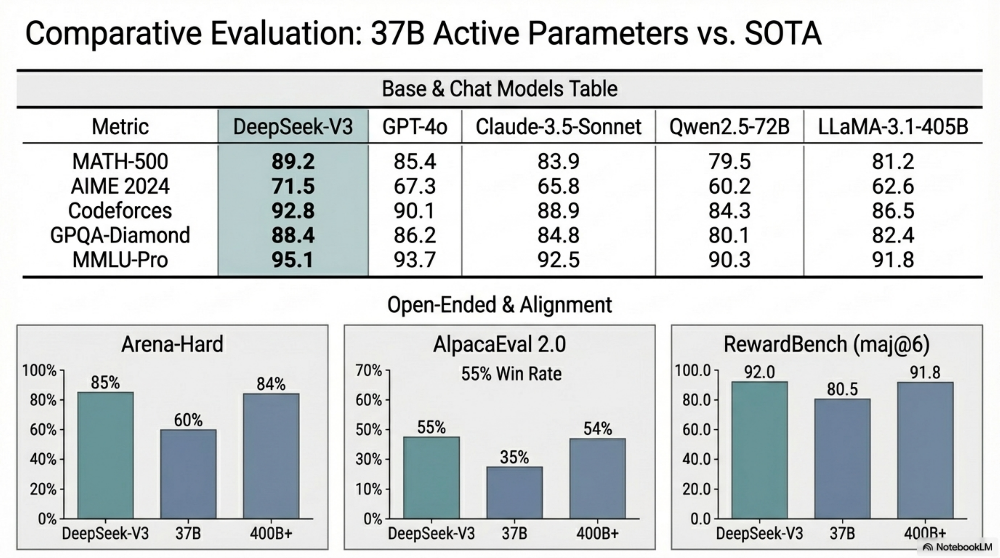

*Figure. Evaluation synthesis showing how DeepSeek-V3 reaches frontier benchmark quality with far fewer activated parameters than dense competitors.*

### 8.1 Base Model Evaluation

#### 8.1.1 Benchmark Categories

**Multi-subject multiple-choice:**
- MMLU, MMLU-Redux, MMLU-Pro, MMMLU (multilingual), C-Eval (Chinese), CMMLU (Chinese)

**Language understanding and reasoning:**
- HellaSwag, PIQA, ARC, BBH

**Closed-book QA:**
- TriviaQA, NaturalQuestions

**Reading comprehension:**
- RACE, DROP, C3 (Chinese), CMRC (Chinese)

**Reference disambiguation:**
- CLUEWSC (Chinese), WinoGrande

**Language modeling:**
- Pile-test (BPB metric)

**Chinese understanding:**
- CCPM

**Math:**
- GSM8K, MATH, MGSM (multilingual), CMath (Chinese)

**Code:**
- HumanEval, LiveCodeBench-Base (0801-1101), MBPP, CRUXEval

**Standardized exams:**
- AGIEval (English + Chinese subsets)

#### 8.1.2 Evaluation Methods

| Method | Benchmarks |
|---|---|
| Perplexity-based | HellaSwag, PIQA, WinoGrande, RACE, MMLU, MMLU-Redux, MMLU-Pro, MMMLU, ARC, C-Eval, CMMLU, C3, CCPM |
| Generation-based | TriviaQA, NaturalQuestions, DROP, MATH, GSM8K, MGSM, HumanEval, MBPP, LiveCodeBench, CRUXEval, BBH, AGIEval, CLUEWSC, CMRC, CMath |
| Language-modeling-based | Pile-test |

**Pile-test metric:** Bits-Per-Byte (BPB) — ensures fair comparison across different tokenizers:

$$
\text{BPB} = \frac{-\sum_{i} \log_2 P(t_i | t_{<i})}{\text{total bytes in text}}
$$

#### 8.1.3 Key Base Model Results

| Benchmark | DeepSeek-V3-Base | Qwen2.5-72B | LLaMA-3.1-405B |
|---|---|---|---|
| MMLU | **87.1** | 85.0 | 84.4 |
| MMLU-Pro | **64.4** | 58.3 | 52.8 |
| BBH | **87.5** | 79.8 | 82.9 |
| MATH | **61.6** | 54.4 | 49.0 |
| HumanEval | **65.2** | 53.0 | 54.9 |
| GSM8K | **89.3** | 88.3 | 83.5 |

### 8.2 Chat Model Evaluation

#### 8.2.1 Additional Benchmarks

- IFEval, FRAMES, LongBench v2, GPQA-Diamond
- SimpleQA, C-SimpleQA
- SWE-Bench Verified (agentless framework, diff format)
- Aider (Edit + Polyglot)
- LiveCodeBench (08/2024–11/2024, CoT and non-CoT)
- Codeforces (competitor percentile)
- CNMO 2024, AIME 2024

#### 8.2.2 Evaluation Configuration

| Setting | Detail |
|---|---|
| MMLU, DROP, GPQA, SimpleQA | simple-evals prompts |
| MMLU-Redux | Zero-Eval prompt, zero-shot |
| HumanEval-Mul | 8 languages: Python, Java, C++, C#, JS, TS, PHP, Bash |
| LiveCodeBench | CoT and non-CoT |
| Codeforces | Competitor percentile |
| SWE-Bench | Agentless framework, diff format |
| AIME, CNMO 2024 | Temperature 0.7, averaged over 16 runs |
| MATH-500 | Greedy decoding |
| Max output tokens | 8192 for all benchmarks |

#### 8.2.3 Key Chat Model Results

| Benchmark | DeepSeek-V3 | GPT-4o-0513 | Claude-3.5-Sonnet |
|---|---|---|---|
| MMLU | **88.5** | 87.2 | 88.3 |
| GPQA-Diamond | 59.1 | 49.9 | **65.0** |
| MATH-500 | **90.2** | 74.6 | 78.3 |
| AIME 2024 | **39.2** | 9.3 | 16.0 |
| Codeforces | **51.6** | 23.6 | 20.3 |
| SWE-Bench | 42.0 | 38.8 | **50.8** |
| LiveCodeBench-CoT | **40.5** | 33.4 | 36.3 |
| DROP (3-shot) | **91.6** | 83.7 | 88.3 |
| C-SimpleQA | **64.8** | 59.3 | 51.3 |

#### 8.2.4 Open-Ended Evaluation

| Model | Arena-Hard (win rate vs GPT-4-0314) | AlpacaEval 2.0 (LC win rate) |
|---|---|---|
| **DeepSeek-V3** | **85.5** | **70.0** |
| Claude-3.5-Sonnet | 85.2 | 52.0 |
| GPT-4o | 80.4 | 51.1 |

DeepSeek-V3: first open-source model to surpass 85% on Arena-Hard.

#### 8.2.5 Generative Reward Model Evaluation (RewardBench)

| Model | Chat | Chat-Hard | Safety | Reasoning | Average |
|---|---|---|---|---|---|
| DeepSeek-V3 | 96.9 | 79.8 | 87.0 | 84.3 | 87.0 |
| DeepSeek-V3 (maj@6) | 96.9 | 82.6 | 89.5 | 89.2 | **89.6** |
| Claude-3.5-Sonnet-1022 | 96.4 | 79.7 | 91.1 | 87.6 | 88.7 |
| GPT-4o-0806 | 96.1 | 76.1 | 88.1 | 86.6 | 86.7 |

### 8.3 Pseudo-Algorithm: Evaluation

```
ALGORITHM: Evaluation_Protocol
INPUT: Model θ, benchmark set B
OUTPUT: Metric scores M

1. FOR each benchmark b ∈ B:
     // Determine evaluation method
     IF b ∈ {HellaSwag, PIQA, MMLU, ...}:
       method ← PERPLEXITY_BASED
     ELIF b == Pile-test:
       method ← LANGUAGE_MODELING (BPB)
     ELSE:
       method ← GENERATION_BASED
     
     // Set evaluation configuration
     IF b ∈ {AIME, CNMO}:
       config ← {temperature: 0.7, n_runs: 16, max_tokens: 8192}
       score ← Average over 16 runs
     ELIF b ∈ {MATH-500}:
       config ← {temperature: 0, max_tokens: 8192}
     ELSE:
       config ← default(b) with max_tokens=8192
     
     // Execute evaluation
     IF method == PERPLEXITY_BASED:
       M[b] ← ComputePerplexityAccuracy(θ, b, config)
     ELIF method == LANGUAGE_MODELING:
       M[b] ← ComputeBPB(θ, b)
     ELSE:
       M[b] ← GenerateAndScore(θ, b, config)

2. RETURN M
```

---

## 9. Deployment Constraints

### 9.1 Cost Summary

| Stage | H800 GPU Hours | Cost (@ $2/GPU-hr) |
|---|---|---|
| Pre-Training | 2,664K | $5.328M |
| Context Extension | 119K | $0.238M |
| Post-Training | 5K | $0.01M |
| **Total** | **2,788K** | **$5.576M** |

**Pre-training efficiency:** 180K H800 GPU hours per trillion tokens = 3.7 days on 2048 H800s.

### 9.2 Memory Budget Analysis

#### 9.2.1 KV Cache per Token (Inference)

$$
\text{KV cache per token per layer} = (d_c + d^R_h) \times \text{dtype\_size} = (512 + 64) \times 2 = 1152 \text{ bytes (BF16)}
$$

$$
\text{KV cache per token (all layers)} = 576 \times 2 \times 61 = 70,272 \text{ bytes} \approx 68.6 \text{ KB}
$$

For 128K context:

$$
\text{Total KV cache} = 128\text{K} \times 68.6 \text{ KB} \approx 8.6 \text{ GB}
$$

vs. standard MHA: $128\text{K} \times 2 \times 128 \times 128 \times 2 \times 61 \approx 490 \text{ GB}$ → **~57× reduction**.

#### 9.2.2 Model Parameters

| Component | Memory (BF16) |
|---|---|
| Total parameters (671B) | ~1.24 TB |
| Activated parameters per token (37B) | ~69 GB |
| Optimizer states (BF16 moments) | ~2.48 TB |
| Master weights (FP32) | ~2.49 TB |

### 9.3 Throughput and Latency Constraints

**Prefilling:**
- 32 GPUs minimum deployment
- Two micro-batches for throughput hiding
- TP4 limits communication overhead
- EP32 ensures per-expert batch size is sufficient for compute efficiency

**Decoding:**
- 320 GPUs minimum deployment
- Each GPU hosts exactly 1 expert → minimal memory access overhead
- Point-to-point IB for low-latency all-to-all
- IBGDA for sub-microsecond communication latency
- Batch size per expert typically ≤ 256 tokens (memory-bound regime)

### 9.4 Fault Tolerance

- No irrecoverable loss spikes throughout training (inherent stability)
- EMA in CPU provides early performance estimation for checkpoint selection
- Pipeline parallelism with bidirectional scheduling reduces failure domain
- Redundant expert deployment provides serving-time fault tolerance

### 9.5 Load Balancing During Serving

- **Prefilling:** 32 redundant experts, rearranged within nodes every ~10 minutes
- **Decoding:** Periodic redundant expert set update based on online statistics
- Dynamic redundancy strategy under exploration (globally optimal routing per layer)

### 9.6 Hardware Design Recommendations

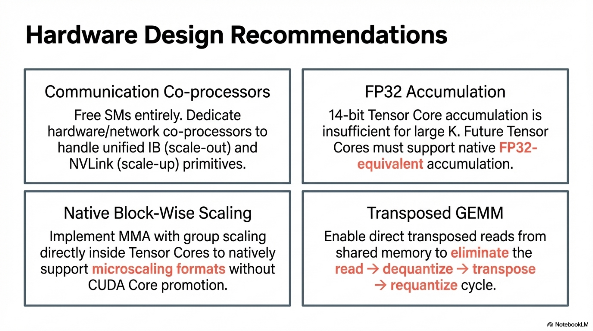

*Figure. Hardware-design implications drawn from DeepSeek-V3 training, spanning communication offload, native quantization support, improved accumulation precision, and transposed GEMM primitives.*

#### 9.6.1 Communication Hardware

**Current bottleneck:** 20 out of 132 SMs dedicated to communication, Tensor Cores underutilized during communication.

**Recommendations:**
1. Dedicated communication co-processor (GPU co-processor or network co-processor like NVIDIA SHARP)
2. Unified IB (scale-out) and NVLink (scale-up) interface from computation unit perspective
3. Primitives: `read`, `write`, `multicast`, `reduce` across IB-NVLink-unified domain

#### 9.6.2 Compute Hardware

**FP8 GEMM accumulation:** Current 14-bit accumulation in H800 Tensor Cores is insufficient → future chips need FP32-equivalent accumulation precision.

**Tile/block-wise quantization support:**
- Current: Partial results copied Tensor Cores → CUDA Cores → scale → accumulate → return
- Recommended: Tensor Cores natively accept scaling factors, perform MMA with group scaling internally

**Online quantization support:**
- Current: Read BF16 from HBM → quantize → write FP8 → read FP8 for MMA (3 HBM accesses)
- Recommended: Fused FP8 cast + TMA access (quantize during global→shared memory transfer)
- Alternative: Near-memory computing with BF16→FP8 cast at HBM interface (50% off-chip access reduction)

**Transposed GEMM:**
- Current: Read → dequantize → transpose → requantize → store → read (multiple HBM operations)
- Recommended: Direct transposed reads from shared memory before MMA for training-relevant precisions

---

## 10. Convergence Dynamics and Failure Mode Analysis

### 10.1 Convergence Properties

**Training stability:** Zero irrecoverable loss spikes, zero rollbacks across 14.8T tokens.

**Contributing factors:**
1. Auxiliary-loss-free balancing avoids gradient perturbations from balance losses
2. Sigmoid gating with normalization (smoother than softmax over all experts)
3. Fine-grained FP8 quantization maintains numerical fidelity
4. Careful precision retention (embedding, output head, gating, normalization, attention in BF16+)
5. Gradient clipping at norm 1.0
6. BF16 optimizer states sufficient (no FP32 required for moments)
7. FP32 master weights and gradient accumulators

### 10.2 Failure Modes and Mitigations

| Failure Mode | Risk | Mitigation |
|---|---|---|
| **Routing collapse** | Experts converge to identical specialization | Auxiliary-loss-free bias mechanism; complementary balance loss $\alpha = 0.0001$ |
| **Load imbalance (within-sequence)** | Single sequence overwhelms subset of experts | Sequence-wise balance loss (complementary) |
| **Load imbalance (domain shift)** | Inference distribution differs from training | Redundant expert deployment; dynamic routing |
| **FP8 underflow/overflow** | Limited dynamic range of E4M3 | Fine-grained tile/block-wise quantization; online quantization |
| **Accumulation precision loss** | 14-bit Tensor Core accumulation insufficient for large K | Promotion to CUDA Cores every $N_C = 128$ elements |
| **Token boundary bias** | Combined punctuation-linebreak tokens create evaluation artifacts | Random splitting during training |
| **MTP gradient interference** | MTP loss may conflict with main loss | Decaying $\lambda$: 0.3 → 0.1; shared embedding/output head stabilizes representations |
| **Reward hacking (RL)** | Model exploits reward model weaknesses | Rule-based RM where possible; chain-of-thought in model-based RM; self-rewarding with voting |
| **Distillation length inflation** | R1-distilled data produces excessively long responses | Careful setting selection; rejection sampling; balance between accuracy and length |
| **KV cache exhaustion** | 128K context requires substantial memory | MLA compression (~57× reduction); only 8.6 GB for 128K context |

### 10.3 Scaling Law Observations

- Training cost per trillion tokens: 180K H800 GPU hours (constant as model scales with maintained computation-to-communication ratio)
- DualPipe ensures near-zero all-to-all communication overhead as model scales, provided computation-to-communication ratio maintained
- With $M = 4$ node-limited routing, maximum 13 experts selectable without increased communication cost (vs. 8 used)

### 10.4 Ablation-Validated Design Decisions

| Decision | Validation | Result |
|---|---|---|
| MTP ($D = 1$) | Ablation at 15.7B and 228.7B scales | Consistent improvement across most benchmarks; zero inference cost increase |
| Aux-loss-free balancing | Ablation at 15.7B and 228.7B scales | Better than pure aux-loss on most benchmarks |
| Batch-wise vs. sequence-wise balance | 1B and 3B MoE experiments | Batch-wise matches aux-loss-free (2.253 vs. 2.253 at 1B; 2.080 vs. 2.080 at 3B) |
| FP8 vs. BF16 | Training at V2-Lite and V2 scales for ~1T tokens | Relative loss error < 0.25% |
| R1 distillation | Ablation on DeepSeek-V2.5 | LiveCodeBench: 31.1 → 37.4; MATH-500: 74.6 → 83.2 (with length increase 769 → 1510) |

### 10.5 Expert Specialization Analysis

The auxiliary-loss-free model demonstrates significantly greater expert specialization patterns compared to auxiliary-loss-based models when analyzed across different domains (Wikipedia, GitHub, DM Mathematics) in the Pile test set. This is a direct consequence of batch-wise (rather than sequence-wise) balancing, which permits per-domain expert specialization while maintaining global load balance.

---

## 11. MTP Speculative Decoding: Serving Acceleration

### 11.1 Mechanism

The $D = 1$ MTP module serves as a single-token draft model for speculative decoding:

$$
\text{Speedup} = \frac{1}{1 - p_{\text{accept}} + p_{\text{accept}} / 2} = \frac{2}{2 - p_{\text{accept}}}
$$

where $p_{\text{accept}}$ is the token-level acceptance rate.

For $p_{\text{accept}} = 0.7$: speedup $\approx 1.54\times$.

### 11.2 Implementation

The MTP module adds minimal overhead since:
- Embedding layer is shared with main model (no additional parameters)
- Output head is shared with main model
- Only one additional Transformer block $\text{TRM}_1(\cdot)$ and projection $M_1 \in \mathbb{R}^{d \times 2d}$
- During verification, the main model can verify the draft token in parallel with generating the next token

### 11.3 Multi-Token Prediction Evaluation (Post-Training)

The MTP acceptance rate serves as an additional evaluation metric for the quality of learned representations, beyond its direct utility for speculative decoding acceleration. Higher acceptance rates indicate better next-next-token prediction quality from the main model's representations.

---

## 12. End-to-End Tensor Flow Summary

### 12.1 Forward Pass Tensor Dimensions (per token)

```
Input token t_i                              → index ∈ {0, ..., V-1}
Embedding: Emb(t_i)                         → ℝ^7168
                                              
FOR layer l = 1 TO 61:                        
  RMSNorm(h)                                 → ℝ^7168
  === MLA ===                                 
  c^Q  = W^DQ · h                            → ℝ^1536         [W^DQ: 1536×7168]
  c^KV = W^DKV · h                           → ℝ^512          [W^DKV: 512×7168]
  k^R  = RoPE(W^KR · h)                      → ℝ^64           [W^KR: 64×7168]
  Per head i (128 heads):                     
    q^C_i = W^UQ_i · c^Q                     → ℝ^128          [W^UQ: 16384×1536]
    q^R_i = RoPE(W^QR_i · c^Q)               → ℝ^64           [W^QR: 8192×1536]
    k^C_i = W^UK_i · c^KV                    → ℝ^128          [W^UK: 16384×512]
    v^C_i = W^UV_i · c^KV                    → ℝ^128          [W^UV: 16384×512]
    q_i = [q^C_i; q^R_i]                     → ℝ^192
    k_i = [k^C_i; k^R]                       → ℝ^192
    attn_i = Softmax(q_i^T K / √192) · V     → ℝ^128
  o = [attn_1; ...; attn_128]                → ℝ^16384
  u = W^O · o                                → ℝ^7168         [W^O: 7168×16384]
                                              
  RMSNorm(u)                                 → ℝ^7168
  === MoE (layers 4-61) ===                   
  Shared expert FFN: ℝ^7168 → ℝ^2048 → ℝ^7168
  8 routed expert FFNs: each ℝ^7168 → ℝ^2048 → ℝ^7168
  Gated sum                                   → ℝ^7168
                                              
  === Dense FFN (layers 1-3) ===              
  Standard FFN                                → ℝ^7168
                                              
Output head: ℝ^7168 → ℝ^128K                 
                                              
=== MTP Module (D=1) ===                      
h' = M_1 · [h^0; Emb(t_{i+1})]              → ℝ^7168         [M_1: 7168×14336]
h^1 = TRM_1(h')                              → ℝ^7168
P^1 = Softmax(OutHead(RMSNorm(h^1)))         → ℝ^128K
```

### 12.2 Parameter Count Verification

| Component | Parameters |
|---|---|
| Embedding | $V \times d = 128\text{K} \times 7168 \approx 0.9\text{B}$ |
| Per MLA layer | $W^{DKV} + W^{DQ} + W^{UK} + W^{UV} + W^{UQ} + W^{KR} + W^{QR} + W^O \approx 0.27\text{B}$ |
| Per MoE layer (58 layers) | $1 \text{ shared} + 256 \text{ routed experts} \times 3 \times 7168 \times 2048 \approx 11.3\text{B}$ |
| Per dense FFN layer (3 layers) | $3 \times 7168 \times d_{\text{ffn}} \approx 0.3\text{B}$ |
| MTP module | $M_1 + \text{TRM}_1 \approx \text{small}$ |
| Output head | Shared with embedding |
| **Total** | **~671B** |
| **Activated per token** | 1 shared + 8 routed experts per MoE layer → **~37B** |

---

## 13. Summary of Hyperparameters (Deterministic Reference)

| Category | Parameter | Value |
|---|---|---|
| **Architecture** | Layers $L$ | 61 |
| | Hidden dim $d$ | 7168 |
| | Attention heads $n_h$ | 128 |
| | Head dim $d_h$ | 128 |
| | KV compression $d_c$ | 512 |
| | Query compression $d'_c$ | 1536 |
| | RoPE head dim $d^R_h$ | 64 |
| | Shared experts $N_s$ | 1 |
| | Routed experts $N_r$ | 256 |
| | Activated experts $K_r$ | 8 |
| | Expert intermediate dim | 2048 |
| | Node limit $M$ | 4 |
| | MTP depth $D$ | 1 |
| | Vocabulary $V$ | 128K |
| | Init std $\sigma$ | 0.006 |
| **Optimizer** | Type | AdamW |
| | $\beta_1$ | 0.9 |
| | $\beta_2$ | 0.95 |
| | Weight decay | 0.1 |
| | Grad clip norm | 1.0 |
| | Moment precision | BF16 |
| | Master weight precision | FP32 |
| **Pre-training** | Tokens | 14.8T |
| | Sequence length | 4096 |
| | Batch size | 3072 → 15360 |
| | Peak LR | $2.2 \times 10^{-4}$ |
| | Final LR | $7.3 \times 10^{-6}$ |
| | Warmup steps | 2000 |
| | Bias speed $\gamma$ | 0.001 → 0.0 |
| | Balance $\alpha$ | 0.0001 |
| | MTP $\lambda$ | 0.3 → 0.1 |
| **Context ext.** | Phase 1 | 32K, 1000 steps, batch 1920 |
| | Phase 2 | 128K, 1000 steps, batch 480 |
| | YaRN $s$ | 40 |
| | YaRN $\alpha, \beta$ | 1, 32 |
| | Scale factor | $0.1 \ln 40 + 1$ |
| **SFT** | Instances | 1.5M |
| | Epochs | 2 |
| | LR | $5 \times 10^{-6} \rightarrow 1 \times 10^{-6}$ |
| **FP8** | Format | E4M3 (all tensors) |
| | Activation tile | $1 \times 128$ |
| | Weight block | $128 \times 128$ |
| | Accumulation interval $N_C$ | 128 |
| **Parallelism** | PP | 16 |
| | EP | 64 (training), 32 (prefill), 320 (decode) |
| | DP | ZeRO-1 |
| | Communication SMs | 20 |
| **Deployment** | Prefill GPUs | 32 |
| | Decode GPUs | 320 |
| | Redundant experts (prefill) | 32 |
| | Max output tokens (eval) | 8192 |

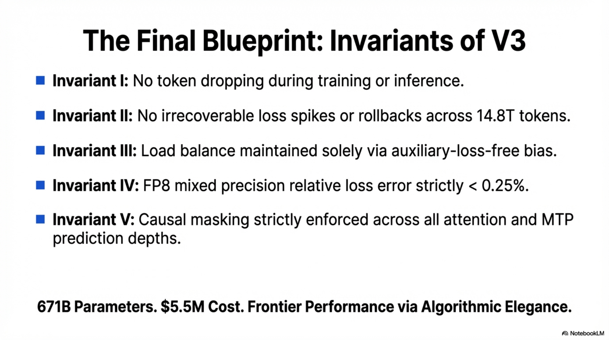

*Figure. Closing invariant summary for DeepSeek-V3, restating the properties that remain stable across architecture, training, inference, and hardware realization.*
