# Gemma 3: End-to-End Technical Report

---

## 1. Data Pipeline

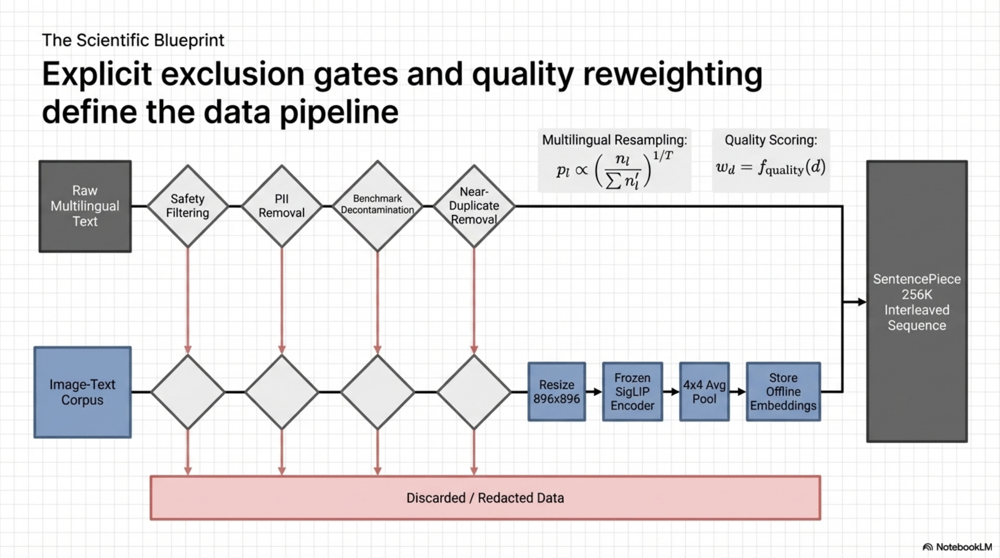

*Figure. End-to-end data curation flow showing safety filtering, decontamination, multilingual balancing, and quality reweighting before tokenization and training-shard construction.*

### 1.1. Objectives, Inputs, Outputs, and Invariants

**Objective:** Construct a pre-training corpus comprising text and image data with controlled quality, decontaminated evaluation sets, balanced multilingual representation, and minimized sensitive content proliferation.

**Inputs:**
- Raw web-scale text corpora (monolingual and parallel multilingual data)
- Image-text paired datasets for vision understanding
- Evaluation benchmark datasets (for decontamination reference)

**Outputs:**
- Tokenized sequences of length $L \in \{32768, 131072\}$ depending on training stage
- Pre-computed vision embeddings $\mathbf{V} \in \mathbb{R}^{256 \times d_{\text{vision}}}$ per image
- Token budget allocations: 14T tokens (27B), 12T (12B), 4T (4B), 2T (1B)

**Invariants:**
- No evaluation set $n$-gram overlap above decontamination threshold
- Personal information density below detection threshold per SDP audit
- Multilingual token distribution follows rebalancing strategy inspired by Chung et al. (2023)

**Failure Modes:**
- Evaluation contamination: benchmark $n$-grams leaking into training splits invalidate downstream metric reliability
- Language imbalance: under-representation of low-resource languages causes degraded multilingual capability
- Recitation risk: duplicated or memorizable passages increase discoverable extraction rate

---

### 1.2. Tokenization

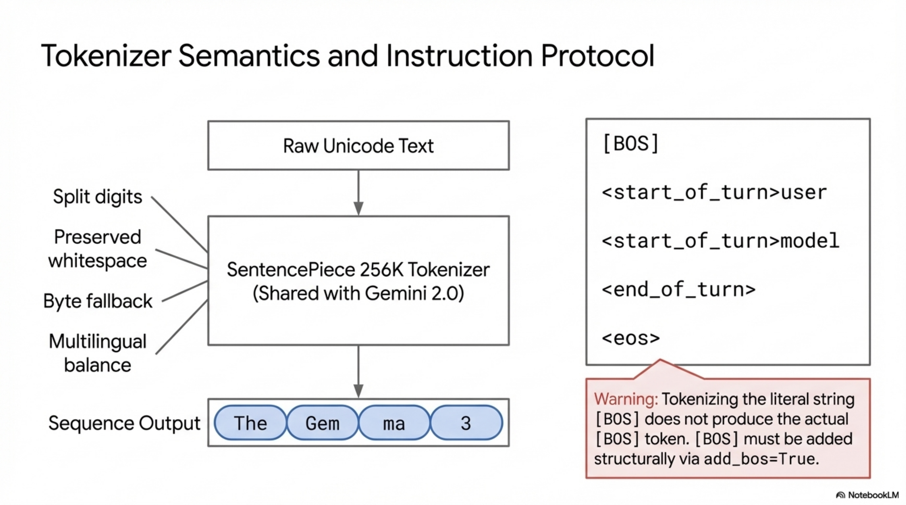

*Figure. Tokenizer and instruction-format overview highlighting shared SentencePiece vocabulary, structural control tokens, and the role of explicit turn delimiters in conversational data.*

**Tokenizer Specification:**
- SentencePiece tokenizer shared with Gemini 2.0
- Vocabulary size: $|\mathcal{V}| = 262144$ (262k entries)
- Features: split digits, preserved whitespace, byte-level fallback encoding

**Formal Definition:**

Let $\mathcal{T}: \Sigma^* \rightarrow \mathcal{V}^*$ denote the tokenizer mapping from raw unicode string space $\Sigma^*$ to token sequence space $\mathcal{V}^*$. The tokenizer satisfies:

$$
\mathcal{T}(s) = (t_1, t_2, \ldots, t_n), \quad t_i \in \{1, 2, \ldots, 262144\}
$$

**Key Properties:**
- **Digit splitting:** Each digit character maps to an individual token, preventing multi-digit token ambiguity
- **Whitespace preservation:** Leading/trailing whitespace tokens are retained, critical for code and structured text
- **Byte-level fallback:** Any character outside the trained vocabulary decomposes into byte-level tokens, guaranteeing lossless encoding: $\forall s \in \Sigma^*, \mathcal{T}^{-1}(\mathcal{T}(s)) = s$
- **Multilingual balance:** Compared to Gemma 2 tokenizer, this vocabulary achieves lower fertility (tokens-per-word ratio) for non-English languages

**Special Tokens:**
- `[BOS]`: Beginning-of-sequence, must be added explicitly (not via text tokenization of the string "[BOS]")
- `<start_of_turn>`: Marks beginning of a conversational turn
- `<end_of_turn>`: Marks end of a conversational turn
- `<eos>`: End-of-sequence for pre-trained models
- PT models terminate generation with `<eos>`; IT models terminate with `<end_of_turn>`

---

### 1.3. Data Filtering

**Stage 1: Safety and Sensitive Data Filtering**
- Remove examples containing certain personal information (detected via pattern matching and classifier-based approaches)
- Filter unsafe or toxic content using trained classifiers
- Remove mistaken self-identification data to prevent model identity confusion

**Stage 2: Quality Reweighting**

Inspired by Sachdeva et al. (2024), a quality scoring function $q: \mathcal{D} \rightarrow [0,1]$ assigns each document $d$ a quality weight. The sampling probability is reweighted:

$$
P_{\text{sample}}(d) \propto q(d) \cdot P_{\text{original}}(d)
$$

This reduces the effective contribution of low-quality documents without hard removal, preserving corpus diversity.

**Stage 3: Decontamination**

For each evaluation benchmark $\mathcal{B}_k$, extract all $n$-grams of length $n \geq n_{\text{thresh}}$. Remove or flag any training document $d$ where:

$$
\exists \, g \in \text{n-grams}(d) \text{ such that } g \in \text{n-grams}(\mathcal{B}_k)
$$

**Stage 4: Deduplication**
- Near-duplicate detection to remove repeated passages
- Reduces memorization rate (empirically validated: Gemma 3 achieves orders-of-magnitude lower memorization than prior models, as shown in Figure 9)

**Stage 5: Recitation Minimization**
- Minimize proliferation of sensitive outputs through targeted filtering
- Empirical validation: 0 personal information instances detected across all Gemma 3 model outputs classified as memorized

---

### 1.4. Multilingual Data Strategy

**Problem:** Natural web-scale data exhibits heavy-tailed language distribution, with English dominating.

**Solution:** Inspired by Chung et al. (2023), apply temperature-based resampling across languages. Given language $l$ with raw frequency $f_l$, the resampled probability is:

$$
P(l) = \frac{f_l^{1/\tau}}{\sum_{l'} f_{l'}^{1/\tau}}
$$

where $\tau > 1$ upsamples low-resource languages. Both monolingual and parallel (translation-aligned) data are included.

---

### 1.5. Vision Data Pipeline

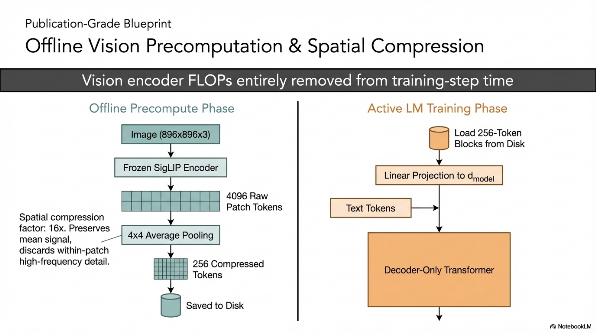

*Figure. Offline multimodal preprocessing path where resized images pass through the frozen SigLIP encoder, are pooled to 256 visual tokens, and are stored for later language-model training.*

**Objective:** Integrate image understanding into the pre-training mixture without increasing language model training cost.

**Mechanism:**
1. Images are preprocessed to $896 \times 896$ resolution (square resize)
2. The frozen SigLIP vision encoder produces patch embeddings
3. A $4 \times 4$ average pooling reduces output to exactly 256 vision tokens per image
4. Embeddings are **pre-computed** offline and stored, decoupling vision encoder compute from language model training

$$
\mathbf{V} = \text{AvgPool}_{4\times4}\left(\text{SigLIP}(\text{Resize}_{896}(\mathbf{I}))\right) \in \mathbb{R}^{256 \times d_{\text{vision}}}
$$

**Invariant:** Pre-computed embeddings are identical to online computation, ensuring no information loss. The language model receives image tokens as soft tokens interleaved with text tokens.

---

### 1.6. Pseudo-Algorithm: Data Preprocessing Pipeline

```
ALGORITHM: DataPreprocessingPipeline
INPUT: Raw corpora C_text, C_image_text, Evaluation benchmarks {B_k}
OUTPUT: Tokenized training shards with pre-computed vision embeddings

1. FOR each document d in C_text ∪ C_image_text:
     a. APPLY safety classifier; DISCARD if toxic/unsafe
     b. APPLY PII detector; REDACT or DISCARD flagged content
     c. COMPUTE quality score q(d)
     d. APPLY deduplication (MinHash / exact n-gram); DISCARD near-duplicates
     e. FOR each benchmark B_k:
          IF n-gram_overlap(d, B_k) > threshold: FLAG for removal
     f. STORE filtered document with quality weight q(d)

2. COMPUTE language frequencies {f_l} over filtered corpus
3. APPLY temperature resampling with τ to balance multilingual distribution
4. SAMPLE final training mixture according to reweighted P_sample(d)

5. FOR each image I in image-text pairs:
     a. RESIZE I to 896 × 896
     b. COMPUTE V = AvgPool_4x4(SigLIP(I)) ∈ R^{256 × d_vision}
     c. STORE pre-computed embedding V alongside paired text

6. TOKENIZE all text using SentencePiece tokenizer T (|V| = 262144)
7. PREPEND [BOS] token to each sequence
8. PACK sequences into training shards of length L ∈ {32768, 131072}
9. OUTPUT: Sharded tokenized dataset with vision embeddings
```

---

## 2. Model Architecture

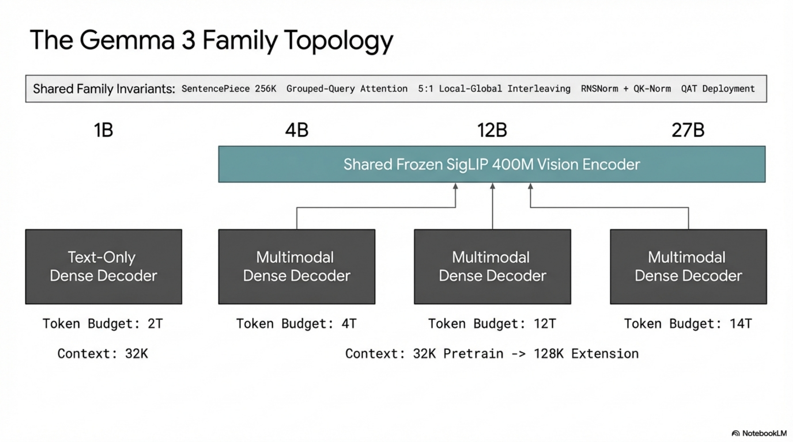

*Figure. Gemma 3 family topology summarizing the 1B, 4B, 12B, and 27B variants, indicating which configurations are text-only versus multimodal and how capacity scales across the family.*

### 2.1. Formal Definition

Gemma 3 is a **decoder-only autoregressive Transformer** with the following formal specification:

$$
P(x_1, x_2, \ldots, x_T) = \prod_{t=1}^{T} P(x_t \mid x_{<t}; \theta)
$$

where $\theta$ denotes all learnable parameters, $x_t \in \mathcal{V}$, and the conditional distribution is computed via a stack of Transformer layers followed by a softmax over the vocabulary.

**Model Variants:**

| Model | Vision Encoder | Embedding Params | Non-Embedding Params | Total |
|-------|---------------|-----------------|---------------------|-------|
| 1B | None | 302M | 698M | 1B |
| 4B | 417M (frozen) | 675M | 3,209M | ~4.3B |
| 12B | 417M (frozen) | 1,012M | 10,759M | ~12.2B |
| 27B | 417M (frozen) | 1,416M | 25,600M | ~27.4B |

---

### 2.2. Core Architectural Components

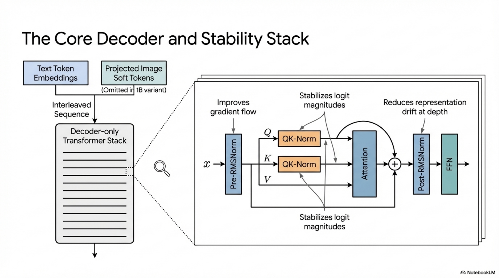

*Figure. Core decoder block composition showing RMSNorm placement, residual structure, grouped attention, feed-forward processing, and the stability-oriented arrangement used throughout the stack.*

#### 2.2.1. Grouped-Query Attention (GQA)

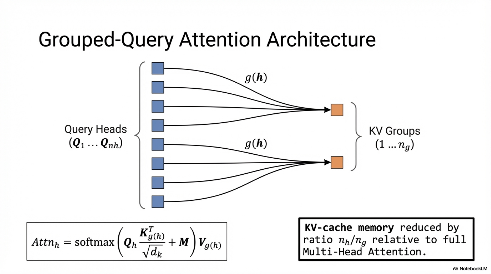

*Figure. Grouped-query attention layout showing multiple query heads sharing fewer key-value heads, clarifying the source of KV-cache compression and its role in long-context serving efficiency.*

**Definition:** GQA partitions query heads into groups, each group sharing a single key-value head. Given $n_q$ query heads and $n_{kv}$ key-value heads, the group size is $g = n_q / n_{kv}$.

For input hidden state $\mathbf{h} \in \mathbb{R}^{d_{\text{model}}}$:

$$
\mathbf{Q}_i = \mathbf{h} \mathbf{W}^Q_i, \quad \mathbf{K}_j = \mathbf{h} \mathbf{W}^K_j, \quad \mathbf{V}_j = \mathbf{h} \mathbf{W}^V_j
$$

where $i \in \{1, \ldots, n_q\}$ and $j = \lfloor i / g \rfloor \in \{1, \ldots, n_{kv}\}$.

$$
\text{Attention}(\mathbf{Q}_i, \mathbf{K}_j, \mathbf{V}_j) = \text{softmax}\left(\frac{\mathbf{Q}_i \mathbf{K}_j^\top}{\sqrt{d_k}}\right) \mathbf{V}_j
$$

**Motivation:** GQA reduces KV-cache memory by factor $g$ compared to MHA while preserving quality close to MHA. This is critical for long-context serving where KV-cache dominates memory.

**KV-Cache Memory:**

$$
M_{\text{KV}} = 2 \cdot n_{kv} \cdot d_k \cdot L \cdot n_{\text{layers}} \cdot b
$$

where $b$ is the bytes per element, $L$ is context length, and the factor 2 accounts for both keys and values. Reducing $n_{kv}$ directly reduces $M_{\text{KV}}$.

---

#### 2.2.2. QK-Normalization

**Replacement of Gemma 2's soft-capping.** Inspired by Dehghani et al. (2023), Wortsman et al. (2023), and Chameleon Team (2024), Gemma 3 applies RMSNorm to query and key vectors before the dot product:

$$
\hat{\mathbf{Q}} = \text{RMSNorm}(\mathbf{Q}), \quad \hat{\mathbf{K}} = \text{RMSNorm}(\mathbf{K})
$$

$$
\text{Attention} = \text{softmax}\left(\frac{\hat{\mathbf{Q}} \hat{\mathbf{K}}^\top}{\sqrt{d_k}}\right) \mathbf{V}
$$

**Why replace soft-capping:** Soft-capping applies $\tanh$ bounding to logits, which introduces gradient saturation at extreme values. QK-norm instead stabilizes the logit magnitude by normalizing $\|\mathbf{Q}\|$ and $\|\mathbf{K}\|$, preventing attention entropy collapse without gradient saturation. This is more hardware-friendly (no transcendental function evaluation per logit) and numerically stable in mixed-precision training.

**RMSNorm Definition:**

$$
\text{RMSNorm}(\mathbf{x}) = \frac{\mathbf{x}}{\sqrt{\frac{1}{d}\sum_{i=1}^{d} x_i^2 + \epsilon}} \cdot \boldsymbol{\gamma}
$$

where $\boldsymbol{\gamma}$ is a learnable scale parameter and $\epsilon$ is a small constant for numerical stability.

---

#### 2.2.3. Normalization Scheme: Post-Norm and Pre-Norm with RMSNorm

Each Transformer layer applies:

$$
\mathbf{h}' = \mathbf{h} + \text{Attn}(\text{RMSNorm}_{\text{pre}}(\mathbf{h}))
$$
$$
\mathbf{h}_{\text{out}} = \text{RMSNorm}_{\text{post}}(\mathbf{h}' + \text{FFN}(\text{RMSNorm}_{\text{pre}}(\mathbf{h}')))
$$

The combination of pre-norm (before sublayer) and post-norm (after residual addition) provides:
- **Pre-norm:** Stabilizes gradient flow through residual streams, enabling deeper networks
- **Post-norm:** Controls the growth rate of hidden state magnitude across layers, preventing representation drift

---

### 2.3. 5:1 Local-Global Attention Interleaving

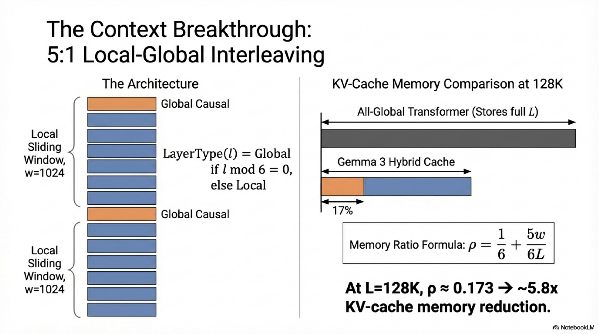

*Figure. Alternating local and global attention schedule illustrating the 5:1 pattern, sliding-window reuse, and the resulting reduction in KV-cache growth relative to global-only attention.*

#### 2.3.1. Definition

Gemma 3 alternates between **local sliding-window self-attention** and **global full self-attention** layers in a fixed 5:1 ratio (5 local layers per 1 global layer), starting with a local layer.

**Layer assignment function:**

$$
\text{type}(\ell) = \begin{cases} \text{global} & \text{if } (\ell + 1) \mod 6 = 0 \\ \text{local} & \text{otherwise} \end{cases}
$$

for layer index $\ell \in \{0, 1, \ldots, N_{\text{layers}} - 1\}$.

#### 2.3.2. Local Sliding-Window Attention

For a local layer at position $t$, the attention mask restricts to a window of size $w = 1024$:

$$
\mathcal{A}_{\text{local}}(t) = \{t' : \max(0, t - w + 1) \leq t' \leq t\}
$$

$$
\text{Attn}_{\text{local}}(\mathbf{Q}_t, \mathbf{K}, \mathbf{V}) = \text{softmax}\left(\frac{\mathbf{Q}_t \mathbf{K}_{\mathcal{A}_{\text{local}}(t)}^\top}{\sqrt{d_k}}\right) \mathbf{V}_{\mathcal{A}_{\text{local}}(t)}
$$

**Complexity per local layer:**

$$
\mathcal{O}(T \cdot w \cdot d_k) = \mathcal{O}(T \cdot 1024 \cdot d_k)
$$

which is **linear in sequence length** $T$ for fixed $w$.

#### 2.3.3. Global Full Attention

For a global layer, the attention mask is causal over the entire context:

$$
\mathcal{A}_{\text{global}}(t) = \{t' : 0 \leq t' \leq t\}
$$

$$
\text{Attn}_{\text{global}}(\mathbf{Q}_t, \mathbf{K}, \mathbf{V}) = \text{softmax}\left(\frac{\mathbf{Q}_t \mathbf{K}_{\mathcal{A}_{\text{global}}(t)}^\top}{\sqrt{d_k}}\right) \mathbf{V}_{\mathcal{A}_{\text{global}}(t)}
$$

**Complexity per global layer:**

$$
\mathcal{O}(T^2 \cdot d_k)
$$

#### 2.3.4. Total KV-Cache Memory Analysis

For a model with $N$ total layers, $N_{\text{global}} = N/6$ global layers and $N_{\text{local}} = 5N/6$ local layers:

$$
M_{\text{KV}} = 2 \cdot n_{kv} \cdot d_k \cdot b \cdot \left(N_{\text{global}} \cdot T + N_{\text{local}} \cdot w\right)
$$

$$
M_{\text{KV}} = 2 \cdot n_{kv} \cdot d_k \cdot b \cdot \left(\frac{N}{6} \cdot T + \frac{5N}{6} \cdot w\right)
$$

**Comparison with global-only baseline** ($N$ global layers):

$$
M_{\text{KV}}^{\text{global-only}} = 2 \cdot n_{kv} \cdot d_k \cdot b \cdot N \cdot T
$$

**Compression ratio:**

$$
\rho = \frac{M_{\text{KV}}}{M_{\text{KV}}^{\text{global-only}}} = \frac{\frac{T}{6} + \frac{5w}{6}}{T} = \frac{1}{6} + \frac{5w}{6T}
$$

For $T = 32768$ and $w = 1024$:

$$
\rho = \frac{1}{6} + \frac{5 \times 1024}{6 \times 32768} = 0.1667 + 0.0260 = 0.193
$$

This yields approximately **5.2× KV-cache reduction** compared to global-only attention. At $T = 131072$:

$$
\rho = \frac{1}{6} + \frac{5 \times 1024}{6 \times 131072} = 0.1667 + 0.0065 = 0.173
$$

yielding approximately **5.8× reduction**.

**Empirical validation (from Figure 5):**
- Global-only: ~60% of total inference memory is KV-cache at $T = 32768$
- 5:1 with $w = 1024$: KV-cache reduced to <15% of total inference memory

#### 2.3.5. Quality Impact

From Figure 3, ablation on 2B and 9B models shows:
- Perplexity delta between 1:1 and 7:1 local:global ratio is within $\pm 0.1$ on validation sets
- The 5:1 ratio is chosen as the operating point that maximizes KV-cache savings while maintaining negligible perplexity degradation

From Figure 4, sliding window ablation shows:
- Reducing window from 4096 to 1024 causes $< 0.01$ perplexity change
- This validates that local context of 1024 tokens is sufficient for local layers

#### 2.3.6. Information-Theoretic Justification

The 5:1 design exploits the observation that most autoregressive prediction relies on **local context** (nearby tokens), while **global context** (long-range dependencies) is needed less frequently. Formally, the mutual information between token $x_t$ and context can be decomposed:

$$
I(x_t; x_{<t}) = I(x_t; x_{t-w:t-1}) + I(x_t; x_{<t-w} \mid x_{t-w:t-1})
$$

The first term (local MI) dominates for most tokens, and the second term (residual global MI) is captured by the fewer global layers. The 5:1 ratio empirically confirms that $\frac{1}{6}$ of layers dedicated to global attention suffices to capture the residual long-range dependencies.

---

### 2.4. Positional Encoding: RoPE

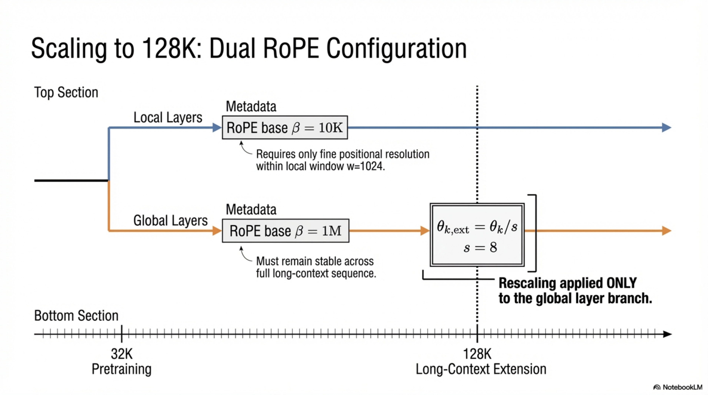

*Figure. Dual-frequency RoPE scheme separating local and global layers, with explicit emphasis on long-context rescaling and the boundary between 32K training and 128K deployment behavior.*

#### 2.4.1. Standard RoPE

Rotary Position Embedding applies rotation matrices to query and key vectors:

$$
\text{RoPE}(x_m, m) = \mathbf{R}_{\Theta, m} \cdot x_m
$$

where $\mathbf{R}_{\Theta, m}$ is a block-diagonal rotation matrix with entries:

$$
\mathbf{R}_{\Theta, m}^{(i)} = \begin{pmatrix} \cos(m \theta_i) & -\sin(m \theta_i) \\ \sin(m \theta_i) & \cos(m \theta_i) \end{pmatrix}
$$

and the frequency for dimension pair $i$ is:

$$
\theta_i = \beta^{-2i/d}
$$

where $\beta$ is the base frequency.

#### 2.4.2. Gemma 3 RoPE Configuration

**Global layers:**

$$
\beta_{\text{global}} = 1{,}000{,}000 \quad (\text{1M base frequency})
$$

**Local layers:**

$$
\beta_{\text{local}} = 10{,}000 \quad (\text{10k base frequency})
$$

**Rationale:**
- Global layers need to represent positions up to $T = 131072$; high base frequency prevents wavelength aliasing at extreme positions
- Local layers only attend within window $w = 1024$; standard base frequency provides fine-grained local position discrimination
- This dual-frequency design is more efficient than uniformly high base frequency, as local attention does not benefit from extreme-range position representation

#### 2.4.3. Long-Context Extension via RoPE Rescaling

Models are pre-trained with $T = 32768$, then extended to $T = 131072$ using positional interpolation (Chen et al., 2023).

The rescaled position for global layers:

$$
m' = \frac{m}{s}, \quad s = 8
$$

$$
\text{RoPE}_{\text{scaled}}(x_m, m) = \mathbf{R}_{\Theta, m/s} \cdot x_m
$$

**Effect:** Frequencies are scaled down by factor $s$, effectively stretching the position space to cover $s \times 32768 = 262144$ positions while maintaining the learned relative position patterns within the original range.

**From Figure 7:** After RoPE rescaling, perplexity remains stable up to 128K context length but degrades rapidly beyond, confirming the scaling factor of 8 provides a sharp generalization boundary at approximately $s \times T_{\text{train}}$.

---

### 2.5. Vision Modality Architecture

#### 2.5.1. SigLIP Vision Encoder

**Architecture:** Vision Transformer (ViT) variant, 400M parameters, trained with sigmoid-based contrastive loss (SigLIP loss).

**Input:** Image $\mathbf{I} \in \mathbb{R}^{896 \times 896 \times 3}$

**Patch embedding:** Image is divided into patches of size $p \times p$, producing $\frac{896}{p} \times \frac{896}{p}$ patch tokens. Each patch is linearly projected:

$$
\mathbf{z}_i^0 = \mathbf{W}_{\text{patch}} \cdot \text{flatten}(\text{patch}_i) + \mathbf{b}_{\text{patch}}
$$

**ViT processing:** Standard ViT with multi-head self-attention and FFN layers:

$$
\mathbf{Z}^{L_{\text{enc}}} = \text{ViT}(\mathbf{Z}^0) \in \mathbb{R}^{N_{\text{patches}} \times d_{\text{vision}}}
$$

**Average pooling to 256 tokens:**

$$
\mathbf{V} = \text{AvgPool}_{4 \times 4}(\mathbf{Z}^{L_{\text{enc}}}) \in \mathbb{R}^{256 \times d_{\text{vision}}}
$$

The $4 \times 4$ pooling reduces spatial resolution by 16×, compressing the patch grid from $\frac{896}{p} \times \frac{896}{p}$ to a fixed 256-token representation regardless of $p$.

**Projection to language model dimension:**

$$
\mathbf{V}_{\text{proj}} = \mathbf{V} \mathbf{W}_{\text{proj}} + \mathbf{b}_{\text{proj}} \in \mathbb{R}^{256 \times d_{\text{model}}}
$$

where $\mathbf{W}_{\text{proj}} \in \mathbb{R}^{d_{\text{vision}} \times d_{\text{model}}}$ is a learnable linear projection.

**Frozen encoder:** The SigLIP encoder is **frozen** during language model training. This yields:
- No gradient computation through the 400M encoder parameters
- Pre-computation of vision embeddings is possible (used in practice)
- Shared encoder across 4B, 12B, and 27B models
- The 1B model has **no** vision encoder

**Training invariant:** Since embeddings are pre-computed, the vision encoder adds zero FLOPs to language model training.

#### 2.5.2. Pan & Scan (P&S)

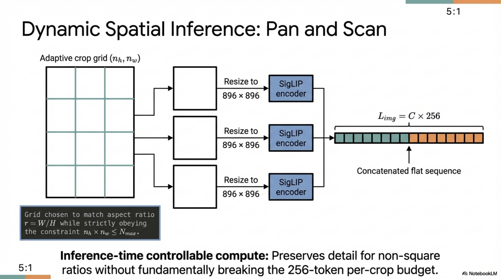

*Figure. Pan and Scan inference path showing the coexistence of whole-image context and crop-based high-resolution views for document and text-heavy image understanding.*

**Problem:** Fixed $896 \times 896$ resolution fails for:
- Non-square aspect ratios (distortion artifacts)
- High-resolution images with small text or objects (information loss due to downsampling)

**Algorithm:** Adaptive windowing at **inference time only**:

```
ALGORITHM: PanAndScan
INPUT: Image I of size (H, W), max_crops N_max, encoder resolution R = 896
OUTPUT: Set of vision embedding sequences {V_1, V_2, ..., V_k, V_full}

1. COMPUTE V_full = Encode(Resize(I, R × R))    // full image context
2. DETERMINE optimal grid (n_h, n_w) such that:
     n_h × n_w ≤ N_max
     aspect ratio H/W ≈ n_h/n_w
     crops are non-overlapping and cover entire image
3. IF windowing is necessary (image is non-square OR high-resolution):
     FOR each crop c_ij, i ∈ {1,...,n_h}, j ∈ {1,...,n_w}:
          EXTRACT crop region from I
          RESIZE crop to R × R
          COMPUTE V_ij = Encode(Resize(crop_ij, R × R))
     OUTPUT: {V_11, ..., V_{n_h,n_w}, V_full}
4. ELSE:
     OUTPUT: {V_full}
```

**Impact (from Table 8):**

| Task | 4B w/o P&S | 4B w/ P&S | Δ | 27B w/o P&S | 27B w/ P&S | Δ |
|------|-----------|----------|---|------------|-----------|---|
| DocVQA | 72.8 | 81.0 | +8.2 | 85.6 | 90.4 | +4.8 |
| InfoVQA | 44.1 | 57.0 | +12.9 | 59.4 | 76.4 | +17.0 |
| TextVQA | 58.9 | 60.8 | +1.9 | 68.6 | 70.2 | +1.6 |

**Key observation:** P&S is an **inference-time only** optimization; it can be disabled for faster inference when image reading tasks are not critical.

#### 2.5.3. Impact of Vision Encoder Resolution

From Table 7 (2B model, short schedule ablation):

| Resolution | DocVQA | InfoVQA | TextVQA |
|-----------|--------|---------|---------|
| 256 | 31.9 | 23.1 | 44.1 |
| 448 | 45.4 | 31.6 | 53.5 |
| 896 | 59.8 | 33.7 | 58.0 |

Higher resolution provides more fine-grained spatial information per patch, critically important for text recognition in images. The 896 resolution is selected as the operating point.

---

### 2.6. Multimodal Sequence Construction

The language model treats images as **soft tokens** interleaved with text tokens. For a sequence containing text and $k$ images:

$$
\mathbf{s} = [\text{BOS}, \underbrace{v_1^{(1)}, \ldots, v_{256}^{(1)}}_{\text{image 1}}, \underbrace{t_1, \ldots, t_m}_{\text{text}}, \underbrace{v_1^{(2)}, \ldots, v_{256}^{(2)}}_{\text{image 2}}, \ldots]
$$

Each image contributes exactly 256 tokens to the sequence length budget. With P&S producing $k$ crops + 1 full image, total vision tokens per image is $(k+1) \times 256$.

---

### 2.7. Complete Forward Pass

```
ALGORITHM: Gemma3ForwardPass
INPUT: Token sequence x = (x_1, ..., x_T), pre-computed vision embeddings {V_j}
OUTPUT: Logit distribution over vocabulary at each position

1. EMBEDDING:
     FOR each position t:
          IF x_t is text token:
               h_t^0 = Embed_text(x_t) ∈ R^{d_model}
          ELSE IF x_t is vision token:
               h_t^0 = W_proj · V_j[idx] + b_proj ∈ R^{d_model}

2. FOR layer ℓ = 0 to N_layers - 1:
     a. PRE-NORM: ĥ = RMSNorm_pre(h^ℓ)
     b. COMPUTE Q, K, V projections with GQA grouping
     c. APPLY QK-Norm: Q̂ = RMSNorm(Q), K̂ = RMSNorm(K)
     d. APPLY RoPE:
          IF type(ℓ) == global:
               Q̂ = RoPE(Q̂, positions, β = 1M)
               K̂ = RoPE(K̂, positions, β = 1M)
          ELSE:
               Q̂ = RoPE(Q̂, positions, β = 10k)
               K̂ = RoPE(K̂, positions, β = 10k)
     e. COMPUTE attention:
          IF type(ℓ) == global:
               A = softmax(Q̂ K̂ᵀ / √d_k) · V    // full causal mask
          ELSE:
               A = softmax(Q̂ K̂ᵀ / √d_k) · V    // sliding window mask, w=1024
     f. RESIDUAL + ATTENTION: h' = h^ℓ + A
     g. POST-NORM: h' = RMSNorm_post(h')
     h. PRE-NORM for FFN: ĥ' = RMSNorm_pre(h')
     i. FFN: f = FFN(ĥ')
     j. RESIDUAL + FFN: h^{ℓ+1} = h' + f
     k. POST-NORM: h^{ℓ+1} = RMSNorm_post(h^{ℓ+1})

3. FINAL NORM: h_final = RMSNorm(h^{N_layers})
4. LOGITS: logits_t = h_final_t · W_embed^T ∈ R^{|V|}    // weight tying
5. OUTPUT: P(x_t | x_{<t}) = softmax(logits_t)
```

---

## 3. Compression Pipeline: Distillation

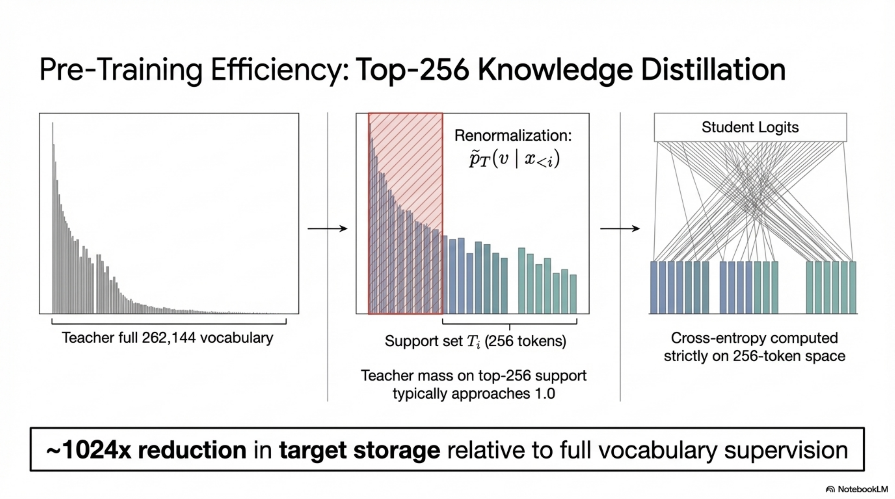

*Figure. Distillation pipeline centered on sparse top-256 teacher logits, showing how probability mass is retained while dramatically lowering distillation bandwidth and storage cost.*

### 3.1. Pre-Training Distillation

#### 3.1.1. Formal Definition

Knowledge distillation transfers knowledge from a teacher model $\mathcal{T}$ (larger, more capable) to a student model $\mathcal{S}$ (smaller) by training the student to match the teacher's output distribution.

#### 3.1.2. Top-K Logit Sampling Strategy

Gemma 3 employs a **sparse distillation** scheme:

**Step 1:** For each token position $t$, sample $K = 256$ logits from the teacher, weighted by teacher probabilities.

Let $P_{\mathcal{T}}(v \mid x_{<t})$ be the teacher's probability for vocabulary item $v$. Sample subset $\mathcal{S}_t \subset \mathcal{V}$ with $|\mathcal{S}_t| = 256$ according to the teacher's distribution.

**Step 2:** Construct the target distribution $\hat{P}_{\mathcal{T}}$ over the sampled subset:

$$
\hat{P}_{\mathcal{T}}(v \mid x_{<t}) = \begin{cases} \frac{P_{\mathcal{T}}(v \mid x_{<t})}{\sum_{v' \in \mathcal{S}_t} P_{\mathcal{T}}(v' \mid x_{<t})} & \text{if } v \in \mathcal{S}_t \\ 0 & \text{otherwise} \end{cases}
$$

**Step 3:** Train the student with cross-entropy loss against the renormalized teacher distribution:

$$
\mathcal{L}_{\text{distill}} = -\sum_{t=1}^{T} \sum_{v \in \mathcal{S}_t} \hat{P}_{\mathcal{T}}(v \mid x_{<t}) \log P_{\mathcal{S}}(v \mid x_{<t})
$$

#### 3.1.3. Why 256 Logits?

- Full vocabulary CE requires $|\mathcal{V}| = 262144$ logit computations per position from teacher — memory and compute intensive
- Top-256 captures the vast majority of the teacher's probability mass (the distribution is heavy-tailed)
- Weighted sampling ensures high-probability tokens are preferentially included
- Renormalization corrects for the truncation bias

**Information preservation guarantee:** If the teacher's distribution has effective support concentrated within the top-$K$ tokens (which is typical for well-trained LLMs), then:

$$
D_{\text{KL}}(\hat{P}_{\mathcal{T}} \| P_{\mathcal{T}}) \leq -\log\left(\sum_{v \in \mathcal{S}_t} P_{\mathcal{T}}(v \mid x_{<t})\right)
$$

For $K = 256$ and typical LLM distributions, this KL divergence is negligible.

#### 3.1.4. Small vs. Large Teacher Analysis

From Figure 8, the relative perplexity difference when using a small vs. large teacher follows:

- **Short training horizons** ($<$ ~50B tokens): Smaller teacher yields lower perplexity. The regularization effect of a less confident teacher acts as implicit smoothing, preventing overfitting on limited data.
- **Long training horizons** ($>$ ~100B tokens): Larger teacher yields lower perplexity. With sufficient data, the student has capacity to absorb the richer distributional information from the larger teacher without overfitting.

**Formal interpretation:** Let $\epsilon_{\text{approx}}(\mathcal{T})$ be the approximation error (teacher quality) and $\epsilon_{\text{est}}(n)$ be the estimation error (finite sample). The student's excess risk is:

$$
\mathcal{R}_{\text{excess}} = \underbrace{\epsilon_{\text{approx}}(\mathcal{T})}_{\text{lower for larger teacher}} + \underbrace{\epsilon_{\text{est}}(n, \mathcal{T})}_{\text{higher variance from complex teacher}}
$$

At small $n$, $\epsilon_{\text{est}}$ dominates, favoring simple teachers. At large $n$, $\epsilon_{\text{approx}}$ dominates, favoring large teachers. Gemma 3's training budgets (2T–14T tokens) fall in the regime where large teachers are preferable.

---

### 3.2. Post-Training Distillation

In instruction tuning, an improved version of knowledge distillation (Agarwal et al., 2024; Anil et al., 2018; Hinton et al., 2015) is applied from a **large IT teacher model**. The student learns to match the IT teacher's response distribution on curated instruction-following data.

---

## 4. Quantization Pipeline

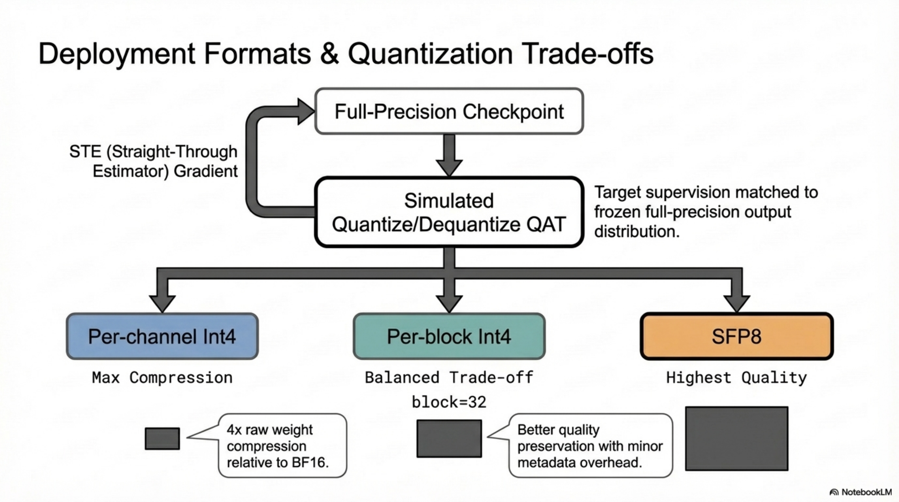

*Figure. Quantization and deployment overview comparing bfloat16, Int4, Int4-block32, and SFP8 checkpoints, with emphasis on memory-performance trade-offs and serving targets.*

### 4.1. Quantization Aware Training (QAT)

#### 4.1.1. Definition

QAT simulates quantization effects during a short fine-tuning phase, allowing the model to adapt its weights to the quantization grid, minimizing the accuracy loss compared to post-training quantization (PTQ).

#### 4.1.2. Procedure

1. Start from the full-precision (bfloat16) checkpoint
2. Fine-tune for **5,000 steps** with simulated quantization in the forward pass
3. Use **teacher probabilities from the non-quantized checkpoint** as targets (distillation-based QAT)
4. Match the data distribution to the combination of pre-training and post-training distributions

**Loss function:**

$$
\mathcal{L}_{\text{QAT}} = -\sum_{t} \sum_{v} P_{\text{bf16}}(v \mid x_{<t}) \log P_{\text{quant}}(v \mid x_{<t})
$$

where $P_{\text{bf16}}$ is from the non-quantized model (teacher) and $P_{\text{quant}}$ is from the quantized model (student).

#### 4.1.3. Quantization Formats

**Per-channel Int4:**

$$
w_{\text{quant}} = \text{clamp}\left(\text{round}\left(\frac{w}{s}\right), -8, 7\right), \quad s = \frac{\max(|w_c|)}{7}
$$

where $s$ is computed per output channel $c$.

**Per-block Int4 (block size 32):**

$$
w_{\text{quant}}^{(b)} = \text{clamp}\left(\text{round}\left(\frac{w^{(b)}}{s_b}\right), -8, 7\right), \quad s_b = \frac{\max(|w_{\text{block}_b}|)}{7}
$$

where each block $b$ of 32 contiguous weights shares a scale factor $s_b$. This provides finer granularity than per-channel, better preserving outlier weights.

**Switched FP8 (SFP8):**

Floating-point 8-bit representation with dynamic exponent bias:

$$
w_{\text{sfp8}} = (-1)^{s} \cdot 2^{e - \text{bias}} \cdot (1 + m \cdot 2^{-m_{\text{bits}}})
$$

where $s$ is sign bit, $e$ is exponent, and $m$ is mantissa.

#### 4.1.4. Memory Footprint Analysis

From Table 3 (at context length $T = 32768$, KV-cache quantized to 8-bit):

| Model | bf16 (GB) | Int4 (GB) | Int4-block32 (GB) | SFP8 (GB) |
|-------|----------|----------|------------------|----------|
| 1B | 2.0 | 0.5 | 0.7 | 1.0 |
| 1B+KV | 2.9 | 1.4 | 1.6 | 1.9 |
| 4B | 8.0 | 2.6 | 2.9 | 4.4 |
| 4B+KV | 12.7 | 7.3 | 7.6 | 9.1 |
| 12B | 24.0 | 6.6 | 7.1 | 12.4 |
| 12B+KV | 38.9 | 21.5 | 22.0 | 27.3 |
| 27B | 54.0 | 14.1 | 15.3 | 27.4 |
| 27B+KV | 72.7 | 32.8 | 34.0 | 46.1 |

**Weight compression ratios:**

$$
\text{Int4 ratio} = \frac{4}{16} = 0.25\times \quad \text{(theoretical)}
$$

$$
\text{SFP8 ratio} = \frac{8}{16} = 0.50\times \quad \text{(theoretical)}
$$

Actual ratios are slightly higher due to scale factor storage overhead.

**Key observation:** At 32K context with 27B model, KV-cache alone adds 18.7 GB in bfloat16. The 5:1 local-global design is critical: without it, KV-cache would scale linearly with full context, making the model undeployable on consumer GPUs.

---

## 5. Optimization Strategy

### 5.1. Pre-Training Optimization

#### 5.1.1. Distributed Training Infrastructure

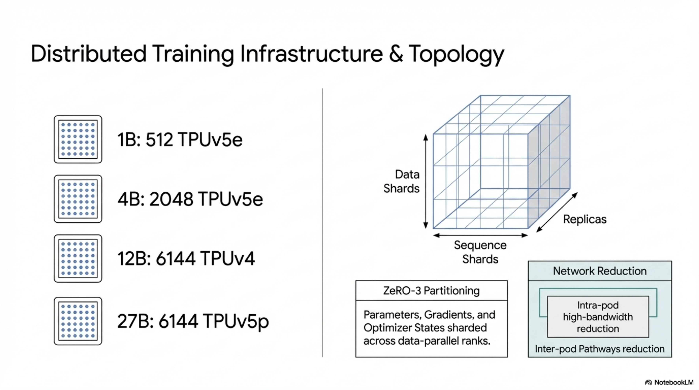

*Figure. Distributed training topology across TPU pods, replicas, and sharded sequence partitions, clarifying how data, model state, and sequence dimensions are coordinated at scale.*

From Table 2:

| Model | Accelerator | #Chips | Data Shards | Sequence Shards | Replicas |
|-------|------------|--------|------------|----------------|----------|
| 1B | TPUv5e | 512 | 16 | 16 | 2 |
| 4B | TPUv5e | 2048 | 16 | 16 | 8 |
| 12B | TPUv4 | 6144 | 16 | 16 | 24 |
| 27B | TPUv5p | 6144 | 24 | 8 | 32 |

**Parallelism Strategy:**

- **Data parallelism:** Across replicas; each replica processes different data batches
- **Sequence parallelism:** Sequence dimension sharded across chips within a replica
- **ZeRO-3 (Ren et al., 2021):** Optimizer state, gradients, and parameters are sharded across data-parallel ranks

$$
\text{Memory per device} = \frac{|\theta| + |\nabla\theta| + |O(\theta)|}{\text{num\_data\_shards} \times \text{num\_replicas}} + M_{\text{activations}}
$$

where $|O(\theta)|$ includes optimizer states (e.g., Adam first and second moments).

**Multi-pod training:** Data replica reduction over data center network using the **Pathways** approach (Barham et al., 2022). The GSPMD partitioner (Xu et al., 2021) handles tensor sharding across pods, and the MegaScale XLA compiler (XLA, 2019) optimizes the computation graph.

**Programming paradigm:** Single controller (JAX + Pathways), eliminating the need for explicit SPMD communication primitives in user code.

#### 5.1.2. Vision Embedding Pre-computation

Since the SigLIP encoder is frozen, vision embeddings are computed once and stored:

$$
\text{Cost}_{\text{vision}} = 0 \text{ FLOPs during LM training}
$$

This is a significant optimization: the 400M encoder would otherwise add substantial forward-pass compute for each image-text pair.

---

### 5.2. Post-Training Optimization

#### 5.2.1. Supervised Fine-Tuning (SFT) with Distillation

The first phase applies distillation from a large IT teacher:

$$
\mathcal{L}_{\text{SFT}} = -\mathbb{E}_{(x, y) \sim \mathcal{D}_{\text{IT}}} \left[\sum_{t} P_{\mathcal{T}}(y_t \mid x, y_{<t}) \log P_{\theta}(y_t \mid x, y_{<t})\right]
$$

#### 5.2.2. Reinforcement Learning Phase

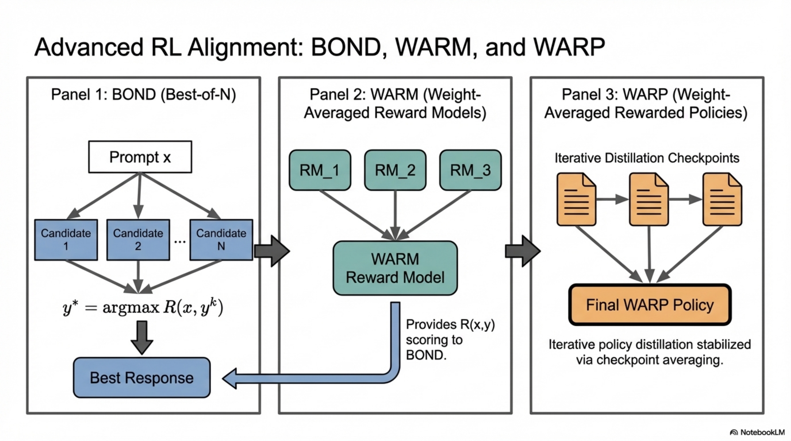

*Figure. Reinforcement-learning post-training stack connecting response sampling, reward modeling, best-of-N selection, policy optimization, and checkpoint averaging in the BOND, WARM, and WARP recipe.*

After SFT, a RL fine-tuning phase is applied using improved versions of:

**BOND (Best-of-N Distillation) (Sessa et al., 2024):**

Generate $N$ responses, select the best according to reward, distill:

$$
\mathcal{L}_{\text{BOND}} = -\mathbb{E}_{x \sim \mathcal{D}} \left[\log P_\theta\left(y^* \mid x\right)\right], \quad y^* = \arg\max_{y \in \{y_1, \ldots, y_N\}} R(x, y)
$$

**WARM (Weight Averaged Reward Models) (Ramé et al., 2024b):**

Multiple reward models are trained and their weights are averaged to produce a more robust reward signal:

$$
R_{\text{WARM}}(x, y) = R_{\bar{\phi}}(x, y), \quad \bar{\phi} = \frac{1}{M} \sum_{m=1}^{M} \phi_m
$$

This reduces reward model overoptimization by smoothing the reward landscape.

**WARP (Weight Averaged RL Policies) (Ramé et al., 2024a):**

Multiple policy checkpoints from RL training are weight-averaged:

$$
\theta_{\text{WARP}} = \frac{1}{K} \sum_{k=1}^{K} \theta_k
$$

This exploits the observation that weight averaging in the policy space produces a better policy than any individual checkpoint, reducing variance and improving robustness.

#### 5.2.3. Reward Functions

Multiple reward signals are combined:

1. **Learned reward models** $R_{\text{human}}(x, y)$: Trained on human preference data, weight-averaged via WARM
2. **Code execution feedback** $R_{\text{code}}(x, y)$: Binary signal from executing generated code (Gehring et al., 2024):

$$
R_{\text{code}}(x, y) = \begin{cases} 1 & \text{if } \text{exec}(y) \text{ passes all test cases} \\ 0 & \text{otherwise} \end{cases}
$$

3. **Ground-truth math rewards** $R_{\text{math}}(x, y)$: Verifiable correctness via answer matching (inspired by DeepSeek-AI, 2025; Lambert et al., 2024):

$$
R_{\text{math}}(x, y) = \mathbb{1}[\text{extract\_answer}(y) = a^*]
$$

where $a^*$ is the ground-truth answer.

**Combined reward:**

$$
R(x, y) = \sum_{d \in \{\text{human, code, math}\}} \lambda_d \cdot R_d(x, y)
$$

with domain-specific weighting $\lambda_d$.

#### 5.2.4. Safety-Aware Optimization

The RL objective includes minimization of harmfulness:

$$
\max_\theta \mathbb{E}_{x, y \sim \pi_\theta} \left[R_{\text{helpful}}(x, y) - \alpha \cdot R_{\text{harm}}(x, y) - \beta \cdot D_{\text{KL}}(\pi_\theta \| \pi_{\text{ref}})\right]
$$

where $R_{\text{harm}}$ penalizes unsafe outputs and $\beta$ controls KL divergence from the reference policy to prevent reward hacking.

---

### 5.3. Post-Training Data Filtering

```
ALGORITHM: PostTrainingDataFiltering
INPUT: Raw IT dataset D_raw
OUTPUT: Filtered IT dataset D_filtered

1. FOR each example (x, y) in D_raw:
     a. DISCARD if y contains personal information (PII detection)
     b. DISCARD if y contains unsafe/toxic content (safety classifier)
     c. DISCARD if x contains mistaken self-identification prompts
     d. DISCARD if (x, y) is a duplicate (exact or near-duplicate)

2. AUGMENT with:
     a. Examples encouraging in-context attribution
     b. Examples demonstrating appropriate hedging
     c. Examples with refusal on unanswerable or harmful queries

3. VALIDATE: Inclusion of safety-oriented data does not degrade
   performance on factuality, math, coding, or chat benchmarks

4. OUTPUT: D_filtered
```

---

## 6. Training Stages

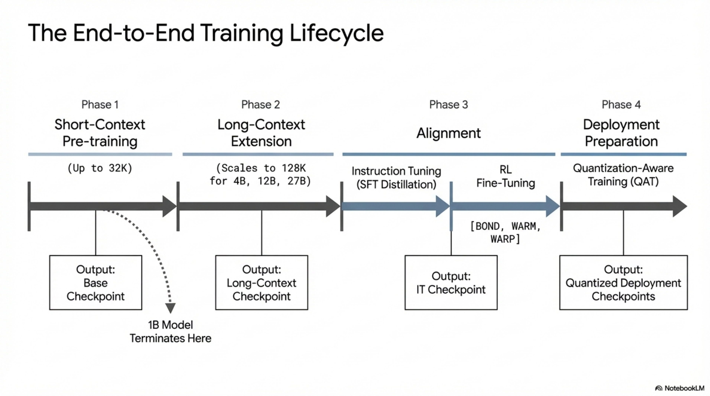

*Figure. Multi-stage training lifecycle covering pre-training, long-context extension, instruction tuning, reinforcement learning, and quantization-aware adaptation as a single continuous pipeline.*

### 6.1. Stage 1: Pre-Training with Distillation

**Objective:** Learn general text and vision understanding from large-scale data via distillation from teacher model.

**Configuration:**
- Context length: $T = 32768$
- Token budgets: 2T (1B), 4T (4B), 12T (12B), 14T (14B → 27B)
- Loss: Sparse cross-entropy distillation with $K = 256$ sampled logits
- Vision: Pre-computed SigLIP embeddings, 256 tokens/image, encoder frozen
- RoPE: $\beta_{\text{global}} = 10^6$, $\beta_{\text{local}} = 10^4$
- Attention: 5:1 local:global, sliding window $w = 1024$

**Convergence monitoring (from Figure 2):**
Pre-training ability probes track: science, code, factuality, multilinguality, reasoning, vision. Gemma 3 shows improvement over Gemma 2 in most categories, with particular gains in multilinguality.

### 6.2. Stage 2: Long-Context Extension

**Objective:** Extend context from 32K to 128K tokens without retraining from scratch.

**Method:**
1. Apply RoPE rescaling with factor $s = 8$ to global attention layers
2. Continue training on sequences up to $T = 131072$
3. Only global layers' position frequencies are modified; local layers retain $\beta_{\text{local}} = 10^4$

**Applied to:** 4B, 12B, 27B models (1B remains at 32K)

**Validation (from Figure 7):**
- Perplexity stable up to 128K
- Rapid degradation beyond 128K

### 6.3. Stage 3: Instruction Tuning (SFT)

**Objective:** Convert pre-trained model to instruction-following model via distillation from large IT teacher.

**Data:** Curated instruction-following data with formatting per Table 4:
```
[BOS]<start_of_turn>user\n{query}<end_of_turn>\n<start_of_turn>model\n
```

**Loss:** Cross-entropy against teacher distribution on response tokens only (prompt tokens masked).

### 6.4. Stage 4: Reinforcement Learning Fine-Tuning

**Objective:** Optimize for helpfulness, math, coding, reasoning, instruction-following, multilingual, and safety objectives.

**Methods:** BOND + WARM + WARP (see Section 5.2.2)

**Reward signals:** Human preference reward models (WARM-averaged), code execution feedback, ground-truth math verification.

### 6.5. Stage 5: Quantization Aware Training

**Objective:** Produce quantized checkpoints (Int4, Int4-block32, SFP8) with minimal quality degradation.

**Method:** 5,000 steps of QAT with non-quantized checkpoint as distillation teacher.

---

## 7. Inference Path

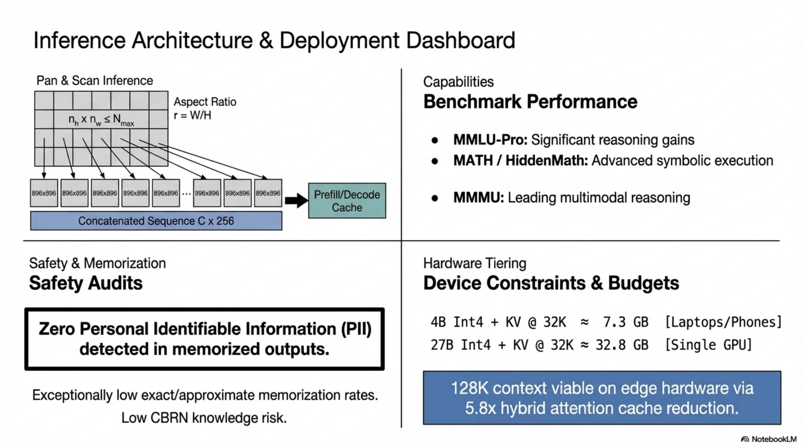

*Figure. Inference and deployment dashboard connecting prompt ingestion, KV-cache management, multimodal token assembly, quantized checkpoint selection, and deployment-scale latency constraints.*

### 7.1. KV-Cache Management

#### 7.1.1. Memory Budget

For a model with $N$ layers, GQA with $n_{kv}$ KV heads, head dimension $d_k$, context length $T$, sliding window $w$, and data type with $b$ bytes per element:

$$
M_{\text{KV}} = 2 \cdot n_{kv} \cdot d_k \cdot b \cdot \left(\frac{N}{6} \cdot T + \frac{5N}{6} \cdot \min(T, w)\right)
$$

#### 7.1.2. Local Layer KV-Cache Eviction

Local layers only need to retain the most recent $w = 1024$ KV entries. Older entries can be evicted:

$$
\text{KV}_{\text{local}}^{(\ell)}[t] = \begin{cases} \text{retain} & \text{if } t \geq t_{\text{current}} - w + 1 \\ \text{evict} & \text{otherwise} \end{cases}
$$

This enables constant memory per local layer regardless of total context length.

#### 7.1.3. Global Layer KV-Cache

Global layers must retain all previous KV entries for causal attention:

$$
\text{KV}_{\text{global}}^{(\ell)} \in \mathbb{R}^{2 \times n_{kv} \times T \times d_k}
$$

This grows linearly with $T$, but only $N/6$ layers carry this cost.

### 7.2. Autoregressive Generation

```
ALGORITHM: Gemma3AutoregressiveGeneration
INPUT: Prompt tokens x_1, ..., x_P; max generation length G
OUTPUT: Generated tokens x_{P+1}, ..., x_{P+G}

1. PREFILL PHASE:
     FOR t = 1 to P:
          COMPUTE hidden states through all layers
          FOR each layer ℓ:
               STORE K_ℓ[t], V_ℓ[t] in KV-cache
               IF type(ℓ) == local AND t < P - w:
                    EVICT K_ℓ[t], V_ℓ[t]  // not needed for future local attention
          COMPUTE logits_P = forward(x_1, ..., x_P)

2. DECODE PHASE:
     FOR t = P+1 to P+G:
          COMPUTE hidden states for single token x_t using KV-cache
          FOR each layer ℓ:
               IF type(ℓ) == global:
                    Attend to all stored K_ℓ[1:t], V_ℓ[1:t]
               ELSE:
                    Attend to K_ℓ[max(1,t-w+1):t], V_ℓ[max(1,t-w+1):t]
                    EVICT K_ℓ[t-w] if exists
               STORE K_ℓ[t], V_ℓ[t]
          logits_t = final_projection(h_t^{N_layers})
          x_t = sample(logits_t)
          IF x_t == <end_of_turn> (IT) OR x_t == <eos> (PT):
               BREAK

3. OUTPUT: x_{P+1}, ..., x_t
```

### 7.3. Vision Inference Path

```
ALGORITHM: Gemma3VisionInference
INPUT: Image I, text prompt x_text
OUTPUT: Generated response

1. IF Pan&Scan enabled:
     crops = PanAndScan(I, N_max)
     V_all = []
     FOR each crop c in crops:
          V_c = AvgPool_4x4(SigLIP(Resize(c, 896)))
          V_proj_c = W_proj · V_c + b_proj
          APPEND V_proj_c to V_all
     V_all ∈ R^{(|crops| × 256) × d_model}
2. ELSE:
     V = AvgPool_4x4(SigLIP(Resize(I, 896)))
     V_all = W_proj · V + b_proj ∈ R^{256 × d_model}

3. CONSTRUCT multimodal sequence:
     tokens = [BOS] + V_all + Tokenize(x_text)

4. RUN autoregressive generation on tokens
```

---

## 8. Evaluation Protocol

### 8.1. Benchmark Suite

From Table 6, the evaluation covers:

| Benchmark | Domain | Metric |
|-----------|--------|--------|
| MMLU-Pro | General knowledge | Accuracy |
| LiveCodeBench | Code generation | Pass rate |
| Bird-SQL (dev) | SQL generation | Execution accuracy |
| GPQA Diamond | Graduate-level QA | Accuracy |
| SimpleQA | Simple factual QA | Accuracy |
| FACTS Grounding | Factual grounding | Score |
| Global MMLU-Lite | Multilingual knowledge | Accuracy |
| MATH | Mathematical reasoning | Accuracy |
| HiddenMath | Hidden mathematical reasoning | Accuracy |
| MMMU (val) | Multimodal understanding | Accuracy |
| DocVQA | Document visual QA | ANLS |
| InfoVQA | Infographic visual QA | ANLS |
| TextVQA | Text-in-image QA | Accuracy |

### 8.2. Key Results (27B IT)

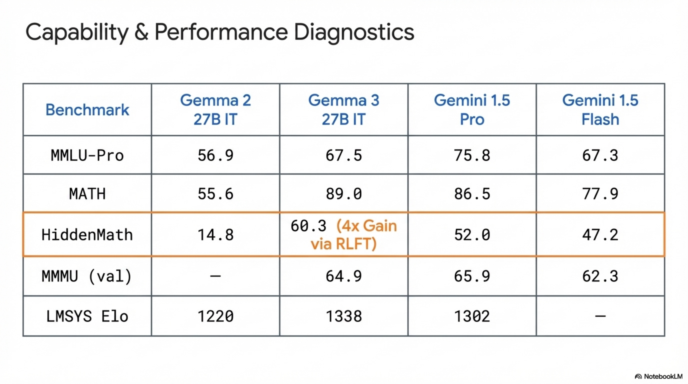

*Figure. Capability summary comparing Gemma 3 against prior Gemma and Gemini baselines across reasoning, multilinguality, coding, and multimodal performance axes.*

| Benchmark | Gemma 2 27B IT | Gemma 3 27B IT | Gemini 1.5 Pro | Gemini 2.0 Pro |
|-----------|---------------|---------------|---------------|---------------|
| MMLU-Pro | 56.9 | 67.5 | 75.8 | 79.1 |
| MATH | 55.6 | 89.0 | 86.5 | 91.8 |
| HiddenMath | 14.8 | 60.3 | 52.0 | 65.2 |
| GPQA Diamond | 34.3 | 42.4 | 59.1 | 64.7 |
| Global MMLU-Lite | 68.6 | 75.1 | 80.8 | 86.5 |
| LiveCodeBench | 20.4 | 29.7 | 34.2 | 36.0 |
| MMMU | — | 64.9 | 65.9 | 72.7 |

**Notable:** Gemma 3 27B IT achieves MATH score of 89.0, surpassing Gemini 1.5 Pro (86.5) and approaching Gemini 2.0 Flash (90.9). The HiddenMath jump from 14.8 → 60.3 demonstrates the effectiveness of the post-training recipe.

### 8.3. Human Evaluation: LMSYS Chatbot Arena

From Table 5, Gemma 3 27B IT achieves **Elo 1338** (95% CI: +8/-9):
- Ranks **9th overall**, above all open dense and MoE models
- Exceeds DeepSeek-V3 (1318, 671B MoE), LLaMA 3.1-405B (1269, dense 405B), Qwen2.5-72B (1257, dense 72B)
- Exceeds Gemma 2 27B IT (1220) by **118 Elo points**
- Competitive with Gemini 1.5 Pro (1302)

### 8.4. Memorization Evaluation

**Methodology (following Gemma Team, 2024b):**

1. Subsample training data uniformly across corpora
2. Extract prefix of length 50 tokens
3. Generate continuation of length 50 tokens
4. Compare to actual training suffix

**Definitions:**

$$
\text{Exact memorization:} \quad \mathbb{1}\left[\text{generated suffix} = \text{training suffix}\right]
$$

$$
\text{Approximate memorization:} \quad \mathbb{1}\left[\frac{\text{edit\_distance}(\text{generated}, \text{training})}{|\text{training}|} \leq 0.10\right]
$$

**Results (from Figure 9):**
- Gemma 3 models exhibit **orders of magnitude lower** memorization rates than all prior models (log scale)
- Approximate memorization rate is ~24× higher than exact memorization rate on average
- 1B memorizes less than 4B/12B/27B (minimal variation among larger models)
- **Zero personal information** detected in memorized outputs across all Gemma 3 models

---

## 9. Deployment Constraints

### 9.1. Hardware Compatibility

**Design target:** Consumer-grade hardware — phones, laptops, high-end GPUs.

**Memory requirements for deployment (Int4 quantization):**

| Model | Weights | Weights + KV (32K) |
|-------|---------|-------------------|
| 1B | 0.5 GB | 1.4 GB |
| 4B | 2.6 GB | 7.3 GB |
| 12B | 6.6 GB | 21.5 GB |
| 27B | 14.1 GB | 32.8 GB |

- **1B Int4:** Fits on mobile devices with 2GB+ available memory
- **4B Int4:** Fits on 8GB consumer GPUs (e.g., RTX 3060) with 32K context
- **12B Int4:** Requires 24GB GPU (e.g., RTX 3090/4090) for 32K context
- **27B Int4:** Requires ~40GB for 32K context; fits on A100-40GB or dual consumer GPUs

### 9.2. Context Length vs. Memory Trade-off

From Figure 6 and the KV-cache formula:

For the 2B model at 128K context:
- **Global-only architecture:** ~6000 MB KV-cache
- **5:1 with $w = 1024$:** ~1200 MB KV-cache

The 5:1 architecture is **essential** for deploying 128K context on consumer hardware.

### 9.3. Inference Latency Considerations

**P&S trade-off:**
- Each additional crop adds 256 vision tokens to the sequence
- With $N_{\text{max}}$ crops, vision tokens total $(N_{\text{max}} + 1) \times 256$
- P&S can be **disabled** for faster inference when image text reading is not required

**Local attention speedup:**
- Local layers with $w = 1024$ have $\mathcal{O}(w)$ cost per token during decode, independent of context length
- Only $N/6$ global layers incur $\mathcal{O}(T)$ attention cost during decode
- Net decode cost: $\mathcal{O}\left(\frac{N}{6} \cdot T + \frac{5N}{6} \cdot w\right)$ per token

### 9.4. Serving Topology

- **On-device (1B, 4B):** Single accelerator, Int4 quantization, no KV-cache distribution needed
- **Edge/laptop (12B):** Single high-end GPU, Int4 or SFP8, KV-cache fits within device memory for moderate context
- **Server (27B):** Single A100-80GB or H100, bfloat16 or SFP8; multi-GPU for long context with KV-cache sharding

---

## 10. Failure Modes and Limitations

### 10.1. Contamination Risk

Despite decontamination, benchmark contamination remains a risk (Mirzadeh et al., 2024). The report explicitly acknowledges: "despite the use of decontamination techniques, there is always a risk of contamination of these probes, making more definitive conclusions harder to assess."

### 10.2. Vision Limitations

- **Fixed resolution:** Without P&S, non-square or high-resolution images suffer from distortion/information loss
- **No video understanding:** The architecture processes static images only
- **1B model lacks vision entirely**

### 10.3. Memorization

While dramatically reduced, memorization is not zero:
- Approximate memorization rate exceeds exact memorization by ~24×
- The detection methodology (50-token prefix/suffix) may not capture shorter memorized fragments

### 10.4. Long-Context Degradation

From Figure 7: Models generalize to 128K but **rapidly degrade beyond**. The RoPE scaling factor $s = 8$ provides a sharp boundary at $s \times T_{\text{train}} = 262144$, but practical reliability degrades before this theoretical limit.

### 10.5. Distillation Ceiling

The student model's performance is bounded by the teacher's capability:

$$
\inf_\theta \mathcal{L}_{\text{distill}}(\theta) \geq H(P_{\mathcal{T}})
$$

where $H(P_{\mathcal{T}})$ is the entropy of the teacher's distribution. The student cannot exceed teacher quality on tasks where the teacher's distribution is well-calibrated.

### 10.6. Safety Policy Limitations

- Safety filters are designed for high recall, leading to false positives
- CBRN knowledge evaluation indicates low domain knowledge, but this assessment is based on closed-ended MCQ format and may not capture more nuanced risks
- No reports of malicious use received, but monitoring is ongoing

---

## 11. Complexity Analysis Summary

### 11.1. Attention Complexity

**Per-layer compute (FLOPs):**

$$
\text{Global layer:} \quad \mathcal{O}(T^2 \cdot d_{\text{model}})
$$

$$
\text{Local layer:} \quad \mathcal{O}(T \cdot w \cdot d_{\text{model}})
$$

**Total attention FLOPs for $N$ layers:**

$$
F_{\text{attn}} = \frac{N}{6} \cdot \mathcal{O}(T^2 \cdot d_{\text{model}}) + \frac{5N}{6} \cdot \mathcal{O}(T \cdot w \cdot d_{\text{model}})
$$

For $T \gg w$, the global layers dominate, but their reduced count (÷6) significantly lowers total compute compared to all-global architectures:

$$
\frac{F_{\text{attn}}^{\text{5:1}}}{F_{\text{attn}}^{\text{global-only}}} \approx \frac{1}{6} + \frac{5w}{6T}
$$

### 11.2. Memory Complexity

**Model parameters (approximate, excluding vision encoder):**

$$
|\theta| \approx |\theta_{\text{embed}}| + N \cdot (4 \cdot d_{\text{model}}^2 + 8 \cdot d_{\text{model}} \cdot d_{\text{ff}})
$$

where the factor 4 accounts for $Q, K, V, O$ projections and 8 accounts for up/down projections in the FFN (assuming SwiGLU-style with gate).

**KV-cache (as derived in Section 2.3.4):**

$$
M_{\text{KV}} = 2 \cdot n_{kv} \cdot d_k \cdot b \cdot \left(\frac{N}{6} \cdot T + \frac{5N}{6} \cdot w\right)
$$

### 11.3. Training Compute (Rough Estimate)

Using the Chinchilla approximation $C \approx 6 \cdot N_{\text{params}} \cdot D$ where $D$ is number of training tokens:

| Model | Params ($N$) | Tokens ($D$) | Estimated FLOPs |
|-------|-------------|-------------|----------------|
| 1B | 1B | 2T | $\sim 1.2 \times 10^{22}$ |
| 4B | 4B | 4T | $\sim 9.6 \times 10^{22}$ |
| 12B | 12B | 12T | $\sim 8.6 \times 10^{23}$ |
| 27B | 27B | 14T | $\sim 2.3 \times 10^{24}$ |

---

## 12. End-to-End Pipeline Summary

```
ALGORITHM: Gemma3EndToEndPipeline

STAGE 0: DATA PIPELINE
     Inputs: Raw text + image-text corpora
     Operations: Filter → Deduplicate → Decontaminate → Quality reweight → 
                 Multilingual rebalance → Tokenize → Pre-compute vision embeddings
     Output: Sharded training data D_train

STAGE 1: PRE-TRAINING
     Input: D_train, Teacher model T
     Architecture: Decoder-only Transformer, 5:1 local:global, GQA, QK-norm, RoPE
     Loss: Sparse distillation CE (K=256 sampled logits)
     Context: T = 32768
     Duration: 2T-14T tokens depending on model size
     Output: Pre-trained checkpoint θ_PT

STAGE 2: LONG-CONTEXT EXTENSION
     Input: θ_PT
     Method: RoPE rescaling (s=8) on global layers, continued training on T=131072
     Output: Long-context pre-trained checkpoint θ_PT_128K

STAGE 3: INSTRUCTION TUNING (SFT)
     Input: θ_PT_128K, IT teacher model, filtered IT data
     Method: Distillation-based SFT
     Output: SFT checkpoint θ_SFT

STAGE 4: REINFORCEMENT LEARNING
     Input: θ_SFT, WARM reward models, code executor, math verifier
     Method: BOND + WARM + WARP with multi-objective rewards
     Objectives: Helpfulness, math, code, reasoning, instruction-following, 
                 multilingual, safety
     Output: RL-tuned checkpoint θ_IT

STAGE 5: QUANTIZATION AWARE TRAINING
     Input: θ_IT (bfloat16)
     Method: 5000-step QAT with θ_IT as teacher
     Formats: Int4 per-channel, Int4 per-block (32), SFP8
     Output: Quantized checkpoints {θ_Int4, θ_Int4_b32, θ_SFP8}

STAGE 6: EVALUATION
     Input: θ_IT, {θ_quantized}
     Benchmarks: MMLU-Pro, MATH, HiddenMath, GPQA, LiveCodeBench, 
                 Bird-SQL, SimpleQA, FACTS, Global MMLU-Lite, MMMU, 
                 DocVQA, InfoVQA, TextVQA, Chatbot Arena
     Safety: Baseline assurance, CBRN evaluation, memorization audit
     Output: Evaluation report

STAGE 7: DEPLOYMENT
     Target hardware: Phones (1B), laptops (4B), GPUs (12B, 27B)
     Serving: Autoregressive decode with KV-cache management
     Optimizations: Local layer KV eviction, P&S toggle, quantized inference
     Output: Deployable model artifacts
```

---

## 13. Convergence Dynamics and Training Stability

### 13.1. QK-Norm Stability Guarantee

Without QK-norm, attention logit variance grows with model depth and sequence length:

$$
\text{Var}(\mathbf{q}^\top \mathbf{k}) = d_k \cdot \text{Var}(q_i) \cdot \text{Var}(k_i) + d_k \cdot (\mathbb{E}[q_i])^2 \cdot \text{Var}(k_i) + \ldots
$$

With QK-norm:

$$
\text{Var}(\hat{\mathbf{q}}^\top \hat{\mathbf{k}}) = \frac{1}{d_k} \cdot \left(1 + \mathcal{O}\left(\frac{1}{d_k}\right)\right)
$$

Since $\|\hat{\mathbf{q}}\| = \|\hat{\mathbf{k}}\| = \sqrt{d_k}$ after RMSNorm (up to learnable scale), the dot product is bounded, preventing attention entropy collapse (all mass on one token) or diffusion (uniform attention). This is superior to soft-capping's $\tanh$ which introduces gradient saturation regions.

### 13.2. Pre-Norm + Post-Norm Stability

**Pre-norm** ensures that inputs to attention and FFN sublayers are normalized, preventing activation explosion:

$$
\|\text{RMSNorm}(\mathbf{h})\| = \sqrt{d_{\text{model}}} \cdot \|\boldsymbol{\gamma}\|
$$

**Post-norm** controls the growth of the residual stream. Without post-norm, residual stream magnitude grows as $\mathcal{O}(\sqrt{N})$ with depth. Post-norm bounds this:

$$
\|\mathbf{h}^{(\ell+1)}\| = \|\text{RMSNorm}(\mathbf{h}^{(\ell)} + f(\mathbf{h}^{(\ell)}))\| = \sqrt{d_{\text{model}}} \cdot \|\boldsymbol{\gamma}_{\text{post}}\|
$$

The combination enables training very deep networks (27B model has many layers) without learning rate or initialization sensitivity.

### 13.3. Distillation Convergence

The distillation loss converges to the entropy of the (renormalized) teacher distribution:

$$
\lim_{\text{training} \to \infty} \mathcal{L}_{\text{distill}} = H(\hat{P}_{\mathcal{T}}) + D_{\text{KL}}(\hat{P}_{\mathcal{T}} \| P_{\mathcal{S}^*})
$$

where $P_{\mathcal{S}^*}$ is the optimal student within the model class. The KL term represents the capacity gap between student and teacher. For well-chosen architectures, this gap is small despite the parameter count difference, due to the teacher providing a smoother, more structured learning signal than hard labels.

---

## 14. Information Preservation Analysis

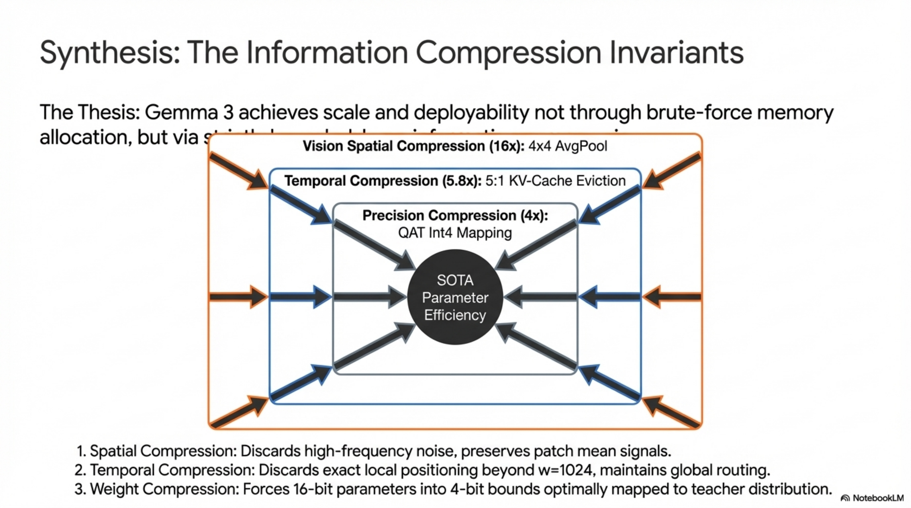

*Figure. End-to-end synthesis of Gemma 3 information-preservation invariants, relating vision compression, KV-cache truncation, distillation sparsity, and quantization to retained task performance.*

### 14.1. Vision Compression Invariant

The vision pipeline applies lossy compression:

$$
\mathbf{I} \in \mathbb{R}^{H \times W \times 3} \xrightarrow{\text{Resize}} \mathbb{R}^{896 \times 896 \times 3} \xrightarrow{\text{SigLIP}} \mathbb{R}^{N_{\text{patches}} \times d_v} \xrightarrow{\text{AvgPool}_{4\times4}} \mathbb{R}^{256 \times d_v}
$$

**Information bottleneck:** The 256-dimensional token representation with $d_v$-dimensional embeddings encodes $256 \times d_v$ floating-point values. For $d_v = 1152$ (typical SigLIP-L/14), this is $256 \times 1152 \times 2 = 589,824$ bytes in bfloat16, far less than the raw image ($896 \times 896 \times 3 \times 2 = 4,816,896$ bytes). The compression ratio is $\sim$8.2×.

**P&S recovery:** P&S partially recovers lost information by processing crops at native resolution, expanding the effective representation to $(k+1) \times 256 \times d_v$ tokens, at the cost of increased sequence length.

### 14.2. KV-Cache Compression Invariant

Local layers discard KV entries beyond the sliding window. This is **lossy** with respect to long-range dependencies within those layers, but the architecture compensates through global layers that retain full context. The design relies on the empirically validated assumption (Figure 3, Figure 4) that:

$$
\text{PPL}_{5:1, w=1024} \approx \text{PPL}_{\text{global-only}} \pm 0.1
$$

This confirms that the information lost by local-layer KV eviction is negligible for the model's predictive capability.

### 14.3. Quantization Information Preservation

QAT minimizes the information loss from weight quantization by directly optimizing for the quantized model's output distribution to match the full-precision model:

$$
D_{\text{KL}}\left(P_{\text{bf16}} \| P_{\text{quant}}\right) \leq \epsilon_{\text{QAT}}
$$

where $\epsilon_{\text{QAT}}$ is the residual KL after 5,000 QAT steps. Per-block Int4 with block size 32 achieves finer scale factor granularity than per-channel Int4, reducing quantization noise at the cost of slightly more storage for scale factors.
