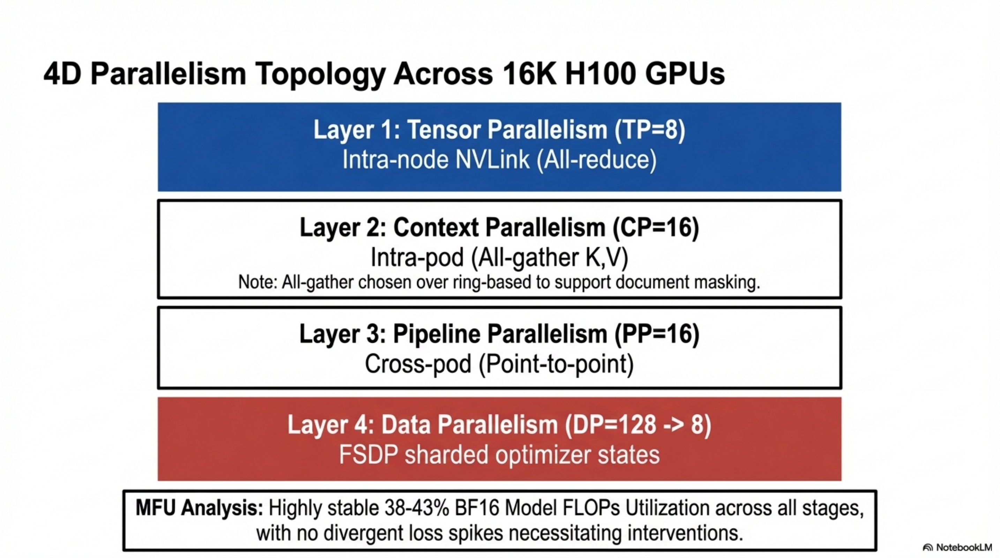
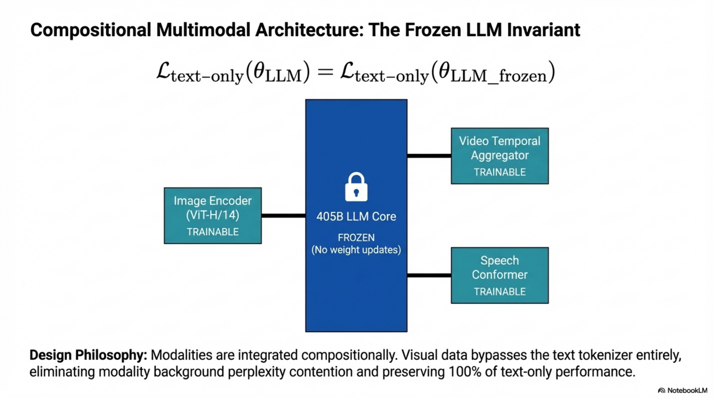

# Llama 3: End-to-End Technical Report

---

## 1. Data Pipeline

### 1.1 Formal Definition

**Objective:** Construct a pre-training corpus $\mathcal{D} = \{x_1, x_2, \ldots, x_N\}$ where $N \approx 15.6 \times 10^{12}$ tokens, drawn from heterogeneous sources $\mathcal{S} = \{\mathcal{S}_{\text{web}}, \mathcal{S}_{\text{code}}, \mathcal{S}_{\text{math}}, \mathcal{S}_{\text{multilingual}}\}$, such that the empirical token distribution $\hat{p}_{\mathcal{D}}(x)$ maximizes downstream task performance under compute budget $C = 3.8 \times 10^{25}$ FLOPs.

**Inputs:** Raw HTML documents from web crawls, code repositories, mathematical corpora, multilingual text spanning 176 languages, with temporal coverage until end of 2023.

**Outputs:** Deduplicated, quality-filtered, tokenized sequences with final data mix: ~50% general knowledge, ~25% mathematical/reasoning, ~17% code, ~8% multilingual tokens.

**Invariants:**
- No training set contamination from evaluation benchmarks in the main pre-training corpus
- PII and unsafe content removal across all sources
- Deduplication at URL, document, and line granularity

### 1.2 Stage 1: Web Data Curation

#### 1.2.1 PII and Safety Filtering

**Mechanism:** Domain-level blocklisting based on Meta safety standards. Filters remove:
- Domains ranked harmful by internal safety taxonomies
- Domains with high volumes of personally identifiable information (PII)
- Known adult content domains

**Failure Modes:**
- False negatives: harmful domains not yet catalogued bypass filtering
- False positives: over-aggressive blocking removes legitimate educational or medical content

#### 1.2.2 Text Extraction and Cleaning

**Objective:** Extract clean plaintext from raw HTML while preserving structural content (mathematics, code).

**Design Decisions:**
- Custom HTML parser optimized for **precision in boilerplate removal** and **content recall**
- Image `alt` attribute text retained (captures pre-rendered mathematical expressions)
- Markdown markers **removed entirely** — empirically shown to degrade model performance on web-dominated training distributions
- Domain-specific HTML extraction for code and math pages with customized text features

$$
\text{Quality}(\text{parser}) = \arg\max_{p \in \mathcal{P}} \left[ \alpha \cdot \text{Precision}_{\text{boilerplate}}(p) + (1 - \alpha) \cdot \text{Recall}_{\text{content}}(p) \right]
$$

where $\mathcal{P}$ is the set of candidate parsers, evaluated via human annotation.

#### 1.2.3 Deduplication Pipeline

Three-level deduplication applied sequentially:

**Level 1 — URL-Level Deduplication:**
- For each URL, retain only the most recent crawl version
- Eliminates temporal redundancy across crawl snapshots

**Level 2 — Document-Level Deduplication (Global MinHash):**

For document $d$, compute MinHash signature $\text{MH}(d) = [\min_{x \in S(d)} h_1(x), \ldots, \min_{x \in S(d)} h_k(x)]$ where $S(d)$ is the set of $n$-gram shingles of $d$ and $\{h_1, \ldots, h_k\}$ are independent hash functions.

$$
\text{Jaccard}(d_i, d_j) \approx \frac{1}{k} \sum_{l=1}^{k} \mathbb{1}[\text{MH}_l(d_i) = \text{MH}_l(d_j)]
$$

Documents with estimated Jaccard similarity above threshold $\tau$ are considered near-duplicates and removed globally across the entire dataset.

**Level 3 — Line-Level Deduplication:**

Aggressive line-level dedup modeled after ccNet. Lines appearing more than 6 times within each bucket of 30M documents are removed.

- **Removes:** leftover boilerplate (navigation menus, cookie warnings)
- **Side effect:** also removes frequent high-quality text
- **Empirical outcome:** strong net improvement despite collateral removal

**Pseudo-Algorithm: Deduplication Pipeline**

```
PROCEDURE DEDUPLICATE(D_raw):
    // Stage 1: URL-level
    url_map ← {}
    FOR doc IN D_raw:
        IF doc.url NOT IN url_map OR doc.timestamp > url_map[doc.url].timestamp:
            url_map[doc.url] ← doc
    D_url ← VALUES(url_map)
    
    // Stage 2: Document-level MinHash
    signatures ← {}
    FOR doc IN D_url:
        sig ← COMPUTE_MINHASH(doc, num_hashes=k)
        signatures[doc.id] ← sig
    clusters ← LSH_CLUSTERING(signatures, threshold=τ)
    D_doc ← SELECT_REPRESENTATIVE(clusters)
    
    // Stage 3: Line-level
    FOR bucket IN PARTITION(D_doc, bucket_size=30M):
        line_counts ← COUNT_LINES(bucket)
        FOR doc IN bucket:
            doc.lines ← [l FOR l IN doc.lines IF line_counts[l] ≤ 6]
    D_clean ← FILTER_EMPTY(D_doc)
    RETURN D_clean
```

#### 1.2.4 Heuristic Filtering

| Heuristic | Mechanism | Target |
|---|---|---|
| Duplicated $n$-gram coverage ratio | Compute ratio of repeated $n$-gram spans in document | Repeated logging/error messages (long, unique lines missed by line-dedup) |
| Dirty word counting | Count occurrences of terms from curated adult vocabulary | Adult websites not covered by domain blocklists |
| Token-distribution KL divergence | $D_{\text{KL}}(\hat{p}_{\text{doc}} \| \hat{p}_{\text{corpus}})$ | Documents with excessive outlier token frequencies |

$$
D_{\text{KL}}(\hat{p}_{\text{doc}} \| \hat{p}_{\text{corpus}}) = \sum_{t \in \mathcal{V}} \hat{p}_{\text{doc}}(t) \log \frac{\hat{p}_{\text{doc}}(t)}{\hat{p}_{\text{corpus}}(t)}
$$

Documents where $D_{\text{KL}}$ exceeds a threshold $\delta$ are removed.

#### 1.2.5 Model-Based Quality Filtering

**Two-tier classifier approach:**

**Tier 1 — FastText Classifier:**
- Binary classifier trained to predict whether text would be referenced by Wikipedia
- Feature space: character $n$-grams ($n \in \{3,4,5,6\}$)
- Inference: $O(1)$ per document (sublinear in vocabulary via hashing)

**Tier 2 — Roberta-Based Classifier (Llama 2-Distilled):**

Training procedure:
1. Curate a set of cleaned web documents
2. Construct quality specification prompt describing requirements
3. Use Llama 2 chat model to annotate each document as meeting/not-meeting quality requirements
4. Train DistilRoberta on Llama 2 annotations to produce quality scores $q(d) \in [0, 1]$

$$
\mathcal{L}_{\text{quality}} = -\mathbb{E}_{d \sim \mathcal{D}_{\text{annotated}}} \left[ y_d \log \sigma(f_\theta(d)) + (1 - y_d) \log(1 - \sigma(f_\theta(d))) \right]
$$

where $y_d \in \{0, 1\}$ is the Llama 2-derived label and $f_\theta$ is the DistilRoberta scoring function.

#### 1.2.6 Code and Reasoning Data Pipelines

- Domain-specific DistilRoberta classifiers trained on Llama 2-annotated web data
- **Prompt tuning** targets: web pages containing mathematical deduction, STEM reasoning, code interleaved with natural language
- Separate HTML extraction logic due to substantially different token distributions of code/math versus natural language
- Custom text features and heuristics specific to code and math filtering

#### 1.2.7 Multilingual Data Processing

- **Language identification:** fastText-based classifier categorizing documents into 176 languages
- **Deduplication:** document-level and line-level dedup applied independently per language
- **Quality filtering:** language-specific heuristics + model-based filters
- **Quality ranking:** multilingual Llama 2-based classifier for prioritizing high-quality content
- **Mix determination:** experimental balancing of multilingual token counts against English and multilingual benchmark performance

### 1.3 Stage 2: Data Mix Determination

#### 1.3.1 Knowledge Classification

A classifier categorizes web data by information type (e.g., arts/entertainment, science, technology). Over-represented categories are downsampled.

#### 1.3.2 Scaling Law Experiments for Data Mix

Iterative procedure:
1. Propose candidate data mix $\mathbf{m} = [m_{\text{general}}, m_{\text{math}}, m_{\text{code}}, m_{\text{multi}}]$ where $\sum_i m_i = 1$
2. Train small proxy models on mix $\mathbf{m}$
3. Use scaling laws to predict flagship model performance on $\mathbf{m}$
4. Repeat with updated mix candidates
5. Train larger validation model on best candidate and evaluate on key benchmarks

**Final Data Mix:**

| Category | Proportion |
|---|---|
| General knowledge | ~50% |
| Mathematical/reasoning | ~25% |
| Code | ~17% |
| Multilingual | ~8% |

### 1.4 Stage 3: Annealing Data

**Objective:** Boost performance on targeted domains (code, mathematics) by upsampling high-quality domain-specific data during the final training phase.

**Key Findings:**
- Annealing on GSM8k and MATH training sets improved Llama 3 8B validation performance by **+24.0%** (GSM8k) and **+6.4%** (MATH)
- Improvements on 405B model were **negligible**, indicating strong in-context learning without domain-specific training samples
- No benchmark training sets included in actual annealing data (enables true few-shot assessment)

**Annealing as Data Quality Assessment:**
- Anneal learning rate of 50%-trained Llama 3 8B linearly to 0 on 40B tokens
- Assign 30% weight to candidate dataset, 70% to default mix
- More efficient than full scaling law experiments for evaluating small domain-specific datasets


*Figure. Annealing and context-extension schedule, corresponding to the late-phase high-quality data emphasis and the different gains observed at 8B versus 405B scale.*

---

## 2. Compression Pipeline (Tokenization)

### 2.1 Formal Definition

**Objective:** Define a bijective mapping $\text{Enc}: \Sigma^* \rightarrow \mathcal{V}^*$ from raw text strings over character alphabet $\Sigma$ to token sequences over vocabulary $\mathcal{V}$ with $|\mathcal{V}| = 128{,}000$, maximizing compression ratio (characters per token) while preserving lossless reconstruction.

$$
\text{Enc}: \Sigma^* \rightarrow \mathcal{V}^*, \quad \text{Dec}: \mathcal{V}^* \rightarrow \Sigma^*, \quad \text{Dec}(\text{Enc}(s)) = s \quad \forall s \in \Sigma^*
$$

### 2.2 Vocabulary Construction

**Composition:**
- **100,000 tokens** from tiktoken tokenizer (BPE-based, optimized for English)
- **28,000 additional tokens** for non-English language support

**Compression Rate Improvement:**

| Metric | Llama 2 Tokenizer | Llama 3 Tokenizer |
|---|---|---|
| Characters per token (English) | 3.17 | 3.94 |
| Vocabulary size | 32,000 | 128,000 |

$$
\text{Compression Ratio} = \frac{|\text{characters in corpus}|}{|\text{tokens in encoded corpus}|}
$$

The improvement from 3.17 to 3.94 characters/token represents a **24.3% increase** in effective text throughput per token, meaning the model processes ~24% more text for identical compute expenditure.

### 2.3 Information-Theoretic Analysis

The optimal code length per token under the true distribution $p$ is:

$$
H(p) = -\sum_{t \in \mathcal{V}} p(t) \log_2 p(t) \text{ bits}
$$

The vocabulary expansion from 32K to 128K tokens introduces:
- **Embedding table cost:** $|\mathcal{V}| \times d_{\text{model}}$ parameters (128,000 × 16,384 = 2.097B parameters for 405B model)
- **Output projection cost:** identical dimensionality $d_{\text{model}} \times |\mathcal{V}|$
- **Net trade-off:** increased embedding parameters amortized by significantly fewer tokens required to represent equivalent text

### 2.4 Multilingual Compression

Adding 28K non-English tokens:
- Improved compression ratios for non-English languages
- Improved downstream multilingual performance
- **No degradation** to English tokenization quality

### 2.5 Pseudo-Algorithm: Tokenization

```
PROCEDURE TOKENIZE(text, vocab):
    // BPE-based encoding with 128K vocabulary
    tokens ← []
    WHILE text NOT EMPTY:
        // Find longest matching token in vocabulary
        match ← LONGEST_PREFIX_MATCH(text, vocab)
        tokens.APPEND(vocab.ENCODE(match))
        text ← text[LEN(match):]
    RETURN tokens  // ∈ ℤ^L where L = sequence length

PROCEDURE DETOKENIZE(tokens, vocab):
    text ← ""
    FOR t IN tokens:
        text ← text + vocab.DECODE(t)
    RETURN text

// Invariant: DETOKENIZE(TOKENIZE(s)) = s ∀ s ∈ Σ*
```

### 2.6 Failure Modes

- **Under-segmentation:** rare words or multilingual text split into excessive subword units, reducing effective context window utilization
- **Over-segmentation of code/math:** structural tokens (brackets, operators) consuming disproportionate token budget
- **Vocabulary mismatch:** tokens optimized for training distribution may compress out-of-distribution text poorly

---

## 3. Model Architecture

### 3.1 Formal Definition

**Architecture Class:** Standard dense autoregressive Transformer decoder with minor modifications.

**Design Philosophy:** Maximize training stability and scalability by minimizing architectural complexity. Dense Transformer chosen over Mixture-of-Experts (MoE) explicitly for training stability.

### 3.2 Architecture Specification

| Hyperparameter | 8B | 70B | 405B |
|---|---|---|---|
| Layers $L$ | 32 | 80 | 126 |
| Model Dimension $d_{\text{model}}$ | 4,096 | 8,192 | 16,384 |
| FFN Dimension $d_{\text{ff}}$ | 14,336 | 28,672 | 53,248 |
| Attention Heads $n_h$ | 32 | 64 | 128 |
| Key/Value Heads $n_{\text{kv}}$ | 8 | 8 | 8 |
| Head Dimension $d_h$ | 128 | 128 | 128 |
| Vocabulary $|\mathcal{V}|$ | 128,000 | 128,000 | 128,000 |
| Peak LR | $3 \times 10^{-4}$ | $1.5 \times 10^{-4}$ | $8 \times 10^{-5}$ |
| Activation | SwiGLU | SwiGLU | SwiGLU |
| Positional Encoding | RoPE ($\theta = 500{,}000$) | RoPE ($\theta = 500{,}000$) | RoPE ($\theta = 500{,}000$) |


*Figure. Flagship 405B dense architecture summary, matching this section's focus on model scale, compute budget, and dense-transformer design.*

### 3.3 Tensor Transformations (Layer-by-Layer)

#### 3.3.1 Input Embedding

$$
\mathbf{X}^{(0)} = \text{Embed}(\mathbf{t}) \in \mathbb{R}^{B \times S \times d_{\text{model}}}
$$

where $B$ is batch size, $S$ is sequence length, $\mathbf{t} \in \{0, \ldots, |\mathcal{V}|-1\}^{B \times S}$ are input token indices, and the embedding table $\mathbf{E} \in \mathbb{R}^{|\mathcal{V}| \times d_{\text{model}}}$.

#### 3.3.2 Pre-Normalization (RMSNorm)

Each Transformer block applies RMSNorm before attention and FFN:

$$
\text{RMSNorm}(\mathbf{x}) = \frac{\mathbf{x}}{\sqrt{\frac{1}{d_{\text{model}}} \sum_{i=1}^{d_{\text{model}}} x_i^2 + \epsilon}} \odot \boldsymbol{\gamma}
$$

where $\boldsymbol{\gamma} \in \mathbb{R}^{d_{\text{model}}}$ is a learnable scale parameter and $\epsilon$ is a small constant for numerical stability.

#### 3.3.3 Grouped Query Attention (GQA)

**Motivation:** Reduce KV-cache memory and improve inference speed while preserving quality close to Multi-Head Attention (MHA).

For layer $l$, given normalized input $\mathbf{H} \in \mathbb{R}^{B \times S \times d_{\text{model}}}$:

**Query projection:**
$$
\mathbf{Q} = \mathbf{H} \mathbf{W}_Q \in \mathbb{R}^{B \times S \times n_h \times d_h}
$$

**Key projection (shared across groups):**
$$
\mathbf{K} = \mathbf{H} \mathbf{W}_K \in \mathbb{R}^{B \times S \times n_{\text{kv}} \times d_h}
$$

**Value projection (shared across groups):**
$$
\mathbf{V} = \mathbf{H} \mathbf{W}_V \in \mathbb{R}^{B \times S \times n_{\text{kv}} \times d_h}
$$

where $\mathbf{W}_Q \in \mathbb{R}^{d_{\text{model}} \times (n_h \cdot d_h)}$, $\mathbf{W}_K \in \mathbb{R}^{d_{\text{model}} \times (n_{\text{kv}} \cdot d_h)}$, $\mathbf{W}_V \in \mathbb{R}^{d_{\text{model}} \times (n_{\text{kv}} \cdot d_h)}$.

**Group ratio:** $G = n_h / n_{\text{kv}} = 128 / 8 = 16$ (for 405B). Each KV head is shared by $G$ query heads.

**Attention computation (per group $g$):**

$$
\mathbf{A}_g = \text{softmax}\left(\frac{\mathbf{Q}_g \mathbf{K}_{\lceil g/G \rceil}^\top}{\sqrt{d_h}} + \mathbf{M}\right) \mathbf{V}_{\lceil g/G \rceil}
$$

where $\mathbf{M} \in \{0, -\infty\}^{S \times S}$ is the combined causal and document mask.

**Output projection:**
$$
\mathbf{O} = \text{Concat}(\mathbf{A}_1, \ldots, \mathbf{A}_{n_h}) \mathbf{W}_O \in \mathbb{R}^{B \times S \times d_{\text{model}}}
$$

where $\mathbf{W}_O \in \mathbb{R}^{(n_h \cdot d_h) \times d_{\text{model}}}$.

**KV-Cache Memory (per token, per layer):**

$$
\text{KV-cache} = 2 \times n_{\text{kv}} \times d_h \times \text{bytes}_{\text{dtype}} = 2 \times 8 \times 128 \times 2 = 4{,}096 \text{ bytes (BF16)}
$$

Compared to MHA ($n_{\text{kv}} = n_h = 128$): $2 \times 128 \times 128 \times 2 = 65{,}536$ bytes — a **16× reduction**.

#### 3.3.4 Document-Level Attention Masking

**Modification:** Attention mask $\mathbf{M}$ prevents self-attention between tokens belonging to different documents packed within the same sequence.

$$
M_{ij} = \begin{cases} 0 & \text{if } \text{doc}(i) = \text{doc}(j) \text{ and } i \geq j \\ -\infty & \text{otherwise} \end{cases}
$$

**Impact:** Limited effect during standard 8K pre-training; **critical** during long-context continued pre-training to prevent cross-document information leakage.

#### 3.3.5 SwiGLU Feed-Forward Network

$$
\text{FFN}(\mathbf{x}) = \left(\text{SiLU}(\mathbf{x} \mathbf{W}_{\text{gate}}) \odot (\mathbf{x} \mathbf{W}_{\text{up}})\right) \mathbf{W}_{\text{down}}
$$

where:
- $\mathbf{W}_{\text{gate}} \in \mathbb{R}^{d_{\text{model}} \times d_{\text{ff}}}$
- $\mathbf{W}_{\text{up}} \in \mathbb{R}^{d_{\text{model}} \times d_{\text{ff}}}$
- $\mathbf{W}_{\text{down}} \in \mathbb{R}^{d_{\text{ff}} \times d_{\text{model}}}$
- $\text{SiLU}(x) = x \cdot \sigma(x) = x / (1 + e^{-x})$

**FFN parameter count per layer (405B):**
$$
3 \times d_{\text{model}} \times d_{\text{ff}} = 3 \times 16{,}384 \times 53{,}248 = 2{,}616{,}197{,}120 \approx 2.62\text{B}
$$

#### 3.3.6 Rotary Position Embeddings (RoPE)

RoPE encodes position $m$ into the query and key vectors by applying a rotation matrix:

$$
\text{RoPE}(\mathbf{x}, m) = \mathbf{R}_{\Theta, m} \mathbf{x}
$$

where for dimension pair $(2i, 2i+1)$:

$$
\begin{pmatrix} x'_{2i} \\ x'_{2i+1} \end{pmatrix} = \begin{pmatrix} \cos(m\theta_i) & -\sin(m\theta_i) \\ \sin(m\theta_i) & \cos(m\theta_i) \end{pmatrix} \begin{pmatrix} x_{2i} \\ x_{2i+1} \end{pmatrix}
$$

with frequency:

$$
\theta_i = \theta_{\text{base}}^{-2i/d_h}, \quad \theta_{\text{base}} = 500{,}000
$$

**Key property:** The dot product $\langle \text{RoPE}(\mathbf{q}, m), \text{RoPE}(\mathbf{k}, n) \rangle$ depends only on $\mathbf{q}$, $\mathbf{k}$, and relative position $m - n$.

**Base frequency $\theta_{\text{base}} = 500{,}000$:** Elevated from the standard 10,000 to support context lengths up to 128K tokens. Higher $\theta_{\text{base}}$ reduces the rotation speed of lower-frequency components, enabling the model to distinguish positions at greater separation.

#### 3.3.7 Residual Connections

$$
\mathbf{H}^{(l+1)} = \mathbf{H}^{(l)} + \text{Attn}(\text{RMSNorm}(\mathbf{H}^{(l)})) + \text{FFN}(\text{RMSNorm}(\mathbf{H}^{(l)} + \text{Attn}(\text{RMSNorm}(\mathbf{H}^{(l)}))))
$$

Pre-norm architecture: normalization applied before each sub-layer.

#### 3.3.8 Output Head

$$
\mathbf{logits} = \text{RMSNorm}(\mathbf{H}^{(L)}) \mathbf{W}_{\text{out}} \in \mathbb{R}^{B \times S \times |\mathcal{V}|}
$$

where $\mathbf{W}_{\text{out}} \in \mathbb{R}^{d_{\text{model}} \times |\mathcal{V}|}$.

**Next-token prediction distribution:**

$$
p(x_{t+1} | x_{\leq t}) = \text{softmax}(\mathbf{logits}_{t}) \in \Delta^{|\mathcal{V}|-1}
$$

### 3.4 Total Parameter Count (405B)

| Component | Parameters |
|---|---|
| Embedding ($|\mathcal{V}| \times d_{\text{model}}$) | $128{,}000 \times 16{,}384 \approx 2.10\text{B}$ |
| Per-layer Attention ($\mathbf{W}_Q, \mathbf{W}_K, \mathbf{W}_V, \mathbf{W}_O$) | $(128 + 8 + 8 + 128) \times 128 \times 16{,}384 = 570\text{M}$ |
| Per-layer FFN ($\mathbf{W}_{\text{gate}}, \mathbf{W}_{\text{up}}, \mathbf{W}_{\text{down}}$) | $3 \times 16{,}384 \times 53{,}248 \approx 2{,}616\text{M}$ |
| Per-layer RMSNorm (2 per layer) | $2 \times 16{,}384 = 32{,}768$ |
| Total per layer | $\approx 3.19\text{B}$ |
| 126 layers | $\approx 401.5\text{B}$ |
| Output projection + final norm | $\approx 2.10\text{B} + 16{,}384$ |
| **Grand total** | **$\approx 405\text{B}$** |

### 3.5 Complexity Analysis

**Attention (per layer, per sequence):**
$$
\mathcal{O}_{\text{compute}} = O(B \cdot S^2 \cdot d_h \cdot n_h)
$$

$$
\mathcal{O}_{\text{memory}} = O(B \cdot n_{\text{kv}} \cdot S \cdot d_h) \quad \text{(KV-cache)}
$$

**FFN (per layer, per sequence):**
$$
\mathcal{O}_{\text{compute}} = O(B \cdot S \cdot d_{\text{model}} \cdot d_{\text{ff}})
$$

**Total forward pass FLOPs (approximate, dominant terms):**
$$
\text{FLOPs}_{\text{fwd}} \approx 2 \times P \times S \times B
$$

where $P \approx 405 \times 10^9$ is the parameter count (the factor of 2 accounts for multiply-accumulate).

---

## 4. Scaling Laws

### 4.1 Formal Objective

Determine compute-optimal model size $N^*(C)$ and optimal training tokens $T^*(C)$ given compute budget $C$.

### 4.2 IsoFLOPs Analysis

**Experimental Setup:**
- Compute budgets: $C \in [6 \times 10^{18}, 10^{22}]$ FLOPs
- Model sizes: 40M to 16B parameters per compute budget
- Training: cosine LR schedule, linear warmup for 2,000 steps
- Peak LR: $[2 \times 10^{-4}, 4 \times 10^{-4}]$ (model-size dependent)
- Cosine decay to 0.1 of peak
- Weight decay: $0.1 \times \text{LR}$ at each step
- Batch sizes: 250K to 4M (fixed per compute scale)

For each compute budget $C$, the validation loss $\mathcal{L}(N, C)$ is measured across model sizes $N$ and fit with a second-degree polynomial:

$$
\mathcal{L}(N; C) = a(C) \cdot (\log N)^2 + b(C) \cdot \log N + c(C)
$$

The minimum of each parabola yields the compute-optimal model size $N^*(C)$.

### 4.3 Power-Law Relation for Optimal Tokens

$$
N^*(C) = A \cdot C^\alpha
$$

**Fitted parameters:** $(\alpha, A) = (0.53, 0.29)$

**Extrapolation to flagship budget:**

$$
N^*(3.8 \times 10^{25}) \implies \text{402B parameters on 16.55T tokens}
$$

**Key Observation:** IsoFLOPs curves flatten near the minimum as $C$ increases, implying the flagship model is robust to small perturbations in the size-token trade-off. This motivated the final choice of 405B parameters.

### 4.4 Two-Stage Downstream Performance Prediction

**Stage 1:** Linear correlation between normalized negative log-likelihood of correct answers on benchmark $\mathcal{B}$ and training FLOPs:

$$
\text{NLL}_{\mathcal{B}}(C) = \beta_0 + \beta_1 \log C
$$

Fitted using scaling-law models up to $10^{22}$ FLOPs.

**Stage 2:** Sigmoidal relation between NLL and task accuracy:

$$
\text{Acc}_{\mathcal{B}}(\text{NLL}) = \frac{1}{1 + \exp(-\gamma_0 - \gamma_1 \cdot \text{NLL})}
$$

Fitted using both scaling-law models and Llama 2 family models (different data mix and tokenizer).

**Result (ARC Challenge):** This two-step extrapolation over **four orders of magnitude** slightly underestimates the final 405B performance — demonstrating high predictive accuracy.

---

## 5. Optimization Strategy

### 5.1 Pre-Training Objective

Standard autoregressive language modeling (next-token prediction):

$$
\mathcal{L}_{\text{pretrain}}(\theta) = -\frac{1}{|\mathcal{D}|} \sum_{(\mathbf{x}) \in \mathcal{D}} \sum_{t=1}^{S} \log p_\theta(x_t | x_{<t})
$$

### 5.2 Optimizer: AdamW

$$
m_t = \beta_1 m_{t-1} + (1 - \beta_1) g_t
$$
$$
v_t = \beta_2 v_{t-1} + (1 - \beta_2) g_t^2
$$
$$
\hat{m}_t = \frac{m_t}{1 - \beta_1^t}, \quad \hat{v}_t = \frac{v_t}{1 - \beta_2^t}
$$
$$
\theta_{t+1} = \theta_t - \eta_t \left( \frac{\hat{m}_t}{\sqrt{\hat{v}_t} + \epsilon} + \lambda \theta_t \right)
$$

where $\lambda$ is the decoupled weight decay coefficient, set to $0.1 \times \eta_t$ (learning-rate-proportional weight decay).

### 5.3 Learning Rate Schedule

**Warmup phase (linear):**
$$
\eta_t = \eta_{\text{peak}} \cdot \frac{t}{T_{\text{warmup}}}, \quad t \leq T_{\text{warmup}} = 8{,}000 \text{ steps}
$$

**Cosine decay phase:**
$$
\eta_t = \eta_{\text{min}} + \frac{1}{2}(\eta_{\text{peak}} - \eta_{\text{min}}) \left(1 + \cos\left(\frac{t - T_{\text{warmup}}}{T_{\text{total}} - T_{\text{warmup}}} \pi\right)\right)
$$

where $\eta_{\text{peak}} = 8 \times 10^{-5}$, $\eta_{\text{min}} = 8 \times 10^{-7}$, $T_{\text{total}} = 1{,}200{,}000$ steps (for 405B).

**Final annealing:** linear decay to 0 over final 40M tokens.

### 5.4 Batch Size Schedule

| Training Phase | Tokens Processed | Batch Size (tokens) | Sequence Length |
|---|---|---|---|
| Phase 1 | 0 – 252M | 4M | 4,096 |
| Phase 2 | 252M – 2.87T | 8M | 8,192 |
| Phase 3 | 2.87T – 15.6T | 16M | 8,192 |

**Rationale:** Lower batch size early improves training stability (lower gradient noise at initialization); larger batch size later improves throughput efficiency.

### 5.5 Numerical Stability

- **FP32 gradient accumulation** during backward computation across micro-batches
- **FP32 reduce-scatter** of gradients across FSDP data-parallel workers
- **FP32 accumulation** for intermediate tensors used multiple times in forward pass (e.g., vision encoder outputs)
- **BF16** for forward computation and weight storage

### 5.6 Convergence Dynamics

**Observation:** Very stable training — few loss spikes, no interventions required for divergence correction. Attributed to:
- Standard dense Transformer (no MoE routing instabilities)
- Learning-rate-proportional weight decay
- Gradual batch size increase
- Pre-norm architecture with RMSNorm

---

## 6. Training Stages

### 6.1 Stage 1: Initial Pre-Training

**Configuration (405B):**
- Compute: $3.8 \times 10^{25}$ FLOPs
- Hardware: up to 16K H100 GPUs (80GB HBM3, 700W TDP)
- Parallelism: 4D parallelism [TP=8, CP=1, PP=16, DP=64→128]
- Context length: 8,192 tokens
- Total tokens: 15.6T
- Duration: 54+ days

**Dynamic Data Mix Adjustments During Training:**
- Increased non-English data percentage mid-training (multilingual improvement)
- Upsampled mathematical data (reasoning improvement)
- Added more recent web data in later stages (knowledge cut-off advancement)
- Downsampled low-quality subsets identified post-hoc

#### 6.1.1 4D Parallelism Implementation

**Tensor Parallelism (TP=8):** Splits individual weight tensors across 8 GPUs within a single server (connected via NVLink). Each GPU holds $1/8$ of $\mathbf{W}_Q$, $\mathbf{W}_K$, $\mathbf{W}_V$, $\mathbf{W}_O$, and FFN weights.

**Pipeline Parallelism (PP=16):** Partitions 126 layers across 16 pipeline stages. With interleaved schedule at $V$ virtual stages per rank:

$$
\text{Pipeline bubble ratio} = \frac{PP - 1}{V \cdot M}
$$

where $M$ is the total number of micro-batches.

**Key modifications:**
- Tunable $N$ (number of contiguous micro-batches per stage) — not constrained to $N = PP$ (DFS) or $N = M$ (BFS)
- First and last stages reduced by one Transformer layer each:
  - First stage: embedding only
  - Last stage: output projection + loss only
- Asynchronous point-to-point communication with `TORCH_NCCL_AVOID_RECORD_STREAMS` for memory reduction
- Proactive tensor deallocation based on memory allocation profiling

**Context Parallelism (CP):** Input sequence partitioned into $2 \times CP$ chunks. The $i$-th CP rank receives chunks $i$ and $(2 \times CP - 1 - i)$ for load balancing.

Implementation uses **all-gather-based** attention (not ring-based):
1. All-gather K and V tensors across CP ranks
2. Compute attention for local Q chunk

**Justification over ring-based CP:**
- Easier support for heterogeneous attention masks (document mask)
- All-gather latency is small because K, V tensors are $n_{\text{kv}}/n_h = 1/16$ the size of Q (due to GQA)
- Attention compute is $O(S^2)$ vs. all-gather communication $O(S)$, making communication overhead negligible

**Data Parallelism (DP=64→128):** FSDP with sharded optimizer states and gradients. Model shards **not resharded after forward** to avoid extra all-gather in backward.

**Parallelism Dimension Ordering:** $[\text{TP}, \text{CP}, \text{PP}, \text{DP}]$ — innermost to outermost matches decreasing bandwidth/latency requirements:

| Dimension | Placement | Communication Pattern | Bandwidth Requirement |
|---|---|---|---|
| TP | Intra-server (NVLink) | All-reduce | Highest |
| CP | Intra-pod | All-gather K,V | High |
| PP | Cross-pod possible | Point-to-point | Moderate |
| DP (FSDP) | Cross-pod | Reduce-scatter, all-gather | Tolerates highest latency |

**MFU (Model FLOPs Utilization):**

| Configuration | GPUs | TP | CP | PP | DP | Seq Len | Batch/DP | Tokens/Batch | TFLOPs/GPU | BF16 MFU |
|---|---|---|---|---|---|---|---|---|---|---|
| Pre-training 8K | 8,192 | 8 | 1 | 16 | 64 | 8,192 | 32 | 16M | 430 | 43% |
| Pre-training 16K-A | 16,384 | 8 | 1 | 16 | 128 | 8,192 | 16 | 16M | 400 | 41% |
| Long-context 128K | 16,384 | 8 | 16 | 16 | 8 | 131,072 | 16 | 16M | 380 | 38% |



*Figure. 4D parallelism topology across 16K H100 GPUs, corresponding to the tensor, context, pipeline, and data parallelism configuration in Section 6.1.1.*

#### 6.1.2 Infrastructure Details

**Compute:**
- Platform: Meta Grand Teton AI server
- Per server: 8 × H100 GPUs + 2 CPUs
- Intra-server interconnect: NVLink
- Scheduling: MAST global-scale training scheduler

**Storage:**
- System: Tectonic distributed file system
- Capacity: 240 PB across 7,500 SSD-equipped servers
- Sustained throughput: 2 TB/s
- Peak throughput: 7 TB/s
- Checkpoint size: 1 MB to 4 GB per GPU
- Challenge: bursty checkpoint writes saturating storage fabric

**Network (RoCE-based):**
- Topology: 3-layer Clos network
  - Bottom: 16 GPUs per rack (2 servers), one Minipack2 ToR switch
  - Middle: 192 racks per pod = 3,072 GPUs with full bisection bandwidth
  - Top: 8 pods per cluster = 24K GPUs, oversubscription ratio 1:7
- Interconnect: 400 Gbps per GPU
- Load balancing: 16 flows per GPU pair + E-ECMP (Enhanced ECMP) using RoCE header fields
- Congestion control: Deep-buffer spine switches; no DCQCN required after E-ECMP optimization

**Collective Communication (NCCLX):**
- Fork of NCCL optimized for high-latency multi-hop networks
- Tuned chunking and data transfer for latency profiles up to tens of microseconds
- Small control messages prioritized to avoid head-of-line blocking in deep-buffer core switches

#### 6.1.3 Reliability

**Effective Training Time:** > 90% despite:
- Automated cluster maintenance (firmware, kernel upgrades)
- At least one training interruption per day

**Interruption Statistics (54-day snapshot):**
- Total interruptions: 466
  - Planned: 47 (firmware upgrades, configuration/dataset updates)
  - Unexpected: 419
- **78% of unexpected interruptions** attributed to hardware issues
- GPU issues: 58.7% of all unexpected interruptions
  - Faulty GPU: 148 (30.1%)
  - GPU HBM3 Memory: 72 (17.2%)
  - GPU SRAM Memory: 19 (4.5%)
  - GPU System Processor: 17 (4.1%)
  - Silent Data Corruption: 6 (1.4%)
  - GPU Thermal Interface + Sensor: 6 (1.4%)
- Manual intervention required: **only 3 times** in 54 days

**Diagnostic Tools:**
- PyTorch NCCL flight recorder: ring buffer capturing collective metadata, stack traces
- NCCLX enhanced failure detection: tight co-design with PyTorch for state access
- Automatic timeout on NVLink stall detection
- Straggler detection: prioritized investigation of suspicious communications in selected process groups

**Environmental Effects:**
- **Diurnal 1-2% throughput variation** due to mid-day temperature increases affecting GPU dynamic voltage and frequency scaling (DVFS)
- **Power fluctuations** on order of tens of megawatts during coordinated GPU state changes (checkpointing, collective communication barriers, job start/stop)

**Pseudo-Algorithm: Fault-Tolerant Training Loop**

```
PROCEDURE PRETRAIN(model, data, config):
    checkpoint ← LOAD_LATEST_CHECKPOINT()
    IF checkpoint EXISTS:
        model.LOAD_STATE(checkpoint.model_state)
        optimizer.LOAD_STATE(checkpoint.optim_state)
        step ← checkpoint.step
    ELSE:
        step ← 0
    
    WHILE step < config.total_steps:
        TRY:
            batch ← GET_BATCH(data, step, config.batch_size_schedule)
            
            // Forward pass (BF16)
            loss ← 0
            FOR micro_batch IN SPLIT(batch, config.num_micro_batches):
                micro_loss ← FORWARD_PP(model, micro_batch)  // Pipeline parallel
                loss ← loss + micro_loss
            
            // Backward pass (FP32 gradient accumulation)
            BACKWARD_PP(model, loss)
            
            // FSDP gradient synchronization (FP32 reduce-scatter)
            SYNC_GRADIENTS_FSDP(model)
            
            // Optimizer step
            CLIP_GRADIENTS(model, max_norm=1.0)
            optimizer.STEP(lr=LR_SCHEDULE(step))
            
            // Proactive memory deallocation
            DEALLOCATE_UNUSED_TENSORS()
            
            // Periodic checkpointing
            IF step % config.checkpoint_interval == 0:
                SAVE_CHECKPOINT(model, optimizer, step)
            
            step ← step + 1
            
        CATCH HardwareException, NCCLTimeout:
            LOG_FLIGHT_RECORDER_DATA()
            DIAGNOSE_FAILURE()
            RESTART_FROM_CHECKPOINT()
```

### 6.2 Stage 2: Long-Context Pre-Training

**Objective:** Extend supported context window from 8K to 128K tokens.

**Approach:** Gradual context length increase in **6 stages**.

**Rationale for deferred long-context training:** Self-attention compute scales quadratically: $O(S^2 \cdot d_h \cdot n_h)$. Training on 128K sequences from the start would be prohibitively expensive.

**Adaptation Criteria (per stage):**
1. Short-context evaluation performance fully recovered
2. Needle-in-a-haystack retrieval solved perfectly up to current length

**Configuration Change:**
- CP activated: CP=16 for 128K sequences
- DP reduced: DP=8 (from 64/128) to maintain global batch size
- MFU drops to 38% due to increased communication and quadratic attention cost

**Total tokens for long-context stage:** ~800B training tokens

**Context Length Progression (6 stages):**

$$
8K \rightarrow 16K \rightarrow 32K \rightarrow 64K \rightarrow 96K \rightarrow 128K
$$

(Exact intermediate values not specified; 6 stages covering this range.)

### 6.3 Stage 3: Annealing

**Configuration:**
- Final 40M tokens
- Linear learning rate decay to 0
- Context length: 128K tokens maintained
- Data mix: upsampled high-quality sources

**Polyak Averaging:**

$$
\theta_{\text{final}} = \frac{1}{K} \sum_{k=1}^{K} \theta_{t_k}
$$

where $\{\theta_{t_1}, \ldots, \theta_{t_K}\}$ are model checkpoints saved during the annealing phase.

**No benchmark contamination:** Benchmark training sets explicitly excluded from annealing data.

---

## 7. Post-Training

### 7.1 Formal Definition

**Objective:** Align the pre-trained model $p_\theta$ to follow instructions, align with human preferences, and acquire specific capabilities (tool use, coding, reasoning) through iterative rounds of supervised finetuning (SFT), rejection sampling (RS), and direct preference optimization (DPO).

**Design Philosophy:** Simple post-training pipeline (SFT + RS + DPO) chosen over complex RL algorithms (PPO) for stability and scalability.

### 7.2 Stage 1: Supervised Finetuning (SFT)

**Objective:**

$$
\mathcal{L}_{\text{SFT}}(\theta) = -\mathbb{E}_{(\mathbf{x}, \mathbf{y}) \sim \mathcal{D}_{\text{SFT}}} \left[ \sum_{t=1}^{|\mathbf{y}|} \log p_\theta(y_t | \mathbf{x}, y_{<t}) \right]
$$

where $\mathbf{x}$ is the instruction/context and $\mathbf{y}$ is the target response.

**Data Quality Assurance:** Rigorous quality filtering of instruction-tuning data with multiple rounds of human and model-based quality assessment.

### 7.3 Stage 2: Rejection Sampling (RS)

**Procedure:**
1. For each prompt $\mathbf{x}$, sample $K$ candidate responses from current model: $\{\mathbf{y}^{(1)}, \ldots, \mathbf{y}^{(K)}\} \sim p_\theta(\cdot | \mathbf{x})$
2. Score each response using a reward model or human evaluation
3. Select the best response: $\mathbf{y}^* = \arg\max_{k} R(\mathbf{x}, \mathbf{y}^{(k)})$
4. Add $(\mathbf{x}, \mathbf{y}^*)$ to the SFT training set for the next round

**Use of Flagship Model:** The 405B model is used to generate rejection-sampled data that improves the quality of smaller models (8B, 70B) during their post-training — a form of model distillation.

### 7.4 Stage 3: Direct Preference Optimization (DPO)

**Objective:**

$$
\mathcal{L}_{\text{DPO}}(\theta) = -\mathbb{E}_{(\mathbf{x}, \mathbf{y}_w, \mathbf{y}_l) \sim \mathcal{D}_{\text{pref}}} \left[ \log \sigma\left( \beta \log \frac{p_\theta(\mathbf{y}_w | \mathbf{x})}{p_{\text{ref}}(\mathbf{y}_w | \mathbf{x})} - \beta \log \frac{p_\theta(\mathbf{y}_l | \mathbf{x})}{p_{\text{ref}}(\mathbf{y}_l | \mathbf{x})} \right) \right]
$$

where:
- $\mathbf{y}_w$ is the preferred (winning) response
- $\mathbf{y}_l$ is the dispreferred (losing) response
- $p_{\text{ref}}$ is the reference policy (SFT model)
- $\beta$ controls the deviation from the reference policy
- $\sigma$ is the sigmoid function

**DPO is equivalent to optimizing the implicit reward:**

$$
r(\mathbf{x}, \mathbf{y}) = \beta \log \frac{p_\theta(\mathbf{y} | \mathbf{x})}{p_{\text{ref}}(\mathbf{y} | \mathbf{x})} + \beta \log Z(\mathbf{x})
$$

without explicitly training a reward model or running RL.

### 7.5 Iterative Rounds

Post-training is conducted in **multiple rounds**, each consisting of:
1. SFT on instruction data (including rejection-sampled data from previous round)
2. DPO on preference data
3. Evaluation and data mix adjustment

**Capability Integration:** Tool use, coding, and reasoning capabilities are integrated during post-training rounds through targeted instruction data and demonstrations.


*Figure. Six-round post-training protocol, corresponding to the iterative SFT, rejection sampling, DPO, and evaluation-driven alignment loop described in Section 7.*

### 7.6 Safety Mitigations

Safety measures incorporated at post-training stage:
- **Llama Guard 3:** Input and output safety classifier
- Safety-oriented SFT data
- Red-teaming and adversarial evaluation
- Improved helpfulness-harmlessness balance compared to Llama 2

---

## 8. Multimodal Extensions (Compositional Approach)

### 8.1 Architecture Overview

Llama 3's multimodal capabilities are added **compositionally** — the pre-trained language model is kept frozen while modality-specific encoders and adapters are trained.



*Figure. Compositional multimodal architecture centered on a frozen Llama 3 core, matching the frozen-language-model invariant described in this section.*

### 8.2 Stage 1: Multi-Modal Encoder Pre-Training

#### 8.2.1 Image Encoder

**Training objective:** Contrastive learning on image-text pairs

$$
\mathcal{L}_{\text{contrastive}} = -\frac{1}{2N} \sum_{i=1}^{N} \left[ \log \frac{\exp(\text{sim}(\mathbf{z}_i^{\text{img}}, \mathbf{z}_i^{\text{txt}}) / \tau)}{\sum_{j=1}^{N} \exp(\text{sim}(\mathbf{z}_i^{\text{img}}, \mathbf{z}_j^{\text{txt}}) / \tau)} + \log \frac{\exp(\text{sim}(\mathbf{z}_i^{\text{txt}}, \mathbf{z}_i^{\text{img}}) / \tau)}{\sum_{j=1}^{N} \exp(\text{sim}(\mathbf{z}_i^{\text{txt}}, \mathbf{z}_j^{\text{img}}) / \tau)} \right]
$$

where $\text{sim}(\cdot, \cdot)$ is cosine similarity, $\tau$ is a learnable temperature, and $N$ is the batch size.

**Output:** Visual encoder that maps images to representations aligned with natural language descriptions.

#### 8.2.2 Speech Encoder

**Training objective:** Self-supervised masked prediction with discrete-token targets.

$$
\mathcal{L}_{\text{speech}} = -\sum_{t \in \mathcal{M}} \log p_\phi(z_t | \mathbf{s}_{\backslash \mathcal{M}})
$$

where $\mathcal{M}$ is the set of masked positions, $z_t$ is the discrete token target for position $t$, and $\mathbf{s}_{\backslash \mathcal{M}}$ is the speech input with masked regions.

**Output:** Speech encoder capturing acoustic and linguistic structure of speech signals.

### 8.3 Stage 2: Vision Adapter Training

**Architecture:** Cross-attention layers feeding image-encoder representations into the language model.

$$
\text{CrossAttn}(\mathbf{Q}_{\text{text}}, \mathbf{K}_{\text{img}}, \mathbf{V}_{\text{img}}) = \text{softmax}\left(\frac{\mathbf{Q}_{\text{text}} \mathbf{K}_{\text{img}}^\top}{\sqrt{d_h}}\right) \mathbf{V}_{\text{img}}
$$

**Training protocol:**
- **Updated:** Image encoder parameters + adapter parameters
- **Frozen:** Language model parameters (intentionally unchanged)
- **Data:** Text-image pairs for representation alignment

**Video extension:** Video adapter trained on top of image adapter using paired video-text data. Enables temporal aggregation across frames.

### 8.4 Stage 3: Speech Adapter Training

**Architecture:** Adapter converting speech encodings into token representations compatible with the finetuned language model's input space.

$$
\mathbf{h}_{\text{speech}} = \text{Adapter}_\psi(\text{SpeechEncoder}_\phi(\mathbf{s})) \in \mathbb{R}^{T' \times d_{\text{model}}}
$$

**Training protocol:**
- **Jointly updated:** Adapter parameters $\psi$ + speech encoder parameters $\phi$
- **Frozen:** Language model parameters
- **Objective:** Supervised finetuning for speech understanding
- **Additional:** Text-to-speech system integration

### 8.5 Frozen Language Model Invariant

**Critical design constraint:** The language model's parameters $\theta$ remain fixed throughout all multimodal adapter training stages. This ensures:
- No catastrophic forgetting of language capabilities
- Modular extensibility — encoders/adapters can be independently updated
- Reduced compute cost (only adapter and encoder parameters require gradients)

---

## 9. Inference Path

### 9.1 Autoregressive Decoding

**Forward pass per token:**

$$
\text{logits}_{t+1} = f_\theta(x_{\leq t}) \in \mathbb{R}^{|\mathcal{V}|}
$$

$$
x_{t+1} \sim \text{Sampling}(\text{softmax}(\text{logits}_{t+1} / T))
$$

where $T$ is the sampling temperature.

### 9.2 KV-Cache Management

**Per-token KV-cache growth (405B, BF16):**

$$
\Delta_{\text{KV}} = 2 \times L \times n_{\text{kv}} \times d_h \times 2 \text{ bytes} = 2 \times 126 \times 8 \times 128 \times 2 = 516{,}096 \text{ bytes} \approx 504 \text{ KB/token}
$$

**Total KV-cache for 128K context:**

$$
\text{KV}_{\text{total}} = 504 \text{ KB} \times 128{,}000 = 64.5 \text{ GB (per sequence)}
$$

### 9.3 GQA Inference Advantage

**Memory reduction factor** compared to MHA:

$$
\text{Reduction} = \frac{n_h}{n_{\text{kv}}} = \frac{128}{8} = 16\times
$$

MHA KV-cache for 128K context would require: $64.5 \times 16 = 1{,}032$ GB — infeasible on a single node. GQA makes 128K context serving tractable.

### 9.4 Inference Complexity

**Prefill phase (prompt processing):**
$$
\mathcal{O}_{\text{prefill}} = O(S_{\text{prompt}}^2 \cdot L \cdot d_{\text{model}}) + O(S_{\text{prompt}} \cdot L \cdot d_{\text{model}} \cdot d_{\text{ff}})
$$

**Decode phase (per token):**
$$
\mathcal{O}_{\text{decode}} = O(S_{\text{context}} \cdot L \cdot n_h \cdot d_h) + O(L \cdot d_{\text{model}} \cdot d_{\text{ff}})
$$

The decode phase is **memory-bandwidth bound** (loading KV-cache and model weights per token), while the prefill phase is **compute bound**.

### 9.5 Pseudo-Algorithm: Inference

```
PROCEDURE GENERATE(model, prompt_tokens, max_new_tokens, temperature):
    kv_cache ← INITIALIZE_EMPTY_CACHE(num_layers=L, num_kv_heads=n_kv)
    
    // Prefill: process entire prompt in parallel
    logits, kv_cache ← model.FORWARD(prompt_tokens, kv_cache, mode="prefill")
    
    generated ← []
    FOR step IN 1..max_new_tokens:
        // Sample next token
        probs ← SOFTMAX(logits[-1] / temperature)
        next_token ← SAMPLE(probs)
        generated.APPEND(next_token)
        
        IF next_token == EOS_TOKEN:
            BREAK
        
        // Decode: single token forward with KV-cache
        logits, kv_cache ← model.FORWARD([next_token], kv_cache, mode="decode")
    
    RETURN generated
```

---

## 10. Evaluation Protocol

### 10.1 Benchmark Suite

| Category | Benchmark | Metric | Llama 3 405B |
|---|---|---|---|
| General | MMLU (5-shot) | Accuracy | 87.3% |
| General | MMLU (0-shot, CoT) | Accuracy | 88.6% |
| General | MMLU-Pro (5-shot, CoT) | Accuracy | 73.3% |
| General | IFEval | Instruction Following | 88.6% |
| Code | HumanEval (0-shot) | pass@1 | 89.0% |
| Code | MBPP EvalPlus (0-shot) | pass@1 | 88.6% |
| Math | GSM8K (8-shot, CoT) | Accuracy | 96.8% |
| Math | MATH (0-shot, CoT) | Accuracy | 73.8% |
| Reasoning | ARC Challenge (0-shot) | Accuracy | 96.9% |
| Reasoning | GPQA (0-shot, CoT) | Accuracy | 51.1% |
| Tool Use | BFCL | Function Calling | 88.5% |
| Tool Use | Nexus | Tool Selection | 58.7% |
| Long Context | ZeroSCROLLS/QuALITY | Comprehension | 95.2% |
| Long Context | InfiniteBench/En.MC | Multiple Choice | 83.4% |
| Long Context | NIH/Multi-needle | Retrieval | 98.1% |
| Multilingual | MGSM (0-shot, CoT) | Math Accuracy | 91.6% |

### 10.2 Evaluation Methodology

**Scaling Law Validation:**
- Two-stage prediction (NLL → accuracy) extrapolated over 4 orders of magnitude
- Validated against actual 405B performance on ARC Challenge — slight underestimation confirms reliability

**Annealing Data Quality Assessment:**
- 50%-trained 8B model annealed on candidate data
- 30% weight to new dataset, 70% to default mix
- More efficient than full scaling law experiments

**Human Evaluations:**
- Direct comparison with competing models (GPT-4, Claude 3.5 Sonnet, Gemma 2)
- Helpfulness and harmlessness balance assessment

### 10.3 Model-Size Equivalence Classes

Evaluation partitioned into three equivalence classes for fair comparison:
- **~8B class:** Llama 3 8B vs. Gemma 2 9B vs. Mistral 7B
- **~70B class:** Llama 3 70B vs. Mixtral 8×22B vs. GPT-3.5 Turbo
- **~405B class:** Llama 3 405B vs. Nemotron 4 340B vs. GPT-4 vs. GPT-4o vs. Claude 3.5 Sonnet

**Key Finding:** Llama 3 405B performs on par with GPT-4 across tasks; smaller models are best-in-class within their parameter budgets.


*Figure. Benchmark synthesis summarizing frontier-level performance across reasoning, coding, tool use, and related capabilities, corresponding to Section 10.*

---

## 11. Deployment Constraints

### 11.1 Memory Requirements

**Model weights (BF16):**

$$
\text{Memory}_{\text{weights}} = P \times 2 \text{ bytes} = 405 \times 10^9 \times 2 = 810 \text{ GB}
$$

**Optimizer states (AdamW, FP32):**

$$
\text{Memory}_{\text{optim}} = P \times (4 + 4 + 4) = 405 \times 10^9 \times 12 = 4{,}860 \text{ GB}
$$

(Parameters, first moment, second moment — all FP32.)

**Total training memory per GPU (with 4D parallelism):** Managed through FSDP sharding + pipeline parallelism + tensor parallelism to fit within 80 GB HBM3 per GPU.


*Figure. Deployment optimization and inference scaling, corresponding to the memory and serving constraints summarized in Section 11.*

### 11.2 Checkpointing

- **Checkpoint size:** 1 MB to 4 GB per GPU
- **Challenge:** Bursty writes saturating 7 TB/s peak storage throughput
- **Optimization goals:**
  - Minimize GPU pause time during checkpointing
  - Increase checkpoint frequency to reduce lost work after recovery
  - Async checkpointing to overlap with computation

### 11.3 Network Constraints

| Constraint | Specification |
|---|---|
| GPU interconnect bandwidth | 400 Gbps |
| Intra-pod oversubscription | 1:1 (full bisection) |
| Inter-pod oversubscription | 1:7 |
| Load balancing | 16 flows per GPU pair + E-ECMP |
| Maximum latency tolerance | Tens of microseconds (multi-hop) |

### 11.4 Power and Thermal

- **GPU TDP:** 700W per H100
- **Cluster power draw (16K GPUs):** ~11.2 MW (GPUs alone)
- **Power fluctuations:** Tens of megawatts during synchronized operations
- **Thermal impact:** 1-2% diurnal throughput variation due to DVFS

### 11.5 Serving Considerations

**KV-cache memory** is the dominant serving bottleneck for long-context inference:

$$
\text{KV}_{\text{total}}(B_{\text{batch}}, S) = 2 \times L \times n_{\text{kv}} \times d_h \times 2 \times B_{\text{batch}} \times S \text{ bytes}
$$

For 405B with $S = 128K$, a single sequence requires ~64.5 GB KV-cache, constraining batch sizes severely.

**GQA** reduces this by $16\times$ versus MHA, making the 405B model servable.

**Inference parallelism:** Tensor parallelism across 8 GPUs (minimum) required to fit 810 GB model weights. Serving at 128K context likely requires additional memory for KV-cache distribution.

### 11.6 Failure Modes

| Failure Mode | Description | Mitigation |
|---|---|---|
| GPU hardware failure | 58.7% of unexpected interruptions | Automated detection + checkpoint recovery |
| Silent data corruption | Bit-flip errors in GPU computation | NCCLX state monitoring, checksumming |
| NVLink stall | Load/store operations stall without error code | Automatic timeout detection |
| Straggler GPU | Functioning but slow GPU degrading entire training | Communication prioritization + suspect ranking |
| Pipeline bubble | PP stages idle waiting for micro-batches | Tunable $N$, interleaved schedule, stage load balancing |
| Memory imbalance | First/last PP stages consume disproportionate memory | Reduce Transformer layers from first/last stages |
| Compute imbalance | Loss computation makes last stage the latency bottleneck | Output projection isolated to separate stage |
| Power grid stress | Synchronized GPU power changes cause MW-scale fluctuations | Ongoing infrastructure challenge |

---

## 12. Loss Formulations Summary

### 12.1 Pre-Training Loss

$$
\mathcal{L}_{\text{pretrain}}(\theta) = -\frac{1}{T} \sum_{t=1}^{T} \log p_\theta(x_t | x_{<t})
$$

### 12.2 SFT Loss

$$
\mathcal{L}_{\text{SFT}}(\theta) = -\frac{1}{|\mathcal{D}_{\text{SFT}}|} \sum_{(\mathbf{x}, \mathbf{y}) \in \mathcal{D}_{\text{SFT}}} \sum_{t=1}^{|\mathbf{y}|} \log p_\theta(y_t | \mathbf{x}, y_{<t})
$$

### 12.3 DPO Loss

$$
\mathcal{L}_{\text{DPO}}(\theta) = -\mathbb{E}_{(\mathbf{x}, \mathbf{y}_w, \mathbf{y}_l)} \left[ \log \sigma\left( \beta \log \frac{p_\theta(\mathbf{y}_w | \mathbf{x})}{p_{\text{ref}}(\mathbf{y}_w | \mathbf{x})} - \beta \log \frac{p_\theta(\mathbf{y}_l | \mathbf{x})}{p_{\text{ref}}(\mathbf{y}_l | \mathbf{x})} \right) \right]
$$

### 12.4 Contrastive Loss (Image Encoder)

$$
\mathcal{L}_{\text{CLIP}} = -\frac{1}{2N} \sum_{i=1}^{N} \left[ \log \frac{e^{\text{sim}(z_i^I, z_i^T)/\tau}}{\sum_j e^{\text{sim}(z_i^I, z_j^T)/\tau}} + \log \frac{e^{\text{sim}(z_i^T, z_i^I)/\tau}}{\sum_j e^{\text{sim}(z_i^T, z_j^I)/\tau}} \right]
$$

### 12.5 Masked Prediction Loss (Speech Encoder)

$$
\mathcal{L}_{\text{mask}} = -\sum_{t \in \mathcal{M}} \log p_\phi(z_t | \mathbf{s}_{\backslash \mathcal{M}})
$$

---

## 13. Information Preservation Analysis

### 13.1 Tokenization Compression

The tokenizer is **lossless**: $\text{Dec}(\text{Enc}(s)) = s$ for all valid strings $s$. No information degradation occurs at this stage.

### 13.2 Context Window Compression

The model implicitly compresses the context $x_{<t}$ into a fixed-dimensional hidden state $\mathbf{h}_t^{(L)} \in \mathbb{R}^{d_{\text{model}}}$ plus the KV-cache $\{(\mathbf{K}^{(l)}, \mathbf{V}^{(l)})\}_{l=1}^{L}$. The KV-cache grows linearly with context length, providing lossless attention access to all prior positions:

$$
\text{KV-cache capacity} = O(L \cdot n_{\text{kv}} \cdot S \cdot d_h)
$$

No position is dropped or compressed lossy in standard attention; the bottleneck is memory, not information.

### 13.3 GQA Information Preservation

GQA reduces KV-cache by sharing key/value heads across query groups. Information-theoretically, this introduces a compression:

$$
I(\mathbf{Q}; \mathbf{K}_{\text{GQA}}, \mathbf{V}_{\text{GQA}}) \leq I(\mathbf{Q}; \mathbf{K}_{\text{MHA}}, \mathbf{V}_{\text{MHA}})
$$

**Empirical finding:** With $n_{\text{kv}} = 8$ and $n_h = 128$ ($G = 16$), quality is preserved close to MHA levels. The shared KV representations learn a sufficient statistic for the attention computation.

### 13.4 Numerical Precision

- **BF16 forward:** 8-bit exponent + 7-bit mantissa; ~3 decimal digits of precision
- **FP32 gradient accumulation:** prevents gradient underflow during micro-batch accumulation
- **FP32 reduce-scatter:** prevents precision loss during distributed gradient synchronization
- **Net effect:** training converges to equivalent loss as full FP32 training, verified through parallel-configuration loss comparison

---

## 14. Convergence Dynamics

### 14.1 Training Stability

**Observed:** Very stable training with few loss spikes and no divergence interventions required.

**Contributing Factors:**
1. Dense Transformer (no MoE routing collapse)
2. Pre-norm architecture (gradient flow stability)
3. RMSNorm (simpler than LayerNorm, avoids mean-shift instability)
4. Gradual batch size increase (smooth signal-to-noise transition)
5. Learning-rate-proportional weight decay ($\lambda = 0.1 \times \eta_t$)
6. SwiGLU activation (smoother than ReLU, avoids dead neurons)

### 14.2 Scaling Law Convergence

The compute-optimal relation $N^*(C) = 0.29 \cdot C^{0.53}$ implies:

$$
\frac{d \log N^*}{d \log C} = 0.53
$$

Each 10× increase in compute budget optimally allocates roughly $10^{0.53} \approx 3.4\times$ more parameters and $10^{0.47} \approx 3.0\times$ more training tokens.

### 14.3 Smaller Model Training Beyond Compute-Optimal

The 8B and 70B models are trained for **much longer than compute-optimal** (i.e., more tokens per parameter than scaling laws suggest). This trades training compute for inference efficiency: the resulting models outperform compute-optimal models at the **same inference budget**, which is the relevant cost metric for deployment.

### 14.4 Polyak Averaging During Annealing

The final model is an exponential moving average (or uniform average) of checkpoints during annealing:

$$
\theta_{\text{final}} = \frac{1}{K} \sum_{k=1}^{K} \theta_{t_k}
$$

This smooths out optimization noise in the final phase and typically improves generalization by ~0.1-0.5% on benchmarks.

---

## 15. End-to-End Pipeline Summary

```
STAGE 0: DATA PIPELINE
    ├── Web crawl → PII/Safety filtering → HTML extraction → Text cleaning
    ├── 3-level deduplication (URL → Document MinHash → Line)
    ├── Heuristic filtering (n-gram, dirty word, KL divergence)
    ├── Model-based quality filtering (fastText + DistilRoberta)
    ├── Domain-specific pipelines (code, math, multilingual)
    ├── Knowledge classification + scaling law data mix optimization
    └── Output: 15.6T tokens, mix [50% general, 25% math, 17% code, 8% multilingual]

STAGE 1: TOKENIZATION
    ├── BPE tokenizer, |V| = 128,000
    ├── 100K tiktoken + 28K multilingual tokens
    ├── Compression: 3.94 chars/token (English)
    └── Invariant: lossless encode/decode

STAGE 2: INITIAL PRE-TRAINING
    ├── Architecture: Dense Transformer, 405B params, 126 layers
    ├── GQA (128 query heads, 8 KV heads), RoPE (θ=500K), SwiGLU
    ├── Optimizer: AdamW, peak LR 8e-5, cosine schedule, 1.2M steps
    ├── Batch size: 4M → 8M → 16M tokens (3 phases)
    ├── 4D parallelism: [TP=8, CP=1, PP=16, DP=64→128]
    ├── Hardware: 16K H100 GPUs, RoCE 400Gbps
    ├── MFU: 38-43%
    └── Output: pre-trained 405B model (8K context)

STAGE 3: LONG-CONTEXT PRE-TRAINING
    ├── 6-stage context extension: 8K → 128K
    ├── ~800B tokens
    ├── CP=16 activated, DP reduced to 8
    ├── Validation: short-context recovery + needle-in-haystack
    └── Output: 128K context model

STAGE 4: ANNEALING
    ├── Final 40M tokens, LR → 0 linearly
    ├── Upsampled high-quality data
    ├── Polyak checkpoint averaging
    └── Output: final pre-trained model

STAGE 5: POST-TRAINING (multiple rounds)
    ├── SFT on instruction data
    ├── Rejection sampling (K candidates, best selected)
    ├── DPO on preference pairs
    ├── Safety mitigations (Llama Guard 3)
    ├── Capability integration (tool use, coding, reasoning)
    └── Output: Llama 3 Instruct models (8B, 70B, 405B)

STAGE 6: MULTIMODAL EXTENSIONS (compositional)
    ├── Image encoder pre-training (contrastive, image-text pairs)
    ├── Speech encoder pre-training (self-supervised, masked prediction)
    ├── Vision adapter (cross-attention, image encoder updated, LM frozen)
    ├── Video adapter (on top of image adapter, video-text pairs)
    ├── Speech adapter (encoder + adapter jointly updated, LM frozen)
    └── Output: multimodal Llama 3 (under development)
```
