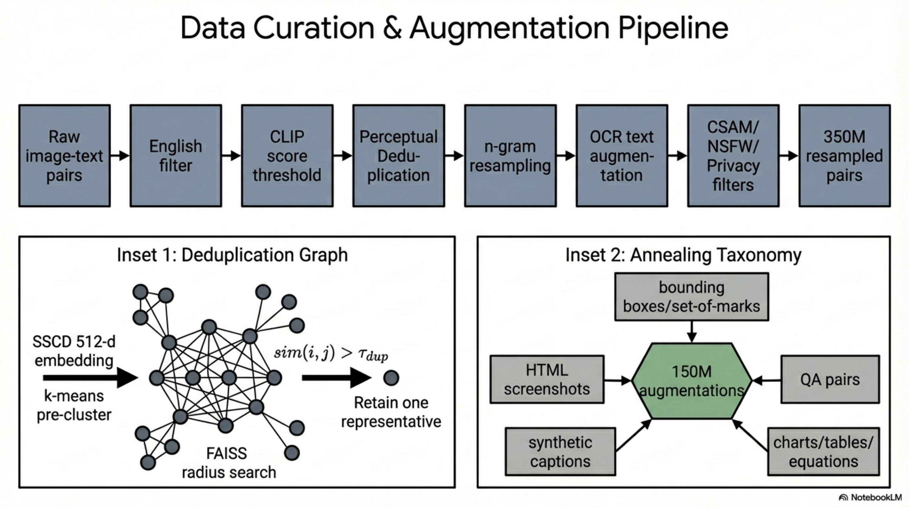
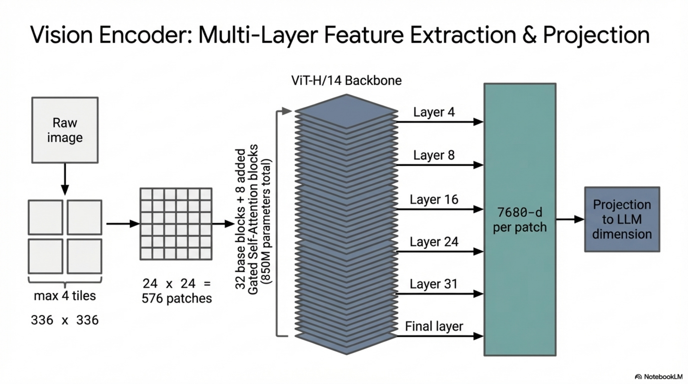
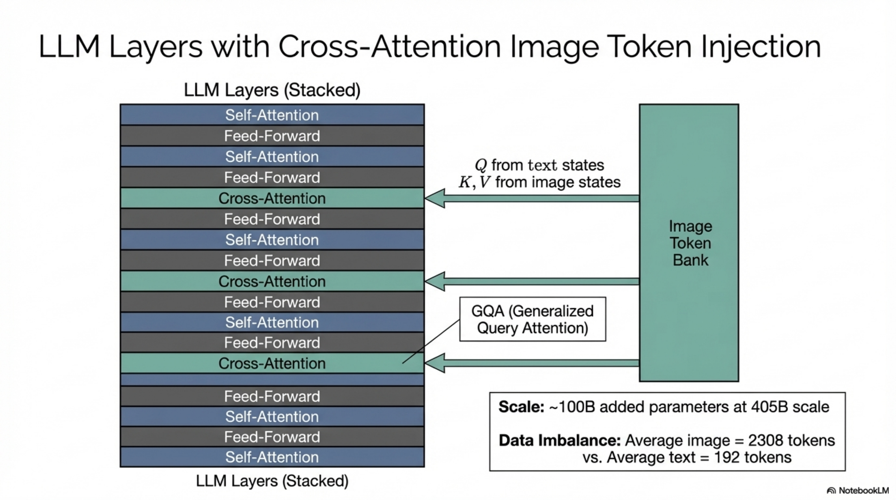
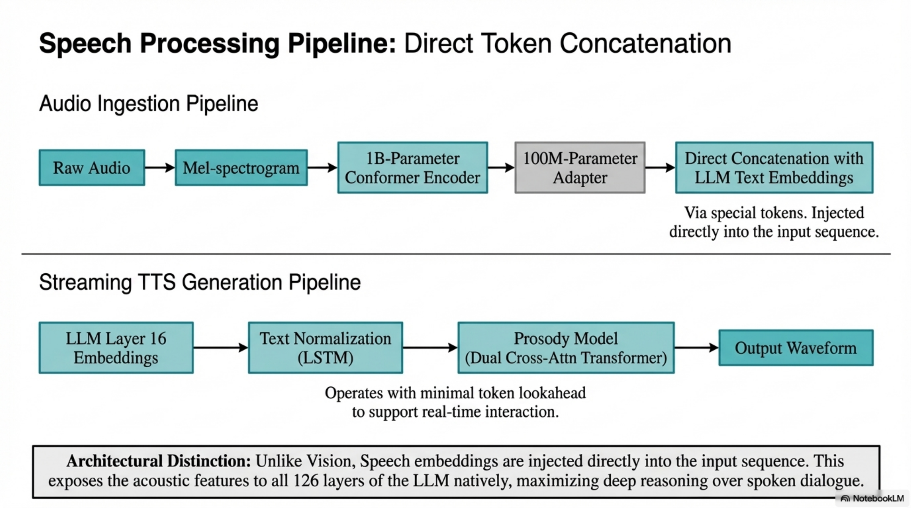
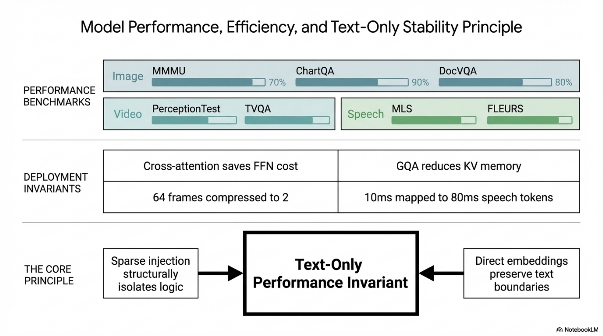

# End-to-End Technical Report: Compositional Multimodal Integration in Llama 3 — Vision and Speech Pipelines

---

## 1. System-Level Architecture Overview

### 1.1 Formal Problem Definition

**Objective:** Given a pre-trained autoregressive language model $\mathcal{M}_{\text{LLM}}$ with parameters $\theta_{\text{LLM}}$, compose modality-specific encoders and adapters to extend $\mathcal{M}_{\text{LLM}}$ to process visual inputs $\mathbf{I} \in \mathbb{R}^{H \times W \times 3}$, video inputs $\mathbf{V} = \{\mathbf{I}_t\}_{t=1}^{T}$, and speech inputs $\mathbf{S} \in \mathbb{R}^{T_s \times F}$ without degrading text-only performance.

**Formal Compositional Constraint:**

$$\mathcal{L}_{\text{text-only}}(\theta_{\text{LLM}}) = \mathcal{L}_{\text{text-only}}(\theta_{\text{LLM}}^{\text{frozen}}) \quad \forall \; \text{multimodal training stages}$$

This is enforced by freezing $\theta_{\text{LLM}}$ during adapter training and only updating modality-specific parameters $\theta_{\text{vision}}, \theta_{\text{speech}}$.


*Figure. Compositional multimodal architecture centered on a frozen Llama 3 core, making the text-performance preservation invariant explicit while showing how vision, video, and speech modules attach around it.*

### 1.2 Five-Stage Training Pipeline

| Stage | Component | Parameters Updated | Data |
|-------|-----------|-------------------|------|
| Stage 1 | Language model pre-training | $\theta_{\text{LLM}}$ | Text corpora |
| Stage 2 | Multimodal encoder pre-training | $\theta_{\text{enc}}$ | Image-text pairs / unlabeled speech |
| Stage 3 | Vision/Speech adapter training | $\theta_{\text{adapter}}, \theta_{\text{enc}}$ (unfrozen for vision) | Paired multimodal data |
| Stage 4 | Model finetuning (SFT + DPO + RS + QT) | $\theta_{\text{adapter}}, \theta_{\text{enc}}$ | Curated conversational data |
| Stage 5 | Speech adapter training | $\theta_{\text{speech-adapter}}, \theta_{\text{speech-enc}}$ | ASR/AST/dialogue data |

### 1.3 Compositional Advantages — Formal Justification

1. **Parallelization:** $\frac{\partial \mathcal{L}_{\text{vision}}}{\partial \theta_{\text{LLM}}} = 0$ during adapter training $\Rightarrow$ vision and language development are decoupled
2. **No tokenization contention:** Visual data bypasses text tokenizer; cross-attention injects visual features at intermediate representations, avoiding background perplexity mismatch between modalities
3. **Text performance preservation:** $\theta_{\text{LLM}}^{\text{frozen}}$ guarantees $\Delta \text{PPL}_{\text{text}} = 0$
4. **Compute efficiency:** Full-resolution images are not passed through all $L$ transformer layers; cross-attention selectively injects visual information every 4th layer, reducing FLOPs by factor proportional to $\frac{L}{L/4} = 4$ for the image pathway through feed-forward networks

---

## 2. Data Pipeline

### 2.1 Image Data Pipeline

#### 2.1.1 Stage Definitions

**Input:** Raw web-crawled image-text pairs $\mathcal{D}_{\text{raw}} = \{(\mathbf{I}_i, \mathbf{c}_i)\}_{i=1}^{N_{\text{raw}}}$

**Output:** Curated dataset $\mathcal{D}_{\text{clean}} \subset \mathcal{D}_{\text{raw}}$ satisfying quality, uniqueness, diversity, and safety invariants

**Invariants:**
- All pairs have English captions with CLIP alignment score $\geq \tau_{\text{CLIP}}$
- No perceptual duplicates within cosine similarity threshold $\tau_{\text{sim}}$
- N-gram frequency distribution is rebalanced to favor rare categories
- Zero CSAM content; NSFW content removed; all faces blurred



*Figure. Image-data curation and augmentation pipeline spanning quality filtering, deduplication, resampling, OCR enrichment, safety filtering, and annealing-focused augmentation.*

#### 2.1.2 Quality Filtering

**Definition:** Remove image-text pairs where caption quality or alignment falls below acceptable thresholds.

**Operations:**
- Language filter: remove non-English captions via language identification
- Alignment filter: compute CLIP score $s_i = \text{CLIP}(\mathbf{I}_i, \mathbf{c}_i)$ and remove pairs where $s_i < \tau_{\text{CLIP}}$

$$\mathcal{D}_{\text{quality}} = \{(\mathbf{I}_i, \mathbf{c}_i) \in \mathcal{D}_{\text{raw}} \mid \text{LangID}(\mathbf{c}_i) = \text{EN} \;\wedge\; \text{CLIP}(\mathbf{I}_i, \mathbf{c}_i) \geq \tau_{\text{CLIP}}\}$$

**Failure Mode:** Threshold $\tau_{\text{CLIP}}$ too high removes valid but stylistically unusual pairs; too low retains misaligned data.

#### 2.1.3 Perceptual De-duplication

**Definition:** Remove near-duplicate images using learned copy-detection embeddings to reduce redundant compute and memorization risk.

**Formal Pipeline:**

1. **Embedding extraction:** For each image $\mathbf{I}_i$, compute $\mathbf{z}_i = f_{\text{SSCD}}(\mathbf{I}_i) \in \mathbb{R}^{512}$ using the SSCD copy-detection model

2. **Nearest neighbor search:** For each $\mathbf{z}_i$, find $\mathcal{N}(\mathbf{z}_i) = \{\mathbf{z}_j \mid \text{cos}(\mathbf{z}_i, \mathbf{z}_j) \geq \tau_{\text{sim}}\}$ using FAISS

3. **Connected components:** Construct graph $G = (V, E)$ where $V = \{1, \ldots, N\}$ and $E = \{(i,j) \mid \text{cos}(\mathbf{z}_i, \mathbf{z}_j) \geq \tau_{\text{sim}}\}$. Compute connected components $\{C_k\}$ of $G$.

4. **Deduplication:** Retain exactly one representative per connected component:

$$\mathcal{D}_{\text{dedup}} = \{\text{representative}(C_k) \mid k = 1, \ldots, K\}$$

**Efficiency Optimizations:**
- Pre-clustering via $k$-means on $\{\mathbf{z}_i\}$ to partition search space
- FAISS index for approximate nearest neighbor with sub-linear query time $O(\sqrt{N})$

**Complexity:**
- Embedding extraction: $O(N \cdot C_{\text{SSCD}})$
- NN search with FAISS IVF: $O(N \cdot n_{\text{probe}} \cdot d)$ where $n_{\text{probe}} \ll K_{\text{clusters}}$, $d = 512$
- Connected components: $O(|V| + |E|)$

**Pseudo-Algorithm: Perceptual De-duplication**
```
ALGORITHM: PerceptualDeduplication
INPUT: D_raw = {(I_i, c_i)}_{i=1}^N, SSCD model f, threshold τ_sim
OUTPUT: D_dedup

1. FOR i = 1 TO N:
     z_i ← f_SSCD(I_i)                          // 512-dim embedding
2. CLUSTER {z_i} via k-means into K clusters
3. BUILD FAISS IVF index over {z_i}
4. FOR i = 1 TO N:
     neighbors ← FAISS.search(z_i, threshold=τ_sim)
     FOR j IN neighbors:
       ADD edge (i, j) to graph G
5. components ← ConnectedComponents(G)
6. FOR EACH component C_k:
     SELECT one representative (I_r, c_r) from C_k
     ADD (I_r, c_r) to D_dedup
7. RETURN D_dedup
```

**Failure Modes:**
- Threshold $\tau_{\text{sim}}$ too low: aggressive deduplication removes semantically distinct images with similar backgrounds
- Threshold too high: insufficient deduplication, retaining near-copies
- Approximate NN misses true neighbors, leaving residual duplicates

#### 2.1.4 N-gram Resampling

**Definition:** Rebalance dataset to ensure representation of rare visual concepts by upsampling image-text pairs containing low-frequency n-grams.

**Formal Procedure:**

1. Construct vocabulary $\mathcal{V}$ of n-grams from high-quality text sources
2. Compute frequency $f_i$ of each n-gram $n_i$ across $\mathcal{D}_{\text{dedup}}$
3. For each image-text pair $(\mathbf{I}, \mathbf{c})$ with n-grams $\{n_1, \ldots, n_m\} \subset \mathbf{c}$:

$$\text{Keep}(\mathbf{I}, \mathbf{c}) = \begin{cases} \text{True} & \text{if } \exists \; n_i : f_i < T \\ \text{True w.p. } 1 - \prod_{i=1}^{m}(1 - p_i) & \text{otherwise} \end{cases}$$

where the sampling probability for each n-gram is:

$$p_i = \min\left(1, \sqrt{\frac{T}{f_i}}\right)$$

and $T$ is the frequency threshold.

**Rationale:** This follows the subsampling strategy from word2vec (Mikolov et al., 2013), applied at the image-text pair level. High-frequency n-grams (common concepts) are downsampled with probability proportional to $\sqrt{T/f_i}$, while rare n-grams ($f_i < T$) are always retained.

**Effect:** Improves performance on low-frequency categories and fine-grained recognition tasks by flattening the long-tail distribution of visual concepts.

#### 2.1.5 Optical Character Recognition (OCR) Augmentation

**Definition:** Extract text rendered within images and concatenate with the original caption to enrich textual supervision.

**Transformation:**

$$\mathbf{c}_i^{\text{aug}} = \mathbf{c}_i \;\|\; \text{OCR}(\mathbf{I}_i)$$

where $\|$ denotes string concatenation.

**Impact:** Critical for document understanding tasks (DocVQA, TextVQA) where the visual text carries primary semantic content.

#### 2.1.6 Document Transcription

Pages from documents are rendered as images $\mathbf{I}_{\text{doc}}$ and paired with their source text $\mathbf{c}_{\text{doc}}$, obtained either from the original source or via a document parsing pipeline:

$$\mathcal{D}_{\text{doc}} = \{(\text{Render}(\text{page}_j), \text{Parse}(\text{page}_j))\}$$

#### 2.1.7 Safety Mitigations

**Multi-layer safety pipeline:**

| Layer | Method | Target |
|-------|--------|--------|
| CSAM detection | PhotoDNA perceptual hashing + proprietary classifiers | Child safety |
| NSFW filtering | Media-risk retrieval pipeline | Sexual/violent content |
| Face privacy | Face detection + Gaussian blurring | PII protection |
| Adversarial testing | Human-generated prompts with attached images | Red-teaming |

**Invariant:** $\forall (\mathbf{I}, \mathbf{c}) \in \mathcal{D}_{\text{final}}$: $\text{CSAM}(\mathbf{I}) = \text{False} \;\wedge\; \text{NSFW}(\mathbf{I}) < \tau_{\text{safety}} \;\wedge\; \text{Faces}(\mathbf{I}) = \text{blurred}$

#### 2.1.8 Annealing Data Construction

**Input:** Full curated dataset $\mathcal{D}_{\text{clean}}$

**Output:** Annealing dataset $\mathcal{D}_{\text{anneal}} \approx 500\text{M}$ examples

**Procedure:**
1. Resample $\mathcal{D}_{\text{clean}}$ via n-gram resampling to $\sim 350$M examples (favoring richer text descriptions $\Rightarrow$ higher-quality subset)
2. Augment with $\sim 150$M examples from five additional sources:

**Source 1: Visual Grounding**
- Link noun phrases in text to bounding boxes/masks in image
- Two representation modes:
  - **Set-of-marks:** Overlay boxes/masks with marks on image; reference marks in text
  - **Coordinate injection:** Insert normalized $(x_{\min}, y_{\min}, x_{\max}, y_{\max})$ coordinates into text, demarcated by special tokens

**Source 2: Screenshot Parsing**
- Render screenshots from HTML code
- Task: predict code producing a specific element (indicated by bounding box)

**Source 3: Question-Answer Pairs**
- Large-volume QA data too extensive for SFT alone

**Source 4: Synthetic Captions**
- Generated by an early version of the model
- More comprehensive image descriptions than original captions

**Source 5: Synthetically-Generated Structured Images**
- Charts, tables, flowcharts, math equations, textual data
- Paired with structured representations (markdown, LaTeX)
- Additionally used to generate QA pairs via text model for finetuning

### 2.2 Video Data Pipeline

**Input:** Raw video-text pairs $\mathcal{D}_{\text{video-raw}}$

**Output:** Curated video dataset $\mathcal{D}_{\text{video}}$

**Multi-stage filtering pipeline:**

1. **Text cleaning:** Rule-based heuristics (minimum length, capitalization normalization)
2. **Language filtering:** Language identification models $\rightarrow$ retain English only
3. **OCR filtering:** Remove videos with excessive overlaid text via OCR detection models
4. **Alignment filtering (two-pass):**
   - Pass 1: Single-frame image-text similarity via CLIP $\rightarrow$ remove low-similarity pairs
   - Pass 2: Video-text contrastive alignment $\rightarrow$ remove low video-text alignment pairs
5. **Motion filtering:** Compute motion score (Girdhar et al., 2023) $\rightarrow$ remove static/low-motion videos

$$\text{Keep}(\mathbf{V}_i, \mathbf{c}_i) = \mathbb{1}\left[\text{CLIP}_{\text{img}}(\mathbf{V}_i^{(1)}, \mathbf{c}_i) \geq \tau_1\right] \cdot \mathbb{1}\left[\text{CLIP}_{\text{vid}}(\mathbf{V}_i, \mathbf{c}_i) \geq \tau_2\right] \cdot \mathbb{1}\left[\text{Motion}(\mathbf{V}_i) \geq \tau_{\text{motion}}\right]$$

**No filtering on:** visual quality, aesthetic scores, or resolution.

**Dataset Statistics:**

| Property | Value |
|----------|-------|
| Mean duration | 21 seconds |
| Median duration | 16 seconds |
| 99th percentile | < 60 seconds |
| Resolution range | 320p – 4K |
| >720p (short side) | >70% |
| Aspect ratio range | 1:2 to 2:1 |
| Median aspect ratio | 1:1 |

### 2.3 Speech Data Pipeline

#### 2.3.1 Speech Understanding Data

**Pre-training data:**
- $\sim 15$M hours of multilingual speech recordings
- Filtered via Voice Activity Detection (VAD) model: retain samples with VAD score $> 0.7$
- PII removal via Presidio Analyzer

**Supervised data:**

| Data Type | Volume | Languages | Details |
|-----------|--------|-----------|---------|
| ASR | 230K hours | 34 languages | Manually transcribed |
| AST | 90K hours | 33→EN + EN→33 | Supervised + NLLB synthetic |
| Spoken dialogue | 60K hours (ASR subset) + 25K hours (TTS-generated) | Multi | Synthetic responses via LLM on transcriptions |

**Spoken dialogue data generation:**
- Given speech prompt with transcription $\mathbf{c}$, generate response $\mathbf{r} = \mathcal{M}_{\text{LLM}}(\mathbf{c})$
- Additional 25K hours via Voicebox TTS on subsets of LLM finetuning data
- Selection heuristics: short prompts, simple structure, no non-text symbols
- Maximum speech segment length: 60 seconds

#### 2.3.2 Speech Generation Data

**Text Normalization (TN) data:**
- 55K samples covering semiotic classes (number, date, time, etc.)
- Each sample: (written-form text, spoken-form text, TN rule sequence)
- Augmented with Llama 3 8B embeddings from 16th decoder layer

**Prosody Model (PM) data:**
- 50K hours of studio-recorded TTS data from professional voice actors
- Linguistic and prosodic features extracted
- Paired with Llama 3 8B embeddings

**Llama 3 Embedding Extraction:**
- Source: output of 16th decoder layer of Llama 3 8B
- Extraction: embeddings generated as if text were produced by the model with empty user prompt
- Alignment: each Llama 3 token chunk is explicitly aligned with corresponding chunks in TN-specific text tokens (demarcated by unicode category) or phone-rate features for PM

**Pseudo-Algorithm: Llama 3 Embedding Extraction for Speech Generation**
```
ALGORITHM: ExtractLlama3Embeddings
INPUT: text T, frozen Llama3-8B model M
OUTPUT: aligned embedding sequence E

1. tokens ← M.tokenize(T)
2. hidden_states ← M.forward(tokens, prompt="")
3. E ← hidden_states[layer=16]          // shape: [seq_len, d_model]
4. chunks ← ChunkByUnicodeCategory(T)   // for TN
   OR chunks ← ChunkByPhoneAlignment(T) // for PM
5. aligned_E ← AlignChunks(E, tokens, chunks)
6. RETURN aligned_E
```

---

## 3. Compression Pipeline

### 3.1 Image Compression via Tiling

**Definition:** Map variable-resolution images to a fixed number of tiles to bound compute while preserving aspect ratio information.

**Initial pre-training compression:**

$$\mathbf{I} \in \mathbb{R}^{H \times W \times 3} \xrightarrow{\text{resize}} \{\mathbf{T}_k\}_{k=1}^{N_{\text{tiles}}} \quad \text{where } N_{\text{tiles}} \leq 4, \; \mathbf{T}_k \in \mathbb{R}^{336 \times 336 \times 3}$$

Supported aspect ratio configurations: $672 \times 672$ (2×2), $672 \times 336$ (2×1), $1344 \times 336$ (4×1), etc.

**Annealing compression:** Per-tile resolution increased (exact value not specified; improves infographics understanding).

**Video SFT compression:** Tiles increased to $448 \times 448$ pixels.

### 3.2 Patch Embedding Compression (ViT)

Each tile is decomposed into non-overlapping patches:

$$\text{Patches per tile} = \left(\frac{336}{14}\right)^2 = 24^2 = 576 \quad \text{(pre-training)}$$

However, the image encoder operates at $224 \times 224$ resolution during its own pre-training:

$$\text{Patches}_{\text{encoder}} = \left(\frac{224}{14}\right)^2 = 16^2 = 256$$

Each patch is projected to a $d$-dimensional representation.

### 3.3 Multi-Layer Feature Extraction (Information Preservation)

**Problem:** Single-layer contrastive encoders lose fine-grained localization information.

**Solution:** Extract features from multiple intermediate layers:

$$\mathbf{h}_{\text{patch}}^{\text{multi}} = \text{Concat}\left[\mathbf{h}^{(4)}, \mathbf{h}^{(8)}, \mathbf{h}^{(16)}, \mathbf{h}^{(24)}, \mathbf{h}^{(31)}, \mathbf{h}^{(L)}\right] \in \mathbb{R}^{7680}$$

where $\mathbf{h}^{(\ell)} \in \mathbb{R}^{d_{\text{layer}}}$ is the representation at layer $\ell$, and $6 \times d_{\text{layer}} = 7680 \Rightarrow d_{\text{layer}} = 1280$.

**Output:** $256$ patch tokens, each with $7680$-dimensional representation.

**Information preservation guarantee:** Multi-layer features capture both low-level spatial details (early layers) and high-level semantic content (late layers), ensuring no critical visual information is lost through the compression bottleneck.

### 3.4 Video Temporal Compression

**Definition:** Aggregate multiple video frames into a compressed temporal representation via a perceiver resampler (temporal aggregator).

**Input:** $T_{\text{frames}}$ encoded frames, each producing $N_{\text{patches}}$ visual tokens

**Aggregation:**

$$\{\mathbf{F}_t\}_{t=1}^{T_{\text{frames}}} \xrightarrow{\text{Temporal Aggregator}} \{\mathbf{G}_s\}_{s=1}^{T_{\text{frames}}/r}$$

where $r$ is the aggregation factor.

| Stage | Frames Sampled | Aggregation Factor $r$ | Effective Frames |
|-------|---------------|----------------------|-----------------|
| Video pre-training | 16 | 16 | 1 |
| Video SFT | 64 | 32 | 2 |

**Perceiver Resampler Formulation:**

The temporal aggregator uses learned latent query tokens $\mathbf{Q} \in \mathbb{R}^{N_q \times d}$ that cross-attend to the concatenated frame representations:

$$\mathbf{G} = \text{PerceiverResampler}(\mathbf{Q}, \text{Concat}[\mathbf{F}_1, \ldots, \mathbf{F}_{r}])$$

$$\text{Attention}(\mathbf{Q}, \mathbf{K}, \mathbf{V}) = \text{softmax}\left(\frac{\mathbf{Q}\mathbf{K}^\top}{\sqrt{d_k}}\right)\mathbf{V}$$

where $\mathbf{K}, \mathbf{V}$ are derived from the concatenated frame features.

**Compression ratio:** $r : 1$ temporal compression (16:1 during pre-training, 32:1 during SFT)

### 3.5 Speech Compression

**Mel-spectrogram extraction:**

$$\mathbf{S}_{\text{mel}} \in \mathbb{R}^{T_s \times 80}$$

**Stride-4 stacking layer:**

$$\mathbf{S}_{\text{stacked}} \in \mathbb{R}^{T_s/4 \times 320} \xrightarrow{\text{Linear}} \mathbf{S}_{\text{proj}} \in \mathbb{R}^{T_s/4 \times d}$$

Frame rate reduced to 40ms per frame.

**Speech adapter further compression:**

Convolutional layer with kernel size 3, stride 2:

$$\mathbf{S}_{\text{adapter}} \in \mathbb{R}^{T_s/8 \times d_{\text{adapter}}}$$

Frame rate: 80ms per frame.

**Total compression ratio:**

$$\text{Original frames} \xrightarrow{\times 4 \text{ (stacking)}} \xrightarrow{\times 2 \text{ (conv stride)}} = 8\times \text{ temporal compression}$$

### 3.6 Speech Pre-training Compression (BEST-RQ)

**Quantization for self-supervised targets:**

1. Stack 4 consecutive mel frames: $\mathbf{x} \in \mathbb{R}^{320}$
2. Project to low-dimensional space: $\mathbf{x}_{\text{proj}} = \mathbf{W}_{\text{proj}} \mathbf{x} \in \mathbb{R}^{16}$
3. Nearest-neighbor quantization in codebook $\mathcal{C} = \{\mathbf{e}_k\}_{k=1}^{8192}$:

$$q(\mathbf{x}) = \arg\min_{k \in \{1,\ldots,8192\}} \frac{\mathbf{x}_{\text{proj}} \cdot \mathbf{e}_k}{\|\mathbf{x}_{\text{proj}}\| \|\mathbf{e}_k\|}$$

4. Use 16 independent codebooks for stability: $\{q_1(\mathbf{x}), \ldots, q_{16}(\mathbf{x})\}$

**Key property:** Projection matrix $\mathbf{W}_{\text{proj}}$ and codebooks $\mathcal{C}$ are randomly initialized and **never updated** during training.

**Masking:** 32-frame spans masked with probability 2.5%.

---

## 4. Model Architecture

### 4.1 Image Encoder

**Architecture:** ViT-H/14 (Vision Transformer, Huge variant, patch size 14)

**Base specifications:**

| Parameter | Value |
|-----------|-------|
| Base parameters | 630M |
| Training data | 2.5B image-text pairs, 5 epochs |
| Pre-training resolution | $224 \times 224$ |
| Patch size | $14 \times 14$ pixels |
| Patches per image | $16 \times 16 = 256$ |
| Training objective | Contrastive text alignment (CLIP-style) |

**Extended architecture (post-augmentation):**

$$\text{Total parameters} = 630\text{M (base)} + 220\text{M (8 gated self-attention layers)} = 850\text{M}$$

8 gated self-attention layers inserted prior to cross-attention pre-training, making total transformer blocks = $32 + 8 = 40$.

**Multi-layer feature extraction:**

$$\mathbf{h}_i = \text{Concat}\left[\mathbf{h}_i^{(4)}, \mathbf{h}_i^{(8)}, \mathbf{h}_i^{(16)}, \mathbf{h}_i^{(24)}, \mathbf{h}_i^{(31)}, \mathbf{h}_i^{(L)}\right] \in \mathbb{R}^{7680} \quad \forall i \in \{1, \ldots, 256\}$$

**Output tensor:** $\mathbf{H}_{\text{img}} \in \mathbb{R}^{256 \times 7680}$

**Gated Self-Attention Layer:**

$$\mathbf{h}' = \mathbf{h} + \alpha \cdot \text{SelfAttention}(\mathbf{h})$$

where $\alpha$ is a learnable gating scalar initialized near zero, allowing gradual integration of alignment-specific features.

**Training status:** Image encoder is **unfrozen** during subsequent training stages (improves text recognition performance).



*Figure. ViT-H/14 vision encoder with patch processing, multi-layer feature extraction, and projection of high-bandwidth visual features into the multimodal pathway.*

### 4.2 Image Adapter (Cross-Attention Layers)

**Definition:** Cross-attention layers injected between the image encoder output and the language model's intermediate representations.

**Placement:** After every 4th self-attention layer in the LLM backbone.

For a language model with $L$ self-attention layers, the number of cross-attention layers is:

$$N_{\text{cross}} = \lfloor L/4 \rfloor$$

**Cross-Attention Computation:**

At layer $\ell$ (where $\ell \equiv 0 \pmod{4}$):

$$\mathbf{Q} = \mathbf{W}_Q^{(\ell)} \mathbf{h}_{\text{text}}^{(\ell)} \in \mathbb{R}^{N_{\text{text}} \times d_k}$$

$$\mathbf{K} = \mathbf{W}_K^{(\ell)} \mathbf{H}_{\text{img}} \in \mathbb{R}^{N_{\text{img}} \times d_k}$$

$$\mathbf{V} = \mathbf{W}_V^{(\ell)} \mathbf{H}_{\text{img}} \in \mathbb{R}^{N_{\text{img}} \times d_v}$$

$$\text{CrossAttn}^{(\ell)} = \text{softmax}\left(\frac{\mathbf{Q}\mathbf{K}^\top}{\sqrt{d_k}}\right)\mathbf{V}$$

**Attention variant:** Generalized Query Attention (GQA) for efficiency — queries use full number of heads while keys/values share heads across groups.

**Parameter count:**

| Model Size | Cross-Attention Parameters |
|------------|--------------------------|
| Llama 3 405B | $\approx 100$B |

**Tensor flow:**

$$\mathbf{h}_{\text{text}}^{(\ell+1)} = \text{FFN}\left(\text{SelfAttn}\left(\mathbf{h}_{\text{text}}^{(\ell)}\right) + \text{CrossAttn}^{(\ell)}(\mathbf{h}_{\text{text}}^{(\ell)}, \mathbf{H}_{\text{img}})\right)$$



*Figure. Visual perception via interleaved cross-attention, highlighting tiled image encoding, 7680-dimensional multi-layer features, and selective injection into every fourth transformer layer for compute-efficient grounding.*

### 4.3 Video Adapter

**Components:**

1. **Temporal Aggregator:** Perceiver resampler that merges $r$ consecutive encoded frames into one effective frame
2. **Video Cross-Attention Layers:** Additional cross-attention layers inserted before every 4th image cross-attention layer

**Temporal Aggregator (Perceiver Resampler):**

$$\mathbf{G} = \text{Perceiver}(\mathbf{Q}_{\text{latent}}, [\mathbf{F}_1; \mathbf{F}_2; \ldots; \mathbf{F}_r])$$

where $\mathbf{Q}_{\text{latent}} \in \mathbb{R}^{N_q \times d}$ are learned latent queries.

**Video Cross-Attention:**

$$\text{VideoCrossAttn}^{(\ell)}(\mathbf{h}_{\text{text}}, \mathbf{G}) = \text{softmax}\left(\frac{\mathbf{Q}_{\text{text}} \mathbf{K}_{\text{video}}^\top}{\sqrt{d_k}}\right)\mathbf{V}_{\text{video}}$$

**Parameter counts:**

| Model | Video Aggregator + Cross-Attention |
|-------|----------------------------------|
| Llama 3 8B | 0.6B |
| Llama 3 70B | 4.6B |

**Frame sampling:** Uniform sampling of up to 64 frames from full video.

### 4.4 Speech Encoder

**Architecture:** Conformer with 1B parameters

| Component | Specification |
|-----------|--------------|
| Input | 80-dim mel-spectrogram |
| Stacking layer | Stride-4, output frame rate 40ms |
| Linear projection | $320 \rightarrow d_{\text{latent}}$ |
| Encoder layers | 24 Conformer layers |
| Latent dimension | 1536 |
| FFN dimension | 4096 (Macaron-net style: two FFNs per layer) |
| Convolution kernel | 7 |
| Attention | Rotary attention (RoPE), 24 heads |

**Conformer Layer Computation:**

$$\mathbf{x}' = \mathbf{x} + \frac{1}{2}\text{FFN}_1(\mathbf{x})$$

$$\mathbf{x}'' = \mathbf{x}' + \text{MHSA}(\mathbf{x}')$$

$$\mathbf{x}''' = \mathbf{x}'' + \text{Conv}(\mathbf{x}'')$$

$$\mathbf{x}_{\text{out}} = \text{LayerNorm}\left(\mathbf{x}''' + \frac{1}{2}\text{FFN}_2(\mathbf{x}''')\right)$$

where MHSA uses rotary positional encoding.

### 4.5 Speech Adapter

**Architecture:** ~100M parameters

| Component | Specification |
|-----------|--------------|
| Conv layer | Kernel size 3, stride 2 $\rightarrow$ frame rate 80ms |
| Transformer layer | Rotary attention, $d = 3072$, FFN dim $= 4096$ |
| Linear projection | $3072 \rightarrow d_{\text{LLM}}$ |

**Integration mode:** Direct token injection — speech embeddings are concatenated with text token embeddings (not via cross-attention). Two special tokens enclose the speech representation sequence.

$$\mathbf{h}_{\text{input}} = [\langle\text{speech\_start}\rangle; \mathbf{h}_{\text{speech}}^{(1)}; \ldots; \mathbf{h}_{\text{speech}}^{(T')}; \langle\text{speech\_end}\rangle; \mathbf{h}_{\text{text}}^{(1)}; \ldots; \mathbf{h}_{\text{text}}^{(N)}]$$

**Critical architectural distinction from vision:** The speech module generates embeddings integrated with text tokens in the input sequence, leveraging ALL capabilities of the LLM backbone. The vision module uses cross-attention injection at intermediate layers. This design choice allows the speech interface to directly benefit from the LLM's full reasoning chain.



*Figure. Speech pathway showing direct token-sequence concatenation for understanding and the streaming text normalization plus prosody stack used for speech generation.*

### 4.6 Speech Generation Components

#### 4.6.1 Text Normalization (TN) Module

**Architecture:** Streaming LSTM-based sequence-tagging model

**Input:** Written-form text tokens + Llama 3 embeddings (via cross-attention)

**Output:** Sequence of TN rule indices that transform written text to spoken form

**Example:**

$$\text{"123"} \xrightarrow{\text{context-aware TN}} \begin{cases} \text{"one hundred twenty three"} & \text{(cardinal context)} \\ \text{"one two three"} & \text{(digit-spelling context)} \end{cases}$$

**Cross-attention integration:**

$$\mathbf{h}_{\text{TN}}^{(t)} = \text{LSTM}\left(\mathbf{h}_{\text{TN}}^{(t-1)}, \mathbf{x}_t + \text{CrossAttn}(\mathbf{x}_t, \mathbf{E}_{\text{Llama3}})\right)$$

**Streaming property:** Minimal text token lookahead enabled by Llama 3 contextual embeddings.

#### 4.6.2 Prosody Model (PM)

**Architecture:** Decoder-only Transformer

| Component | Specification |
|-----------|--------------|
| Architecture | Uni-directional Transformer |
| Attention heads | 6 |
| Hidden dimension | 864 |
| Cross-attention | Dual: one for linguistic features, one for Llama 3 embeddings |
| FC layers | 2 per block |

**Predicted prosodic features:**

$$\hat{\mathbf{y}} = \begin{bmatrix} \log d_{\text{phone}} \\ \log \bar{F}_0 \\ \log \bar{P} \end{bmatrix}$$

where $d_{\text{phone}}$ is phone duration, $\bar{F}_0$ is mean fundamental frequency, $\bar{P}$ is mean power.

**Dual Cross-Attention:**

$$\text{Attn}_1 = \text{CrossAttn}(\mathbf{Q}, \mathbf{K}_{\text{ling}}, \mathbf{V}_{\text{ling}})$$

$$\text{Attn}_2 = \text{CrossAttn}(\mathbf{Q}, \mathbf{K}_{\text{Llama}}, \mathbf{V}_{\text{Llama}})$$

This dual mechanism handles varying input rates (linguistic features at phone rate, Llama embeddings at token rate) without explicit alignment.

**Lookahead mechanism:**
- Fixed number of future phones
- Variable number of future tokens (defined by TN chunk size)
- Causal masking enforced for streamability

**Delayed pattern approach** (Kharitonov et al., 2021): Prosody targets are predicted with temporal delay to capture long-range prosodic dependencies.

---

## 5. Optimization Strategy

### 5.1 Image Adapter Pre-training

**Optimizer:** Not explicitly stated; inferred as AdamW based on weight decay specification.

| Hyperparameter | Value |
|---------------|-------|
| Global batch size | 16,384 |
| Learning rate schedule | Cosine decay |
| Initial learning rate | $10 \times 10^{-4} = 10^{-3}$ |
| Weight decay | 0.01 |
| Image resolution | $\leq 4$ tiles of $336 \times 336$ |
| Training data | $\sim 6$B image-text pairs |

**Learning rate adjustments:** Learning rate dropped manually when loss stagnated, indicating that small-scale hyperparameter search findings did not generalize to very long training schedules.

**Frozen parameters:** $\theta_{\text{LLM}}$ frozen; $\theta_{\text{ViT}}$ unfrozen; $\theta_{\text{cross-attn}}$ trained.

### 5.2 Image Adapter Annealing

| Hyperparameter | Value |
|---------------|-------|
| Learning rate | $2 \times 10^{-5}$ |
| Schedule | Cosine decay with warm-up |
| Optimizer | Re-initialized with warm-up |
| Training data | $\sim 500$M examples from annealing dataset |
| Resolution | Increased per-tile resolution |

### 5.3 Video Pre-training

| Hyperparameter | Value |
|---------------|-------|
| Global batch size | 4,096 |
| Sequence length | 190 tokens |
| Learning rate | $10^{-4}$ |
| Frames per video | 16 (uniformly sampled) |
| Frame resolution | 4 tiles of $448 \times 448$ |
| Aggregation factor | 16 $\rightarrow$ 1 effective frame |
| Frozen parameters | Everything except video aggregator + video cross-attention |

### 5.4 Speech Encoder Pre-training (BEST-RQ)

| Hyperparameter | Value |
|---------------|-------|
| Training steps | 500K |
| Global batch size | 2,048 utterances |
| Mask length | 32 frames |
| Mask probability | 2.5% |
| Max utterance length | 60 seconds (random crop of 6K frames if longer) |
| Codebook size | 8,192 vectors |
| Number of codebooks | 16 |
| Quantization dimension | 16 |

**Loss:**

$$\mathcal{L}_{\text{BEST-RQ}} = -\sum_{t \in \mathcal{M}} \sum_{b=1}^{16} \log P(q_b(\mathbf{x}_t) \mid \mathbf{h}_t)$$

where $\mathcal{M}$ is the set of masked positions, $q_b$ is the quantized target from codebook $b$, and $\mathbf{h}_t$ is the encoder output at position $t$. Loss computed only on masked frames.

### 5.5 Speech Supervised Finetuning

| Hyperparameter | Llama 3 8B | Llama 3 70B |
|---------------|-----------|------------|
| Training steps | 650K | 600K |
| Global batch size | 512 | 768 |
| Initial learning rate | $10^{-4}$ | $4 \times 10^{-5}$ |
| LLM status | Frozen | Frozen |
| Encoder/Adapter status | Jointly optimized | Jointly optimized |
| Data mix | ASR + AST + spoken dialogue | ASR + AST + spoken dialogue |

### 5.6 Prosody Model Training

| Hyperparameter | Value |
|---------------|-------|
| Batch size | 1,024 utterances |
| Max length | 500 phones |
| Learning rate | $9 \times 10^{-4}$ |
| Optimizer | AdamW |
| Training steps | 1M updates |
| Warmup | 3,000 steps |
| Schedule | Cosine |
| Llama 3 model | Frozen 8B |

### 5.7 Numerical Stability Considerations

**Problem:** Gradient accumulation in bf16 causes numerical instabilities when the image encoder is connected to the language backbone via cross-attention layers at every 4th layer.

**Root cause analysis:** Image token representations propagate through $N_{\text{cross}}$ cross-attention layers throughout the full depth of the LLM. Numerical deviations in image token representation compound multiplicatively across layers:

$$\epsilon_{\text{compound}} \approx \epsilon_{\text{bf16}} \cdot \prod_{\ell=1}^{N_{\text{cross}}} \|\nabla_\ell\|$$

**Solution:** Perform gradient accumulation in FP32.

**Formal precision policy:**
- Forward pass: bf16
- Gradient computation: bf16
- Gradient accumulation: FP32
- Parameter updates: FP32

---

## 6. Training Stages (Detailed)

### 6.1 Stage 1: Language Model Pre-training

**Scope:** Standard autoregressive LLM pre-training (covered in Sections 1–3 of the original paper).

**Output:** Pre-trained $\theta_{\text{LLM}}$ for 8B, 70B, and 405B parameter models.

### 6.2 Stage 2: Image Encoder Pre-training

**Model:** ViT-H/14, 630M parameters

**Objective:** Contrastive image-text alignment (CLIP-style):

$$\mathcal{L}_{\text{CLIP}} = -\frac{1}{2N}\sum_{i=1}^{N}\left[\log \frac{\exp(\text{sim}(\mathbf{z}_i^{\text{img}}, \mathbf{z}_i^{\text{text}})/\tau)}{\sum_{j=1}^N \exp(\text{sim}(\mathbf{z}_i^{\text{img}}, \mathbf{z}_j^{\text{text}})/\tau)} + \log \frac{\exp(\text{sim}(\mathbf{z}_i^{\text{text}}, \mathbf{z}_i^{\text{img}})/\tau)}{\sum_{j=1}^N \exp(\text{sim}(\mathbf{z}_i^{\text{text}}, \mathbf{z}_j^{\text{img}})/\tau)}\right]$$

**Data:** 2.5B image-text pairs, 5 epochs.

**Post-training augmentation:** 8 gated self-attention layers added $\rightarrow$ 850M total parameters.

### 6.3 Stage 3: Vision Adapter Training (Image)

**Pseudo-Algorithm: Image Adapter Pre-training**
```
ALGORITHM: ImageAdapterPretraining
INPUT: Frozen LLM θ_LLM, unfrozen ViT θ_ViT, 
       randomly initialized cross-attention θ_cross,
       dataset D_image (~6B pairs)
OUTPUT: Trained θ_ViT, θ_cross

1. INITIALIZE optimizer with lr=10^{-3}, weight_decay=0.01, cosine schedule
2. FOR step = 1 TO max_steps:
     a. SAMPLE batch B of size 16,384 from D_image
     b. FOR EACH (I, c) IN B:
        i.   tiles ← ResizeToTiles(I, max_tiles=4, tile_size=336)
        ii.  H_img ← ViT_multilayer(tiles)      // [N_patches × 7680]
        iii. h_text ← LLM_embed(c)              // [N_text × d_LLM]
        iv.  FOR ℓ = 4, 8, ..., L:
               h_text^(ℓ) ← SelfAttn^(ℓ)(h_text^(ℓ-1))
               h_text^(ℓ) ← h_text^(ℓ) + CrossAttn^(ℓ)(h_text^(ℓ), H_img)
               h_text^(ℓ) ← FFN^(ℓ)(h_text^(ℓ))
        v.   logits ← LLM_head(h_text^(L))
        vi.  loss ← CrossEntropy(logits, c_target)
     c. Accumulate gradients in FP32
     d. UPDATE θ_ViT, θ_cross (θ_LLM frozen)
     e. IF loss stagnant: DROP learning rate
3. ANNEAL:
     a. RE-INITIALIZE optimizer with lr=2×10^{-5}, warm-up, cosine
     b. TRAIN on D_anneal (~500M examples) with increased resolution
4. RETURN θ_ViT, θ_cross
```

### 6.4 Stage 3b: Video Adapter Training

**Pseudo-Algorithm: Video Adapter Pre-training**
```
ALGORITHM: VideoAdapterPretraining
INPUT: Image-pretrained + annealed model (θ_ViT, θ_cross, θ_LLM),
       randomly initialized θ_video_agg, θ_video_cross,
       video dataset D_video
OUTPUT: Trained θ_video_agg, θ_video_cross

1. FREEZE all parameters except θ_video_agg, θ_video_cross
2. INITIALIZE optimizer with lr=10^{-4}
3. FOR step = 1 TO max_steps:
     a. SAMPLE batch of 4,096 video-text pairs
     b. FOR EACH (V, c):
        i.   frames ← UniformSample(V, n=16)
        ii.  FOR t = 1 TO 16:
               F_t ← ViT(ResizeToTiles(frames[t], 4 tiles, 448×448))
        iii. G ← TemporalAggregator([F_1,...,F_16], factor=16)  // 1 effective frame
        iv.  h_text ← LLM_embed(c)
        v.   FOR ℓ IN video_cross_attn_positions:
               h_text^(ℓ) ← VideoCrossAttn^(ℓ)(h_text, G)
        vi.  loss ← CrossEntropy(LLM_head(h_text), c_target)
     c. UPDATE θ_video_agg, θ_video_cross only
4. RETURN θ_video_agg, θ_video_cross
```

### 6.5 Stage 4: Post-Training (Vision)


*Figure. Six-round post-training loop connecting data collection, reward modeling, rejection sampling, supervised finetuning, DPO, and model averaging under a strict non-degradation benchmark constraint.*

#### 6.5.1 Supervised Finetuning (SFT)

**Initialization:**
- Vision encoder + image adapter: from pre-trained weights
- Language model: **hot-swapped** with instruction-tuned LLM weights (not the pre-trained LLM)
- LLM: frozen; only vision encoder + image adapter updated

**Data composition:**
1. Academic datasets converted to QA pairs via templates or LLM rewriting
2. Human-annotated multi-modal conversations (diverse tasks + domains)
3. Synthetic multi-modal data (text-representation → image replacement)

**Model Averaging (Wortsman et al., 2022):**

$$\theta_{\text{final}} = \frac{1}{K}\sum_{k=1}^{K} \theta_{\text{top-}k}$$

**Procedure:**
1. Hyperparameter sweep: multiple random data subsets × learning rates × weight decay values
2. Rank models by performance
3. Average weights of top-$K$ models
4. Select $K$ by evaluating averaged models

**Property:** Averaged models consistently outperform best individual model, reducing hyperparameter sensitivity.

**Pseudo-Algorithm: SFT with Model Averaging**
```
ALGORITHM: VisionSFT
INPUT: Pre-trained θ_ViT, θ_cross; instruction-tuned θ_LLM; SFT data D_sft
OUTPUT: Finetuned θ_ViT*, θ_cross*

1. HOT-SWAP θ_LLM with instruction-tuned weights
2. FREEZE θ_LLM
3. FOR EACH (lr, wd, D_subset) IN HyperparameterGrid:
     a. θ_k ← Train(θ_ViT, θ_cross, D_subset, lr, wd)
     b. score_k ← Evaluate(θ_k, D_val)
     c. STORE (θ_k, score_k)
4. SORT models by score_k descending
5. FOR K = 1 TO max_K:
     θ_avg_K ← (1/K) Σ_{k=1}^K θ_{top-k}
     eval_K ← Evaluate(θ_avg_K, D_val)
6. K* ← argmax_K eval_K
7. θ_final ← θ_avg_{K*}
8. RETURN θ_final
```

#### 6.5.2 Video SFT

**Initialization:**
- Video aggregator + video cross-attention: from video pre-trained weights
- Image weights + LLM: from their respective post-SFT states

**Updates:** Only video parameters (aggregator + video cross-attention)

**Changes from pre-training:**
- Frames: 16 → 64
- Aggregation factor: 16 → 32 (2 effective frames)
- Resolution: increased to match image SFT hyperparameters

#### 6.5.3 Direct Preference Optimization (DPO)

**Objective:**

$$\mathcal{L}_{\text{DPO}}(\theta) = -\mathbb{E}_{(x, y_w, y_l) \sim \mathcal{D}_{\text{pref}}} \left[\log \sigma\left(\beta \log \frac{\pi_\theta(y_w | x)}{\pi_{\text{ref}}(y_w | x)} - \beta \log \frac{\pi_\theta(y_l | x)}{\pi_{\text{ref}}(y_l | x)}\right)\right]$$

where $y_w$ is the chosen response, $y_l$ is the rejected response, $\beta$ is the temperature, and $\pi_{\text{ref}}$ is the reference policy.

**Preference Data Sources:**
1. **Human annotations:** Pairwise comparisons with 7-scale ratings between model outputs from a weekly-updated model pool; optional human edits to correct inaccuracies in chosen responses
2. **Synthetic data:** LLM-introduced deliberate errors (object changes, attribute changes, calculation mistakes) as rejected samples paired with original SFT data as chosen
3. **Rejection sampling by-products:** Non-selected generations serve as rejected samples

**Distribution Shift Mitigation:**
- Only retain recent batches of human preference annotations
- Drop batches sufficiently off-policy (e.g., if base pre-trained model changed)

**EMA Reference Model Update:**

$$\theta_{\text{ref}}^{(t)} = \alpha \cdot \theta_{\text{ref}}^{(t-1)} + (1 - \alpha) \cdot \theta^{(t)} \quad \text{every } k \text{ steps}$$

**Rationale:** Instead of freezing $\pi_{\text{ref}}$, updating it via EMA allows the model to learn more from the data, improving human evaluation performance.

**Invariant:** Vision DPO model consistently outperforms its SFT starting point in human evaluations across every finetuning iteration.

#### 6.5.4 Reward Modeling

**Initialization:**
- Vision encoder + cross-attention: from vision SFT model (unfrozen)
- Self-attention layers: from language reward model (frozen)

**Training objective:**

$$\mathcal{L}_{\text{RM}} = -\log \sigma(r_\theta(x, y_w) - r_\theta(x, y_l)) + \lambda \cdot \frac{1}{B}\sum_{i=1}^{B} r_\theta(x_i, y_i)^2$$

where the second term is a weighted regularization on the square of reward logits averaged over the batch, preventing reward score drift.

**Preference pair construction (from 7-scale ratings):**

$$\text{edited} > \text{chosen} > \text{rejected} \Rightarrow 2\text{–}3 \text{ training pairs per annotation}$$

**Synthetic augmentation:** Perturb words/phrases related to image information (numbers, visual text) to create negative samples, encouraging the RM to ground judgments on actual image content.

#### 6.5.5 Rejection Sampling

**Problem:** Available QA pairs contain only final answers without chain-of-thought explanations.

**Pseudo-Algorithm: Rejection Sampling for Reasoning**
```
ALGORITHM: RejectionSampling
INPUT: QA dataset D_qa = {(q_i, a_i)}, finetuned model M, reward model RM
OUTPUT: Augmented training data D_aug

1. FOR EACH (q, a_gt) IN D_qa:
     a. SAMPLE N responses {r_1, ..., r_N} from M(q) with varied
        system prompts and temperatures
     b. FOR EACH r_j:
          correct_j ← CompareToGT(r_j, a_gt)  // heuristic or LLM judge
     c. p_correct ← Σ correct_j / N
     d. IF p_correct < threshold:
          SKIP (q, a_gt)                       // guard against incorrect explanations
     e. correct_responses ← {r_j | correct_j = True}
     f. scores ← {RM(q, r_j) | r_j ∈ correct_responses}
     g. top_K ← TopK(correct_responses, scores, K)
     h. ADD {(q, r_k)}_{k ∈ top_K} to D_aug
     i. rejected_responses ← {r_j | correct_j = False}
     j. ADD preference pairs {(q, r_chosen, r_rejected)} to D_pref
2. RETRAIN M with D_sft ∪ D_aug
3. RETURN D_aug, D_pref
```

**Guardrails:**
1. Drop questions where $P(\text{correct}) < \tau$ to filter incorrect explanations with correct final answers
2. Use reward model to select top-$K$ highest-quality correct answers (style/language preference)

**By-product:** Non-selected generations become additional rejection samples for preference data.

#### 6.5.6 Quality Tuning (QT)

**Definition:** Final finetuning stage on a very small, highly selective SFT dataset where all samples are rewritten and verified by humans or best models.

**Procedure:**
1. Apply DPO on quality-tuned data
2. Checkpoint selection based **purely on benchmarks** (not human evaluation) to ensure capability retention

**Invariants:**
- QT dataset must cover wide range of tasks
- Proper early stopping applied
- Significantly improves human evaluations without affecting benchmark generalization

### 6.6 Speech Training Stages

#### 6.6.1 Stage 1: Speech Encoder Pre-training (BEST-RQ)

**Self-supervised objective:** Predict quantized targets at masked positions using multi-softmax loss:

$$\mathcal{L}_{\text{BEST-RQ}} = -\sum_{t \in \mathcal{M}} \sum_{b=1}^{B} \log \frac{\exp(\mathbf{h}_t^\top \mathbf{e}_{q_b(t)})}{\sum_{k=1}^{|\mathcal{C}|} \exp(\mathbf{h}_t^\top \mathbf{e}_k)}$$

where $B = 16$ codebooks, $|\mathcal{C}| = 8192$, and $\mathcal{M}$ denotes masked frame positions.

**Masking strategy:** Spans of 32 frames masked with probability 2.5%.

**Crop strategy:** Utterances $> 60$s are randomly cropped to 6K frames (60s).

#### 6.6.2 Stage 2: Speech Supervised Finetuning

**Objective:** Standard next-token prediction on text targets conditioned on speech input:

$$\mathcal{L}_{\text{SFT}} = -\sum_{t=1}^{T_{\text{text}}} \log P_\theta(w_t \mid w_{<t}, \mathbf{h}_{\text{speech}}, \text{prompt})$$

**System prompts (used during both training and inference):**
- ASR: `"Repeat after me in {language}: "`
- AST: `"Translate the following sentence into {language}: "`
- Dialogue: no specific system prompt (general-purpose spoken dialogue)

**Design choice for language control:** Target-side LID only (no source-side LID) to preserve:
- Zero-shot performance on unseen translation directions
- Code-switched speech handling capability

**Frozen:** $\theta_{\text{LLM}}$
**Trained:** $\theta_{\text{speech-enc}}, \theta_{\text{speech-adapter}}$ (jointly optimized)

---

## 7. Model Scaling and Distributed Training

### 7.1 Parallelism Strategy

| Model Size | Parallelism Strategy |
|------------|---------------------|
| 8B | Data parallelism + Tensor parallelism |
| 70B | Data parallelism + Tensor parallelism |
| 405B | Data parallelism + Tensor parallelism + Pipeline parallelism |

**Rationale for 8B/70B:** Model/pipeline parallelism does not increase efficiency because parameter gathering dominates computation at these scales.

### 7.2 Pipeline Parallelism Design for 405B

**Problem: Model Heterogeneity**

Computation is heterogeneous: image tokens pass through ViT + cross-attention layers, while text tokens only pass through self-attention layers. This creates scheduling bottlenecks.

**Solution:** Each pipeline stage contains exactly 5 layers:
- 4 self-attention layers (LLM backbone)
- 1 cross-attention layer (image adapter)

This matches the insertion pattern (cross-attention after every 4th self-attention layer).

**Additional optimization:** Image encoder replicated on ALL pipeline stages. Since training uses paired image-text data, this enables load balancing between image and text computation paths.


*Figure. 4D training topology across 16K H100 GPUs, clarifying how tensor, context, pipeline, and data parallelism are layered to sustain stable 405B-scale training.*

### 7.3 Sequence Parallelism for Data Heterogeneity

**Problem:** Average image has 2,308 tokens vs. average text with 192 tokens $\Rightarrow$ cross-attention layers require more time/memory than self-attention layers.

**Solution:**
- Sequence parallelism in the image encoder: each GPU processes roughly equal token count
- Substantially larger micro-batch size: 8 (instead of 1) to compensate for short text sequences

### 7.4 Numerical Stability

**Problem:** bf16 gradient accumulation causes instabilities when image tokens propagate through all cross-attention layers.

**Mechanism:** Error compounding across $N_{\text{cross}}$ cross-attention layers:

$$\|\epsilon_{\text{total}}\| \leq \prod_{\ell=1}^{N_{\text{cross}}} (1 + \|\delta_\ell\|) \cdot \|\epsilon_{\text{initial}}\| \approx e^{\sum_\ell \|\delta_\ell\|} \cdot \|\epsilon_{\text{initial}}\|$$

**Solution:** FP32 gradient accumulation.

---

## 8. Inference Path


*Figure. Shared autoregressive inference view covering image, video, speech understanding, and speech generation, useful as a top-level map before the per-modality inference subsections.*

### 8.1 Image Inference

**Input:** Image $\mathbf{I}$, text prompt $\mathbf{p}$

**Pseudo-Algorithm: Image Inference**
```
ALGORITHM: ImageInference
INPUT: Image I, text prompt p, model (θ_ViT, θ_cross, θ_LLM)
OUTPUT: Generated text response

1. tiles ← ResizeToTiles(I, max_tiles, tile_size)
2. FOR EACH tile t_k:
     patches_k ← ExtractPatches(t_k, patch_size=14)
3. H_img ← ViT_multilayer(patches)                // [N_patches × 7680]
4. h_text ← LLM_embed(p)                           // [N_text × d_LLM]
5. FOR ℓ = 1 TO L:
     h_text^(ℓ) ← SelfAttn^(ℓ)(h_text^(ℓ-1))
     IF ℓ mod 4 == 0:
       h_text^(ℓ) ← h_text^(ℓ) + CrossAttn^(ℓ)(h_text^(ℓ), H_img)
     h_text^(ℓ) ← FFN^(ℓ)(h_text^(ℓ))
6. WHILE not EOS:
     token ← argmax(LLM_head(h_text^(L)))          // greedy or sampling
     APPEND token to output
     h_text ← UPDATE(h_text, token)                 // KV cache for self-attn
                                                     // H_img cached for cross-attn
7. RETURN output
```

**Efficiency advantage:** Full-resolution images are NOT passed through all $L$ transformer layers' FFNs. Only the cross-attention layers (every 4th layer) interact with image representations, and the image encoder processes images independently from the LLM backbone.

### 8.2 Video Inference

**Input:** Video $\mathbf{V}$, text prompt $\mathbf{p}$

**Procedure:**
1. Uniformly sample up to 64 frames from full video
2. Each frame processed by image encoder (with tiles)
3. Temporal aggregator merges frames ($r = 32 \Rightarrow$ 2 effective frames during SFT)
4. Video cross-attention layers inject temporal features
5. Autoregressive text generation

**Prompting strategy:**

| Benchmark Type | Prompt Template |
|---------------|----------------|
| Multiple-choice | `"Select the correct answer from the following options: {question}. Answer with the correct option letter and nothing else"` |
| Short answer | `"Answer the question using a single word or phrase. {question}"` |
| With subtitles (TVQA) | Include subtitles in prompt |
| NExT-QA (WUPS-sensitive) | Additional instruction for specificity |

### 8.3 Speech Understanding Inference

**Input:** Speech waveform $\mathbf{S}$, optional text prompt, optional dialogue history

**Procedure:**
1. Extract 80-dim mel-spectrogram
2. Stride-4 stacking + linear projection $\rightarrow$ 40ms frame rate
3. Conformer encoder (24 layers) $\rightarrow$ speech representations
4. Speech adapter (conv stride-2 + transformer + linear) $\rightarrow$ 80ms frame rate, $d_{\text{LLM}}$-dim
5. Concatenate: $[\langle\text{speech\_start}\rangle; \mathbf{h}_{\text{speech}}; \langle\text{speech\_end}\rangle; \mathbf{h}_{\text{text\_prompt}}]$
6. Feed to frozen LLM
7. Greedy decoding for all evaluations

**Multi-turn support:** Dialogue history prepended as prompt prefix.

**Modes of operation (controlled by system prompt):**
- No system prompt: general-purpose spoken dialogue
- ASR prompt: speech recognition
- AST prompt: speech translation

**Interleaved input:** Model supports interleaved text and speech tokens for advanced audio-comprehension tasks.

### 8.4 Speech Generation Inference (Streaming TTS)

**Pipeline:**

$$\text{LLM decoding} \xrightarrow{\text{tokens + embeddings}} \text{TN (streaming)} \xrightarrow{\text{spoken-form text}} \text{PM (streaming)} \xrightarrow{\text{prosody features}} \text{Speech synthesis}$$

**Streaming TN inference:**
- Process text chunk by chunk
- Cross-attend to Llama 3 embeddings (layer 16) with minimal lookahead

**Streaming PM inference:**
- Process phone by phone for phone-rate features
- Process chunk by chunk for token-rate features
- New chunk input updated only when first phone of that chunk is current
- Causal masking + lookahead mechanism consistent with training

**Delayed pattern decoding:** Prosody targets predicted with temporal delay for long-range dependency capture.

---

## 9. Evaluation Protocol



*Figure. Consolidated benchmark and efficiency summary emphasizing multimodal gains together with the core design invariant that text-only capability remains stable.*

### 9.1 Image Understanding Benchmarks

| Benchmark | Task | Metric | Evaluation Set | Key Challenge |
|-----------|------|--------|---------------|---------------|
| MMMU | Multimodal reasoning (30 disciplines) | Accuracy (CoT) | val, 900 images | College-level problems |
| VQAv2 | Generic visual QA | Accuracy | test-dev | Image + language + commonsense |
| AI2 Diagram | Scientific diagram parsing | Accuracy | test (transparent bbox) | Structured visual understanding |
| ChartQA | Chart understanding | Accuracy (CoT) | test | Logical reasoning over charts |
| TextVQA | OCR in natural images | Accuracy | val | Text reading + reasoning |
| DocVQA | Document analysis | Accuracy | test | OCR + document reasoning |

#### 9.1.1 Results Summary (Table 29)

| Model | MMMU | VQAv2 | AI2D | ChartQA | TextVQA | DocVQA |
|-------|------|-------|------|---------|---------|--------|
| Llama 3-V 8B | 49.6 | 78.0 | 84.4 | 78.7 | 78.2 | 84.4 |
| Llama 3-V 70B | 60.6 | 79.1 | 93.0 | 83.2 | 83.4 | 92.2 |
| Llama 3-V 405B | 64.5 | 80.2 | 94.1 | 85.8 | 84.8 | 92.6 |
| GPT-4V | 56.4 | 77.2 | 78.2 | 78.4 | 78.0 | 88.4 |
| GPT-4o | 69.1 | — | 94.2 | 85.7 | — | 92.8 |
| Gemini 1.5 Pro | 62.2 | 80.2 | 94.4 | 87.2 | 78.7 | 93.1△ |
| Claude 3.5 Sonnet | 68.3 | — | 94.7 | 90.8 | — | 95.2 |

**Key findings:**
- Llama 3-V 405B outperforms GPT-4V on ALL benchmarks
- Slightly behind Gemini 1.5 Pro and Claude 3.5 Sonnet
- Particularly competitive on document understanding (DocVQA: 92.6 vs 92.8 GPT-4o)
- Clear scaling behavior: 8B → 70B → 405B monotonically improves across all benchmarks

### 9.2 Video Understanding Benchmarks

| Benchmark | Task | Metric | Key Properties |
|-----------|------|--------|---------------|
| PerceptionTest | Temporal reasoning (memory, abstraction, physics, semantics) | Accuracy (MC) | 11.6K QA, avg 23s, held-out test |
| TVQA | Compositional reasoning with subtitles | Accuracy (MC, 5 options) | 15K val QA, avg 76s, TV shows |
| NExT-QA | Temporal/causal reasoning (open-ended) | WUPS | 1K test videos, avg 44s, 9K questions |
| ActivityNet-QA | Long-form activity understanding | GPT-3.5 evaluated accuracy | 8K test QA, avg 3min, 800 videos |

#### 9.2.1 Results Summary (Table 30)

| Model | PerceptionTest | TVQA | NExT-QA | ActivityNet-QA |
|-------|---------------|------|---------|---------------|
| Llama 3-V 8B | 53.8 | 82.5 | 27.3 | 52.7 |
| Llama 3-V 70B | 60.8 | 87.9 | 30.3 | 56.3 |
| Gemini 1.0 Pro | 51.1 | — | 28.0 | 49.8 |
| Gemini 1.0 Ultra | 54.7 | — | 29.9 | 52.2 |
| Gemini 1.5 Pro | — | — | — | 57.5 |
| GPT-4V | — | 87.3 | — | — |
| GPT-4o | — | — | — | 61.9 |

**Key findings:**
- All results are **zero-shot** (no benchmark data in training/finetuning)
- Llama 3-V competitive or better than models with native multimodal pre-training
- Strong PerceptionTest performance: complex temporal reasoning capability
- ActivityNet-QA: competitive despite processing only 64 frames from 3-minute videos (≈1 frame/3s)

### 9.3 Speech Understanding Evaluation

#### 9.3.1 ASR (Table 31) — Word Error Rate (WER)

| Model | MLS (EN) | LibriSpeech (test-other) | VoxPopuli (EN) | FLEURS (34 lang) |
|-------|----------|------------------------|----------------|-----------------|
| Llama 3 8B | 4.9 | 3.4 | 6.2 | 9.6 |
| Llama 3 70B | 4.4 | 3.1 | 5.7 | 8.2 |
| Whisper v2/v3 | 6.2 | 4.9 | 7.0 | 14.4 |
| SeamlessM4T v2 | 6.5 | 6.2 | 7.0 | 11.7 |
| Gemini 1.0 Ultra | 4.4 | — | — | — |
| Gemini 1.5 Pro | 4.2 | — | — | — |

**Post-processing:** Whisper text normalizer applied for consistency.

**For CJK+Thai:** Character Error Rate (CER) reported instead of WER.

#### 9.3.2 Speech Translation (Table 32) — BLEU Score

| Model | FLEURS (33→EN) | CoVoST 2 (15→EN) |
|-------|---------------|------------------|
| Llama 3 8B | 29.5 | 34.4 |
| Llama 3 70B | 33.7 | 38.8 |
| Whisper v2 | 21.9 | 33.8 |
| SeamlessM4T v2 | 28.6 | 37.9 |

#### 9.3.3 Safety Evaluation (Table 33)

**Dataset:** MuTox — multilingual audio-based toxicity dataset
- English/Spanish: 20K utterances each
- 19 other languages: 4K utterances each

**Metrics:**
- **Added Toxicity (AT):** Percentage where safe input → toxic output
- **Lost Toxicity (LT):** Percentage where toxic input → safe output

**Key finding:** AT < 1% for English; model removes significantly more toxicity than it adds.

**Evaluation method:** MuTox classifier on model outputs after special character cleaning.

---

## 10. Loss Formulations — Comprehensive Summary

### 10.1 Pre-training Losses

**Image encoder (CLIP-style contrastive):**

$$\mathcal{L}_{\text{CLIP}} = -\frac{1}{2N}\sum_{i=1}^{N}\left[\log \frac{e^{\text{sim}(\mathbf{z}_i^I, \mathbf{z}_i^T)/\tau}}{\sum_j e^{\text{sim}(\mathbf{z}_i^I, \mathbf{z}_j^T)/\tau}} + \log \frac{e^{\text{sim}(\mathbf{z}_i^T, \mathbf{z}_i^I)/\tau}}{\sum_j e^{\text{sim}(\mathbf{z}_i^T, \mathbf{z}_j^I)/\tau}}\right]$$

**Image/Video adapter (autoregressive cross-entropy):**

$$\mathcal{L}_{\text{adapter}} = -\sum_{t=1}^{T} \log P_\theta(w_t \mid w_{<t}, \mathbf{H}_{\text{visual}})$$

**Speech encoder (BEST-RQ multi-softmax):**

$$\mathcal{L}_{\text{BEST-RQ}} = -\sum_{t \in \mathcal{M}} \sum_{b=1}^{16} \log \frac{e^{\mathbf{h}_t^\top \mathbf{e}_{q_b(t)}}}{\sum_{k=1}^{8192} e^{\mathbf{h}_t^\top \mathbf{e}_k}}$$

### 10.2 Post-training Losses

**SFT (cross-entropy on targets):**

$$\mathcal{L}_{\text{SFT}} = -\sum_{t=1}^{T} \log P_\theta(y_t \mid y_{<t}, x)$$

**Reward model:**

$$\mathcal{L}_{\text{RM}} = -\log \sigma\left(r_\theta(x, y_w) - r_\theta(x, y_l)\right) + \lambda \cdot \overline{r_\theta^2}$$

**DPO:**

$$\mathcal{L}_{\text{DPO}} = -\log \sigma\left(\beta \left[\log \frac{\pi_\theta(y_w|x)}{\pi_{\text{ref}}(y_w|x)} - \log \frac{\pi_\theta(y_l|x)}{\pi_{\text{ref}}(y_l|x)}\right]\right)$$

with EMA reference model update: $\theta_{\text{ref}} \leftarrow \alpha \theta_{\text{ref}} + (1-\alpha)\theta$ every $k$ steps.

### 10.3 Speech Generation Loss

**Prosody model (regression):**

$$\mathcal{L}_{\text{PM}} = \sum_{p=1}^{N_{\text{phones}}} \left\| \begin{bmatrix} \log d_p \\ \log \bar{F}_{0,p} \\ \log \bar{P}_p \end{bmatrix} - \hat{\mathbf{y}}_p \right\|^2$$

---

## 11. Complexity Analysis

### 11.1 Computational Complexity

**Image Encoder (ViT-H/14):**

$$\text{FLOPs}_{\text{ViT}} = O(40 \cdot N_{\text{patches}} \cdot d^2 + 40 \cdot N_{\text{patches}}^2 \cdot d)$$

where $N_{\text{patches}} = 256$ per tile, $d = 1280$, 40 transformer layers.

For 4 tiles: $N_{\text{total patches}} = 4 \times 576 = 2304$ (at 336×336 resolution).

**Cross-Attention (per layer):**

$$\text{FLOPs}_{\text{cross}} = O(N_{\text{text}} \cdot N_{\text{img}} \cdot d_k + N_{\text{text}} \cdot N_{\text{img}} \cdot d_v)$$

**Total cross-attention FLOPs for 405B:**

$$\text{FLOPs}_{\text{all-cross}} = N_{\text{cross}} \cdot O(N_{\text{text}} \cdot N_{\text{img}} \cdot d)$$

**Key efficiency property:** Image tokens do NOT pass through LLM FFN layers (which dominate LLM compute). Only text tokens pass through FFNs. Cross-attention acts as a selective information injection mechanism:

$$\text{FLOPs}_{\text{saved}} \approx N_{\text{cross}} \cdot O(N_{\text{img}} \cdot d_{\text{FFN}})$$

### 11.2 Memory Analysis

**Cross-attention KV cache (inference):**

$$\text{Memory}_{\text{cross-KV}} = N_{\text{cross}} \cdot N_{\text{img}} \cdot (d_k + d_v) \cdot 2 \text{ bytes (bf16)}$$

For 405B with GQA: $d_k, d_v$ scaled by number of KV heads (reduced from query heads).

**Image encoder memory:**

$$\text{Memory}_{\text{ViT}} = 850\text{M params} \times 2 \text{ bytes} = 1.7\text{ GB (bf16)}$$

**Video adapter memory:**

$$\text{Memory}_{\text{video}} = 4.6\text{B params (70B)} \times 2 \text{ bytes} = 9.2\text{ GB}$$

### 11.3 Token Count Analysis

| Component | Token Count |
|-----------|------------|
| Image (avg) | 2,308 tokens |
| Text (avg) | 192 tokens |
| Ratio | $\sim 12:1$ image:text |

This asymmetry drives the need for sequence parallelism in the image encoder and larger micro-batch sizes.

---

## 12. Deployment Constraints and Failure Modes

### 12.1 Deployment Constraints

| Constraint | Impact | Mitigation |
|-----------|--------|------------|
| 100B cross-attention params (405B) | Massive memory footprint | GQA reduces KV heads; pipeline parallelism |
| Image encoder replication | Memory overhead per pipeline stage | Enables load balancing; acceptable trade-off |
| FP32 gradient accumulation | 2× memory for gradients vs bf16 | Required for numerical stability |
| Image:text token ratio 12:1 | Cross-attention bottleneck | Sequence parallelism + large micro-batch |
| Video: 64 frames × 4 tiles | High per-sample compute | Temporal aggregation (32:1 compression) |
| LLM frozen during multimodal training | Cannot adapt language capabilities | Guarantees text performance; limits multimodal depth |
| Speech streaming TTS | Latency-critical | Streaming TN + PM with minimal lookahead; delayed pattern decoding |


*Figure. Deployment optimization and inference scaling view showing why 405B BF16 serving overflows a single node and how pipeline parallelism, FP8 row-wise scaling, and KV-cache management address that constraint.*

### 12.2 Failure Modes

| Failure Mode | Description | Mitigation |
|-------------|-------------|------------|
| Loss of fine-grained localization | CLIP-trained ViT discards spatial detail | Multi-layer feature extraction (layers 4,8,16,24,31,L) |
| Numerical instability (bf16) | Error compounding across cross-attention layers | FP32 gradient accumulation |
| Hyperparameter sensitivity (SFT) | Learning rate/weight decay choices affect performance | Model weight averaging of top-K models |
| Distribution shift in DPO | Off-policy preference data degrades performance | Drop stale batches; EMA reference model |
| Incorrect chain-of-thought with correct answer | Rejection sampling may admit flawed reasoning | Threshold on $P(\text{correct})$; reward model selection |
| Language confusion (speech) | Multilingual ASR/AST interference | Target-side LID only in system prompts |
| CSAM/NSFW in training data | Safety risk | PhotoDNA + proprietary classifiers + media-risk retrieval |
| Memorization via duplicates | Privacy and efficiency risk | SSCD-based perceptual deduplication |
| Over-reliance on text in vision tasks | Model ignores image content for RM | Synthetic perturbation of image-related words in RM training |
| Small-scale LR findings not generalizing | Training divergence on long schedules | Manual LR drops during training |
| Static/low-motion video inclusion | Wasted compute, poor temporal learning | Motion-score filtering |

### 12.3 Information Preservation Guarantees

| Stage | Preservation Mechanism |
|-------|----------------------|
| Image encoding | Multi-layer features (7680-dim) capture both low-level and high-level information |
| Temporal aggregation | Perceiver resampler with learned queries preserves salient temporal information |
| Speech encoding | 80ms frame rate with Conformer + rotary attention preserves phonetic detail |
| Cross-modality injection | Cross-attention (vision) or direct embedding concatenation (speech) ensures full interaction with LLM representations |
| Post-training | Weight averaging, rejection sampling guardrails, QT with benchmark validation ensure no capability regression |

### 12.4 Scaling Behavior

**Empirical observation across all benchmarks:**

$$\text{Performance}(N) \text{ is monotonically increasing in model size } N \in \{8\text{B}, 70\text{B}, 405\text{B}\}$$

**Cross-attention parameter scaling:**

$$|\theta_{\text{cross}}| \propto |\theta_{\text{LLM}}| \cdot \frac{d_{\text{img}}}{d_{\text{LLM}}} \cdot \frac{L}{4}$$

For Llama 3 405B: $\sim 100$B cross-attention parameters, representing $\sim 25\%$ of total LLM parameter count, indicating significant parameter investment in multimodal bridging.

---

## 13. End-to-End System Flow Summary

### 13.1 Vision Pipeline

$$\mathbf{I} \xrightarrow[\text{tiles}]{\text{resize}} \{\mathbf{T}_k\} \xrightarrow[\text{patches}]{\text{14×14}} \xrightarrow[\text{ViT-H/14}]{\text{850M}} \mathbf{H}_{\text{img}}^{(256 \times 7680)} \xrightarrow[\text{cross-attn}]{\text{every 4th layer}} \mathbf{h}_{\text{fused}} \xrightarrow[\text{LLM}]{\text{frozen}} \text{output}$$

### 13.2 Video Pipeline

$$\mathbf{V} \xrightarrow[\text{uniform}]{\text{sample 64}} \{\mathbf{I}_t\}_{t=1}^{64} \xrightarrow{\text{ViT}} \{\mathbf{F}_t\} \xrightarrow[\text{perceiver}]{\text{aggregate 32:1}} \mathbf{G}^{(\text{2 frames})} \xrightarrow[\text{video cross-attn}]{\text{before img cross-attn}} \mathbf{h}_{\text{fused}} \xrightarrow[\text{LLM}]{\text{frozen}} \text{output}$$

### 13.3 Speech Understanding Pipeline

$$\mathbf{S} \xrightarrow{\text{mel}} \mathbb{R}^{T \times 80} \xrightarrow[\text{stride-4}]{\text{stack}} \xrightarrow[\text{Conformer}]{\text{1B}} \mathbf{h}_{\text{enc}} \xrightarrow[\text{adapter}]{\text{100M}} \mathbf{h}_{\text{speech}} \xrightarrow[\text{concat with text}]{\text{special tokens}} \xrightarrow[\text{LLM}]{\text{frozen}} \text{output}$$

### 13.4 Speech Generation Pipeline

$$\text{LLM tokens} \xrightarrow[\text{layer 16}]{\text{embeddings}} \xrightarrow[\text{TN}]{\text{LSTM + cross-attn}} \text{spoken form} \xrightarrow[\text{PM}]{\text{Transformer + dual cross-attn}} (\log d, \log F_0, \log P) \xrightarrow{\text{vocoder}} \text{waveform}$$
