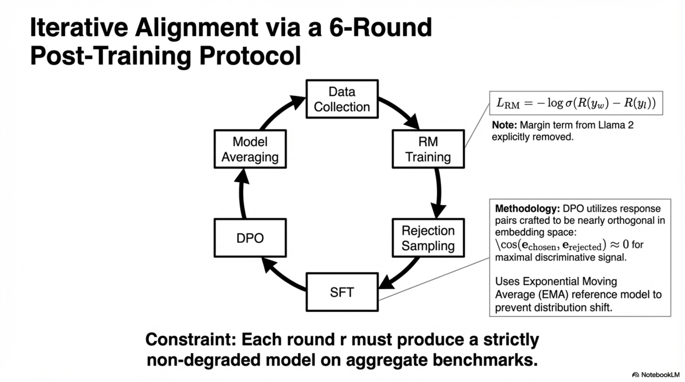
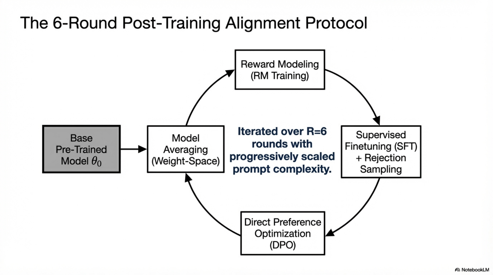
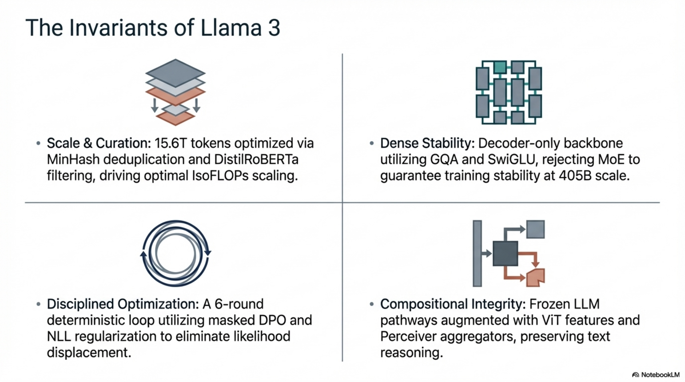

# Llama 3 Post-Training: End-to-End Technical Report

---

## 1. Stage Definition and Architectural Overview

### 1.1 Formal Problem Formulation

**Definition.** Post-training denotes all model training executed after pre-training, transforming a pre-trained base model $\theta_{\text{base}}$ into an aligned model $\theta_{\text{aligned}}$ through iterative application of supervised finetuning (SFT), reward modeling (RM), and direct preference optimization (DPO) across $R = 6$ rounds.

**Objective.** Given pre-trained parameters $\theta_{\text{base}} \in \mathbb{R}^d$ (where $d$ is the parameter count of the 405B model), the post-training pipeline solves:

$$\theta_{\text{aligned}} = \arg\min_{\theta} \; \mathbb{E}_{(x, y) \sim \mathcal{D}_{\text{post}}} \left[ \mathcal{L}_{\text{SFT}}(\theta; x, y) + \lambda_{\text{DPO}} \mathcal{L}_{\text{DPO}}(\theta, \theta_{\text{ref}}; x, y_w, y_l) \right]$$

where $\mathcal{D}_{\text{post}}$ is the composite post-training data distribution, $y_w$ and $y_l$ are chosen and rejected responses, and $\theta_{\text{ref}}$ is the SFT reference policy.

**Boundary Conditions.**
- Input: pre-trained checkpoint with 8K→128K context length
- Output: aligned model with capabilities across code, multilingual, math, reasoning, tool use, factuality, steerability, and long context
- Invariant: each round $r \in \{1, \ldots, 6\}$ must produce a strictly non-degraded model on aggregate benchmarks

**Pipeline Ordering (Deterministic):**

$$\text{Pre-trained } \theta_{\text{base}} \xrightarrow{\text{RM Training}} \theta_{\text{RM}} \xrightarrow{\text{SFT}} \theta_{\text{SFT}} \xrightarrow{\text{DPO}} \theta_{\text{DPO}} \xrightarrow{\text{Model Averaging}} \theta_{\text{round}_r}$$

This pipeline repeats for $R = 6$ rounds with progressively improved data.

---



*Figure. High-level post-training protocol, corresponding to the deterministic reward-model, SFT, DPO, and averaging sequence defined at the start of this report.*

## 2. Chat Dialog Format

### 2.1 Multi-Message Protocol

**Definition.** A structured token protocol enabling multi-message generation within a single dialog turn, supporting routing to multiple destinations (e.g., `user`, `ipython` for tool execution).

**Components:**
- **Header tokens**: Encode source and destination metadata per message segment
  - Format: `<|start_header_id|>{role}<|end_header_id|>`
  - Roles: `system`, `user`, `assistant`, `ipython`
- **Termination tokens**: Signal turn alternation between human and AI
  - `<|eot_id|>`: end of turn
  - `<|eom_id|>`: end of message (within a multi-message turn)

**Invariant.** Within a single assistant turn, multiple messages can be emitted to different destinations. The token stream must satisfy the grammar:

$$\text{Turn} ::= \text{Header}(\text{src}, \text{dst}) \; \text{Content} \; \text{Terminator} \; [\text{Turn}]$$

**Failure Modes:**
- Conflicting learning signals on common formatting tokens during DPO (addressed in Section 6.4)
- Premature termination token generation
- Tail repetition artifacts from formatting token interference

---

## 3. Reward Modeling

### 3.1 Definition

**Definition.** A reward model $r_\phi: \mathcal{X} \times \mathcal{Y} \rightarrow \mathbb{R}$ maps (prompt, response) pairs to scalar quality scores, initialized from the pre-trained checkpoint $\theta_{\text{base}}$.

### 3.2 Training Objective

The reward model is trained using the Bradley-Terry preference model. Given preference pairs $(y_w, y_l)$ for prompt $x$:

$$\mathcal{L}_{\text{RM}}(\phi) = -\mathbb{E}_{(x, y_w, y_l) \sim \mathcal{D}_{\text{pref}}} \left[ \log \sigma\left( r_\phi(x, y_w) - r_\phi(x, y_l) \right) \right]$$

**Key Modification from Llama 2:** The margin term $m(r)$ used in Llama 2's reward loss is **removed**:

$$\text{Llama 2: } \log \sigma\left( r_\phi(x, y_w) - r_\phi(x, y_l) - m(r) \right) \quad \longrightarrow \quad \text{Llama 3: } \log \sigma\left( r_\phi(x, y_w) - r_\phi(x, y_l) \right)$$

**Justification:** Diminishing improvements observed from margin after data scaling.

### 3.3 Three-Response Ranking Extension

For samples with an edited response, the ranking becomes $y_e \succ y_w \succ y_l$, creating three pairwise constraints:

$$\mathcal{L}_{\text{RM}}^{3}(\phi) = -\mathbb{E} \left[ \log \sigma(r_\phi(x, y_e) - r_\phi(x, y_w)) + \log \sigma(r_\phi(x, y_e) - r_\phi(x, y_l)) + \log \sigma(r_\phi(x, y_w) - r_\phi(x, y_l)) \right]$$

### 3.4 Training Efficiency Optimization

**Concatenation Strategy:** Prompt and all responses (2 or 3) are concatenated into a single training row with responses **randomly shuffled**. This approximates the standard separate-row approach while improving training throughput.

**Formal Approximation:** Let $\mathbf{s}_i = r_\phi(x, y_i)$ be computed from a shared forward pass over the concatenated sequence. The approximation error is bounded by the interaction between response representations through shared attention context, which empirically shows no accuracy loss.

### 3.5 Data Filtering

- Samples where chosen and rejected responses are labeled as similar are **discarded**
- Only samples with preference strength ∈ {significantly better, better} are retained
- All available preference data across rounds is used for RM training

### 3.6 Pseudo-Algorithm: Reward Model Training

```
ALGORITHM: RewardModelTraining
INPUT: pre-trained checkpoint θ_base, preference dataset D_pref
OUTPUT: reward model parameters φ*

1. Initialize φ ← θ_base
2. Filter D_pref: remove samples with similar responses
3. Filter D_pref: retain only {significantly_better, better} pairs
4. FOR each batch B ∈ D_pref:
   a. FOR each sample (x, {y_e, y_w, y_l}) ∈ B:
      i.   Randomly shuffle response ordering
      ii.  Concatenate: seq = [x; y_σ(1); y_σ(2); (y_σ(3))]
      iii. Forward pass: compute r_φ(x, y_i) for each response
      iv.  Compute pairwise losses for all valid pairs
   b. Aggregate loss over batch
   c. Update φ via gradient descent
5. RETURN φ*
```

### 3.7 Failure Modes

| Failure Mode | Manifestation | Mitigation |
|---|---|---|
| Reward hacking | Model exploits surface patterns (length, formatting) | Multi-signal quality scoring |
| Calibration collapse | RM scores not calibrated across domains | Domain-stratified training |
| Preference noise | Annotator disagreement on marginal pairs | Filter marginally-better samples |

---

## 4. Preference Data Pipeline

### 4.1 Annotation Protocol

**Definition.** Human annotators interact with multiple deployed models in multi-turn dialog, comparing two responses per turn sampled from different models with potentially different data mixes and alignment recipes.

**Annotation Schema:**
1. **Preference ranking**: 4-level strength scale
   - Significantly better
   - Better
   - Slightly better
   - Marginally better
2. **Editing step**: Annotators optionally edit the chosen response or prompt the model to self-refine
3. **Result**: Each sample yields 2 or 3 responses: $(y_e \succ y_w \succ y_l)$ or $(y_w \succ y_l)$

### 4.2 Data Statistics

| Dataset | % of comparisons | Avg. turns/dialog | Avg. tokens/example | Avg. prompt tokens | Avg. response tokens |
|---|---|---|---|---|---|
| General English | 81.99% | 4.1 | 1000.4 | 36.4 | 271.2 |
| Coding | 6.93% | 3.2 | 1621.0 | 113.8 | 462.9 |
| Multilingual | 5.19% | 1.8 | 1299.4 | 77.1 | 420.9 |
| Reasoning & Tools | 5.89% | 1.6 | 707.7 | 46.6 | 129.9 |
| **Total** | **100%** | **3.8** | **1041.6** | **44.5** | **284.0** |

### 4.3 Data Routing

- **Reward Modeling**: All available preference data across all rounds
- **DPO**: Only the most recent batches from each capability domain
- **Rationale**: DPO training data must conform to the current policy distribution $\pi_\theta$ being optimized, as distribution mismatch degrades DPO convergence

### 4.4 Diversity Mechanism

Responses are sampled from **two different models** per prompt, where models differ in:
- Data mix composition
- Alignment recipe
- Capability strength (e.g., code expertise)

This ensures annotation diversity spans both capability and stylistic dimensions.

---

## 5. Supervised Finetuning (SFT)

### 5.1 Formal Objective

Given SFT dataset $\mathcal{D}_{\text{SFT}} = \{(x_i, y_i)\}_{i=1}^N$ where $x_i$ is the prompt (including dialog history) and $y_i$ is the target response:

$$\mathcal{L}_{\text{SFT}}(\theta) = -\mathbb{E}_{(x, y) \sim \mathcal{D}_{\text{SFT}}} \left[ \sum_{t=1}^{|y|} \log p_\theta(y_t | x, y_{<t}) \right]$$

**Critical Detail:** Loss is computed **only on target tokens** $y_t$; prompt tokens $x$ are **masked** from the loss computation:

$$\mathcal{L}_{\text{SFT}}(\theta) = -\sum_{t=1}^{|y|} \log p_\theta(y_t | x, y_{<t}) \cdot \mathbb{1}[t \in \text{response tokens}]$$

### 5.2 Data Sources

1. **Rejection-sampled data**: Human annotation prompts with best responses selected by RM
2. **Synthetic data**: Targeting specific capabilities (code, math, tool use, long context, factuality)
3. **Human-curated data**: Small amounts of expert-annotated data for specific skills

### 5.3 SFT Data Statistics

| Dataset | % examples | Avg. turns | Avg. tokens | Context tokens | Response tokens |
|---|---|---|---|---|---|
| General English | 52.66% | 6.3 | 974.0 | 656.7 | 317.1 |
| Code | 14.89% | 2.7 | 753.3 | 378.8 | 374.5 |
| Multilingual | 3.01% | 2.7 | 520.5 | 230.8 | 289.7 |
| Exam-like | 8.14% | 2.3 | 297.8 | 124.4 | 173.4 |
| Reasoning & Tools | 21.19% | 3.1 | 661.6 | 359.8 | 301.9 |
| Long context | 0.11% | 6.7 | 38,135.6 | 37,395.2 | 740.5 |
| **Total** | **100%** | **4.7** | **846.1** | **535.7** | **310.4** |

### 5.4 Rejection Sampling

**Definition.** For each prompt $x$, sample $K$ responses $\{y^{(1)}, \ldots, y^{(K)}\}$ from the current best policy $\pi_{\theta_{\text{best}}}$ and select the response maximizing the reward:

$$y^* = \arg\max_{y^{(k)}, k \in [K]} r_\phi(x, y^{(k)})$$

**Hyperparameters:**
- $K \in [10, 30]$ (typically)
- Policy: best checkpoint from previous post-training round or best capability-specific checkpoint
- System prompts applied in later rounds to steer tone, style, and formatting

**Computational Optimization via PagedAttention:**
- Dynamic KV-cache allocation eliminates fixed memory pre-allocation waste
- KV-cache pages for prompt $x$ are **shared** across all $K$ output candidates
- Maximum output length pre-defined; requests admitted only if sufficient memory exists
- Swap-out eliminated by admission control
- **Throughput improvement**: $> 2\times$ over baseline rejection sampling

**Formal Memory Model:** Let $M_{\text{prompt}}$ be the KV-cache memory for prompt $x$, and $M_{\text{max\_output}}$ be the maximum per-output KV memory. With page sharing:

$$M_{\text{RS}}(x, K) = M_{\text{prompt}} + K \cdot M_{\text{max\_output}}$$

versus the non-shared baseline:

$$M_{\text{baseline}}(x, K) = K \cdot (M_{\text{prompt}} + M_{\text{max\_output}})$$

yielding savings factor:

$$\text{Savings} = \frac{K \cdot M_{\text{prompt}} + K \cdot M_{\text{max\_output}}}{M_{\text{prompt}} + K \cdot M_{\text{max\_output}}} = \frac{K(M_{\text{prompt}} + M_{\text{max\_output}})}{M_{\text{prompt}} + K \cdot M_{\text{max\_output}}}$$

### 5.5 Training Hyperparameters

| Parameter | Value |
|---|---|
| Learning rate | $10^{-5}$ |
| Training steps | 8,500 – 9,000 |
| Loss masking | Prompt tokens masked |
| Data epochs | Multiple epochs on high-quality sources; downsampled on others |

### 5.6 Pseudo-Algorithm: SFT Pipeline

```
ALGORITHM: SupervisedFinetuning
INPUT: pre-trained θ_base, SFT data D_SFT, reward model r_φ
OUTPUT: SFT model θ_SFT

1. Initialize θ ← θ_base
2. FOR each prompt x in human annotation set:
   a. Sample K responses {y^(1), ..., y^(K)} from π_{θ_best}
      - Use PagedAttention with shared prompt KV-cache
      - Apply system prompts for style/format steering
   b. Select y* = argmax_k r_φ(x, y^(k))
   c. Add (x, y*) to D_RS
3. Merge D_RS with synthetic data and human-curated data → D_SFT
4. Apply data processing pipeline (Section 8):
   - Topic classification
   - Quality scoring (RM + Llama-based)
   - Difficulty scoring (Instag + Llama-based)
   - Semantic deduplication
5. FOR step = 1 to 9000:
   a. Sample batch B from D_SFT
   b. Compute L_SFT = -Σ log p_θ(y_t | x, y_{<t}) for response tokens only
   c. Update θ via AdamW with lr = 1e-5
6. RETURN θ_SFT
```

### 5.7 Failure Modes

| Failure Mode | Cause | Mitigation |
|---|---|---|
| Reward hacking via RS | RM exploits surface features | Model-as-judge + execution feedback filtering |
| Quality degradation on 405B self-distillation | 405B training on own generated data | Execution feedback as external ground truth |
| Distribution mismatch | RS policy diverges from final deployment policy | Use latest best checkpoint per round |
| Over-fitting to synthetic | Synthetic data artifacts | Data mix balancing, quality filtering |

---

## 6. Direct Preference Optimization (DPO)

### 6.1 Formal Objective

Given preference dataset $\mathcal{D}_{\text{DPO}} = \{(x_i, y_w^{(i)}, y_l^{(i)})\}$ and reference policy $\pi_{\text{ref}} = \pi_{\theta_{\text{SFT}}}$:

$$\mathcal{L}_{\text{DPO}}(\theta) = -\mathbb{E}_{(x, y_w, y_l) \sim \mathcal{D}_{\text{DPO}}} \left[ \log \sigma \left( \beta \log \frac{\pi_\theta(y_w | x)}{\pi_{\text{ref}}(y_w | x)} - \beta \log \frac{\pi_\theta(y_l | x)}{\pi_{\text{ref}}(y_l | x)} \right) \right]$$

where $\beta = 0.1$ controls the strength of the KL constraint.

### 6.2 DPO as Implicit Reward Model

DPO reparameterizes the reward function as:

$$r_\theta(x, y) = \beta \log \frac{\pi_\theta(y | x)}{\pi_{\text{ref}}(y | x)} + \beta \log Z(x)$$

where $Z(x)$ is the partition function. This eliminates the need for explicit reward model evaluation during optimization, reducing compute compared to PPO.

### 6.3 Hyperparameters

| Parameter | Value |
|---|---|
| Learning rate | $10^{-5}$ |
| $\beta$ | 0.1 |
| NLL regularization coefficient $\alpha$ | 0.2 |
| Data source | Most recent preference batches per round |

### 6.4 Algorithmic Modifications

#### 6.4.1 Formatting Token Masking

**Problem.** Special formatting tokens (headers, terminators) appear identically in both $y_w$ and $y_l$. The DPO loss simultaneously pushes to increase $\pi_\theta(y_w | x)$ and decrease $\pi_\theta(y_l | x)$, creating a **conflicting gradient signal** on shared tokens:

$$\nabla_\theta \mathcal{L}_{\text{DPO}} \text{ on token } t_{\text{fmt}} \propto \underbrace{+\nabla \log \pi_\theta(t_{\text{fmt}} | \cdot)}_{\text{from } y_w} + \underbrace{-\nabla \log \pi_\theta(t_{\text{fmt}} | \cdot)}_{\text{from } y_l} \approx 0 + \text{noise}$$

This stochastic near-cancellation with residual noise causes:
- Tail repetition
- Abrupt termination token generation
- Format instability

**Solution.** Define mask $\mathcal{M}(y) = \{t : t \notin \text{formatting tokens}\}$ and compute log-probabilities only over non-formatting tokens:

$$\log \pi_\theta(y | x) = \sum_{t \in \mathcal{M}(y)} \log p_\theta(y_t | x, y_{<t})$$

#### 6.4.2 NLL Regularization

**Problem.** Standard DPO can decrease the log-probability of chosen responses (the "likelihood displacement" phenomenon).

**Solution.** Add an NLL loss term on chosen sequences:

$$\mathcal{L}_{\text{DPO+NLL}}(\theta) = \mathcal{L}_{\text{DPO}}(\theta) - \alpha \sum_{t=1}^{|y_w|} \log p_\theta(y_{w,t} | x, y_{w,<t})$$

with $\alpha = 0.2$. The combined gradient:

$$\nabla_\theta \mathcal{L}_{\text{total}} = \nabla_\theta \mathcal{L}_{\text{DPO}} + \alpha \nabla_\theta \mathcal{L}_{\text{NLL}}(y_w)$$

ensures that the chosen response probability is actively maintained, preventing distribution collapse.

### 6.5 DPO vs. PPO Decision

**Empirical Finding:** DPO outperforms PPO for Llama 3 405B, especially on instruction following benchmarks (IFEval), while requiring substantially less compute.

**Analysis:**
- PPO requires: critic network training, rollout generation, GAE estimation, multiple optimization epochs per batch
- DPO requires: only paired forward passes through the policy
- Compute ratio: $\text{Cost}_{\text{PPO}} / \text{Cost}_{\text{DPO}} \gg 1$ at 405B scale
- PPO's advantage in on-policy optimization is offset by the on-distribution nature of the latest-batch DPO data strategy

### 6.6 Data Strategy for DPO

- **Only most recent** preference batches from current round
- Rationale: recent data is closer to $\pi_{\theta_{\text{SFT}}}$ distribution, minimizing the covariate shift between the implicit reference policy and the data-generating policy
- Only {significantly better, better} pairs retained

### 6.7 Pseudo-Algorithm: DPO Training

```
ALGORITHM: DirectPreferenceOptimization
INPUT: SFT model θ_SFT, latest preference data D_DPO
OUTPUT: aligned model θ_DPO

1. Initialize θ ← θ_SFT, θ_ref ← θ_SFT (frozen copy)
2. Filter D_DPO: retain {significantly_better, better} pairs only
3. FOR each batch B ∈ D_DPO:
   a. FOR each (x, y_w, y_l) ∈ B:
      i.   Compute masked log-probs:
           log_π_θ(y_w|x) = Σ_{t ∈ M(y_w)} log p_θ(y_{w,t} | x, y_{w,<t})
           log_π_θ(y_l|x) = Σ_{t ∈ M(y_l)} log p_θ(y_{l,t} | x, y_{l,<t})
      ii.  Compute reference log-probs similarly with θ_ref
      iii. Compute implicit rewards:
           r_w = β(log_π_θ(y_w|x) - log_π_ref(y_w|x))
           r_l = β(log_π_θ(y_l|x) - log_π_ref(y_l|x))
      iv.  L_DPO = -log σ(r_w - r_l)
      v.   L_NLL = -Σ_{t=1}^{|y_w|} log p_θ(y_{w,t} | x, y_{w,<t})
      vi.  L_total = L_DPO + 0.2 * L_NLL
   b. Update θ via AdamW with lr = 1e-5
4. RETURN θ_DPO
```

### 6.8 Convergence Dynamics

The DPO loss landscape for the combined objective:

$$\mathcal{L}_{\text{total}} = \mathcal{L}_{\text{DPO}} + \alpha \mathcal{L}_{\text{NLL}}$$

The NLL term acts as an anchor preventing the policy from drifting too far in directions that decrease chosen-response likelihood. The gradient magnitude of the NLL term scales as $O(\alpha / |y_w|)$ per token, while the DPO gradient scales as $O(\beta)$ per preference pair. With $\alpha = 0.2$ and $\beta = 0.1$, the two signals are comparable in magnitude, ensuring stable training.

### 6.9 Failure Modes

| Failure Mode | Mechanism | Mitigation |
|---|---|---|
| Likelihood displacement | DPO reduces $\pi_\theta(y_w)$ while increasing margin | NLL regularization ($\alpha = 0.2$) |
| Format collapse | Conflicting gradient on shared tokens | Formatting token masking |
| Distribution shift | Training data from old policy | Use only latest-round preference data |
| Over-optimization | Implicit reward exploited past RM accuracy | Limited DPO steps; model averaging |

---

## 7. Model Averaging

### 7.1 Definition

**Definition.** Given $M$ model checkpoints $\{\theta^{(1)}, \ldots, \theta^{(M)}\}$ obtained from different hyperparameter or data configurations at a given stage (RM, SFT, or DPO):

$$\theta_{\text{avg}} = \frac{1}{M} \sum_{m=1}^{M} \theta^{(m)}$$

### 7.2 Theoretical Justification

Model averaging in weight space exploits the observation that for models trained from the same pre-trained initialization, the loss landscape exhibits a connected low-loss basin (mode connectivity). Averaging produces a point within this basin that:

1. **Reduces variance**: $\text{Var}[\theta_{\text{avg}}] = \frac{1}{M} \text{Var}[\theta^{(m)}]$ (assuming independence)
2. **Improves calibration**: Smooths out optimization trajectory noise
3. **Combines strengths**: Different data mixes or hyperparameters produce complementary strengths

### 7.3 Application Points

- After **RM training**: Average reward models from different data configurations
- After **SFT**: Average checkpoints from different data mixes
- After **DPO**: Average aligned models from different hyperparameter sweeps

---

## 8. Data Processing and Quality Control Pipeline

### 8.1 Data Cleaning (Rule-Based)

**Objective.** Remove systematic artifacts from model-generated data.

**Operations:**
- **Pattern identification**: Detect overused phrases ("I'm sorry", "I apologize", excessive emojis, excessive exclamation points)
- **Proportion balancing**: Rather than complete removal, carefully balance the proportion of samples exhibiting each pattern
- **Rule-based filtering**: Remove samples matching predefined regex patterns for known failure modes

### 8.2 Data Pruning (Model-Based)

#### 8.2.1 Topic Classification

**Method:** Finetune Llama 3 8B as a hierarchical topic classifier.

**Granularity:**
- **Coarse**: e.g., "mathematical reasoning"
- **Fine**: e.g., "geometry and trigonometry"

**Purpose:** Enable fine-grained control of data mix proportions across capability domains.

#### 8.2.2 Quality Scoring

**Dual-Signal Approach:**

1. **RM-based score**: Apply reward model to each sample; retain top quartile ($Q_{75}$ threshold):
$$q_{\text{RM}}(x, y) = \mathbb{1}\left[r_\phi(x, y) \geq \text{percentile}_{75}(r_\phi)\right]$$

2. **Llama-based score**: Prompt Llama 3 to rate each sample:
   - General English: 3-point scale on {accuracy, instruction following, tone/presentation}
   - Coding: 2-point scale on {bug identification, user intention}
   - High quality = maximum score achieved

3. **Combination**: RM and Llama-based scores exhibit **high disagreement rates**. Union filter yields best recall:
$$q_{\text{final}}(x, y) = q_{\text{RM}}(x, y) \lor q_{\text{Llama}}(x, y)$$

#### 8.2.3 Difficulty Scoring

**Dual-Signal Approach:**

1. **Instag**: Prompt Llama 3 70B to tag intentions in SFT prompts. Complexity proxy:
$$d_{\text{Instag}}(x) = |\text{intention\_tags}(x)|$$

2. **Llama-based difficulty**: Prompt Llama 3 to rate difficulty on 3-point scale:
$$d_{\text{Llama}}(x) \in \{1, 2, 3\}$$

#### 8.2.4 Semantic Deduplication

**Procedure:**

1. **Embed**: Compute RoBERTa embeddings for complete dialogs: $e_i = \text{RoBERTa}(\text{dialog}_i)$
2. **Cluster**: Cluster embeddings via standard algorithm (e.g., k-means or hierarchical)
3. **Sort**: Within each cluster, sort by composite score:
$$s_i = q_{\text{final}}(x_i, y_i) \times d_{\text{composite}}(x_i)$$
4. **Greedy selection**: Iterate through sorted examples; retain example $i$ only if:
$$\max_{j \in \text{selected}} \cos(e_i, e_j) < \tau$$
where $\tau$ is the similarity threshold.

### 8.3 Pseudo-Algorithm: Data Processing Pipeline

```
ALGORITHM: DataProcessingPipeline
INPUT: raw SFT data D_raw
OUTPUT: curated SFT data D_curated

1. RULE-BASED CLEANING:
   a. Apply regex filters for overused phrases
   b. Balance proportions of apologetic/emoji-heavy samples
   c. Remove structurally malformed samples

2. TOPIC CLASSIFICATION:
   a. Run Llama-3-8B topic classifier on all samples
   b. Assign coarse + fine topic labels

3. QUALITY SCORING:
   a. Compute r_φ(x, y) for all samples via reward model
   b. Mark RM-high-quality if r_φ ≥ Q_75 threshold
   c. Prompt Llama 3 for quality rating
   d. Mark Llama-high-quality if max score achieved
   e. Retain samples satisfying: q_RM OR q_Llama

4. DIFFICULTY SCORING:
   a. Run Instag: count intention tags
   b. Prompt Llama 3 for difficulty rating
   c. Compute composite difficulty score

5. SEMANTIC DEDUPLICATION:
   a. Embed all dialogs with RoBERTa
   b. Cluster embeddings
   c. Sort within clusters by quality × difficulty
   d. Greedy select with cosine threshold τ

6. DATA MIX TUNING:
   a. Adjust proportions per topic/capability
   b. Epoch high-quality sources multiple times
   c. Downsample lower-quality sources

7. RETURN D_curated
```

---

## 9. Iterative Rounds

### 9.1 Round Structure

The full post-training pipeline executes $R = 6$ rounds. Each round $r$:

$$\text{Round } r: \quad \theta_{\text{base}} \xrightarrow{\text{RM}_r} \theta_{\text{RM}}^{(r)} \xrightarrow{\text{SFT}_r} \theta_{\text{SFT}}^{(r)} \xrightarrow{\text{DPO}_r} \theta_{\text{DPO}}^{(r)} \xrightarrow{\text{Avg}} \theta^{(r)}$$



*Figure. Iterative six-round alignment loop, corresponding to the round-structure and convergence-invariant discussion in Section 9.*

### 9.2 Inter-Round Data Flow

- New preference annotations collected using $\theta^{(r-1)}$ as the deployed model
- Synthetic data generated from $\theta^{(r-1)}$
- Prompt complexity increases as model improves
- RM uses **all** cumulative preference data
- DPO uses **only** latest-round preference data

### 9.3 Convergence Invariant

Each round must satisfy:

$$\text{BenchmarkScore}(\theta^{(r)}) \geq \text{BenchmarkScore}(\theta^{(r-1)}) \quad \forall \text{ aggregate benchmarks}$$

---

## 10. Capability-Specific Pipelines

### 10.1 Code (Section 4.3.1)

#### 10.1.1 Code Expert Training

**Architecture:** Branch from main pre-training run at checkpoint $\theta_{\text{branch}}$.

**Training Pipeline:**
1. Continue pre-training on 1T token mix with $>85\%$ code data
2. Long-context finetuning (LCFT) for last several thousand steps → 16K context on repo-level code
3. Post-training: SFT + DPO with code-focused data mixes
4. Use as rejection sampling policy for coding prompts

#### 10.1.2 Synthetic Code Data Generation

**Total volume:** $>2.7$M synthetic SFT dialogs across three methods:

**Method 1: Execution Feedback (≈1M dialogs)**

```
ALGORITHM: CodeSyntheticWithExecutionFeedback
INPUT: code snippet corpus, Llama 3 model
OUTPUT: validated coding dialogs

1. PROBLEM GENERATION:
   a. Sample random code snippets from diverse sources
   b. Prompt model to generate programming problems inspired by snippets
   c. Ensure long-tail topic diversity

2. SOLUTION GENERATION:
   a. For each problem, prompt Llama 3 with:
      - Problem description
      - Target programming language
      - General rules of good programming
      - Requirement to explain thought process in comments
   b. Generate candidate solution

3. CORRECTNESS ANALYSIS:
   a. STATIC ANALYSIS:
      - Parse source code (syntax check)
      - Run linter (style, typing, uninitialized variables, missing imports)
   b. DYNAMIC ANALYSIS:
      - Prompt model to generate unit tests
      - Execute solution + tests in containerized environment
      - Check: runtime errors, semantic errors

4. ERROR FEEDBACK & SELF-CORRECTION:
   a. IF solution fails any check:
      - Construct correction prompt: [problem, faulty solution, error output]
      - Model may either fix code OR modify tests
      - Re-run checks
   b. REPEAT until pass or max iterations

5. FILTER: Include only dialogs passing all checks
   - ~20% of solutions initially incorrect but self-corrected

6. ITERATE: Repeat across post-training rounds with improved models
```

**Key Finding:** Training Llama 3 405B on its own generated data without execution feedback **degrades performance**. Execution feedback provides external ground truth that breaks the self-reinforcement loop.

**Method 2: Programming Language Translation (volume: subset of 2.7M)**

$$\text{Performance}(\text{Python/C++}) \gg \text{Performance}(\text{TypeScript/PHP})$$

**Procedure:**
1. Select high-quality code in high-resource language (Python, C++)
2. Prompt Llama 3 to translate to low-resource language (TypeScript, PHP, Rust, etc.)
3. Validate via: syntax parsing → compilation → execution
4. Add validated translations to SFT data

**Method 3: Backtranslation (≈1.2M dialogs)**

For capabilities where execution feedback is less informative (documentation, explanation, debugging):

```
ALGORITHM: CodeBacktranslation
INPUT: code snippets from pre-training, Llama 3
OUTPUT: high-quality capability-specific dialogs

1. GENERATE: Prompt model to produce target capability output
   - e.g., add comments/docstrings to code, or explain code

2. BACKTRANSLATE: Prompt model to reconstruct original code
   from the generated output alone
   - e.g., generate code from documentation only

3. FILTER: Use original code as reference
   - Prompt Llama 3 to score faithfulness of backtranslation
   - Retain highest self-verification scores

4. OUTPUT: (capability_output, backtranslated_code) pairs for SFT
```

#### 10.1.3 System Prompt Steering for Rejection Sampling

During RS, code-specific system prompts applied to improve:
- Code readability
- Documentation quality
- Variable naming informativeness
- Memory efficiency
- Comment coverage

#### 10.1.4 Code Quality Filtering

**Problem:** Rejection-sampled responses mix natural language and code; code may not always be executable (e.g., pseudo-code, code snippets).

**Solution:** Model-as-judge with Llama 3:
- Score on two binary criteria: **code correctness** (0/1) + **code style** (0/1)
- Retain only samples scoring 2/2
- **Issue:** Stringent filtering disproportionately removes hard prompts → regression
- **Fix:** Strategically revise responses for hardest prompts until they pass judge criteria
- **Result:** Balance between quality and difficulty, optimal downstream performance

---

### 10.2 Multilinguality (Section 4.3.2)

#### 10.2.1 Multilingual Expert Training

**Procedure:**
1. Branch from pre-training run
2. Continue pre-training with 90% multilingual tokens
3. Apply standard post-training (SFT + DPO)
4. Use for annotation collection until main pre-training completes

**Target languages:** German, French, Italian, Portuguese, Hindi, Spanish, Thai

#### 10.2.2 Multilingual SFT Data Composition

| Source | Proportion | Description |
|---|---|---|
| Human annotations | 2.4% | Native speakers, open-ended real-world prompts |
| Other NLP tasks | 44.2% | Reformatted into dialog format (exams-qa, Conic10k, GlobalVoices, Wikimedia) |
| Rejection sampled | 18.8% | RS on human prompts with multilingual-specific checks |
| Translated reasoning | 34.6% | Math/quantitative reasoning translated from English |

#### 10.2.3 Multilingual-Specific Processing

**Generation (RS):**
- Temperature: explored random $T \in [0.2, 1.0]$ in early rounds; fixed $T = 0.6$ in final round
- Trade-off: high $T$ → creative but code-switching artifacts; low $T$ → safe but less diverse
- Specialized system prompts for format/structure/readability

**Selection (RS):**
- Pre-RM filtering: language match check between prompt and response
- Script consistency: e.g., romanized Hindi prompt must not receive Devanagari response

**Data Quality:**
- LID-based filtering
- Blaser2.0 quality scoring for parallel text
- Multilingual dialog templates (Wei et al., 2022a style) instead of raw bitext pairs

**Translation Policy:**
- **Avoid** machine-translated data to prevent translationese, name bias, gender bias, cultural bias
- **Exception**: Translated quantitative reasoning data (simple language, negligible quality issues)
- **Validation**: Strong gains on MGSM benchmark

---

### 10.3 Math and Reasoning (Section 4.3.3)

#### 10.3.1 Challenge Taxonomy

| Challenge | Description |
|---|---|
| Lack of prompts | Valid prompts decrease with complexity; long-tail scarcity |
| No ground truth CoT | Step-by-step solutions often unavailable |
| Incorrect intermediate steps | Model-generated CoT may contain invalid reasoning |
| Tool integration | Code interpreter interleaving for computation |
| Train-inference discrepancy | Training ≠ interactive inference with feedback |

#### 10.3.2 Methodological Solutions

**1. Prompt Sourcing:**
- Extract math-relevant pre-training data → convert to QA format
- Construct mathematical skill taxonomy
- Human annotators provide prompts targeting identified skill gaps

**2. Step-wise Reasoning Trace Augmentation:**

For prompt $x$ with known answer $a^*$:

$$\{y^{(1)}, \ldots, y^{(K)}\} \sim \pi_\theta(\cdot | x)$$

$$\mathcal{D}_{\text{filtered}} = \{(x, y^{(k)}) : \text{FinalAnswer}(y^{(k)}) = a^*\}$$

Additional self-verification: prompt Llama 3 to validate whether each step-by-step solution is logically valid.

**3. Reward Model-Based Filtering:**

Train **outcome reward model** (ORM) and **process reward model** (PRM):

$$r_{\text{ORM}}(x, y) \in \mathbb{R} \quad \text{(scores final answer correctness)}$$

$$r_{\text{PRM}}(x, y, t) \in \mathbb{R} \quad \text{(scores step } t \text{ correctness)}$$

For challenging prompts, apply **Monte Carlo Tree Search (MCTS)** with learned step-wise reward:

$$\text{MCTS}(x; \pi_\theta, r_{\text{PRM}}) \rightarrow y_{\text{valid}}$$

**4. Interleaved Code-Text Reasoning:**

Model prompted to solve via alternating textual reasoning and Python code:

$$y = [t_1, c_1, \text{exec}(c_1), t_2, c_2, \text{exec}(c_2), \ldots, t_n, a_{\text{final}}]$$

Code execution provides feedback signal; invalid reasoning chains filtered.

**5. Learning from Feedback:**

$$y_{\text{incorrect}} \sim \pi_\theta(x) \quad \text{s.t. FinalAnswer}(y_{\text{incorrect}}) \neq a^*$$

$$y_{\text{corrected}} \sim \pi_\theta(\cdot | x, y_{\text{incorrect}}, \text{error\_signal})$$

Iterative self-correction teaching the model to reason from mistakes.

---

### 10.4 Long Context (Section 4.3.4)

#### 10.4.1 Problem Statement

Pre-training extends context from 8K → 128K tokens. SFT with only short-context data causes **significant regression** in long-context capabilities.

#### 10.4.2 Synthetic Long-Context Data Generation

| Type | Method | Sequence Lengths |
|---|---|---|
| Question Answering | Split docs into 8K chunks → generate QA on random chunks → train with full doc as context | 16K, 32K, 64K, 128K |
| Summarization | Hierarchical: summarize 8K chunks → summarize summaries → train with full doc + summarization prompt; also generate QA requiring global understanding | 16K, 32K, 64K, 128K |
| Code Reasoning | Parse Python imports → identify high-dependency files (≥5 dependents) → remove one → prompt model to identify dependents + generate missing code | 16K, 32K, 64K, 128K |

#### 10.4.3 Optimal Mixing Ratio

**Finding:** $0.1\%$ long-context synthetic data mixed with original short-context data optimizes both short and long context benchmarks.

$$\mathcal{D}_{\text{SFT}}^{\text{long}} = 0.999 \cdot \mathcal{D}_{\text{short}} + 0.001 \cdot \mathcal{D}_{\text{long-synthetic}}$$

#### 10.4.4 DPO for Long Context

**Finding:** Short-context-only DPO does **not** degrade long-context performance when the SFT model is high quality on long-context tasks.

**Hypothesis:** DPO has fewer optimizer steps than SFT, insufficient to overwrite long-context capabilities.

**Decision:** Standard short-context DPO recipe applied on top of long-context SFT checkpoints.

---

### 10.5 Tool Use (Section 4.3.5)

#### 10.5.1 Supported Tools

| Tool | Capability |
|---|---|
| Brave Search | Real-time web information retrieval beyond knowledge cutoff |
| Python Interpreter | Complex computation, file processing, data analysis, visualization |
| Wolfram Alpha API | Precise math/science computation, database queries |

#### 10.5.2 Implementation Architecture

- All core tools implemented as **Python objects** with methods
- Zero-shot tools: Python functions with descriptions + docstrings
- Function definitions convertible to **JSON format** for web API calls
- Python interpreter **must be enabled** in system prompt
- Core tools individually enable/disable via system prompt

#### 10.5.3 Multi-Message Turn Format

Tool use requires multi-message assistant turns:

$$\text{assistant} \rightarrow \text{ipython (tool call)} \rightarrow \text{tool output} \rightarrow \text{assistant (reasoning)} \rightarrow [\text{more tool calls}] \rightarrow \text{final answer}$$

#### 10.5.4 Annotation Protocol Differences

1. **Message-level annotation** (not turn-level): Annotators provide preference between two assistant messages with same context, enabling granular feedback on both tool calling and tool output reasoning
2. **No rejection sampling**: No gains observed on tool benchmarks from RS
3. **Progressive complexity**: Start with single-turn → dialog-level → multi-step + data analysis

#### 10.5.5 Tool Data Generation Pipeline

**Single-Step Tool Use:**

```
ALGORITHM: SingleStepToolData
1. Few-shot generate synthetic user prompts requiring one core tool
2. Few-shot generate appropriate tool calls
3. Execute tool calls; add outputs to context
4. Generate final answer conditioned on tool output
5. Filter ~30% for execution errors / formatting issues
6. Output: (system_prompt, user_prompt, tool_call, tool_output, final_answer)
```

**Multi-Step Tool Use:**

```
ALGORITHM: MultiStepToolData
1. Prompt Llama 3 to generate prompts requiring ≥2 tool calls
2. Few-shot generate solutions with interleaved reasoning + tool calls (ReAct-style)
3. Execute all tool calls in sequence
4. Validate reasoning chain
```

**File Uploads:**
- Supported formats: `.txt`, `.docx`, `.pdf`, `.pptx`, `.xlsx`, `.csv`, `.tsv`, `.py`, `.json`, `.jsonl`, `.html`, `.xml`
- Tasks: summarization, bug finding/fixing, code optimization, data analysis, visualization

**Zero-Shot Tool Use Data:**
- **Single/nested/parallel function calling**: Mine function definitions from The Stack → extract calls → clean/filter → generate natural language queries via Llama 3
- **Multi-turn function calling**: Multi-agent generation (Li et al., 2023b style) with domain, API, query, call, and response agents, all Llama 3 variants with different prompts

#### 10.5.6 Negative Examples

Add easy math/QA queries **without** tool usage (but with tools activated in system prompt) to teach the model when **not** to invoke tools.

---

### 10.6 Factuality (Section 4.3.6)

#### 10.6.1 Design Principle

> Post-training should align the model to **"know what it knows"** rather than add knowledge.

#### 10.6.2 Knowledge Probing Pipeline

```
ALGORITHM: FactualityDataGeneration
INPUT: pre-training corpus, Llama 3
OUTPUT: factuality-aligned training data

1. EXTRACT data snippet from pre-training data
2. GENERATE factual question about snippet using Llama 3
3. SAMPLE N responses from Llama 3 to the question
4. SCORE CORRECTNESS: use original snippet as reference + Llama-as-judge
5. SCORE INFORMATIVENESS: use Llama-as-judge
6. CLASSIFY each generation:
   - Consistently informative AND correct → retain as positive example
   - Consistently informative AND incorrect → generate REFUSAL using Llama 3
   - Not informative → discard
7. OUTPUT:
   - Positive: (question, correct_response) for answerable questions
   - Refusal: (question, refusal_response) for questions beyond model knowledge
```

#### 10.6.3 Sensitive Topics

Separately collect labeled factuality data for sensitive topics where pre-training data contains factually contradictory or incorrect statements.

---

### 10.7 Steerability (Section 4.3.7)

#### 10.7.1 Definition

**Steerability**: The model's ability to conform to developer/user specifications provided via system prompts covering response length, format, tone, character, and persona.

#### 10.7.2 Data Collection

- Annotators design custom system prompts (see example in source text)
- Multi-turn conversations evaluating instruction consistency over extended dialog
- Preference data collected under general English category

#### 10.7.3 Integration Points

Steerability preference data flows into:
1. **Reward modeling**: RM learns to score adherence to system prompt
2. **Rejection sampling**: RS with system prompts → higher-quality steered responses
3. **SFT**: Steered examples in training mix
4. **DPO**: Preference pairs testing steerability compliance

---

## 11. Complete Post-Training Pipeline: End-to-End Pseudo-Algorithm

```
ALGORITHM: Llama3PostTraining
INPUT: pre-trained checkpoint θ_base, annotation infrastructure
OUTPUT: aligned model θ_aligned

FOR round r = 1 TO 6:

  ═══════════════════════════════════════
  PHASE 1: DATA COLLECTION
  ═══════════════════════════════════════
  1a. Deploy θ^{(r-1)} (or θ_base if r=1) and variant models
  1b. Collect human preference annotations:
      - Multi-turn dialogs with 2 responses per turn from different models
      - 4-level preference ranking + optional editing
      - Message-level annotation for tool use
  1c. Generate synthetic data using θ^{(r-1)}:
      - Code: execution feedback, translation, backtranslation
      - Math: CoT generation, MCTS, interleaved code-text
      - Long context: QA, summarization, code reasoning
      - Tool use: single-step, multi-step, file uploads, zero-shot
      - Factuality: knowledge probing pipeline
  1d. Increase prompt complexity proportional to model improvement

  ═══════════════════════════════════════
  PHASE 2: DATA PROCESSING
  ═══════════════════════════════════════
  2a. Rule-based cleaning (patterns, proportions)
  2b. Topic classification (Llama 3 8B classifier)
  2c. Quality scoring (RM top-25% ∪ Llama max-score)
  2d. Difficulty scoring (Instag + Llama 3-point)
  2e. Semantic deduplication (RoBERTa + cosine threshold)
  2f. Data mix optimization across capability axes

  ═══════════════════════════════════════
  PHASE 3: REWARD MODEL TRAINING
  ═══════════════════════════════════════
  3a. Initialize from θ_base
  3b. Train on ALL cumulative preference data (2/3-response ranking)
  3c. Loss: Bradley-Terry without margin
  3d. Filter: remove similar-response pairs
  3e. Apply model averaging across RM variants → θ_RM^{(r)}

  ═══════════════════════════════════════
  PHASE 4: SUPERVISED FINETUNING
  ═══════════════════════════════════════
  4a. Rejection sampling:
      - Sample K ∈ [10,30] responses per prompt from θ^{(r-1)}
      - PagedAttention with shared KV-cache (>2x throughput)
      - Select argmax r_φ(x, y^(k))
      - System prompt steering in later rounds
  4b. Merge: RS data + synthetic data + human-curated data
  4c. Train θ_base with cross-entropy loss:
      - Mask prompt tokens, loss on response tokens only
      - lr = 1e-5, steps = 8.5K-9K
  4d. Apply model averaging across SFT variants → θ_SFT^{(r)}

  ═══════════════════════════════════════
  PHASE 5: DIRECT PREFERENCE OPTIMIZATION
  ═══════════════════════════════════════
  5a. Initialize from θ_SFT^{(r)}, freeze reference θ_ref = θ_SFT^{(r)}
  5b. Use ONLY latest-round preference data
  5c. Filter: retain {significantly_better, better} pairs
  5d. Train with modified DPO:
      - Mask formatting tokens in loss
      - Add NLL regularization (α=0.2) on chosen responses
      - β = 0.1, lr = 1e-5
  5e. Apply model averaging across DPO variants → θ_DPO^{(r)}

  ═══════════════════════════════════════
  PHASE 6: VALIDATION
  ═══════════════════════════════════════
  6a. Evaluate on internal benchmark suite
  6b. Verify: score(θ^{(r)}) ≥ score(θ^{(r-1)})
  6c. Set θ^{(r)} = θ_DPO^{(r)}

END FOR

RETURN θ_aligned = θ^{(6)}
```

---

## 12. Loss Function Summary and Mathematical Reference

### 12.1 Complete Loss Taxonomy

| Stage | Loss | Equation |
|---|---|---|
| Reward Model | Bradley-Terry (no margin) | $\mathcal{L}_{\text{RM}} = -\log \sigma(r_\phi(x, y_w) - r_\phi(x, y_l))$ |
| RM 3-response | Extended Bradley-Terry | $\mathcal{L}_{\text{RM}}^3 = -\sum_{(i,j): y_i \succ y_j} \log \sigma(r_\phi(x, y_i) - r_\phi(x, y_j))$ |
| SFT | Masked cross-entropy | $\mathcal{L}_{\text{SFT}} = -\sum_{t \in \text{resp}} \log p_\theta(y_t \mid x, y_{<t})$ |
| DPO | Implicit reward preference | $\mathcal{L}_{\text{DPO}} = -\log \sigma(\beta[\log \frac{\pi_\theta(y_w\mid x)}{\pi_{\text{ref}}(y_w\mid x)} - \log \frac{\pi_\theta(y_l\mid x)}{\pi_{\text{ref}}(y_l\mid x)}])$ |
| DPO + NLL | DPO with chosen NLL | $\mathcal{L}_{\text{total}} = \mathcal{L}_{\text{DPO}} + 0.2 \cdot \mathcal{L}_{\text{NLL}}(y_w)$ |

### 12.2 Masked Log-Probability Computation

For response $y$ with formatting token mask $\mathcal{M}$:

$$\log \pi_\theta(y | x) = \sum_{t \in \mathcal{M}(y)} \log p_\theta(y_t | x, y_{<t})$$

where $\mathcal{M}(y) = \{t : y_t \notin \{\text{header tokens}, \text{termination tokens}\}\}$.

---

## 13. Complexity Analysis

### 13.1 Rejection Sampling Complexity

For $N$ prompts, $K$ samples per prompt, sequence length $L$, model parameters $d$:

- **Generation**: $O(N \cdot K \cdot L \cdot d)$ FLOPs (autoregressive)
- **RM Scoring**: $O(N \cdot K \cdot L \cdot d)$ FLOPs (forward pass)
- **KV-Cache Memory** (with PagedAttention sharing): $O(N \cdot (L_{\text{prompt}} + K \cdot L_{\text{output}}) \cdot d_{\text{head}} \cdot n_{\text{layers}})$
- **Throughput gain**: $>2\times$ from prompt KV-cache sharing + swap elimination

### 13.2 DPO Training Complexity per Step

For batch size $B$, sequence length $L$ (chosen + rejected):

$$\text{FLOPs}_{\text{DPO}} = 2 \cdot B \cdot 2 \cdot L \cdot d_{\text{model}} \quad \text{(forward for } \pi_\theta \text{ and } \pi_{\text{ref}} \text{ on both responses)}$$

$$\text{Memory}_{\text{DPO}} = O(d_{\text{model}}) + O(B \cdot L \cdot d_{\text{model}}) \quad \text{(parameters + activations)}$$

The $\pi_{\text{ref}}$ forward pass can be computed without gradient → memory savings from no activation storage for reference.

### 13.3 Model Averaging Complexity

$$O(M \cdot d) \quad \text{where } M = \text{number of checkpoints}, \; d = \text{parameter count}$$

Single-pass operation, negligible relative to training.

---

## 14. Information Preservation Analysis

### 14.1 Pre-training → Post-training Knowledge Retention

**Risk:** Catastrophic forgetting of pre-trained capabilities during SFT/DPO.

**Mitigations:**
1. **Low learning rate**: $\text{lr} = 10^{-5}$ constrains parameter drift:
$$\|\theta_{\text{SFT}} - \theta_{\text{base}}\|_2 \leq \eta \cdot T \cdot \|\nabla \mathcal{L}_{\text{SFT}}\|_2$$
where $T \approx 9000$ steps.

2. **DPO KL constraint**: The $\beta$ parameter implicitly constrains divergence from the SFT policy:
$$D_{\text{KL}}(\pi_\theta \| \pi_{\text{ref}}) \leq f(\beta^{-1})$$

3. **NLL regularization**: Prevents probability mass erosion on chosen responses.

4. **Model averaging**: Ensembles multiple optimization trajectories, reducing variance of capability loss.

5. **Long-context data mixing (0.1%)**: Explicitly preserves long-context capabilities against short-context SFT forgetting.

### 14.2 Factuality Information Flow

$$\text{Pre-training data} \xrightarrow{\text{knowledge probe}} \text{factual questions} \xrightarrow{\text{model generation}} \text{quality-scored responses} \xrightarrow{\text{filter}} \text{aligned data}$$

This closes the loop: post-training data is grounded in pre-training knowledge, ensuring alignment does not hallucinate beyond the model's actual knowledge boundary.



*Figure. Llama 3 invariants, especially relevant here for disciplined optimization and knowledge preservation during post-training.*

---

## 15. Failure Mode Taxonomy

| Failure Mode | Stage | Root Cause | Detection | Mitigation |
|---|---|---|---|---|
| Reward hacking | RM/RS | Surface pattern exploitation | Benchmark regression | Multi-signal scoring (RM + Llama) |
| Self-reinforcement collapse | SFT (405B) | Training on own generations without external signal | Quality metrics plateau/degrade | Execution feedback as external oracle |
| Format instability | DPO | Conflicting gradients on shared formatting tokens | Tail repetition, premature termination | Formatting token masking |
| Likelihood displacement | DPO | DPO reduces chosen probability | Chosen response log-prob monitoring | NLL regularization ($\alpha = 0.2$) |
| Code-switching (multilingual) | SFT/RS | High temperature generation | LID scoring | Fixed $T = 0.6$, language match filtering |
| Translationese | Multilingual SFT | Machine-translated data artifacts | Human evaluation | Avoid MT except for simple math data |
| Over-apologetic tone | SFT | Imbalanced training distribution | Phrase frequency analysis | Rule-based proportion balancing |
| Quality-difficulty imbalance | Code filtering | Stringent quality filter removes hard examples | Benchmark regression on hard tasks | Targeted revision of hardest examples |
| Long-context regression | SFT | Only short-context SFT data | Long-context benchmark evaluation | 0.1% long-context data mixing |
| Distribution shift in DPO | DPO | Training data from old policy | Implicit reward miscalibration | Latest-batch-only data strategy |

---

## 16. Deployment Constraints and Serving Considerations

### 16.1 Inference Path

$$\text{Input} \xrightarrow{\text{tokenize}} \text{tokens} \xrightarrow{\theta_{\text{aligned}}} \text{autoregressive decode} \xrightarrow{\text{detokenize}} \text{output}$$

For tool use:

$$\text{Input} \xrightarrow{\theta} \text{tool call} \xrightarrow{\text{execute}} \text{tool output} \xrightarrow{\theta} \text{reasoning} \xrightarrow{[\text{more tools}]} \text{final answer}$$

### 16.2 System Prompt Integration

- System prompts control: tool activation/deactivation, response style, persona, format constraints
- System prompt tokens prepended and cached via prefix caching
- Tool availability configured per-session via system prompt flags

### 16.3 Memory and Throughput

- **PagedAttention** for dynamic KV-cache management
- **128K context** requires $O(128K \times d_{\text{head}} \times n_{\text{layers}} \times 2)$ bytes KV-cache per sequence
- GQA/MLA reduce KV-cache footprint for multi-request serving
- Model averaging produces a single checkpoint → no ensemble serving overhead


*Figure. Serving optimization and memory-scaling view, corresponding to the throughput and KV-cache considerations in Section 16.*

### 16.4 Multi-Turn State Management

The chat dialog format supports:
- Persistent dialog context across turns
- Multi-message assistant turns with routing to different destinations
- Tool output injection into context without user involvement
- File upload processing with arbitrary format handling
