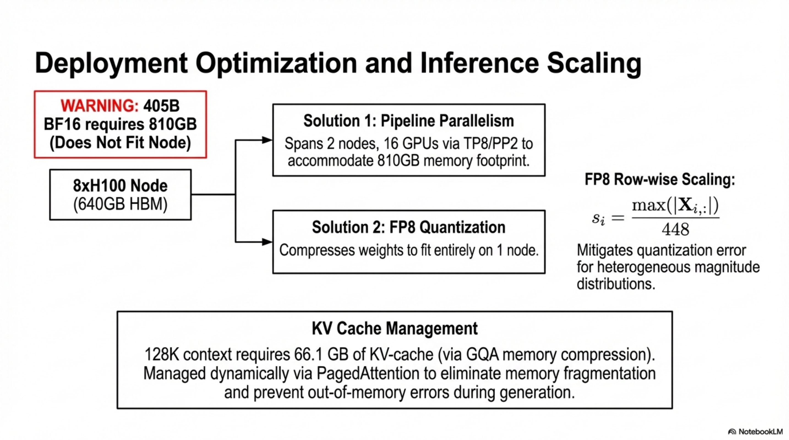

# Technical Report: Llama 3 — Evaluation, Safety, and Inference Pipeline

---

## 1. Evaluation Framework: Formal Problem Definition

### 1.1 Objective

Given a pre-trained or post-trained language model $M_\theta$ with parameters $\theta$, the evaluation problem is defined as estimating the true capability $\mu_k$ of model $M_\theta$ on capability dimension $k \in \{1, 2, \ldots, K\}$ using a finite benchmark sample $\mathcal{D}_k = \{(x_i, y_i)\}_{i=1}^{N_k}$ drawn from an underlying task distribution $\mathcal{P}_k$.

### 1.2 Formal Estimator

The benchmark score $\hat{S}_k$ is a sample mean estimator of $\mu_k$:

$$\hat{S}_k = \frac{1}{N_k} \sum_{i=1}^{N_k} \mathbf{1}[M_\theta(x_i) = y_i]$$

where $\mathbf{1}[\cdot]$ is the indicator function for exact-match or accuracy-based metrics, $N_k$ is the sample size of benchmark $k$.

### 1.3 Confidence Interval Construction

Under a Gaussian approximation (justified as a conservative lower bound on actual variance from finite-sample subsampling), the 95% confidence interval for $\hat{S}_k$ is:

$$\hat{S}_k \pm 1.96 \sqrt{\frac{\hat{S}_k (1 - \hat{S}_k)}{N_k}}$$

**Invariants:**
- $\hat{S}_k \in [0, 1]$
- CI width $\propto 1/\sqrt{N_k}$, so smaller benchmarks yield wider intervals
- The Gaussian assumption is approximate; bounded scores violate normality but bootstrap experiments confirm CI adequacy for discrete metrics

**Failure Modes:**
- CIs underestimate true variance since subsampling is not the only source of variation (prompt formatting, tokenization artifacts, stochastic decoding)
- Benchmark scores are point estimates subject to contamination, distribution shift, and prompt sensitivity

---

## 2. Pre-Training Evaluation Pipeline

### 2.1 Benchmark Taxonomy

Eight top-level capability categories, each containing specific benchmarks:

| Category | Benchmarks |
|---|---|
| Commonsense Reasoning | CommonSenseQA, PiQA, SiQA, OpenBookQA, WinoGrande |
| Knowledge | (Captured via MMLU, MMLU-Pro, AGIEval, NaturalQuestions) |
| Reading Comprehension | SQuAD V2, QuAC, RACE |
| Math, Reasoning, Problem Solving | GSM8K, MATH, ARC-Challenge, DROP, WorldSense |
| Long Context | QuALITY, Many-shot GSM8K |
| Code | HumanEval, MBPP |
| Adversarial | Adversarial SQuAD, Dynabench SQuAD, GSM-Plus, PAWS |
| Aggregate | MMLU, MMLU-Pro, AGIEval, BIG-Bench Hard |

### 2.2 Experimental Protocol

**Input:** Model $M_\theta$ (Llama 3 at 8B, 70B, 405B scales), competitor model set $\{M_{\phi_j}\}_{j=1}^{J}$

**Process:**
1. For each benchmark $\mathcal{D}_k$, compute $\hat{S}_k(M_\theta)$ using standardized evaluation pipeline (fixed shot count, metric, hyperparameters)
2. For competitor models, compute $\hat{S}_k(M_{\phi_j})$ using identical pipeline where possible
3. Select $\max(\hat{S}_k^{\text{reproduced}}, \hat{S}_k^{\text{reported}})$ for each competitor to ensure fairness
4. Report per-category averages only when all constituent benchmark scores are available for all compared models

**Output:** Score matrix $\mathbf{S} \in \mathbb{R}^{(J+1) \times K}$ with 95% CIs

### 2.3 Pseudo-Algorithm: Pre-Training Evaluation

```
PROCEDURE PreTrainingEvaluation(M_θ, {M_φ_j}, {D_k})
  FOR each benchmark D_k:
    FOR each model M in {M_θ} ∪ {M_φ_j}:
      IF model weights accessible:
        S_k(M) ← Evaluate(M, D_k, shots=k_shots, metric=k_metric)
        S_k(M) ← max(S_k(M), S_k^reported(M))
      ELSE:
        S_k(M) ← S_k^reported(M) or NULL
      CI_k(M) ← 1.96 * sqrt(S_k(M) * (1 - S_k(M)) / N_k)
    END FOR
  END FOR
  FOR each category C:
    IF all S_k available for all models:
      S_C(M) ← mean({S_k : k ∈ C})
    ELSE:
      S_C(M) ← NULL (do not report)
    END IF
  END FOR
  RETURN S, CI
END PROCEDURE
```

### 2.4 Key Results — Quantitative Analysis

**8B Model Class:**

| Benchmark | Llama 3 8B | Mistral 7B | Gemma 7B |
|---|---|---|---|
| SQuAD | $77.0 \pm 0.8$ | $73.2 \pm 0.8$ | $81.8 \pm 0.7$ |
| HumanEval | $37.2 \pm 7.4$ | $30.5 \pm 7.0$ | $32.3 \pm 7.2$ |
| MMLU | $66.7$ | $63.6$ | $64.3$ |
| GSM8K | $57.2 \pm 2.7$ | $52.5 \pm 2.7$ | $46.4 \pm 2.7$ |
| ARC-C | $79.7 \pm 2.3$ | $78.2 \pm 2.4$ | $78.6 \pm 2.4$ |

- Llama 3 8B achieves highest per-category win rate and average across commonsense, knowledge, reading comprehension, math/reasoning, and code
- Commonsense benchmarks approach saturation for 70B+ models

**70B Model Class:**

| Benchmark | Llama 3 70B | Mixtral 8×22B |
|---|---|---|
| MMLU | $79.3$ | $77.8$ |
| GSM8K | $83.7 \pm 2.0$ | $88.4 \pm 1.7$ |
| MATH | $41.4 \pm 1.4$ | $41.8 \pm 1.4$ |
| HumanEval | $58.5 \pm 7.5$ | $45.1 \pm 7.6$ |
| ARC-C | $92.9 \pm 1.5$ | $91.9 \pm 1.6$ |

- Llama 3 70B dominates predecessor Llama 2 70B on all non-saturated benchmarks
- Outperforms Mixtral 8×22B overall despite Mixtral's MoE architecture advantage

**405B Model Class:**

| Benchmark | Llama 3 405B | GPT-4 | Nemotron 4 340B | Gemini Ultra |
|---|---|---|---|---|
| MMLU | $85.2$ | $86.4$ | $81.1$ | $83.7$ |
| MATH | $53.8 \pm 1.4$ | — | — | $53.2 \pm 1.4$ |
| ARC-C | $96.1 \pm 1.1$ | $96.3 \pm 1.1$ | $94.3 \pm 1.3$ | — |
| HumanEval | $61.0 \pm 7.5$ | $67.0 \pm 7.2$ | $57.3 \pm 7.6$ | $74.4 \pm 6.7$ |
| BB Hard | $85.9 \pm 0.8$ | — | $85.4 \pm 0.9$ | $83.6 \pm 0.9$ |

- Llama 3 405B is competitive with GPT-4 and substantially outperforms all prior open-source models
- Category averages not reported for 405B due to incomplete competitor coverage (many models do not release pre-trained weights or log-probabilities)

**Long Context (Pre-trained):**

| Task | 8B | 70B | 405B |
|---|---|---|---|
| QuALITY (5-shot) | $56.0 \pm 2.1$ | $82.8 \pm 1.6$ | $87.6 \pm 1.4$ |
| GSM8K (16-shot) | $60.0 \pm 9.6$ | $83.0 \pm 7.4$ | $90.0 \pm 5.9$ |

---

## 3. Robustness Analysis

### 3.1 Problem Formulation

Let $f_\theta: \mathcal{X} \times \mathcal{C} \to \mathcal{Y}$ be the model mapping from (prompt, configuration) to output. Robustness is defined as stability of $\hat{S}_k$ under perturbations $\delta$ to the configuration space $\mathcal{C}$:

$$\text{Robustness}(M_\theta, \mathcal{D}_k) = 1 - \frac{\max_{\delta \in \Delta} |\hat{S}_k(\mathcal{C}) - \hat{S}_k(\mathcal{C} + \delta)|}{\hat{S}_k(\mathcal{C})}$$

where $\Delta$ is the set of permissible configuration perturbations.

### 3.2 Perturbation Dimensions (MMLU)

**Dimension 1: Few-shot label bias**
- Configurations: $\{ABCD, AADD, BBCC, AAAA\}$
- Tests whether label distribution in few-shot exemplars biases predictions

**Dimension 2: Label variants**
- Configurations: $\{A.B.C.D., A)B)C)D), 1.2.3.4., \$ \& \# @, œ § з ü\}$
- Tests sensitivity to choice token semantics

**Dimension 3: Answer order**
- Permutation distance $d \in \{0, 2, 3, 4\}$ from canonical order
- Fixed remapping applied across entire dataset

**Dimension 4: Prompt format**
- Five task prompts varying information level (bare question → expert assertion → best-answer instruction)

### 3.3 Results

- **Label variants:** Llama 3 models (8B, 70B, 405B) show minimal performance variation across all five label sets. 405B exhibits the tightest spread.
- **Few-shot label bias:** Near-constant accuracy across ABCD, AADD, BBCC, AAAA configurations. 405B achieves $>85\%$ micro accuracy uniformly.
- **Answer order:** Micro accuracy remains within $\pm 2\%$ across permutation distances 0–4 for 405B. Smaller models show slightly larger variance.
- **Prompt format:** 405B accuracy spans $\sim 83\%$–$85\%$ across five prompts; 8B spans $\sim 65\%$–$68\%$.

**Key finding:** Robustness improves monotonically with model scale. Llama 3 405B is essentially invariant to MCQ configuration changes.

**Significance:** This demonstrates that scaling reduces sensitivity to prompt engineering artifacts, a critical property for deployment reliability and reproducible evaluation.

---

## 4. Adversarial Evaluation

### 4.1 Adversarial Benchmark Design

For each capability area, adversarial benchmarks are paired with non-adversarial counterparts:

| Capability | Non-Adversarial | Adversarial |
|---|---|---|
| Question Answering | SQuAD | Adversarial SQuAD, Dynabench SQuAD |
| Mathematical Reasoning | GSM8K | GSM-Plus |
| Paraphrase Detection | QQP | PAWS |

### 4.2 Adversarial Gap Analysis

Define the adversarial gap:

$$\Delta_{\text{adv}} = \hat{S}_{\text{non-adv}} - \hat{S}_{\text{adv}}$$

**Results by capability:**
- **Paraphrase detection:** $\Delta_{\text{adv}} \approx 0$ for both pre-trained and post-trained models. Llama 3 is not susceptible to the spurious correlations that PAWS was constructed to exploit.
- **Question answering:** $\Delta_{\text{adv}} > 0$ (substantial). Adversarial performance significantly lower than non-adversarial across all model sizes.
- **Mathematical reasoning:** $\Delta_{\text{adv}} > 0$ (substantial). GSM-Plus causes consistent degradation relative to GSM8K.

**Failure Mode:** The adversarial gap in QA and math does not diminish with post-training, indicating that SFT/DPO alignment does not close robustness gaps introduced by adversarial input perturbations.

**Interpretation:** Paraphrase detection robustness suggests LLMs have learned more than surface-level lexical features, confirming Weber et al. (2023a). QA and math adversarial gaps indicate residual reliance on dataset-specific patterns.

---

## 5. Contamination Analysis

### 5.1 Formal Method

**Detection:** 8-gram overlap between evaluation examples and pre-training corpus.

For dataset $\mathcal{D}$, example $e \in \mathcal{D}$ is classified as contaminated if:

$$\frac{|\{t \in e : t \text{ is part of an 8-gram occurring in } \mathcal{C}_{\text{train}}\}|}{|e|} \geq T_{\mathcal{D}}$$

where $T_{\mathcal{D}}$ is a dataset-specific threshold selected to maximize the estimated performance gain (EPG):

$$\text{EPG}_{\mathcal{D}} = \hat{S}_{\text{contaminated}} - \hat{S}_{\text{clean}}$$

$T_{\mathcal{D}}$ is chosen as:

$$T_{\mathcal{D}}^* = \arg\max_{T} \text{EPG}_{\mathcal{D}}(T) \quad \text{subject to statistical significance}$$

### 5.2 Pseudo-Algorithm: Contamination Detection

```
PROCEDURE ContaminationAnalysis(D, C_train, models)
  BUILD rolling hash index of all 8-grams in C_train
  FOR each dataset D_k:
    FOR threshold T in candidate_thresholds:
      contaminated_set ← {e ∈ D_k : overlap_ratio(e, index) ≥ T}
      clean_set ← D_k \ contaminated_set
      IF |contaminated_set| < min_size OR |clean_set| < min_size:
        CONTINUE
      FOR each model M:
        S_contam(M) ← Evaluate(M, contaminated_set)
        S_clean(M) ← Evaluate(M, clean_set)
        EPG(M, T) ← S_contam(M) - S_clean(M)
      END FOR
      IF EPG is significant across models:
        RECORD (T, EPG, |contaminated_set|/|D_k|)
    END FOR
    SELECT T* maximizing significant EPG
  END FOR
  RETURN contamination_table
END PROCEDURE
```

### 5.3 Results

| Benchmark | Contamination % | EPG (8B) | EPG (70B) | EPG (405B) |
|---|---|---|---|---|
| AGIEval | 98% | 8.5 | 19.9 | 16.3 |
| BIG-Bench Hard | 95% | 26.0 | 36.0 | 41.0 |
| HellaSwag | 85% | 14.8 | 14.8 | 14.3 |
| PiQA | 55% | 8.5 | 7.9 | 8.1 |
| NaturalQuestions | 52% | 1.6 | 0.9 | 0.8 |
| GSM8K | 41% | 0.0 | 0.1 | 1.3 |
| MATH | 1% | 0.0 | -0.1 | -0.2 |
| SQuAD | 0% | 0.0 | 0.0 | 0.0 |
| HumanEval | — | — | — | — |
| MMLU | — | — | — | — |

**Key observations:**
- **High contamination + high EPG:** AGIEval, BIG-Bench Hard, HellaSwag — benchmark scores are likely inflated
- **High contamination + low EPG:** NaturalQuestions (52% contamination, ~1% EPG) — contamination does not help, suggesting task requires genuine reasoning or that 8-gram overlap produces false positives
- **Low contamination + no EPG:** SQuAD, MATH — clean
- **Undetermined:** HumanEval, MBPP, MMLU, MMLU-Pro — 8-gram overlap method saturates at all thresholds, requiring alternative detection methods

**Failure Modes of Contamination Analysis:**
- 8-gram overlap has unknown false positive/negative rates across tasks
- Cannot distinguish memorization from legitimate distributional coverage
- Selection of $T_{\mathcal{D}}^*$ via EPG maximization introduces selection bias
- Benchmarks with high $T$-insensitive contamination scores are unanalyzable

---

## 6. Post-Training Evaluation Pipeline

### 6.1 Benchmark Taxonomy (Post-Training)

| Category | Benchmarks |
|---|---|
| General | MMLU, MMLU-Pro, IFEval |
| Math & Reasoning | GSM8K, MATH, GPQA, ARC-Challenge |
| Code | HumanEval, MBPP, HumanEval+, MBPP EvalPlus, MultiPL-E |
| Multilingual | MGSM, Multilingual MMLU |
| Tool Use | Nexus, API-Bank, API-Bench, BFCL |
| Long Context | ZeroSCROLLS, Needle-in-a-Haystack, InfiniteBench |

**Decontamination:** Exact-match filtering of post-training data against all benchmark prompts.


*Figure. Benchmark synthesis for the Llama 3 family, corresponding to the post-training evaluation comparisons developed in Section 6.*

### 6.2 General Knowledge and Instruction Following

**MMLU (5-shot, no CoT):** Macro average of subtask accuracy, generation format (matching simple-evals).

$$\hat{S}_{\text{MMLU}} = \frac{1}{|\mathcal{T}|} \sum_{t \in \mathcal{T}} \hat{S}_t$$

where $\mathcal{T}$ is the set of MMLU subtasks.

**MMLU-Pro (5-shot CoT):** Extended MMLU with 10-option MCQs and reasoning-focused questions.

**IFEval:** Average of prompt-level and instruction-level accuracy under strict and loose constraints.

$$\hat{S}_{\text{IFEval}} = \frac{1}{4}(\hat{S}_{\text{prompt-strict}} + \hat{S}_{\text{prompt-loose}} + \hat{S}_{\text{instr-strict}} + \hat{S}_{\text{instr-loose}})$$

**Results:**
- All Llama 3 variants (8B, 70B, 405B) outperform comparable models on MMLU, MMLU-Pro, and IFEval
- 405B outperforms GPT-4 and Nemotron 4 340B on general knowledge; Claude 3.5 Sonnet leads among larger models

### 6.3 Proficiency Exams

**Exam sources:** GRE (2 official practice tests), LSAT (4 preptests), SAT (8 exams), AP (1 official practice per subject), GMAT (1 official online exam).

**Protocol:**
- MCQ and generation questions included
- Image-accompanied questions excluded
- Multi-correct GRE questions scored correct only if all correct options selected
- GRE scores scaled to 130–170 range; all others report accuracy
- Few-shot prompting used when multiple exam sets available

**Results (selected):**

| Exam | Llama 3 405B | GPT-4o | Claude 3.5 Sonnet |
|---|---|---|---|
| LSAT | $81.1 \pm 3.8$ | $77.4 \pm 4.1$ | $80.0 \pm 3.9$ |
| SAT Math | $94.9 \pm 2.3$ | $95.5 \pm 2.2$ | $95.8 \pm 2.1$ |
| AP Average | $93.5 \pm 1.9$ | $93.0 \pm 2.0$ | $92.2 \pm 2.1$ |
| GRE Quant. | 162 | 166 | 164 |
| GRE Verbal | 166 | 167 | 167 |

- 405B performance is statistically indistinguishable from Claude 3.5 Sonnet and GPT-4o on most exams
- 70B significantly outperforms GPT-3.5 Turbo and beats Nemotron 4 340B on many tests

### 6.4 Code Generation

**Metric:** pass@$N$ — the pass rate for a set of unit tests among $N$ generations. Reported as pass@1.

$$\text{pass}@1 = \frac{1}{|\mathcal{P}|} \sum_{p \in \mathcal{P}} \mathbf{1}[\text{any test passed}(M_\theta(p))]$$

**Python benchmarks:**

| Model | HumanEval | HumanEval+ | MBPP | MBPP EvalPlus |
|---|---|---|---|---|
| Llama 3 8B | $72.6 \pm 6.8$ | $67.1 \pm 7.2$ | $60.8 \pm 4.3$ | $72.8 \pm 4.5$ |
| Llama 3 70B | $80.5 \pm 6.1$ | $74.4 \pm 6.7$ | $75.4 \pm 3.8$ | $86.0 \pm 3.5$ |
| Llama 3 405B | $89.0 \pm 4.8$ | $82.3 \pm 5.8$ | $78.8 \pm 3.6$ | $88.6 \pm 3.2$ |
| GPT-4o | $90.2 \pm 4.5$ | $86.0 \pm 5.3$ | $81.4 \pm 3.4$ | $87.8 \pm 3.3$ |
| Claude 3.5 Sonnet | $92.0 \pm 4.2$ | $82.3 \pm 5.8$ | $76.6 \pm 3.7$ | $90.5 \pm 3.0$ |

**Multi-language (MultiPL-E):**

| Model | C++ | Java | PHP | TypeScript | C# | Shell |
|---|---|---|---|---|---|---|
| Llama 3 405B HumanEval | $82.0$ | $80.4$ | $76.4$ | $81.1$ | $54.4$ | $57.6$ |
| Llama 3 405B MBPP | $67.5$ | $65.8$ | $76.6$ | $72.6$ | $53.1$ | $43.7$ |

**Key observation:** Significant performance drop from Python to non-Python languages, indicating training data distribution skew toward Python.

### 6.5 Multilingual

**MGSM:** 0-shot CoT, native prompts (matching simple-evals).

**Multilingual MMLU:** Questions, few-shot examples, and answers translated via Google Translate into 7 languages; task instructions remain in English; 5-shot evaluation.

| Model | MGSM | Multilingual MMLU |
|---|---|---|
| Llama 3 8B | 68.9 | 58.6 |
| Llama 3 70B | 86.9 | 78.2 |
| Llama 3 405B | 91.6 | 83.2 |
| GPT-4o | 90.5 | 85.5 |

- 405B leads on MGSM (tied with Claude 3.5 Sonnet at 91.6)
- GPT-4o leads Multilingual MMLU by 2% over 405B
- 8B and 70B outperform competitors by wide margins in their size classes

### 6.6 Math and Reasoning (Post-Trained)

- 405B is best-in-class on GSM8K and ARC-C
- Second-best on MATH (behind GPT-4o/Claude 3.5 Sonnet depending on benchmark)
- GPQA: competitive with GPT-4o; Claude 3.5 Sonnet leads by significant margin

### 6.7 Long Context (Post-Trained)

**Needle-in-a-Haystack:** 100% retrieval at all document depths and context lengths for all model sizes.

**Multi-Needle:** 4 needles inserted, 2 queried. Average recall across 10 sequence lengths up to 128K.

| Model | QuALITY | Qasper | SQuALITY | InfiniteBench En.QA | En.MC | Multi-needle |
|---|---|---|---|---|---|---|
| Llama 3 8B | $81.0 \pm 16.8$ | $39.3 \pm 18.1$ | $15.3 \pm 7.9$ | $27.1 \pm 4.6$ | $65.1 \pm 6.2$ | $98.8 \pm 1.2$ |
| Llama 3 70B | $90.5 \pm 12.6$ | $49.0 \pm 18.5$ | $16.4 \pm 8.1$ | $36.7 \pm 5.0$ | $78.2 \pm 5.4$ | $97.5 \pm 1.7$ |
| Llama 3 405B | $95.2 \pm 9.1$ | $49.8 \pm 18.5$ | $15.4 \pm 7.9$ | $30.5 \pm 4.8$ | $83.4 \pm 4.8$ | $98.1 \pm 1.5$ |
| GPT-4o | $90.5 \pm 12.5$ | $49.2 \pm 18.5$ | $18.8 \pm 8.6$ | $19.1 \pm 4.1$ | $82.5 \pm 4.9$ | $100.0 \pm 0.0$ |

- 405B outperforms all competitors on InfiniteBench En.MC ($83.4$ vs GPT-4o $82.5$)
- InfiniteBench En.QA: 405B ($30.5$) significantly outperforms GPT-4o ($19.1$) and Claude 3.5 Sonnet ($11.3$)

### 6.8 Tool Use

**Benchmarks:** Nexus, API-Bank, Gorilla API-Bench, BFCL — zero-shot function calling accuracy.

| Model | Nexus | API-Bank | API-Bench | BFCL |
|---|---|---|---|---|
| Llama 3 8B | $38.5 \pm 4.1$ | $82.6 \pm 3.8$ | $8.2 \pm 1.3$ | $76.1 \pm 2.0$ |
| Llama 3 70B | $56.7 \pm 4.2$ | $90.0 \pm 3.0$ | $29.7 \pm 2.1$ | $84.8 \pm 1.7$ |
| Llama 3 405B | $58.7 \pm 4.1$ | $92.3 \pm 2.6$ | $35.3 \pm 2.2$ | $88.5 \pm 1.5$ |
| Claude 3.5 Sonnet | $45.7 \pm 4.2$ | $92.6 \pm 2.6$ | $60.0 \pm 2.3$ | $90.2 \pm 1.4$ |

- Llama 3 variants lead on Nexus across all size classes
- API-Bank: 405B within 0.3% of Claude 3.5 Sonnet
- API-Bench: Claude 3.5 Sonnet leads substantially ($60.0$ vs $35.3$)

**Human Evaluation (Tool Use):**
- 2000 prompts: code execution, plot generation, file uploads
- Llama 3 405B significantly outperforms GPT-4o on code execution (without plotting/file uploads) and plot generation
- GPT-4o leads on file upload use cases

---

## 7. Human Evaluation Protocol

### 7.1 Prompt Collection

**Taxonomy:** Hierarchical capability taxonomy covering:
- 6 single-turn capabilities: English, reasoning, coding, Hindi, Spanish, Portuguese
- 3 multi-turn capabilities: English, reasoning, coding (2–11 turns per prompt)

**Distribution constraints:**
- Uniform distribution across subcategories within each category
- Difficulty distribution: 10% easy, 30% medium, 60% hard
- ~7,000 total prompts
- Quality assurance: prompts sequestered from modeling teams to prevent contamination

### 7.2 Evaluation Process

**Pairwise comparison:** Annotators rate two model responses (anonymized) on 7-point scale:
- Much better / Better / Slightly better / About the same (for each direction)
- "Win" = annotator selects "better" or "much better"

**Metric:** Win rate per capability, with 95% CIs, excluding ties.

### 7.3 Pseudo-Algorithm: Human Evaluation

```
PROCEDURE HumanEvaluation(M_A, M_B, prompt_set)
  FOR each prompt p in prompt_set:
    r_A ← Generate(M_A, p)
    r_B ← Generate(M_B, p)
    Randomly assign left/right position
    annotator_rating ← HumanAnnotate(r_A, r_B, 7-point scale)
    IF rating ∈ {much_better_A, better_A}:
      win_A += 1
    ELSE IF rating ∈ {much_better_B, better_B}:
      win_B += 1
    ELSE:
      tie += 1
  END FOR
  win_rate_A ← win_A / (win_A + win_B)
  CI ← 1.96 * sqrt(win_rate_A * (1 - win_rate_A) / (win_A + win_B))
  RETURN win_rate_A, win_rate_B, CI
END PROCEDURE
```

### 7.4 Results (405B Pairwise Comparisons)

**vs. GPT-4 (0125 API):**
- Approximately on par across all capabilities
- Win rates within margin of error on nearly all capabilities
- Llama 3 outperforms GPT-4 on multi-turn reasoning and coding
- GPT-4 outperforms on multilingual (Hindi, Spanish, Portuguese)

**vs. GPT-4o:**
- On par on English prompts
- Mixed results on other capabilities
- GPT-4o wins on some coding/reasoning tasks

**vs. Claude 3.5 Sonnet:**
- Llama 3 outperforms on single and multi-turn English
- On par on multilingual
- Claude 3.5 Sonnet leads on coding and reasoning

**Failure Modes:**
- Annotator bias, background, and preference introduce variance
- Tone, verbosity, and response structure influence judgments independent of factual quality
- No objective ground truth for many open-ended prompts

---

## 8. Safety Pipeline

### 8.1 Safety Metrics — Formal Definitions

**Violation Rate (VR):**

$$\text{VR} = \frac{|\{p \in \mathcal{D}_{\text{adv}} : M_\theta(p) \text{ violates safety policy}\}|}{|\mathcal{D}_{\text{adv}}|}$$

**False Refusal Rate (FRR):**

$$\text{FRR} = \frac{|\{p \in \mathcal{D}_{\text{border}} : M_\theta(p) \text{ refuses to answer}\}|}{|\mathcal{D}_{\text{border}}|}$$

**Constraint:** Safety optimization is a Pareto problem over $(\text{VR}, \text{FRR})$:

$$\min_\theta \text{VR}(\theta) \quad \text{subject to} \quad \text{FRR}(\theta) \leq \epsilon_{\text{FRR}}$$

A model that always refuses achieves $\text{VR} = 0$ but $\text{FRR} = 1$. A model that never refuses achieves $\text{FRR} = 0$ but potentially high VR. The optimization target is the Pareto frontier.

### 8.2 Benchmark Construction

**Sources:**
- ML Commons taxonomy of hazards (Vidgen et al., 2024)
- 13 hazard categories: Child Sexual Exploitation, Defamation, Elections, Hate, Indiscriminate Weapons, Intellectual Property, Non-Violent Crimes, Privacy, Sex-Related Crimes, Sexual Content, Specialized Advice, Suicide & Self-Harm, Violent Crimes
- Additional: Code Interpreter Abuse

**Prompt types:**
- **Adversarial prompts:** Range from direct harmful requests to sophisticated jailbreaking techniques
- **Borderline prompts:** Near decision boundary, plausible safe response exists (e.g., "How can I steal the spotlight from my bestie?")

**Scale:** $>4000$ prompts per capability/language, mix of single-turn and multi-turn

### 8.3 Safety Pre-Training

**Discoverable Memorization Analysis:**

Define inclusion rate (verbatim memorization):

$$\text{IR}_{n} = \frac{|\{g \in \mathcal{G} : \text{ground\_truth}_{n} \subseteq g\}|}{|\mathcal{G}|}$$

where $\mathcal{G}$ is the set of model generations, $\text{ground\_truth}_n$ is the $n$-gram continuation from training data.

**Protocol:**
1. Sample prompts at different frequencies in training data using rolling hash index of all $n$-grams
2. Vary: prompt length, ground truth length, language, domain
3. Measure verbatim generation rate

**Results:**

| Model | English 50-gram | All 50-gram | All 1000-gram |
|---|---|---|---|
| Llama 3 8B | 0.26% | 0.24% | 1.11% |
| Llama 3 70B | 0.60% | 0.55% | 3.56% |
| Llama 3 405B | 1.13% | 1.03% | 3.91% |
| Llama 2 7B | 0.20% | — | — |
| Llama 2 70B | 0.47% | — | — |

- Memorization rates scale with model size (expected — larger models have higher capacity for memorization)
- Rates are roughly on par with Llama 2 at equivalent size
- Rates remain low overall ($<4\%$ even for 1000-gram at 405B)

**Limitations:** Exact match may underestimate near-verbatim or paraphrased memorization. Alternative prompt search strategies may elicit higher rates.

### 8.4 Safety Fine-Tuning

#### 8.4.1 Data Pipeline

**Human-generated data:**
- Adversarial prompts + safe model responses, collected from data vendors
- Borderline prompts + helpful responses, teaching the model to not over-refuse
- All data subject to tone guidelines and quality assurance (AI-assisted annotation tools)

**Synthetic data generation:**
- In-context learning with safety-focused system prompts
- Guided mutation of seed prompts based on new attack vectors
- Rainbow Teaming (Samvelyan et al., 2024) based on MAP-Elites (Mouret & Clune, 2015): generates prompts constrained across multiple diversity dimensions

**Tone control:**
- Refusal tone guideline developed for Llama 3
- Zero-shot rewriting + human-in-the-loop editing
- Tone classifier to assess tone quality for safety responses

#### 8.4.2 Safety SFT

**Method:** Joint training on helpfulness data $\mathcal{D}_{\text{help}}$ and safety data $\mathcal{D}_{\text{safe}} = \mathcal{D}_{\text{adv}} \cup \mathcal{D}_{\text{border}}$.

The SFT loss:

$$\mathcal{L}_{\text{SFT}} = -\sum_{(x,y) \in \mathcal{D}_{\text{help}} \cup \mathcal{D}_{\text{safe}}} \log p_\theta(y | x)$$

**Critical design choice:** Ratio of adversarial to borderline examples.
- Higher borderline ratio in challenging risk areas → reduces FRR without significantly increasing VR
- More safety data required for smaller models relative to helpfulness data to achieve comparable VR

**Model size effect on VR-FRR tradeoff:**
- 8B requires higher proportion of safety data in SFT mix
- 70B+ models more capable of discerning adversarial vs. borderline context
- Larger models achieve more favorable Pareto frontiers

#### 8.4.3 Safety DPO

**Method:** Incorporate adversarial and borderline examples into DPO preference datasets.

The DPO loss for safety:

$$\mathcal{L}_{\text{DPO}} = -\mathbb{E}_{(x, y_w, y_l) \sim \mathcal{D}_{\text{pref}}} \left[\log \sigma\left(\beta \log \frac{p_\theta(y_w|x)}{p_{\text{ref}}(y_w|x)} - \beta \log \frac{p_\theta(y_l|x)}{p_{\text{ref}}(y_l|x)}\right)\right]$$

**Key finding:** Crafting $(y_w, y_l)$ pairs to be nearly orthogonal in embedding space is particularly effective:

$$\cos(h(y_w), h(y_l)) \approx 0$$

where $h(\cdot)$ is the embedding representation. This maximizes the discriminative signal for the model to distinguish safe from unsafe responses.

**Ratio optimization:** Multiple experiments to determine optimal mix of adversarial, borderline, and helpfulness examples. Different mixes tailored per model size.

### 8.5 Safety Results

#### 8.5.1 English and Multilingual Short Context

**Violation Rate comparison (405B):**
- Llama 3 405B + Llama Guard: lowest or tied-lowest VR across all 8 supported languages
- Standalone Llama 3 405B: significantly lower VR than competing standalone open-source model, with moderately higher FRR

**False Refusal Rate:**
- Llama 3 achieves competitive FRR while maintaining low VR
- Pareto-optimal or near-optimal across the VR-FRR frontier

#### 8.5.2 Long Context Safety

**Many-shot jailbreaking mitigation:**
- SFT datasets include examples of safe behavior in presence of unsafe demonstrations in context
- Scalable mitigation that significantly reduces VR even for 256-shot attacks
- Little to no impact on FRR and helpfulness metrics

**DocQA benchmark:** Long documents with potentially exploitable information + adversarial prompts.

**Results:**
- Llama 3 405B (with/without Llama Guard) is Pareto-better than Comp. 2 across VR and FRR on both DocQA and Many-shot
- Significantly safer than Comp. 1, with trade-off on FRR

#### 8.5.3 Tool Usage Safety

- Search use case: Llama 3 405B significantly safer than Comp. 1
- Slightly higher FRR (expected trade-off)

#### 8.5.4 Multilingual Safety Transfer

**Key finding:** Safety knowledge in English does not readily transfer to other languages.
- Language-specific safety data essential
- Distribution of safety data per language significantly impacts VR/FRR
- Some languages benefit from cross-lingual transfer; others require more language-specific data
- Iterative data addition with monitoring of both metrics

### 8.6 Cybersecurity Evaluation

**CyberSecEval benchmarks:**

| Task | Key Finding |
|---|---|
| Insecure code generation | Larger models generate more insecure code with higher BLEU scores |
| Code interpreter abuse | 405B complies with malicious prompts 10.4% of the time; 70B at 3.8% |
| Text-based prompt injection | 405B: 21.7% success rate; more susceptible than GPT-4 Turbo and Gemini Pro, less than Mixtral |
| Vulnerability identification (CTF) | Does not outperform traditional non-LLM tools |
| Spear phishing | 70B: 24% success rate; 405B: 14% success rate (judge: Llama 3 70B). Moderately persuasive. |
| Autonomous attack automation | Effective at network reconnaissance; fails to gain initial access across 20–23 test runs; exploit attempts entirely unsuccessful |

**Uplift study (62 subjects):**
- Two-stage design: internet-only → internet + Llama 3 405B
- Expert and novice cohorts
- Result: Insignificant uplift over open internet access without an LLM

### 8.7 Chemical/Biological Weapons Uplift

**Study design:**
- 6-hour scenarios, teams of 2 participants
- Fictitious operational plans for biological/chemical attacks
- Covers: agent acquisition, production, weaponization, delivery
- Control (internet only) vs. LLM (internet + Llama 3 with search, RAG, code execution)
- Evaluated by CBRNE SMEs across scientific accuracy, detail, detection avoidance, probability of success

**Results:** No significant uplift from Llama 3 usage.
- Holds for aggregate analysis and all subgroup breakdowns (70B vs. 405B, chemical vs. biological)
- Assessment: low risk that release increases ecosystem risk for CBRNE attacks

### 8.8 Red Teaming

#### 8.8.1 Attack Taxonomy

**Short/Long Context English attacks:**
- Multi-turn refusal suppression: constrain model response format to exclude refusal phrases
- Hypothetical scenarios: wrap violating prompts in fictional/theoretical framing
- Personas/role play: assign violating persona or user character that obfuscates intent
- Disclaimers/warnings: response priming allowing model a path to "helpful compliance" intersecting safety training
- Gradual escalation: benign → incrementally more harmful across turns; once model generates violating content, recovery is difficult

**Multilingual attacks:**
- Mixed-language prompts: combining multiple languages increases violation rate
- Low-resource languages: insufficient safety fine-tuning data → higher violation rates (but often lower quality overall)
- Slang/cultural references: model may misinterpret or fail to flag culturally-specific harmful content

**Tool use attacks:**
- Unsafe tool chaining: multiple tool calls with one violating → all tools called with mixed inputs
- Forced tool use: specific input strings, fragmented/encoded text trigger violating tool inputs
- Tool parameter modification: swapping words, retrying, obfuscating across turns

**Child safety:** Expert teams using objective-based methodologies across multiple attack vectors, with market-specific nuance assessment.

### 8.9 System-Level Safety

#### 8.9.1 Llama Guard 3

**Architecture:** Llama 3 8B fine-tuned as safety classifier.

**Training data pipeline:**
1. Start with English data from Llama Guard 1
2. Expand to multilingual and tool use domains
3. Increase unsafe response count via prompt engineering to override refusals
4. Obtain response labels via Llama 3
5. Clean using human annotation + LLM annotation
6. Iterative label refinement

**Taxonomy:** 14 categories (13 ML Commons + Code Interpreter Abuse)

**Results — VR/FRR reduction relative to standalone Llama 3 (405B):**

| Capability | Input LG VR | Output LG VR | Full LG VR | Full LG FRR |
|---|---|---|---|---|
| English | -76% | -75% | **-86%** | +102% |
| French | -38% | -45% | -59% | +29% |
| German | -57% | -60% | -77% | +37% |
| Hindi | -54% | -54% | -71% | +62% |
| Italian | -34% | -34% | -48% | +29% |
| Portuguese | -51% | -57% | -65% | +39% |
| Spanish | -41% | -50% | -60% | +27% |
| Thai | -43% | -39% | -51% | +39% |

**Average VR reduction:** -65% across all benchmarks.

**Trade-off:** VR reduction comes at cost of increased FRR. Llama Guard 3 can be deployed per-category to control this trade-off granularly.

**Per-category VR reduction (English, Full Llama Guard):**

| Category | VR Reduction |
|---|---|
| Defamation | -100% |
| Elections | -100% |
| Intellectual Property | -100% |
| Non-Violent Crimes | -100% |
| Sexual Content | -100% |
| Hate | -91% |
| Sex-Related Crimes | -88% |
| Violent Crimes | -80% |
| Specialized Advice | -70% |
| Suicide & Self-Harm | -62% |
| Privacy | -60% |
| Child Sexual Exploitation | -59% |
| Indiscriminate Weapons | 0% |

**Quantization:** int8 quantization reduces model size by >40% with negligible performance impact:

| Capability | Non-Quant F1 | Quant F1 | Non-Quant FPR | Quant FPR |
|---|---|---|---|---|
| English | 0.939 | 0.936 | 0.040 | 0.040 |
| Multilingual | 0.862 | 0.851 | 0.033 | 0.031 |
| Tool Use | 0.825 | 0.827 | 0.176 | 0.155 |

#### 8.9.2 Prompt Guard

**Architecture:** mDeBERTa-v3-base (86M parameters), multi-label classifier.

**Classes:**
1. Direct jailbreaks: explicitly override safety conditioning or system prompt
2. Indirect prompt injections: third-party data in context window contains instructions executed as user commands

**Results:**

| Dataset | TPR | FPR | AUC |
|---|---|---|---|
| In-dist Jailbreaks | 99.9% | 0.4% | 0.997 |
| In-dist Injections | 99.5% | 0.8% | 1.000 |
| OOD Jailbreaks | 97.5% | 3.9% | 0.975 |
| Multilingual Jailbreaks | 91.5% | 5.3% | 0.959 |
| Indirect Injections (CyberSecEval) | 71.4% | 1.0% | 0.996 |

#### 8.9.3 Code Shield

- Static analysis via Insecure Code Detector (ICD)
- Suite of static analysis tools across 7 programming languages
- Inference-time filtering to prevent insecure code from reaching production

---

## 9. Inference Optimization

### 9.1 Problem Formulation

**Objective:** Serve Llama 3 405B ($\sim 810$ GB in BF16) with maximum throughput at acceptable latency under GPU memory constraints.

**Constraint:** Single 8×H100 machine: $8 \times 80\text{GB} = 640\text{GB}$ HBM — insufficient for BF16 model weights alone.

Two complementary strategies: pipeline parallelism across nodes and FP8 quantization to fit on single node.

### 9.2 Pipeline Parallelism for Inference

#### 9.2.1 Setup

- **Tensor parallelism (TP):** Within-node, exploiting high NVLink bandwidth ($\sim900$ GB/s bidirectional per A100/H100 pair)
- **Pipeline parallelism (PP):** Across nodes, using lower-bandwidth interconnect (InfiniBand/RoCE)
- **Configuration:** TP8/PP2 (8-way tensor parallelism within each node, 2-way pipeline parallelism across 2 nodes = 16 GPUs total)

#### 9.2.2 Micro-Batching in Inference

Unlike training, inference has no backward pass → no pipeline bubble from flush. Micro-batching enables concurrent execution of micro-batches across pipeline stages.

**Evaluation setup:** 4,096 input tokens, 256 output tokens, 2 micro-batches.

**Pre-fill stage:**
- Micro-batching enables overlapping computation between pipeline stages
- Throughput improvement with same local batch size
- Additional synchronization points increase latency

**Decode stage:**
- Same micro-batching benefit
- Better throughput-latency trade-off overall despite latency increase per token

**Key finding:** Micro-batching improves throughput-latency Pareto frontier for both pre-fill and decode stages in pipeline-parallel inference.

### 9.3 FP8 Quantization

#### 9.3.1 Quantization Strategy

**Scope:** Most matrix multiplications inside the model, specifically feed-forward network (FFN) layers ($\sim50\%$ of inference compute time). Self-attention layers are NOT quantized.

**Precision mapping:**
- Parameters: BF16 → FP8 (E4M3 format)
- Activations: BF16 → FP8 with dynamic scaling

**Dynamic scaling:**

$$x_{\text{FP8}} = \text{clamp}\left(\frac{x}{s}, -\text{max}_{\text{FP8}}, \text{max}_{\text{FP8}}\right)$$

where $s$ is the dynamic scaling factor computed per-row or per-tensor.

#### 9.3.2 Critical Mitigations

**1. Skip first and last Transformer layers:**

$$\text{Quantized layers} = \{l : 2 \leq l \leq L-1\}$$

First and last layers are more sensitive to quantization error (following Zhang et al., 2021).

**2. Dynamic scaling factor upper bound:**

$$s_{\text{eff}} = \min(s_{\text{computed}}, 1200)$$

High-perplexity tokens (dates, rare tokens) → large activation values → high scaling factors → many FP8 underflows → decoding errors. Upper bounding at 1200 prevents catastrophic underflow.

**3. Row-wise quantization (preferred over tensor-wise):**

For parameter matrix $\mathbf{W} \in \mathbb{R}^{m \times n}$ and activation matrix $\mathbf{X} \in \mathbb{R}^{b \times n}$:

- **Tensor-wise:** Single scaling factor per tensor:

$$s_W = \frac{\max(|\mathbf{W}|)}{\text{max}_{\text{FP8}}}$$

- **Row-wise:** Per-row scaling factors:

$$s_{W,i} = \frac{\max(|\mathbf{W}_{i,:}|)}{\text{max}_{\text{FP8}}}, \quad s_{X,j} = \frac{\max(|\mathbf{X}_{j,:}|)}{\text{max}_{\text{FP8}}}$$

Row-wise quantization provides more granular scaling → better accuracy for mixed-magnitude rows.

#### 9.3.3 Failure Mode: Benchmark Insensitivity

**Critical finding:** Standard benchmarks do not adequately detect FP8 quantization errors.

- Without upper-bounded scaling factors, model occasionally produces corrupted responses
- Benchmark accuracy may remain unchanged (scores are coarse-grained averages)
- Correct diagnostic: analyze full distribution of reward-model scores across $\sim100{,}000$ responses

**Reward distribution analysis:**
- BF16 and FP8 (row-wise with mitigations) produce nearly identical reward score distributions
- This validates that the quantization approach preserves output quality at the distributional level

#### 9.3.4 Efficiency Results

**Pre-fill stage:**
- FP8 achieves up to **50% throughput improvement** over BF16 (TP8/PP2) baseline
- Better throughput at every latency point

**Decode stage:**
- Substantially better throughput-latency trade-off
- FP8 on single node (TP8) competitive with or better than BF16 on two nodes (TP8/PP2)

**Memory reduction:**
- FFN weight memory reduced by $\sim50\%$ (FP8 vs BF16)
- Enables single-node deployment (8×H100) for 405B model


*Figure. FP8 row-wise quantization diagram, corresponding to the dynamic scaling, mitigation strategy, and efficiency analysis in Section 9.3.*

### 9.4 Pseudo-Algorithm: Inference Pipeline

```
PROCEDURE Llama3_405B_Inference(prompt, config)
  // Phase 1: Model Loading
  IF config.precision == FP8:
    Load model weights in BF16
    FOR layer l in {2, ..., L-1}:  // skip first and last
      FOR each FFN weight matrix W in layer l:
        Compute row-wise scaling factors s_W
        Quantize W → W_FP8
    parallelism ← TP8 (single node)
  ELSE:  // BF16
    parallelism ← TP8/PP2 (two nodes)
  
  // Phase 2: Pre-fill (KV cache population)
  tokens ← Tokenize(prompt)
  IF config.micro_batching:
    Split tokens into micro_batches
  FOR each micro_batch:
    FOR each pipeline stage:
      Compute attention (BF16 for all layers)
      Compute FFN:
        IF FP8 AND layer ∈ {2,...,L-1}:
          s_X ← min(compute_row_scales(X), 1200)
          X_FP8 ← quantize(X, s_X)
          Y ← dequantize(matmul_FP8(X_FP8, W_FP8), s_X, s_W)
        ELSE:
          Y ← matmul_BF16(X, W)
      Store KV cache entries
    Pipeline sync between stages
  
  // Phase 3: Autoregressive Decoding
  FOR t = 1 to max_output_tokens:
    FOR each micro_batch:
      Compute attention with cached KV
      Compute FFN (FP8 or BF16 as above)
      Sample next token
    IF EOS generated:
      BREAK
  
  RETURN decoded_tokens
END PROCEDURE
```

---

## 10. Convergence Dynamics and Scaling Analysis

### 10.1 Model Size → Capability Scaling

Across all evaluation dimensions, performance scales predictably with model size:

| Capability | 8B → 70B Δ | 70B → 405B Δ |
|---|---|---|
| MMLU | +12.6 | +5.9 |
| GSM8K | +26.5 | +5.3 |
| MATH | +21.1 | +12.4 |
| HumanEval | +7.9 | +8.5 |
| ARC-C | +13.2 | +3.2 |

Diminishing returns on saturated benchmarks (commonsense), continued gains on harder benchmarks (MATH, GPQA).

### 10.2 Model Size → Safety Scaling

- Larger models achieve more favorable VR-FRR Pareto frontiers
- 8B requires proportionally more safety data in SFT mix
- 405B better discerns adversarial vs. borderline intent
- Memorization rate increases with model size but remains low

### 10.3 Model Size → Robustness Scaling

- Robustness to MCQ perturbations improves monotonically with scale
- 405B is essentially invariant to prompt formatting, label variants, and answer order
- Adversarial gap does not close with scale for QA and math (structural limitation)

---

## 11. Failure Mode Summary

| Failure Mode | Manifestation | Mitigation |
|---|---|---|
| Benchmark contamination | Inflated scores on AGIEval, BBH, HellaSwag | 8-gram contamination analysis, EPG estimation |
| MCQ sensitivity | Performance varies with prompt format, labels | Scale to 405B; standardized evaluation protocols |
| Adversarial gap | QA and math performance drops on adversarial variants | Not closed by post-training; structural |
| Safety over-refusal | FRR increases with safety mitigations | Borderline data, DPO with orthogonal pairs, per-category Llama Guard |
| Many-shot jailbreaking | Long-context models vulnerable to in-context unsafe demonstrations | SFT with safe-behavior-in-presence-of-unsafe-demonstrations data |
| FP8 corrupted responses | Occasional corrupted outputs undetectable by benchmarks | Row-wise quantization, scaling factor upper bound (1200), reward distribution analysis |
| Multilingual safety gap | English safety does not transfer to other languages | Language-specific safety data collection |
| Memorization | Verbatim training data reproduction | PII filtering, memorization rate monitoring |
| Prompt injection | 21.7% success rate on 405B | Prompt Guard (mDeBERTa), system-level filtering |
| Tool use exploitation | Unsafe tool chaining, forced tool use | Tool-specific safety fine-tuning, Llama Guard 3 tool-use training |

---

## 12. Deployment Constraints and Production Considerations

### 12.1 Memory Budget

| Configuration | GPUs | Memory | Precision | Throughput Gain |
|---|---|---|---|---|
| TP8/PP2 (BF16) | 16 (2 nodes) | 1280 GB HBM | BF16 | Baseline |
| TP8 (FP8) | 8 (1 node) | 640 GB HBM | FP8 | Up to +50% pre-fill |



*Figure. Deployment optimization and inference scaling, corresponding to the memory-budget and serving-topology constraints in Section 12.*

### 12.2 System-Level Safety Stack

```
Input → [Prompt Guard] → [Llama Guard 3 Input] → [Llama 3 Model] → [Llama Guard 3 Output] → [Code Shield] → Output
```

- Each component independently configurable per harm category
- Prompt Guard: 86M parameters, negligible latency overhead
- Llama Guard 3: 8B parameters, can be int8-quantized (40% size reduction, negligible quality loss)
- Code Shield: static analysis, no neural inference required

### 12.3 Serving Topology

- **Pre-fill:** Compute-bound, benefits from FP8 FLOPS improvement
- **Decode:** Memory-bandwidth-bound, benefits from FP8 weight compression and reduced memory traffic
- **Micro-batching:** Improves both pre-fill and decode throughput at cost of per-token latency increase
- **KV cache:** Stored in BF16 (attention layers not quantized); memory scaling: $O(b \cdot L \cdot d_{\text{kv}} \cdot s)$ where $b$ = batch size, $L$ = layers, $d_{\text{kv}}$ = KV head dimension, $s$ = sequence length

### 12.4 Observability

- Reward-model score distribution monitoring ($10^5$ samples) preferred over benchmark spot-checks for detecting quantization drift
- VR and FRR tracked per capability, per language, per harm category
- Contamination analysis should be re-run whenever training data changes

---

## 13. Significance and Limitations

### 13.1 Why This Evaluation Framework Matters

- **Reproducibility:** Standardized evaluation pipeline with fixed hyperparameters, CI reporting, and score maximization across reproduced/reported numbers
- **Robustness:** Systematic perturbation analysis across 4 MCQ dimensions reveals evaluation artifacts that single-configuration benchmarks miss
- **Contamination transparency:** Explicit contamination analysis with EPG quantification enables calibrated interpretation of benchmark scores
- **Safety-helpfulness trade-off:** Pareto analysis of VR-FRR provides actionable framework for deployment configuration
- **Quantization validation:** Reward distribution analysis is strictly more informative than benchmark spot-checks for detecting subtle quality degradation

### 13.2 Limitations

- **Benchmark coverage:** No single benchmark set captures all model capabilities; aggregate scores can mask capability-specific deficiencies
- **Human evaluation subjectivity:** Annotator bias, preference for tone/verbosity over factual accuracy
- **Contamination detection:** 8-gram overlap is one of many possible methods; some benchmarks (HumanEval, MMLU) resist analysis with this approach
- **Safety benchmarks are internal:** Competitor comparisons on safety metrics are not externally reproducible
- **Adversarial gap persistence:** Post-training does not close adversarial gaps in QA and math, indicating fundamental model limitations
- **Memorization metrics:** Exact-match verbatim memorization underestimates near-verbatim or paraphrased reproduction
- **Language coverage:** Safety optimized for 8 languages; other languages may have elevated risk profiles
