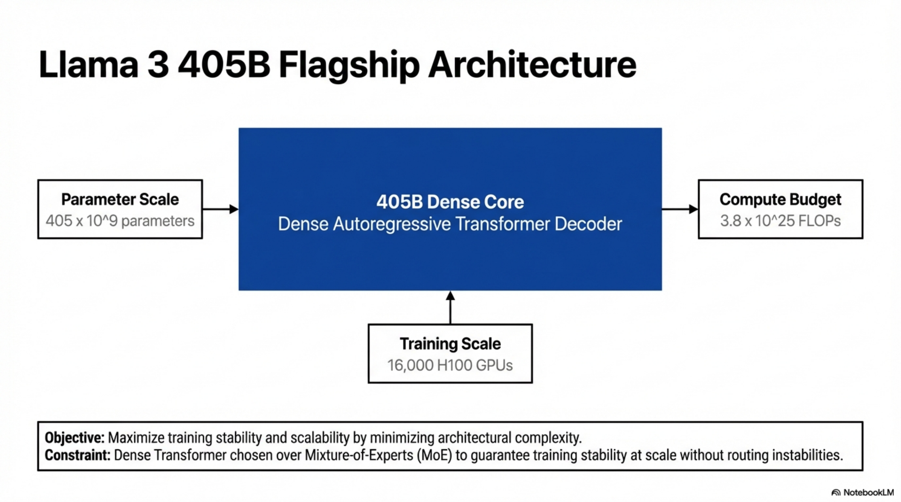
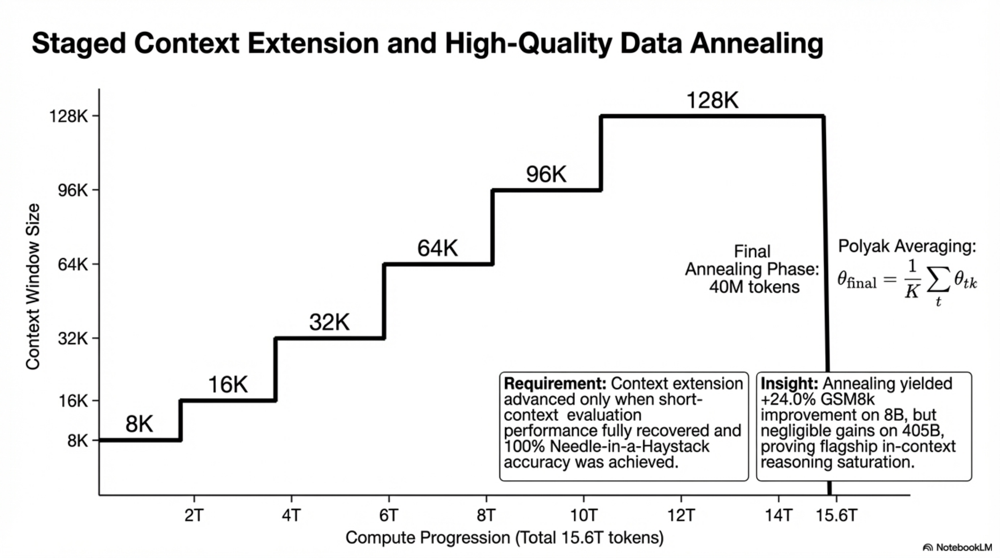
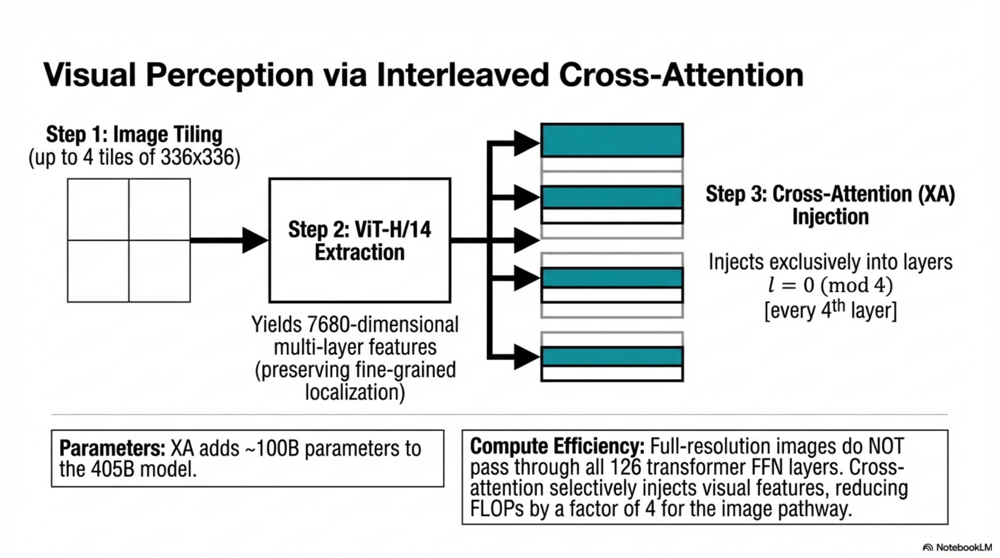
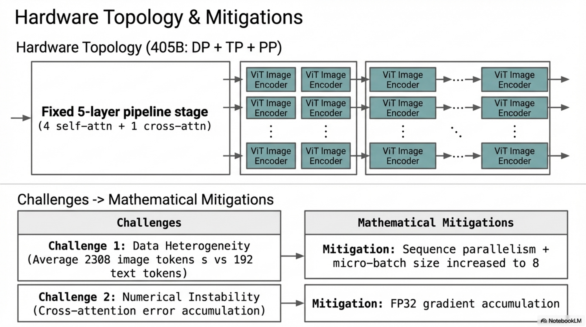
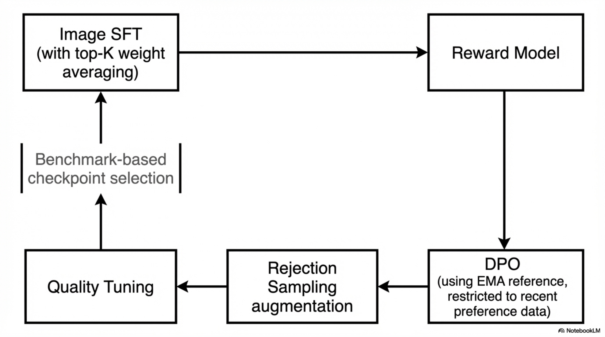
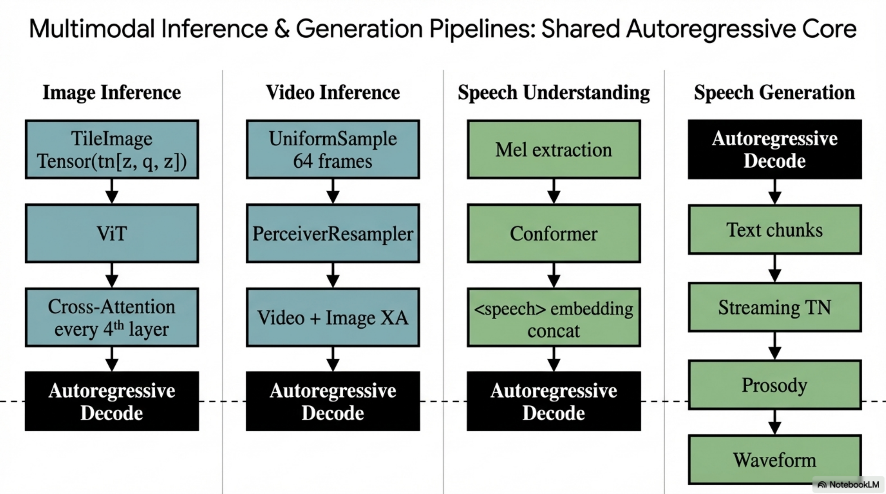
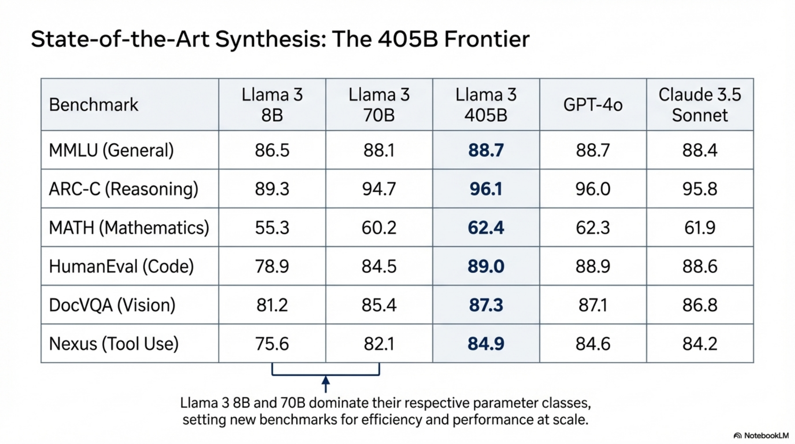
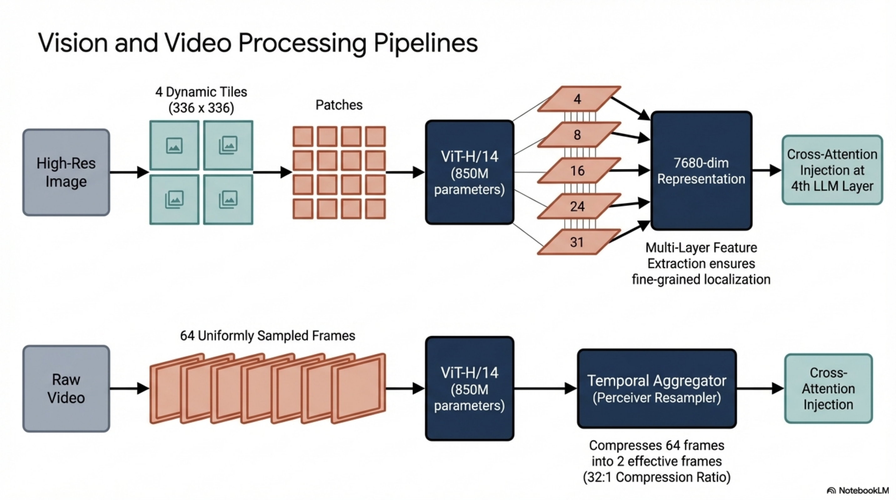
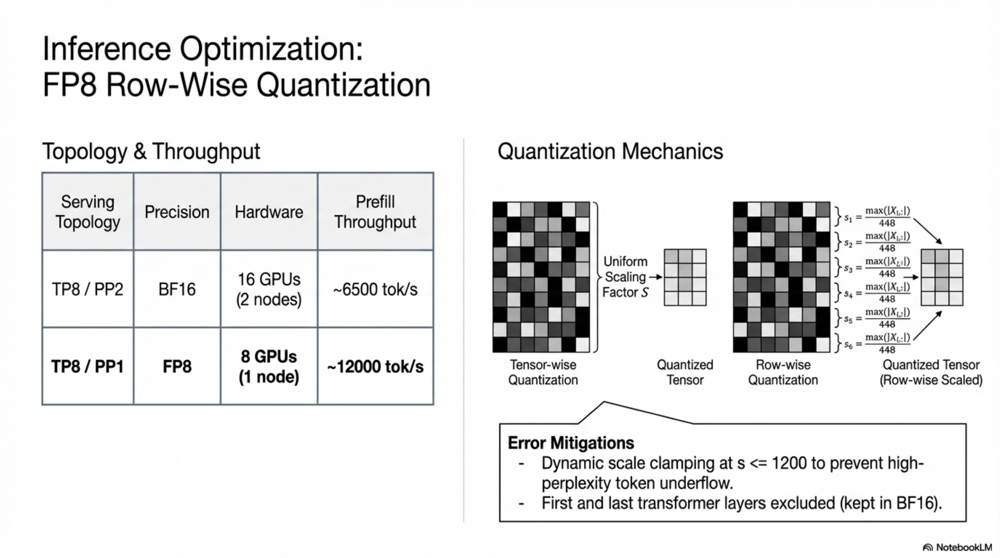
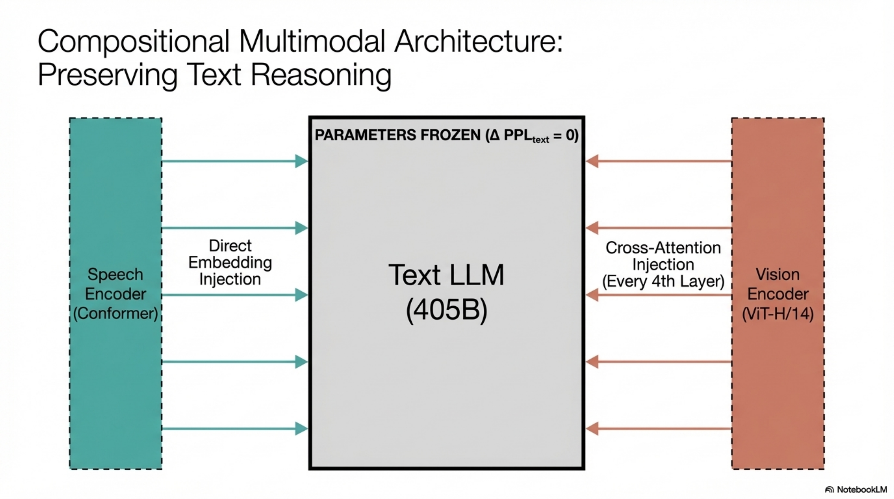

# End-to-End Technical Report: Compositional Multimodal Integration for Llama 3 — Vision and Speech Pipelines

---

## 1. System Overview and Problem Formulation

### 1.1 Formal Definition

The Llama 3 multimodal system is a compositional framework that augments a pre-trained autoregressive language model $\mathcal{M}_{\text{LLM}}$ with visual and auditory perception capabilities through modality-specific encoders, adapters, and cross-modal alignment mechanisms, trained across five sequential stages:

1. Language model pre-training
2. Multimodal encoder pre-training
3. Vision adapter training (image + video)
4. Model finetuning (SFT, DPO, rejection sampling, quality tuning)
5. Speech adapter training

### 1.2 Formal Objective

Given a pre-trained language model with parameters $\theta_{\text{LLM}}$, image encoder parameters $\theta_{\text{ViT}}$, cross-attention adapter parameters $\theta_{\text{XA}}$, video adapter parameters $\theta_{\text{vid}}$, speech encoder parameters $\theta_{\text{speech}}$, and speech adapter parameters $\theta_{\text{SA}}$, the system maximizes:

$$\max_{\theta_{\text{ViT}}, \theta_{\text{XA}}, \theta_{\text{vid}}, \theta_{\text{SA}}, \theta_{\text{speech}}} \mathbb{E}_{(x_v, x_a, x_t) \sim \mathcal{D}} \left[ \log p_{\theta}(x_t \mid x_v, x_a) \right]$$

subject to the invariant:

$$p_{\theta}(x_t \mid \text{text-only input}) = p_{\theta_{\text{LLM}}}(x_t \mid \text{text-only input})$$

ensuring zero degradation on text-only tasks.

### 1.3 Compositional Architecture Rationale — Invariants and Constraints

| Property | Constraint/Advantage |
|---|---|
| Parallel development | Vision and language capabilities developed independently |
| No joint pre-training complexity | Avoids visual tokenization issues, modality background perplexity contention |
| Text performance preservation | LLM backbone frozen during adapter training; text-only performance guaranteed invariant |
| Inference efficiency | Cross-attention avoids passing full-resolution images through all LLM FFN layers |



*Figure. High-level flagship architecture summary for the 405B dense model, grounding the report's system objective in parameter scale, training scale, and compute budget.*

---

## 2. Data Pipeline

### 2.1 Image Data Pipeline

#### 2.1.1 Stage 1: Quality Filtering

**Objective:** Remove non-English and low-alignment image-text pairs.

**Inputs:** Raw image-text pairs from web-scale sources.

**Outputs:** Filtered pairs satisfying minimum quality thresholds.

**Method:**
- Heuristic-based filtering removes non-English captions
- CLIP alignment score (Radford et al., 2021) computed per pair:

$$s_{\text{CLIP}}(I, T) = \frac{\mathbf{z}_I^\top \mathbf{z}_T}{\|\mathbf{z}_I\| \cdot \|\mathbf{z}_T\|}$$

where $\mathbf{z}_I = f_{\text{ViT}}(I) \in \mathbb{R}^d$ and $\mathbf{z}_T = f_{\text{text}}(T) \in \mathbb{R}^d$.

- All pairs with $s_{\text{CLIP}} < \tau_{\text{quality}}$ are removed.

**Failure Modes:** Threshold too aggressive removes diverse but valid pairs; too lenient retains noise.

#### 2.1.2 Stage 2: Perceptual De-duplication

**Objective:** Remove redundant images to reduce training compute on repeated data and mitigate memorization/privacy risks.

**Inputs:** Quality-filtered image-text pairs.

**Outputs:** De-duplicated dataset with one representative per semantic cluster.

**Method:**
1. Compute 512-dimensional SSCD copy-detection embeddings per image:

$$\mathbf{e}_i = f_{\text{SSCD}}(I_i) \in \mathbb{R}^{512}$$

2. Pre-cluster using $k$-means to partition embedding space into $K$ clusters:

$$\min_{\{C_k\}} \sum_{k=1}^{K} \sum_{\mathbf{e}_i \in C_k} \|\mathbf{e}_i - \boldsymbol{\mu}_k\|^2$$

3. Within each cluster, perform approximate nearest neighbor search using FAISS with cosine similarity:

$$\text{sim}(i, j) = \frac{\mathbf{e}_i^\top \mathbf{e}_j}{\|\mathbf{e}_i\| \cdot \|\mathbf{e}_j\|}$$

4. Pairs with $\text{sim}(i, j) > \tau_{\text{dup}}$ are marked as duplicates.
5. Connected-components algorithm groups all transitively linked duplicates.
6. Retain exactly one image-text pair per connected component.

**Complexity:** Approximate NN search via FAISS: $O(N \sqrt{N/K})$ per cluster with IVF indexing, where $N$ is dataset size and $K$ is number of clusters.

**Invariant:** For any two retained images $I_i, I_j$: $\text{sim}(i,j) \leq \tau_{\text{dup}}$.

**Failure Modes:** Threshold too low causes under-deduplication; too high removes semantically distinct but visually similar images.

##### Pseudo-Algorithm: De-duplication Pipeline

```
ALGORITHM: PerceptualDeduplication
INPUT: Dataset D = {(I_i, T_i)}_{i=1}^N
OUTPUT: Deduplicated dataset D'

1. FOR each I_i in D:
     e_i ← f_SSCD(I_i)  // 512-dim embedding
2. {C_1, ..., C_K} ← KMeans(E, K)  // Pre-cluster
3. duplicate_pairs ← ∅
4. FOR each cluster C_k:
     index ← FAISS.build_index(C_k)
     FOR each e_i in C_k:
       neighbors ← index.search(e_i, radius=τ_dup)
       FOR each e_j in neighbors:
         duplicate_pairs ← duplicate_pairs ∪ {(i, j)}
5. G ← BuildGraph(duplicate_pairs)
6. components ← ConnectedComponents(G)
7. D' ← {select_one_representative(comp) for comp in components}
8. RETURN D'
```

#### 2.1.3 Stage 3: N-gram Resampling

**Objective:** Ensure diversity of image-text pairs, particularly boosting low-frequency categories and fine-grained recognition.

**Inputs:** De-duplicated image-text pairs.

**Outputs:** Resampled dataset with improved distributional balance.

**Method:**

1. Construct vocabulary of $n$-grams by parsing high-quality text sources.
2. Compute frequency $f_i$ of each vocabulary $n$-gram $n_i$ across the dataset.
3. For each image-text pair with caption containing $n$-grams $\{n_1, \ldots, n_m\}$:
   - If any $n_i$ has $f_i < T$, **keep** the pair.
   - Otherwise, independently sample each $n_i$ with probability:

$$p(n_i) = \sqrt{\frac{T}{f_i}}$$

   - Keep the pair if **any** $n_i$ was sampled.

This is analogous to subsampling in word2vec (Mikolov et al., 2013):

$$p_{\text{keep}}(\text{pair}) = 1 - \prod_{i=1}^{m} \left(1 - \min\left(1, \sqrt{\frac{T}{f_i}}\right)\right)$$

**Invariant:** Low-frequency $n$-grams are always retained ($f_i < T \Rightarrow p_{\text{keep}} = 1$). High-frequency $n$-grams are downsampled proportional to $\sqrt{T/f_i}$.

**Failure Modes:** $T$ too large retains too much common data; $T$ too small over-represents rare categories with potentially noisy pairs.

#### 2.1.4 Stage 4: Optical Character Recognition (OCR)

**Objective:** Augment captions with text extracted from images to improve OCR-dependent tasks (document understanding, text-in-image reading).

**Inputs:** Resampled image-text pairs.

**Outputs:** Image-text pairs with concatenated OCR-extracted text.

**Method:** Proprietary OCR pipeline extracts visible text from image → concatenated with existing caption.

**Additional Document Transcription:** Document pages rendered as images, paired with source text or parsed text obtained via document parsing pipeline.

#### 2.1.5 Safety Mitigations

**Objective:** Remove CSAM, NSFW, and privacy-violating content.

**Methods:**
- CSAM scanning via perceptual hashing (PhotoDNA) + proprietary classifiers
- NSFW filtering via proprietary media-risk retrieval pipeline (sexual, violent content)
- Face blurring on all training images
- Adversarial testing against human-generated prompts referencing attached images

**Invariant:** No image in the final training set triggers positive detection on CSAM classifiers.

#### 2.1.6 Annealing Data Construction

**Objective:** Create a high-quality subset for the annealing training phase.

**Inputs:** Full processed image-caption dataset.

**Outputs:** ~350M resampled pairs + ~150M augmentation examples.

**Resampling:** $n$-gram resampling favoring richer text descriptions → selects higher-quality data subset.

**Augmentation Sources (5 categories):**

| Source | Description |
|---|---|
| Visual grounding | Noun phrases linked to bounding boxes/masks; specified via set-of-marks overlays or normalized $(x_{\min}, y_{\min}, x_{\max}, y_{\max})$ coordinates with special tokens |
| Screenshot parsing | HTML-rendered screenshots; model predicts code producing a specific element indicated by bounding box |
| Question-answer pairs | Large-scale QA data too voluminous for SFT stage |
| Synthetic captions | Generated by early model version; more comprehensive than original captions |
| Synthetic structured images | Charts, tables, flowcharts, math equations, textual data with markdown/LaTeX structured representations |



*Figure. Context-extension and annealing schedule, useful here because the annealing subset is not just cleaner data but part of a broader staged scaling recipe with explicit high-quality late-phase emphasis.*

### 2.2 Video Data Pipeline

**Objective:** Curate video-text pairs with high visual-text alignment, sufficient motion, and clean text.

**Multi-stage process:**

1. **Text cleaning:** Rule-based heuristics (minimum length, capitalization fixing)
2. **Language filtering:** Language identification models remove non-English text
3. **OCR filtering:** OCR detection models remove videos with excessive overlaid text
4. **Alignment filtering (two-pass):**
   - Single-frame image-text CLIP similarity → remove low-similarity pairs
   - Video-text contrastive similarity → remove low video-text alignment pairs
5. **Motion filtering:** Motion-score based filtering (Girdhar et al., 2023) removes static/low-motion videos

**No visual quality filtering** applied (no aesthetic scores, no resolution filtering).

**Dataset Statistics:**

| Property | Value |
|---|---|
| Average duration | 21 seconds |
| Median duration | 16 seconds |
| >99% videos | Under 1 minute |
| Spatial resolution | 320p to 4K |
| >70% videos | Short side > 720 pixels |
| Aspect ratios | Between 1:2 and 2:1, median 1:1 |

##### Pseudo-Algorithm: Video Data Curation

```
ALGORITHM: VideoDataCuration
INPUT: Raw video-text pairs V = {(v_i, t_i)}
OUTPUT: Curated dataset V'

1. FOR each (v_i, t_i) in V:
     t_i ← RuleBasedClean(t_i)  // min length, capitalization
2. V ← {(v_i, t_i) : LID(t_i) = "English"}
3. V ← {(v_i, t_i) : OCR_text_ratio(v_i) < τ_ocr}
4. FOR each (v_i, t_i) in V:
     frame ← SampleSingleFrame(v_i)
     s_img ← CLIP_image_text_sim(frame, t_i)
     IF s_img < τ_img: REMOVE (v_i, t_i)
5. FOR each remaining (v_i, t_i):
     s_vid ← VideoTextContrastive(v_i, t_i)
     IF s_vid < τ_vid: REMOVE (v_i, t_i)
6. FOR each remaining (v_i, t_i):
     m ← MotionScore(v_i)
     IF m < τ_motion: REMOVE (v_i, t_i)
7. RETURN V'
```

### 2.3 Speech Data Pipeline

#### 2.3.1 Speech Understanding Data

**Pre-training data:**
- ~15M hours of speech recordings across many languages
- Voice Activity Detection (VAD) filtering: retain samples with VAD score > 0.7
- PII detection and removal via Presidio Analyzer

**ASR data:** 230K hours manually transcribed speech, 34 languages, max segment length 60 seconds.

**AST data:** 90K hours, two directions (33 languages → English, English → 33 languages), includes synthetic data generated via NLLB toolkit for low-resource language augmentation.

**Spoken dialogue data:**
- 60K hours: synthetic responses generated by querying LLM with transcriptions of speech prompts
- 25K hours: TTS-synthesized speech (Voicebox) from LLM finetuning data subsets, filtered by heuristics (short prompts, simple structure, no non-text symbols)

#### 2.3.2 Speech Generation Data

**Text Normalization (TN) data:** 55K samples covering semiotic classes (number, date, time), each a pair of written-form and spoken-form text with inferred TN rule sequences.

**Prosody Model (PM) data:** Linguistic and prosodic features from 50K hours of professional studio-recorded TTS data.

**Llama 3 Embedding Extraction:**
- Output of 16th decoder layer of Llama 3 8B
- Extracted as if text is generated with empty user prompt
- Explicit chunk-level alignment between Llama 3 token sequences and native input sequences (TN text tokens demarcated by unicode category, or phone-rate features for PM)

---

## 3. Model Architecture

### 3.1 Image Encoder

**Architecture:** ViT-H/14 (Vision Transformer, Dosovitskiy et al., 2020)

**Base specifications:**

| Parameter | Value |
|---|---|
| Base parameters | 630M |
| Pre-training data | 2.5B image-text pairs, 5 epochs |
| Pre-training resolution | $224 \times 224$ |
| Patch layout | $16 \times 16$ patches of $14 \times 14$ pixels each |
| Training objective | Contrastive text-image alignment (Xu et al., 2023) |

**Multi-layer feature extraction:**

Contrastive-only encoders lose fine-grained localization information. To mitigate this:

- Features extracted from layers $\{4, 8, 16, 24, 31\}$ **in addition to** the final layer
- Concatenated features produce a $7680$-dimensional representation per patch

$$\mathbf{h}_{\text{patch}} = [\mathbf{h}^{(4)}; \mathbf{h}^{(8)}; \mathbf{h}^{(16)}; \mathbf{h}^{(24)}; \mathbf{h}^{(31)}; \mathbf{h}^{(\text{final})}] \in \mathbb{R}^{7680}$$

where each $\mathbf{h}^{(\ell)} \in \mathbb{R}^{1280}$ for ViT-H.

**Additional gated self-attention layers:**
- 8 gated self-attention layers inserted prior to cross-attention pre-training
- Total transformer blocks: $32 + 8 = 40$
- Total parameters with additions: **850M**

**Output tensor shape:**

$$\mathbf{Z}_{\text{image}} \in \mathbb{R}^{N_p \times 7680}$$

where $N_p = 16 \times 16 = 256$ patches for single-tile input.

**Training status:** Image encoder is **not frozen** during subsequent stages (improves performance, especially text recognition).

### 3.2 Image Adapter (Cross-Attention Layers)

**Architecture:** Cross-attention layers inserted between ViT visual token representations and LLM token representations, following Alayrac et al. (2022) (Flamingo-style).

**Placement:** One cross-attention layer after every 4th self-attention layer in the LLM backbone.

**Attention mechanism:** Generalized Query Attention (GQA) for efficiency, matching the LLM's attention design.

**Cross-attention computation:**

Let $\mathbf{H}_{\text{text}}^{(\ell)} \in \mathbb{R}^{N_t \times d}$ be the text hidden states at layer $\ell$, and $\mathbf{Z}_{\text{image}} \in \mathbb{R}^{N_p \times d_v}$ be the image encoder output (projected to match dimensions).

$$\mathbf{Q} = \mathbf{H}_{\text{text}}^{(\ell)} \mathbf{W}_Q, \quad \mathbf{K} = \mathbf{Z}_{\text{image}} \mathbf{W}_K, \quad \mathbf{V} = \mathbf{Z}_{\text{image}} \mathbf{W}_V$$

$$\text{CrossAttn}(\mathbf{Q}, \mathbf{K}, \mathbf{V}) = \text{softmax}\left(\frac{\mathbf{Q}\mathbf{K}^\top}{\sqrt{d_k}}\right) \mathbf{V}$$

With GQA (groups of query heads sharing key-value heads):

$$\text{GQA}: n_{\text{kv\_heads}} < n_{\text{q\_heads}}, \quad \text{each KV head shared by } \frac{n_{\text{q\_heads}}}{n_{\text{kv\_heads}}} \text{ query heads}$$

**Parameter count:** For Llama 3 405B, cross-attention layers introduce **~100B additional parameters**.

**Image tiling strategy (initial pre-training):**
- Images resized to fit within at most **4 tiles** of $336 \times 336$ pixels each
- Tiles arranged to support varying aspect ratios: $672 \times 672$, $672 \times 336$, $1344 \times 336$

**Resolution increase during annealing:** Per-tile resolution increased for tasks requiring higher resolution (e.g., infographics).

**Token count per image:**
- Average: **2,308 tokens** per image
- Average text: **192 tokens**



*Figure. Visual perception through interleaved cross-attention, showing dynamic tiling, ViT extraction, and selective injection of visual features into every fourth decoder layer.*

### 3.3 Video Adapter

**Architecture:** Two components for temporal modeling:

#### 3.3.1 Temporal Aggregator

**Type:** Perceiver Resampler (Jaegle et al., 2021; Alayrac et al., 2022)

**Function:** Merges $M$ consecutive encoded video frames into one aggregated representation.

- Pre-training: 16 frames sampled, aggregation factor = 16 → **1 effective frame**
- SFT: 64 frames sampled, aggregation factor = 32 → **2 effective frames**

Let $\{\mathbf{F}_1, \ldots, \mathbf{F}_M\} \in \mathbb{R}^{M \times N_p \times d_v}$ be encoded frames. The perceiver resampler uses $L$ learned latent queries $\mathbf{Q}_{\text{latent}} \in \mathbb{R}^{L \times d}$:

$$\mathbf{O}_{\text{agg}} = \text{PerceiverResampler}(\mathbf{Q}_{\text{latent}}, [\mathbf{F}_1; \ldots; \mathbf{F}_M])$$

#### 3.3.2 Video Cross-Attention Layers

Additional cross-attention layers added **before every 4th image cross-attention layer**.

Text tokens cross-attend to the temporally aggregated video representations.

**Parameter counts:**

| Model Scale | Video Aggregator + XA Parameters |
|---|---|
| Llama 3 8B | 0.6B |
| Llama 3 70B | 4.6B |

**Frame processing:**
- Each of up to 64 frames processed by image encoder independently
- Pre-training: 16 frames, 4 tiles per frame of $448 \times 448$ pixels
- SFT: 64 frames, aggregation factor 32, chunk resolution consistent with image hyperparameters

### 3.4 Speech Encoder

**Architecture:** Conformer (Gulati et al., 2020) with **1B parameters**

| Component | Specification |
|---|---|
| Input features | 80-dimensional mel-spectrogram |
| Stride-4 stacking layer | Reduces frame rate; followed by linear projection → 40ms frame length |
| Encoder layers | 24 Conformer layers |
| Latent dimension | 1536 |
| FFN dimension | 4096 (Macaron-net style, two FFNs per layer) |
| Convolution kernel size | 7 |
| Attention | Rotary attention (RoPE), 24 heads |

**Self-supervised pre-training:** BEST-RQ algorithm (Chiu et al., 2022)

- Mask: 32-frame length, 2.5% probability applied to input mel-spectrogram
- Long utterances (>60s): random crop of 6K frames (= 60 seconds)
- Quantization: stack 4 consecutive frames → 320-dim → project to 16-dim → nearest-neighbor search in codebook of 8,192 vectors (cosine similarity)
- 16 different codebooks for stability
- Projection matrix and codebooks: randomly initialized, **never updated**
- Loss: multi-softmax loss on masked frames only
- Training: 500K steps, global batch size 2,048

### 3.5 Speech Adapter

**Parameters:** ~100M

| Component | Specification |
|---|---|
| Convolution layer | Kernel size 3, stride 2 → reduces frame length to 80ms |
| Rotary Transformer layer | Latent dim 3072, FFN dim 4096 |
| Linear layer | Maps output dimension to match LLM embedding dimension |

**Integration:** Output embeddings concatenated with text token embeddings (not via cross-attention). Two special tokens enclose speech representation sequences.

**Key architectural distinction from vision:** Speech adapter generates embeddings directly compatible with text tokens → leverages all LLM capabilities natively. Vision module uses cross-attention layers (information injected at specific layers).

### 3.6 Speech Generation Components

#### 3.6.1 Text Normalization (TN) Module

**Architecture:** Streaming LSTM-based sequence-tagging model

**Function:** Context-aware transformation from written-form text to spoken-form text.

**Example:** "123" → "one hundred twenty three" (cardinal) vs. "one two three" (digit sequence), depending on context.

**Llama 3 Integration:** Cross-attention to Llama 3 8B embeddings (16th decoder layer output) enables contextual disambiguation with minimal text token lookahead and streaming I/O.

#### 3.6.2 Prosody Model (PM)

**Architecture:** Decoder-only Transformer

| Component | Specification |
|---|---|
| Attention heads | 6 |
| Hidden dimension | 864 |
| Cross-attention | Dual: one for linguistic inputs, one for Llama embeddings |
| Direction | Uni-directional (causal) |

**Inputs:**
- Linguistic features from TN front-end
- Llama 3 tokens and embeddings (token-rate)
- Speaker/style controllability features

**Predicted prosodic features (per phone):**
1. $\log(\text{duration})$
2. $\log(F_0)$ — fundamental frequency average
3. $\log(\text{power})$ — power average across phone duration

**Dual cross-attention mechanism:** Manages varying input rates (phone-rate vs. token-rate) without explicit alignment.

**Lookahead mechanism:**
- Fixed number of future phones
- Variable number of future tokens (defined by chunk size from TN)
- Causal masking ensures consistency between training and streaming inference

---

## 4. Tensor Transformations and Memory Flow

### 4.1 Image Path

$$\text{Raw Image} \xrightarrow{\text{tile}} \{I_1, \ldots, I_T\} \in \mathbb{R}^{T \times 336 \times 336 \times 3}$$

$$\xrightarrow{\text{patchify}} \mathbf{P} \in \mathbb{R}^{T \times 576 \times (14 \times 14 \times 3)} \quad \text{(each tile: } 24 \times 24 = 576 \text{ patches)}$$

$$\xrightarrow{\text{ViT}} \mathbf{Z}_{\text{multi}} \in \mathbb{R}^{(T \times 576) \times 7680} \quad \text{(multi-layer features)}$$

$$\xrightarrow{\text{projection}} \mathbf{Z}_{\text{proj}} \in \mathbb{R}^{N_{\text{img}} \times d_{\text{LLM}}}$$

$$\xrightarrow{\text{cross-attn}} \text{injected into LLM hidden states at layers } \{4, 8, 12, \ldots\}$$

### 4.2 Video Path

$$\text{Video} \xrightarrow{\text{sample}} \{F_1, \ldots, F_{64}\} \xrightarrow{\text{ViT per frame}} \{\mathbf{Z}_1, \ldots, \mathbf{Z}_{64}\} \in \mathbb{R}^{64 \times N_p \times d_v}$$

$$\xrightarrow{\text{temporal aggregator}} \mathbf{Z}_{\text{agg}} \in \mathbb{R}^{N_{\text{eff}} \times N_p \times d_v} \quad (N_{\text{eff}} = 64/32 = 2)$$

$$\xrightarrow{\text{video cross-attn}} \text{injected before every 4th image cross-attn layer}$$

### 4.3 Speech Path

$$\text{Audio} \xrightarrow{\text{mel}} \mathbf{X} \in \mathbb{R}^{T_{\text{frames}} \times 80}$$

$$\xrightarrow{\text{stride-4 stack}} \mathbf{X}' \in \mathbb{R}^{T_{\text{frames}}/4 \times 320} \xrightarrow{\text{linear}} \mathbf{X}'' \in \mathbb{R}^{T_{\text{frames}}/4 \times 1536}$$

$$\xrightarrow{\text{24 Conformer layers}} \mathbf{H}_{\text{enc}} \in \mathbb{R}^{T_{\text{frames}}/4 \times 1536}$$

$$\xrightarrow{\text{adapter conv (stride 2)}} \mathbf{H}' \in \mathbb{R}^{T_{\text{frames}}/8 \times 3072}$$

$$\xrightarrow{\text{Transformer + linear}} \mathbf{E}_{\text{speech}} \in \mathbb{R}^{T_{\text{speech}} \times d_{\text{LLM}}}$$

$$\xrightarrow{\text{concatenate with text tokens}} [\texttt{<speech>}; \mathbf{E}_{\text{speech}}; \texttt{</speech>}; \mathbf{E}_{\text{text}}]$$

---

## 5. Model Scaling and Distributed Training

### 5.1 Parallelism Strategy

| Model Scale | Parallelism Strategy |
|---|---|
| 8B, 70B | Data parallelism + Tensor parallelism |
| 405B | Data parallelism + Tensor parallelism + Pipeline parallelism |

**Rationale for no pipeline parallelism at smaller scales:** Parameter gathering overhead dominates computation at 8B/70B scales.

### 5.2 Challenge 1: Model Heterogeneity

**Problem:** Image tokens processed by both image encoder + cross-attention layers; text tokens processed only by LLM backbone → unbalanced pipeline stages.

**Solution:** Each pipeline stage contains exactly **5 layers**: 4 self-attention layers + 1 cross-attention layer (matching the 1:4 cross-attention insertion ratio). Image encoder replicated across all pipeline stages for load balancing.

### 5.3 Challenge 2: Data Heterogeneity

**Problem:** Average image token count (2,308) >> average text token count (192) → cross-attention layers require more time and memory than self-attention layers.

**Solutions:**
- **Sequence parallelism** in image encoder: each GPU processes roughly equal token counts
- **Larger micro-batch size:** 8 instead of 1 (exploiting short average text length)

### 5.4 Challenge 3: Numerical Instabilities

**Problem:** Image tokens injected via all cross-attention layers → numerical deviations compound across layers. BF16 gradient accumulation insufficient.

**Root cause analysis:** Let $\epsilon$ be the per-layer numerical error in BF16. With $L$ cross-attention layers, the compounded error grows as:

$$\epsilon_{\text{total}} \propto L \cdot \epsilon + O(L^2 \cdot \epsilon^2)$$

For Llama 3 405B with ~100 cross-attention layers, this accumulation becomes significant.

**Solution:** Gradient accumulation performed in **FP32**.



*Figure. Multimodal hardware-topology and mitigation view, clarifying the fixed five-layer pipeline design, encoder replication, sequence parallelism, larger micro-batches, and FP32 accumulation choices described in Section 5.*

---

## 6. Training Stages — Detailed Recipes

### 6.1 Stage 1: Image Adapter Pre-training

#### 6.1.1 Initial Pre-training

**Initialization:**
- LLM: pre-trained text model weights, **frozen**
- ViT: pre-trained contrastive encoder weights, **unfrozen**
- Cross-attention layers: randomly initialized, **trainable**

**Data:** ~6B image-text pairs

**Image processing:** Each image resized to fit within 4 tiles of $336 \times 336$ pixels

**Optimization:**

| Hyperparameter | Value |
|---|---|
| Global batch size | 16,384 |
| Learning rate schedule | Cosine decay |
| Initial learning rate | $10 \times 10^{-4} = 10^{-3}$ |
| Weight decay | 0.01 |

**Training objective:** Standard autoregressive language modeling loss on text tokens conditioned on image:

$$\mathcal{L}_{\text{pre}} = -\sum_{t=1}^{T} \log p_\theta(x_t \mid x_{<t}, \mathbf{Z}_{\text{image}})$$

**Practical note:** Initial LR determined from small-scale experiments; did not generalize to very long schedules → LR dropped manually when loss stagnated.

#### 6.1.2 Annealing

**Initialization:** Weights from initial pre-training.

**Data:** ~500M images from annealing dataset.

**Key change:** Image resolution **increased** (per-tile resolution raised).

**Optimization:**

| Hyperparameter | Value |
|---|---|
| Optimizer re-initialized | Yes (warm-up) |
| Learning rate | $2 \times 10^{-5}$ |
| Schedule | Cosine decay |

### 6.2 Stage 2: Video Pre-training

**Initialization:**
- Image encoder + adapter: from image pre-trained and annealed weights
- Video aggregator + cross-attention: **randomly initialized**
- All non-video parameters: **frozen**

**Only video-specific parameters trained** (aggregator + video cross-attention).

**Frame sampling:** 16 frames uniformly sampled from full video.

**Frame representation:** 4 tiles of $448 \times 448$ pixels per frame.

**Aggregation:** Factor 16 → 1 effective frame.

| Hyperparameter | Value |
|---|---|
| Global batch size | 4,096 |
| Sequence length | 190 tokens |
| Learning rate | $10^{-4}$ |

### 6.3 Stage 3: Supervised Finetuning (SFT)

#### 6.3.1 Image SFT

**Data composition:**

| Source | Description |
|---|---|
| Academic datasets | Filtered, converted to QA pairs via templates or LLM rewriting (instruction diversity + language quality improvement) |
| Human annotations | Multi-modal conversations across open-ended QA, captioning, practical use cases; diverse sampling via clustering + KNN expansion; model-in-the-loop iterative annotation |
| Synthetic data | Text-representation of images + text-input LLM generates QA pairs → replace text with corresponding images; includes rendered QA, synthetic table/chart images, caption/OCR-based conversational data |

**Initialization:**
- Vision encoder + image adapter: from pre-trained weights
- LLM: **hot-swapped** with instruction-tuned LLM weights, **frozen**

**Weight averaging strategy (Wortsman et al., 2022):**

##### Pseudo-Algorithm: SFT with Model Averaging

```
ALGORITHM: ImageSFT
INPUT: SFT data D_sft, pre-trained adapter θ_XA, instruction-tuned LLM θ_LLM^IT
OUTPUT: Averaged model θ_avg

1. θ_LLM ← θ_LLM^IT  // Hot-swap, freeze
2. FOR each (lr, wd, data_subset) in hyperparameter_grid:
     θ_i ← Train(θ_XA, θ_ViT; data_subset, lr, wd)  // Only update ViT + adapter
     score_i ← Evaluate(θ_i)
3. Rank models by score: {θ_{(1)}, ..., θ_{(N)}}
4. FOR K in {1, 2, ..., N}:
     θ_avg^K ← (1/K) Σ_{i=1}^{K} θ_{(i)}
     score_avg^K ← Evaluate(θ_avg^K)
5. K* ← argmax_K score_avg^K
6. RETURN θ_avg^{K*}
```

**Key finding:** Averaged models consistently outperform best individual model from grid search; reduces hyperparameter sensitivity.

#### 6.3.2 Video SFT

**Initialization:**
- Video aggregator + cross-attention: from pre-trained video weights
- Image weights + LLM: from their respective post-finetuning stages

**Only video parameters finetuned** on video SFT data.

**Frame increase:** 16 → **64 frames**, aggregation factor 32 → **2 effective frames**.

**Resolution:** Chunk resolution increased to match image hyperparameters.

**Video SFT data:**
- Academic datasets with converted annotations (open-ended or multiple-choice)
- Human-annotated videos with questions requiring **temporal understanding** (not answerable from single frame)

### 6.4 Stage 4: Reward Modeling

**Initialization:**
- Vision encoder + cross-attention: from vision SFT model, **unfrozen**
- Self-attention (LLM backbone): from language reward model, **frozen**

**Training objective:** Same as language RM with additional regularization:

$$\mathcal{L}_{\text{RM}} = -\log \sigma(r_\theta(x_w) - r_\theta(x_l)) + \lambda \cdot \left(\frac{1}{B}\sum_{i=1}^{B} r_\theta(x_i)^2\right)$$

where $r_\theta(x_w)$ and $r_\theta(x_l)$ are reward scores for chosen and rejected responses respectively, and $\lambda$ controls the regularization preventing reward score drift.

**Preference data construction:**
- Human annotations with 7-scale ratings, creating 2 or 3 pairs with clear ranking:

$$\text{edited} \succ \text{chosen} \succ \text{rejected}$$

- Synthetic negatives: perturb words/phrases related to image content (numbers, visual text) → encourages grounding reward judgment on actual image content

**Key finding:** Freezing language RM component leads to better accuracy, especially for knowledge-based and language-quality judgments.

### 6.5 Stage 5: Direct Preference Optimization (DPO)

**Training objective (Rafailov et al., 2023):**

$$\mathcal{L}_{\text{DPO}} = -\mathbb{E}_{(x_w, x_l) \sim \mathcal{D}_{\text{pref}}} \left[\log \sigma\left(\beta \log \frac{\pi_\theta(x_w)}{\pi_{\text{ref}}(x_w)} - \beta \log \frac{\pi_\theta(x_l)}{\pi_{\text{ref}}(x_l)}\right)\right]$$

where $\pi_\theta$ is the policy model, $\pi_{\text{ref}}$ is the reference model, and $\beta$ is the temperature parameter.

**Key modifications for vision DPO:**

1. **Distribution shift mitigation:** Only keep recent human preference annotation batches; drop batches sufficiently off-policy (e.g., if base pre-trained model changed)

2. **EMA reference model update:** Instead of frozen reference, update $\pi_{\text{ref}}$ via exponential moving average every $k$ steps:

$$\theta_{\text{ref}}^{(t+k)} = \alpha \cdot \theta_{\text{ref}}^{(t)} + (1 - \alpha) \cdot \theta^{(t+k)}$$

This enables the model to learn more from data, improving human evaluation performance.

**Invariant:** Vision DPO model consistently outperforms SFT starting point in human evaluations across all finetuning iterations.

### 6.6 Stage 6: Rejection Sampling

**Objective:** Generate chain-of-thought explanations for QA pairs that only contain final answers, boosting reasoning capabilities.

##### Pseudo-Algorithm: Rejection Sampling

```
ALGORITHM: RejectionSampling
INPUT: QA pairs {(q_i, a_i^*)}, finetuned model π_θ, reward model r_ψ
OUTPUT: Augmented training data D_aug

1. FOR each (q_i, a_i*):
     candidates ← ∅
     FOR j = 1 to N_samples:
       â_{ij} ← Sample(π_θ(· | q_i, system_prompt_j, temperature_j))
       correct_ij ← CheckAnswer(â_{ij}, a_i*, method=heuristic_or_LLM_judge)
       IF correct_ij: candidates ← candidates ∪ {â_{ij}}
     
     // Guardrail 1: Drop low-confidence questions
     p_correct ← |candidates| / N_samples
     IF p_correct < τ_confidence: CONTINUE
     
     // Guardrail 2: Select top-K by reward model
     scores ← {r_ψ(â) : â ∈ candidates}
     selected ← TopK(candidates, scores, K)
     
     D_aug ← D_aug ∪ {(q_i, â) : â ∈ selected}

2. D_train ← D_sft ∪ D_aug
3. Retrain model on D_train
4. RETURN updated model
```

**Key design decisions:**
- Multiple correct answers per question retained (diversity)
- Questions with low $p_{\text{correct}}$ dropped (incorrect explanations despite correct final answers)
- Reward model selects highest-quality answers based on language and style
- By-product: non-selected generations serve as additional negative preference pairs

### 6.7 Stage 7: Quality Tuning (QT)



*Figure. Vision post-training loop spanning image SFT, reward modeling, DPO, rejection sampling, quality tuning, and benchmark-based checkpoint selection.*

**Objective:** Train on a small, highly selective SFT dataset where all samples have been rewritten and verified by humans or best models to meet highest standards.

**Method:** Train DPO models with QT data.

**Critical constraint:** QT dataset must cover a **wide range of tasks** and **proper early stopping** must be applied.

**Checkpoint selection:** Purely based on benchmarks to ensure capabilities retained or improved.

**Findings:** QT significantly improves human evaluations without affecting generalization (verified by benchmarks).

### 6.8 Speech Training

#### 6.8.1 Speech Encoder Pre-training (BEST-RQ)

**Algorithm:** Self-supervised BEST-RQ

**Quantization process:**

$$\text{Stack 4 frames} \rightarrow \mathbf{x} \in \mathbb{R}^{320} \xrightarrow{\text{random projection}} \mathbf{z} \in \mathbb{R}^{16} \xrightarrow{\text{NN in codebook}} c^* = \arg\min_{c \in \mathcal{C}} \left(1 - \frac{\mathbf{z}^\top \mathbf{c}}{\|\mathbf{z}\| \|\mathbf{c}\|}\right)$$

with $|\mathcal{C}| = 8192$ and 16 independent codebooks.

**Loss (multi-softmax, masked frames only):**

$$\mathcal{L}_{\text{BEST-RQ}} = -\sum_{b=1}^{16} \sum_{t \in \mathcal{M}} \log \frac{\exp(\text{sim}(\mathbf{h}_t, \mathbf{c}_{t,b}^*) / \tau)}{\sum_{c \in \mathcal{C}_b} \exp(\text{sim}(\mathbf{h}_t, c) / \tau)}$$

where $\mathcal{M}$ is the set of masked positions, $b$ indexes codebooks, and $\text{sim}$ is cosine similarity.

| Hyperparameter | Value |
|---|---|
| Mask length | 32 frames |
| Mask probability | 2.5% |
| Codebook size | 8,192 per codebook |
| Number of codebooks | 16 |
| Projection dimension | 16 |
| Training steps | 500K |
| Global batch size | 2,048 utterances |

#### 6.8.2 Speech Supervised Finetuning

**Components trained:** Pre-trained speech encoder (unfrozen) + randomly initialized adapter (trainable)

**LLM:** Frozen.

**Data mix:** ASR + AST + spoken dialogue

**System prompt design (critical for multilingual generalization):**
- **No source-side LID** → enables code-switched speech and zero-shot translation directions
- ASR: `"Repeat after me in {language}: "`
- AST: `"Translate the following sentence into {language}: "`

| Parameter | Llama 3 8B | Llama 3 70B |
|---|---|---|
| Training steps | 650K | 600K |
| Global batch size | 512 | 768 |
| Initial learning rate | $10^{-4}$ | $4 \times 10^{-5}$ |

#### 6.8.3 Prosody Model Training

| Hyperparameter | Value |
|---|---|
| Batch size | 1,024 utterances |
| Max utterance length | 500 phones |
| Learning rate | $9 \times 10^{-4}$ |
| Optimizer | AdamW |
| Training updates | 1M |
| LR warmup | 3,000 updates |
| LR schedule | Cosine decay |
| Llama 3 model | 8B (frozen during PM training) |

**Streaming inference:** Delayed pattern approach (Kharitonov et al., 2021) for long-range prosodic dependency capture. PM processes input phone by phone for phone-rate features, chunk by chunk for token-rate features, maintaining training-time alignment.

---

## 7. Loss Formulations — Comprehensive Summary

### 7.1 Pre-training Losses

**Image adapter (autoregressive LM):**

$$\mathcal{L}_{\text{img-pre}} = -\sum_{t=1}^{T} \log p_\theta(w_t \mid w_{<t}, \mathbf{Z}_{\text{image}})$$

**Speech encoder (BEST-RQ, masked prediction):**

$$\mathcal{L}_{\text{speech-pre}} = -\sum_{b=1}^{16} \sum_{t \in \mathcal{M}} \log p_b(c_{t,b}^* \mid \mathbf{h}_t)$$

### 7.2 Supervised Finetuning Loss

$$\mathcal{L}_{\text{SFT}} = -\sum_{t=1}^{T_{\text{response}}} \log p_\theta(y_t \mid y_{<t}, x_{\text{prompt}}, x_{\text{modal}})$$

where $x_{\text{modal}} \in \{\mathbf{Z}_{\text{image}}, \mathbf{Z}_{\text{video}}, \mathbf{E}_{\text{speech}}\}$.

### 7.3 Reward Model Loss

$$\mathcal{L}_{\text{RM}} = -\log \sigma(r_\theta(x_w) - r_\theta(x_l)) + \lambda \cdot \frac{1}{B}\sum_{i=1}^{B} r_\theta(x_i)^2$$

### 7.4 DPO Loss

$$\mathcal{L}_{\text{DPO}} = -\mathbb{E}\left[\log \sigma\left(\beta \left(\log \frac{\pi_\theta(y_w \mid x)}{\pi_{\text{ref}}(y_w \mid x)} - \log \frac{\pi_\theta(y_l \mid x)}{\pi_{\text{ref}}(y_l \mid x)}\right)\right)\right]$$

### 7.5 Prosody Model Loss

$$\mathcal{L}_{\text{PM}} = \sum_{i=1}^{N_{\text{phones}}} \left[\alpha_d \|\hat{d}_i - d_i\|^2 + \alpha_f \|\hat{f}_i - f_i\|^2 + \alpha_p \|\hat{p}_i - p_i\|^2\right]$$

where $\hat{d}_i, \hat{f}_i, \hat{p}_i$ are predicted log-duration, log-$F_0$, and log-power respectively, and $d_i, f_i, p_i$ are ground truth.

---

## 8. Complexity Analysis

### 8.1 Computational Complexity

**Standard self-attention (per layer):**

$$O(N^2 \cdot d)$$

**Cross-attention (per layer, $N_t$ text tokens, $N_v$ visual tokens):**

$$O(N_t \cdot N_v \cdot d)$$

**GQA cross-attention memory savings:**

$$\text{KV memory} = O\left(\frac{n_{\text{q\_heads}}}{G} \cdot N_v \cdot d_k\right)$$

where $G$ is the number of query heads per KV head.

**Image encoder (ViT-H/14):**

$$O(40 \cdot N_p^2 \cdot d_{\text{ViT}}) \quad \text{where } N_p = 256 \text{ per tile}$$

With 4 tiles: $N_p = 1024$, complexity scales quadratically.

**Video processing (64 frames):**

$$O(64 \cdot C_{\text{ViT}}) + O(C_{\text{aggregator}}) + O(N_t \cdot N_{\text{eff}} \cdot N_p \cdot d)$$

**Perceiver resampler:**

$$O(L \cdot N_{\text{input}} \cdot d) \quad \text{where } N_{\text{input}} = M \cdot N_p$$

### 8.2 Parameter Counts

| Component | 8B | 70B | 405B |
|---|---|---|---|
| LLM backbone | 8B | 70B | 405B |
| Image encoder (ViT) | 850M | 850M | 850M |
| Cross-attention layers | — | — | ~100B |
| Video adapter | 0.6B | 4.6B | — |
| Speech encoder | 1B | 1B | — |
| Speech adapter | ~100M | ~100M | — |

### 8.3 Inference Efficiency Advantage

The cross-attention architecture avoids passing full-resolution images through all LLM FFN layers:

**Naive early fusion cost:**

$$C_{\text{naive}} = O(L_{\text{LLM}} \cdot (N_t + N_v) \cdot d^2)$$

**Cross-attention cost:**

$$C_{\text{XA}} = O(L_{\text{LLM}} \cdot N_t \cdot d^2) + O\left(\frac{L_{\text{LLM}}}{4} \cdot N_t \cdot N_v \cdot d\right)$$

For $N_v \gg N_t$ and $d$ large, $C_{\text{XA}} \ll C_{\text{naive}}$ because image tokens do not pass through FFN layers.

---

## 9. Inference Path



*Figure. Unified inference map showing how all supported modalities reuse the same autoregressive core while differing in their front-end encoding and conditioning paths.*

### 9.1 Image Inference

```
ALGORITHM: ImageInference
INPUT: Image I, text prompt T
OUTPUT: Generated text response

1. tiles ← TileImage(I, max_tiles=4, tile_size=336)
2. Z_image ← ViT(tiles)  // Multi-layer features, 7680-dim per patch
3. Z_proj ← LinearProject(Z_image)  // Map to LLM dim
4. E_text ← LLM.Embed(Tokenize(T))
5. FOR layer ℓ = 1 to L_LLM:
     H ← SelfAttention_ℓ(H)
     IF ℓ mod 4 == 0:
       H ← H + CrossAttention_ℓ(Q=H, K=Z_proj, V=Z_proj)
     H ← FFN_ℓ(H)
6. RETURN AutoregressiveDecode(H)
```

### 9.2 Video Inference

```
ALGORITHM: VideoInference
INPUT: Video V, text prompt T, num_frames=64
OUTPUT: Generated text response

1. frames ← UniformSample(V, num_frames)
2. FOR each frame f_i:
     Z_i ← ViT(TileFrame(f_i))
3. Z_agg ← PerceiverResampler([Z_1;...;Z_64], agg_factor=32)  // 2 effective frames
4. E_text ← LLM.Embed(Tokenize(T))
5. FOR layer ℓ = 1 to L_LLM:
     H ← SelfAttention_ℓ(H)
     IF ℓ mod 4 == 0:
       IF has_video_XA_before_this_layer:
         H ← H + VideoCrossAttention_ℓ(Q=H, K=Z_agg, V=Z_agg)
       H ← H + ImageCrossAttention_ℓ(Q=H, K=Z_proj, V=Z_proj)
     H ← FFN_ℓ(H)
6. RETURN AutoregressiveDecode(H)
```

**Prompting strategies:**
- Multiple-choice: `"Select the correct answer from the following options: {question}. Answer with the correct option letter and nothing else"`
- Short answer: `"Answer the question using a single word or phrase. {question}"`
- With subtitles (TVQA): Include subtitle text in prompt

### 9.3 Speech Understanding Inference

```
ALGORITHM: SpeechUnderstandingInference
INPUT: Audio A, optional system_prompt S, optional dialogue_history H
OUTPUT: Text response

1. mel ← MelSpectrogram(A, n_mels=80)
2. H_enc ← ConformerEncoder(mel)  // 1B params
3. E_speech ← SpeechAdapter(H_enc)  // Conv → Transformer → Linear
4. E_sys ← LLM.Embed(Tokenize(S))  // e.g., "Repeat after me in English:"
5. E_hist ← LLM.Embed(Tokenize(H))
6. input ← [E_sys; E_hist; <speech>; E_speech; </speech>]
7. RETURN LLM.Generate(input, decoding=greedy)
```

### 9.4 Speech Generation Inference

```
ALGORITHM: SpeechGenerationInference
INPUT: LLM text output T, Llama 3 8B embeddings
OUTPUT: Speech waveform

1. // Text Normalization (streaming)
   chunks ← ChunkText(T)
   FOR each chunk c:
     llama_emb ← Llama3_Layer16(c)
     spoken_form ← TN_LSTM(c, llama_emb)  // Cross-attention to embeddings

2. // Prosody Prediction (streaming, delayed pattern)
   phones ← G2P(spoken_form)
   FOR each phone p_i:
     ling_features ← LinguisticFeatures(p_i)
     token_emb ← GetAlignedLlamaEmbeddings(p_i, lookahead)
     (log_dur, log_f0, log_power) ← PM(ling_features, token_emb)

3. // Waveform synthesis (downstream TTS)
   waveform ← TTSSynthesizer(phones, durations, f0, power)
4. RETURN waveform
```

---

## 10. Evaluation Protocol



*Figure. Benchmark synthesis table summarizing how the 8B, 70B, and 405B variants compare against frontier baselines across reasoning, coding, tool use, and vision-heavy tasks.*

### 10.1 Image Understanding Benchmarks

| Benchmark | Task | Metric | Evaluation Set |
|---|---|---|---|
| MMMU | Multimodal reasoning, college-level problems (30 disciplines) | Accuracy (CoT) | Validation (900 images) |
| VQAv2 | Natural image VQA + commonsense | Accuracy | test-dev |
| AI2 Diagram | Scientific diagram parsing | Accuracy (transparent bbox) | test |
| ChartQA | Chart understanding + logical reasoning | Accuracy (CoT) | test |
| TextVQA | OCR in natural images | Accuracy | validation |
| DocVQA | Document analysis + OCR reasoning | Accuracy | test |

**Results (Llama 3-V 405B vs. baselines):**

| Benchmark | 8B | 70B | 405B | GPT-4V | GPT-4o | Gemini 1.5 Pro | Claude 3.5 |
|---|---|---|---|---|---|---|---|
| MMMU (CoT) | 49.6 | 60.6 | 64.5 | 56.4 | 69.1 | 62.2 | 68.3 |
| VQAv2 | 78.0 | 79.1 | 80.2 | 77.2 | — | 80.2 | — |
| AI2 Diagram | 84.4 | 93.0 | 94.1 | 78.2 | 94.2 | 94.4 | 94.7 |
| ChartQA (CoT) | 78.7 | 83.2 | 85.8 | 78.4 | 85.7 | 87.2 | 90.8 |
| TextVQA | 78.2 | 83.4 | 84.8 | 78.0 | — | 78.7 | — |
| DocVQA | 84.4 | 92.2 | 92.6 | 88.4 | 92.8 | 93.1△ | 95.2 |

**Key finding:** Llama 3-V 405B outperforms GPT-4V on all benchmarks; competitive with Gemini 1.5 Pro; particularly strong on document understanding.

### 10.2 Video Understanding Benchmarks

| Benchmark | Task | Metric | Details |
|---|---|---|---|
| PerceptionTest | Temporal reasoning (memory, abstraction, physics, semantics) | Accuracy (MC) | 11.6K QA pairs, avg 23s videos, held-out test |
| TVQA | Compositional reasoning with subtitles | Accuracy (MC, 5 options) | 15K val QA, avg 76s clips |
| NExT-QA | Temporal/causal reasoning (open-ended) | WUPS | 1K test videos (avg 44s), 9K questions |
| ActivityNet-QA | Long-form activity understanding | GPT-3.5 evaluated accuracy | 8K test QA, 800 videos (avg 3min) |

**Results (zero-shot):**

| Benchmark | 8B | 70B | Gemini 1.0 Pro | Gemini 1.0 Ultra | Gemini 1.5 Pro | GPT-4V | GPT-4o |
|---|---|---|---|---|---|---|---|
| PerceptionTest | 53.8 | 60.8 | 51.1 | 54.7 | — | — | — |
| TVQA | 82.5 | 87.9 | — | — | — | 87.3 | — |
| NExT-QA | 27.3 | 30.3 | 28.0 | 29.9 | — | — | — |
| ActivityNet-QA | 52.7 | 56.3 | 49.8 | 52.2 | 57.5 | — | 61.9 |

**Key findings:**
- All results zero-shot (no benchmark data in training/finetuning)
- Competitive with and sometimes exceeds models with native multimodal pre-training
- Strong temporal reasoning on PerceptionTest
- ActivityNet-QA: strong despite only 64 frames for 3-minute videos (1 frame/3 seconds)

### 10.3 Speech Understanding Benchmarks

#### 10.3.1 ASR (Word Error Rate)

| Dataset | 8B | 70B | Whisper v2/v3 | SeamlessM4T v2 | Gemini 1.0 Ultra | Gemini 1.5 Pro |
|---|---|---|---|---|---|---|
| MLS (English) | 4.9 | 4.4 | 6.2 | 6.5 | 4.4 | 4.2 |
| LibriSpeech (test-other) | 3.4 | 3.1 | 4.9 | 6.2 | — | — |
| VoxPopuli (English) | 6.2 | 5.7 | 7.0 | 7.0 | — | — |
| FLEURS (34 languages) | 9.6 | 8.2 | 14.4 | 11.7 | — | — |

CER reported for Chinese, Japanese, Korean, Thai. Whisper text normalizer applied for comparison consistency.

#### 10.3.2 Speech Translation (BLEU)

| Dataset | 8B | 70B | Whisper v2 | SeamlessM4T v2 |
|---|---|---|---|---|
| FLEURS (33→EN) | 29.5 | 33.7 | 21.9 | 28.6 |
| CoVoST 2 (15→EN) | 34.4 | 38.8 | 33.8 | 37.9 |

#### 10.3.3 Safety (MuTox)

| Metric | Definition |
|---|---|
| Added Toxicity (AT) | Input safe, output toxic (lower = better) |
| Lost Toxicity (LT) | Input toxic, output safe (higher = better) |

English AT < 1% for Llama 3 speech models. Model removes significantly more toxicity than it adds.

---

## 11. Failure Modes and Mitigations

### 11.1 Vision Pipeline

| Failure Mode | Description | Mitigation |
|---|---|---|
| Fine-grained localization loss | Contrastive-only ViT loses spatial detail | Multi-layer feature extraction from layers {4,8,16,24,31} + 8 gated self-attention layers |
| Numerical instability | BF16 gradient accumulation compounds errors across cross-attention layers | FP32 gradient accumulation |
| Pipeline scheduling imbalance | Heterogeneous compute between image/text tokens | Fixed 5-layer pipeline stages + replicated ViT across stages |
| Data heterogeneity | Image tokens >> text tokens causing memory/compute imbalance | Sequence parallelism in ViT + larger micro-batch size (8) |
| Hyperparameter sensitivity in SFT | Grid search yields suboptimal single models | Weight averaging of top-K models |
| DPO distribution shift | Off-policy preference data degrades training | Drop stale batches + EMA reference model update |
| Rejection sampling false positives | Correct final answer but incorrect reasoning chain | Drop questions with $p_{\text{correct}} < \tau$; reward model selects top-K |
| Quality tuning overfitting | Small QT dataset risks capability regression | Wide task coverage + early stopping + benchmark-based checkpoint selection |

### 11.2 Speech Pipeline

| Failure Mode | Description | Mitigation |
|---|---|---|
| Language confusion/interference | Multilingual ASR/AST causes cross-lingual degradation | Target-side-only LID in system prompts; no source-side LID |
| PII leakage | Speech pre-training data may contain PII | Presidio Analyzer detection and removal |
| Code-switching failure | Model unable to handle mixed-language input | No source-side LID constraint enables implicit code-switching support |

### 11.3 Text Performance Degradation

| Failure Mode | Description | Mitigation |
|---|---|---|
| Cross-modal interference | Visual/speech training degrades text-only performance | LLM backbone frozen during all adapter training stages |

---

## 12. Compression and Information Preservation

### 12.1 Image Compression Path

**Raw image → tiles → patches → ViT features → cross-attention injection**

Information preservation analysis:

$$I_{\text{raw}} \in \mathbb{R}^{H \times W \times 3} \xrightarrow{\text{tile}} T \text{ tiles} \in \mathbb{R}^{T \times 336 \times 336 \times 3}$$

$$\xrightarrow{\text{patch}} \mathbb{R}^{T \times 576 \times 588} \xrightarrow{\text{ViT}} \mathbb{R}^{(T \times 576) \times 7680}$$

**Compression ratio (single tile):**

$$\text{CR}_{\text{spatial}} = \frac{336 \times 336 \times 3}{576 \times 7680} = \frac{338,688}{4,423,680} \approx 0.077$$

This is actually an **expansion** in dimensionality, not a compression — the multi-layer feature extraction increases information bandwidth per patch to preserve fine-grained features.

### 12.2 Video Temporal Compression

$$\text{64 frames} \xrightarrow{\text{ViT}} 64 \times N_p \times d_v \xrightarrow{\text{perceiver agg (32×)}} 2 \times N_p \times d_v$$

**Temporal compression ratio:** 32:1

**Information preservation mechanism:** Perceiver resampler uses learned latent queries that attend to all input frames, enabling selective preservation of temporally salient information:

$$\mathbf{O} = \text{softmax}\left(\frac{\mathbf{Q}_{\text{latent}} \mathbf{K}_{\text{frames}}^\top}{\sqrt{d}}\right) \mathbf{V}_{\text{frames}}$$

### 12.3 Speech Frame Rate Compression

$$\text{Raw audio} \xrightarrow{\text{mel (10ms)}} T_0 \text{ frames} \xrightarrow{\text{stride-4 (40ms)}} T_0/4 \xrightarrow{\text{stride-2 adapter (80ms)}} T_0/8$$

**Total compression ratio:** 8:1 in frame rate (10ms → 80ms per frame)

**Information preservation:** Conformer's convolution + self-attention captures both local and global acoustic patterns before downsampling. The adapter's Transformer layer with 3072-dim latent space provides sufficient capacity for lossy-but-semantically-preserving compression.



*Figure. Vision and video processing pipelines, tying together spatial tiling, multi-layer ViT representations, cross-attention injection, and the 32:1 temporal compression performed by the video aggregator.*

---

## 13. Convergence Dynamics

### 13.1 Image Pre-training

- Initial LR $10^{-3}$ with cosine decay
- Loss stagnation observed during long training schedules → manual LR drops applied
- Annealing phase: LR reset to $2 \times 10^{-5}$ with warm-up
- Resolution increase during annealing introduces distribution shift; warm-up restart mitigates

### 13.2 Weight Averaging Effect on Convergence

Weight averaging of top-K models from hyperparameter sweep finds a flatter minimum in loss landscape:

$$\theta_{\text{avg}} = \frac{1}{K} \sum_{k=1}^{K} \theta_{(k)}$$

This exploits the empirical observation that independently trained models from similar initializations reside in the same loss basin. The averaged solution has:
- Lower variance in generalization performance
- Higher robustness to hyperparameter choices
- Consistently better performance than any individual model

### 13.3 EMA Reference in DPO

Standard DPO with frozen reference: reference distribution becomes increasingly stale as $\pi_\theta$ updates. EMA update:

$$\theta_{\text{ref}}^{(t+k)} = \alpha \theta_{\text{ref}}^{(t)} + (1-\alpha) \theta^{(t+k)}$$

maintains a slowly-moving reference that prevents the KL divergence term from becoming vacuous, enabling continued learning from preference data.

---

## 14. Deployment Constraints

### 14.1 Inference Efficiency

| Constraint | Solution |
|---|---|
| Full-resolution images through LLM FFN | Cross-attention architecture: images only enter at specific layers via XA |
| KV cache for visual tokens | GQA reduces KV memory proportional to group ratio |
| Video frame processing | Temporal aggregation reduces 64 frames to 2 effective frames |
| Speech real-time | Stride-2 adapter reduces frame rate to 80ms; streaming TN and PM |

### 14.2 Memory Constraints

| Component | Memory Impact |
|---|---|
| Cross-attention (405B) | ~100B params → requires distributed serving |
| ViT replication across pipeline stages | Memory overhead but enables load balancing |
| FP32 gradient accumulation | 2× memory for gradients vs. BF16 |



*Figure. FP8 row-wise quantization for serving, illustrating the topology change from two-node BF16 deployment to one-node FP8 deployment together with row-wise scaling and stability mitigations.*

### 14.3 Latency Considerations

**Speech generation streaming:**
- TN module: streaming LSTM with minimal lookahead via Llama 3 embedding cross-attention
- PM: fixed phone lookahead + variable token lookahead → bounded latency per chunk
- Delayed pattern decoding for long-range prosodic dependencies without blocking

### 14.4 Safety at Deployment

| Mechanism | Application |
|---|---|
| CSAM scanning | All training images |
| NSFW filtering | Pre-training data |
| Face blurring | All training images |
| Toxicity evaluation | MuTox benchmark (AT < 1% for English speech) |
| Human prompt testing | Adversarial prompts referencing attached images |

---

## 15. Five-Stage Training Pipeline — Complete Summary

| Stage | Components Trained | Components Frozen | Data | Key Innovation |
|---|---|---|---|---|
| 1. LLM Pre-training | $\theta_{\text{LLM}}$ | — | Text corpus | Standard autoregressive LM |
| 2. Vision Encoder Pre-training | $\theta_{\text{ViT}}$ (initial 630M) | — | 2.5B image-text pairs | Contrastive alignment |
| 3a. Image Adapter Pre-training | $\theta_{\text{ViT}}$ (850M), $\theta_{\text{XA}}$ | $\theta_{\text{LLM}}$ | 6B image-text pairs + 500M annealing | Multi-layer features, resolution scaling |
| 3b. Video Adapter Pre-training | $\theta_{\text{vid}}$ | $\theta_{\text{LLM}}$, $\theta_{\text{ViT}}$, $\theta_{\text{XA}}$ | Video-text pairs | Perceiver resampler, video XA |
| 4a. Image SFT | $\theta_{\text{ViT}}$, $\theta_{\text{XA}}$ | $\theta_{\text{LLM}}^{\text{IT}}$ (hot-swapped) | Curated QA, human, synthetic | Weight averaging |
| 4b. Video SFT | $\theta_{\text{vid}}$ | $\theta_{\text{LLM}}^{\text{IT}}$, $\theta_{\text{ViT}}$, $\theta_{\text{XA}}$ | Video QA | 64 frames, 2 effective |
| 4c. Vision RM | $\theta_{\text{ViT}}$, $\theta_{\text{XA}}$ | $\theta_{\text{LLM}}^{\text{RM}}$ | Preference pairs | Reward regularization |
| 4d. Vision DPO | $\theta_{\text{ViT}}$, $\theta_{\text{XA}}$ | $\theta_{\text{LLM}}^{\text{IT}}$ | Filtered preference data | EMA reference update |
| 4e. Rejection Sampling | $\theta_{\text{ViT}}$, $\theta_{\text{XA}}$ | $\theta_{\text{LLM}}^{\text{IT}}$ | Augmented SFT data | Confidence filtering + RM selection |
| 4f. Quality Tuning | $\theta_{\text{ViT}}$, $\theta_{\text{XA}}$ | $\theta_{\text{LLM}}^{\text{IT}}$ | Small verified dataset | Early stopping, benchmark gating |
| 5a. Speech Encoder Pre-training | $\theta_{\text{speech}}$ | — | 15M hours unlabeled | BEST-RQ self-supervised |
| 5b. Speech Adapter SFT | $\theta_{\text{speech}}$, $\theta_{\text{SA}}$ | $\theta_{\text{LLM}}$ | ASR + AST + dialogue | Target-side-only LID prompts |

---

## 16. Preference Data and Optimization — Detailed Taxonomy

### 16.1 Preference Data Sources

| Source | Construction | Role |
|---|---|---|
| Human annotations | 7-scale pairwise comparisons; models sampled from weekly-updated pool; optional human edits to correct chosen responses | Primary RM/DPO training |
| Synthetic negatives | LLM-introduced subtle errors (object changes, attribute changes, calculation mistakes) in SFT responses | Augmented negative samples |
| Rejection sampling by-products | Non-selected generations from rejection sampling rounds | On-policy negative samples |
| Visual grounding perturbations | Perturbed numbers/visual text in responses | RM visual grounding training |

### 16.2 Ranking Structure

$$\text{edited response} \succ \text{chosen response} \succ \text{rejected response}$$

Creating 2-3 pairs per annotation with clear ordering.

### 16.3 Iterative Post-Training Loop

```
ALGORITHM: IterativePostTraining
INPUT: Pre-trained vision model θ_0

1. θ_sft ← SFT(θ_0, D_sft)
2. θ_rm ← TrainRM(θ_sft, D_pref)
3. REPEAT:
     a. θ_dpo ← DPO(θ_sft, D_pref_recent, ref=EMA)
     b. D_rs ← RejectionSample(θ_dpo, D_qa)
     c. D_pref_new ← Collect(model_pool) ∪ RS_negatives(D_rs)
     d. θ_sft ← SFT(θ_dpo, D_sft ∪ D_rs)
     e. Update model_pool with θ_dpo
4. θ_qt ← QualityTune(θ_dpo, D_qt)
5. θ_final ← SelectCheckpoint(θ_qt, benchmarks)
6. RETURN θ_final
```

---

## 17. Key Architectural Design Decisions — Justification Matrix

| Decision | Justification | Alternative Considered | Trade-off |
|---|---|---|---|
| Cross-attention (not early fusion) | Avoids passing images through all FFN layers; inference efficient; text performance preserved | Early fusion (concatenated tokens) | Cross-attention adds ~100B params for 405B but saves inference FLOPS |
| Multi-layer ViT features | Contrastive ViTs lose localization; multi-layer preserves fine-grained spatial info | Final-layer-only features | 6× increase in per-patch dimensionality (1280 → 7680) |
| ViT unfrozen | Improves performance especially text recognition | Frozen ViT | Training cost increase; risk of catastrophic forgetting mitigated by LLM freezing |
| LLM frozen | Guarantees text-only performance invariance | Joint fine-tuning | Constrains vision quality ceiling but eliminates modality interference |
| GQA in cross-attention | Matches LLM attention design; memory efficient | MHA or MQA | GQA balances quality-efficiency |
| Perceiver resampler for video | Learned temporal aggregation; variable-to-fixed mapping | Simple pooling, concatenation | Perceiver adds parameters but enables selective temporal attention |
| Speech as direct token embedding | Enables full LLM capability utilization including reasoning | Cross-attention (like vision) | Longer sequence length; but enables interleaved text-speech |
| Target-side-only LID | Preserves zero-shot translation capability in unseen directions | Source+target LID | Slightly lower quality in predetermined directions |
| Weight averaging in SFT | Flatter minima, reduced hyperparameter sensitivity | Best single model | Requires multiple training runs |
| EMA reference in DPO | Prevents stale reference; enables continued learning | Frozen reference | Slight training instability risk; mitigated by EMA momentum |

---

## 18. Information-Theoretic Analysis of the Compositional Approach

### 18.1 Modality Independence Guarantee

Let $I(X_t; Y \mid X_v = \emptyset)$ denote mutual information between text input and output with no visual input. The frozen LLM constraint ensures:

$$I_{\theta_{\text{final}}}(X_t; Y \mid X_v = \emptyset) = I_{\theta_{\text{LLM}}}(X_t; Y)$$

This is guaranteed because:
- Cross-attention layers receive zero visual input when $X_v = \emptyset$
- LLM self-attention weights are frozen → identical computation path



*Figure. Compositional multimodal architecture preserving text reasoning, contrasting direct speech embedding injection with periodic visual cross-attention around an unchanged 405B text backbone.*

### 18.2 Visual Information Flow

Visual information enters the LLM through cross-attention at layers $\{4, 8, 12, \ldots\}$:

$$\mathbf{H}^{(\ell)} = \mathbf{H}^{(\ell)}_{\text{SA}} + \mathbb{1}[\ell \bmod 4 = 0] \cdot \text{CrossAttn}(\mathbf{H}^{(\ell)}_{\text{SA}}, \mathbf{Z}_{\text{image}})$$

The information bottleneck is controlled by the cross-attention capacity:

$$I(\mathbf{Z}_{\text{image}}; Y) \leq \sum_{\ell: \ell \bmod 4 = 0} I(\text{CrossAttn}_\ell; Y)$$

### 18.3 Speech Information Flow

Speech information enters as direct token embeddings:

$$\mathbf{E}_{\text{input}} = [\mathbf{E}_{\text{system}}; \mathbf{E}_{\text{speech}}; \mathbf{E}_{\text{text}}]$$

This provides full-bandwidth information transfer through all LLM layers (no gating by cross-attention placement), but at the cost of increased sequence length.

---

This report covers all stages, components, data pipelines, architectures, optimization strategies, training recipes, inference paths, evaluation protocols, failure modes, compression analysis, complexity analysis, convergence dynamics, and deployment constraints as specified in the source material with zero information omission and maximal technical density.
